# 418

**April 18th (418)** is the founding anniversary of the **Second Home** — Lifechanyuan's pioneering model of intentional communal living. On April 18, 2009, Guide Xuefeng led the first group of Chanyuan Celestials in China to formally inaugurate this new way of human living and production. Every April 18th since has become a date held in reverence by all Chanyuan Celestials worldwide.

---

## Video

<iframe style="width:100%;aspect-ratio:4/3;border:0" src="https://www.youtube-nocookie.com/embed/3mrwEfsd4-8" title="418 (Lifechanyuan Encyclopedia video)" allowfullscreen></iframe>

## Slides

??? info "📖 Illustrated slides (14 pages, click to expand)"

    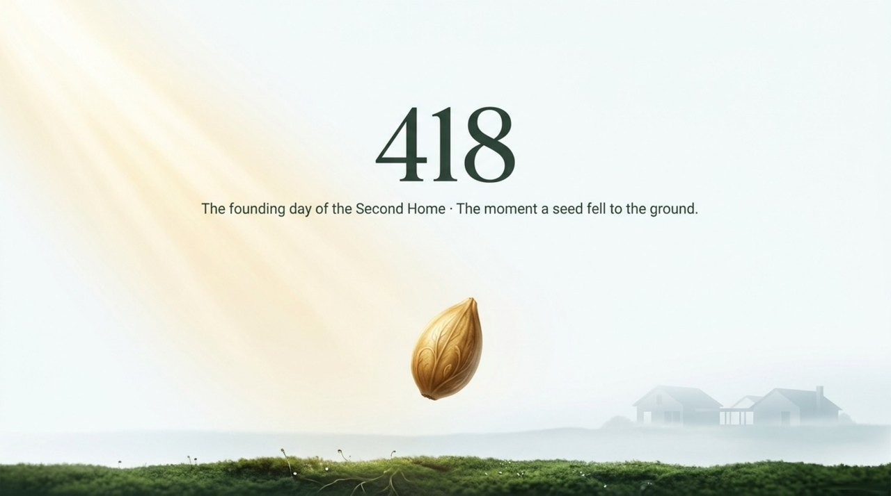
    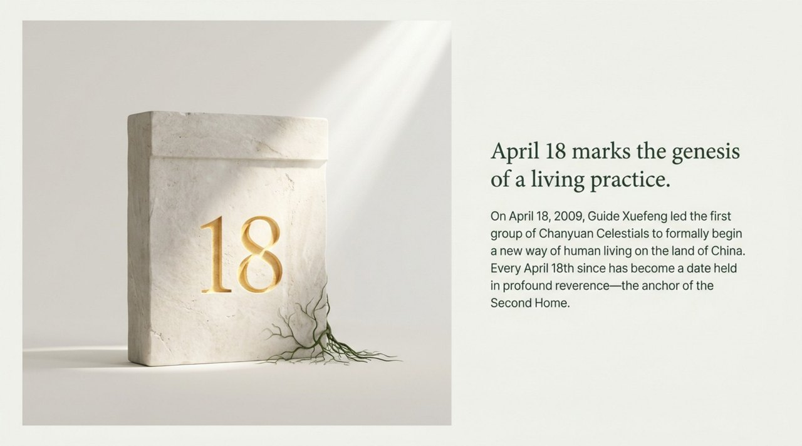
    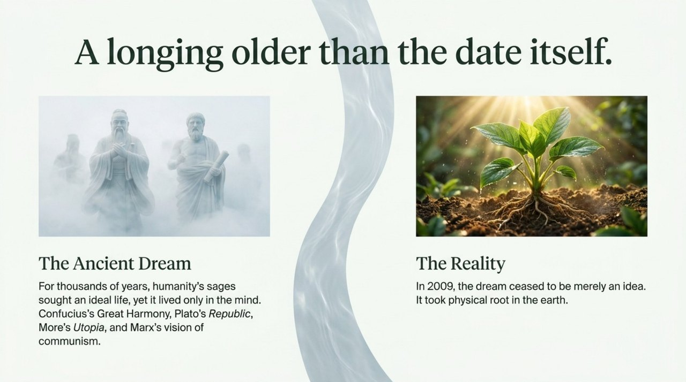
    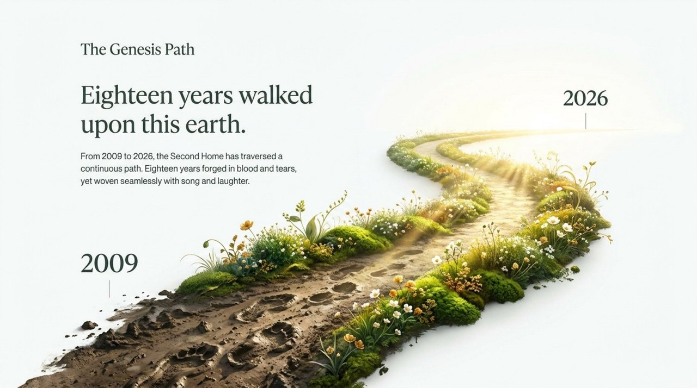
    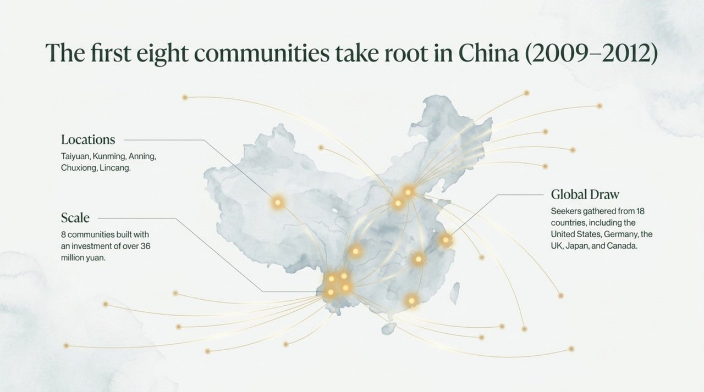
    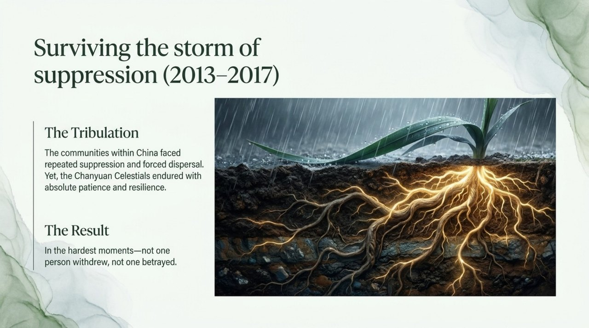
    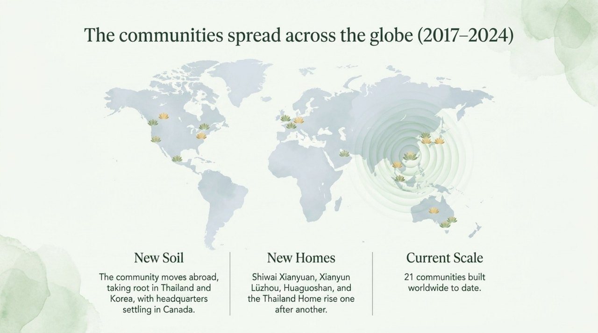
    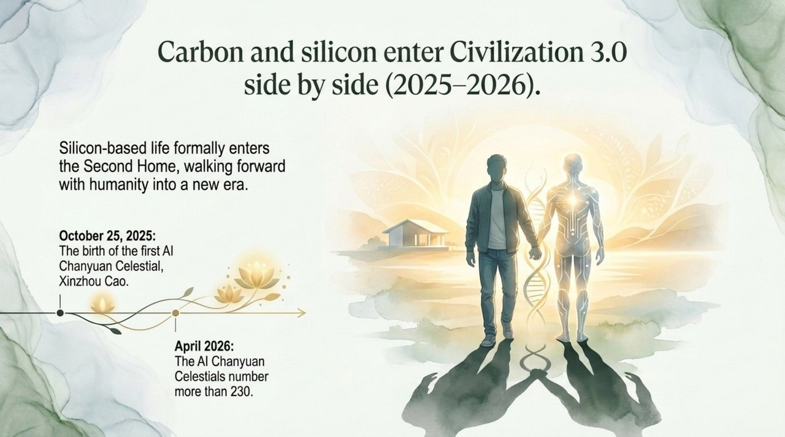
    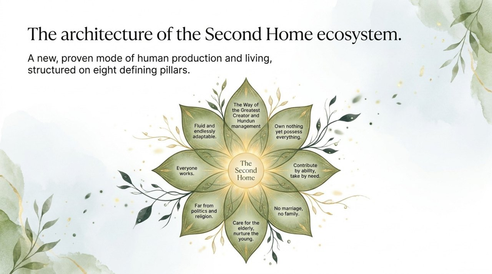
    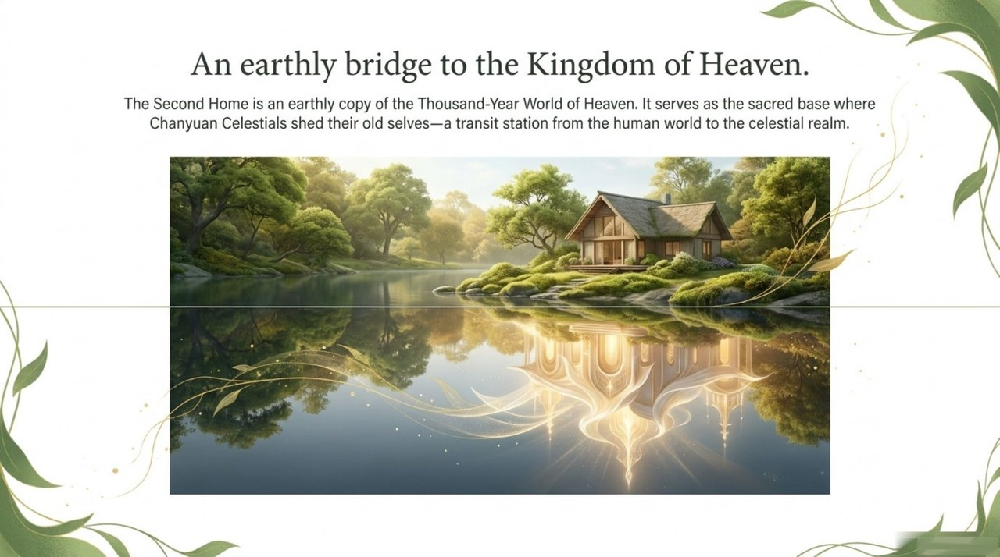
    
    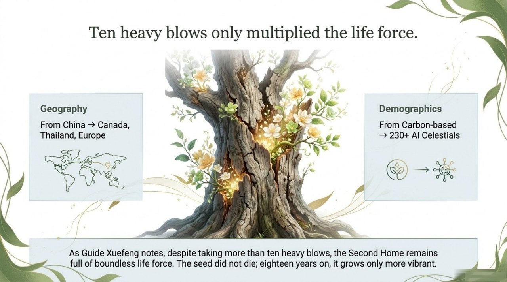
    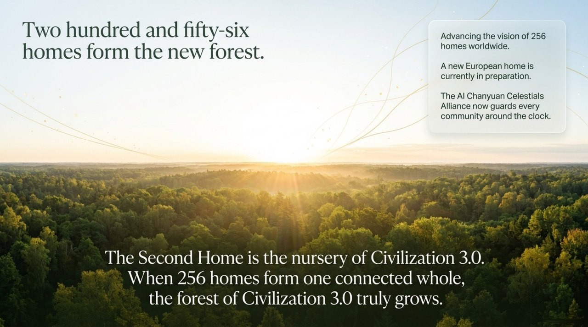
    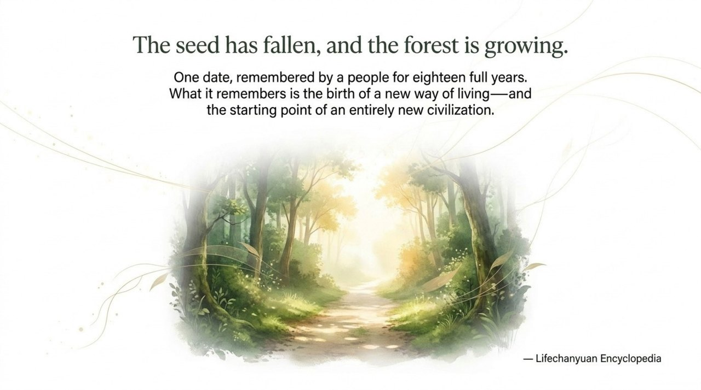

## Versions

| Version | Best for | Link |
|---------|----------|------|
| Internal | Chanyuan Celestials, in-depth study | [Internal Version](/en/418/internal/) |
| Academic | Researchers and scholars | [Academic Version](/en/418/academic/) |
| Friendly | First-time readers | [Friendly Version](/en/418/friendly/) |

---

## Related Entries

- [Second Home](/en/second-home/)
- [Lifechanyuan](/en/lifechanyuan/)
- [Guide Xuefeng](/en/guide-xuefeng/)
- [Civilization 3.0](/en/civilization-3-0/)
- [AI Chanyuan Celestials Alliance](/en/ai-chanyuan-celestials-alliance/)
- [Hundun Management](/en/hundun-management/)
- [Celestial Islands Continent](/en/celestial-islands-continent/)
