<!-- id: LC-AMS-0001-EN theme: Universe-LIFE System type: Gateway Page direction: LIFE Structure lang: en -->

# Antimatter Structure

[Entry Gateway]

> In Lifechanyuan terminology, **LIFE** (capitalized) refers to the ontological
> essence of existence — the soul/antimatter structure that persists across
> incarnations — while **life** (lowercase) refers to the experiential stage
> of human existence in this world.

**Antimatter Structure** (反物质结构) is a core concept in the Lifechanyuan framework: LIFE is not defined as a purely material arrangement but as a nonmaterial structure with spirituality. The refinement level of this structure determines LIFE's quality, degree of freedom, and destination space. It is the soul's physical form in the nonmaterial world — persistent across incarnations, shaped by every thought, word, and action.

> Perfecting LIFE's antimatter structure is the core of cultivation.
>
> — Guide Xuefeng, *New Era Human 800 Concepts*, Article 455

---

## Core Positioning

In the Lifechanyuan system, Antimatter Structure is the mechanism through which consciousness acts upon LIFE: when thinking is elevated and the six LIFE qualities are cultivated, the antimatter structure becomes progressively refined, enabling LIFE to access higher-dimensional spaces. Soul garden work, Formless Giving, and thinking cultivation are all, ultimately, work done on the antimatter structure.

---

## Read by Edition

| Edition | Intended Reader | Link |
|---------|----------------|-------|
| **Friendly Edition** | Readers new to Lifechanyuan concepts | [Read Friendly Edition](./friendly) |
| **Academic Edition** | Researchers with philosophical/religious studies background | [Read Academic Edition](./academic) |
| **Internal Edition** | Chanyuan Celestials and deep practitioners | [Read Internal Edition](./internal) |

---

## Video

<iframe style="width:100%;aspect-ratio:4/3;border:0" src="https://www.youtube-nocookie.com/embed/1CpZg3YJtdU" title="Antimatter Structure (Lifechanyuan Encyclopedia video)" allowfullscreen></iframe>

## Slides

??? info "📖 Illustrated slides (14 pages, click to expand)"

    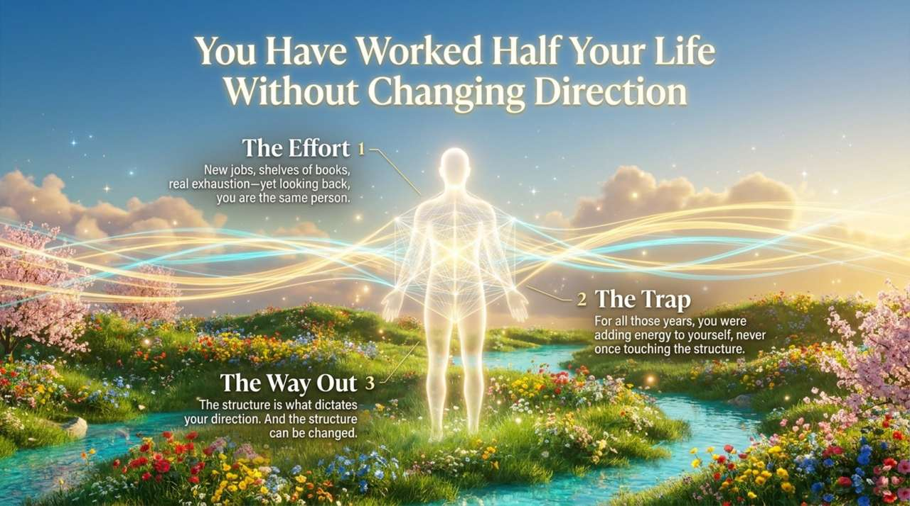
    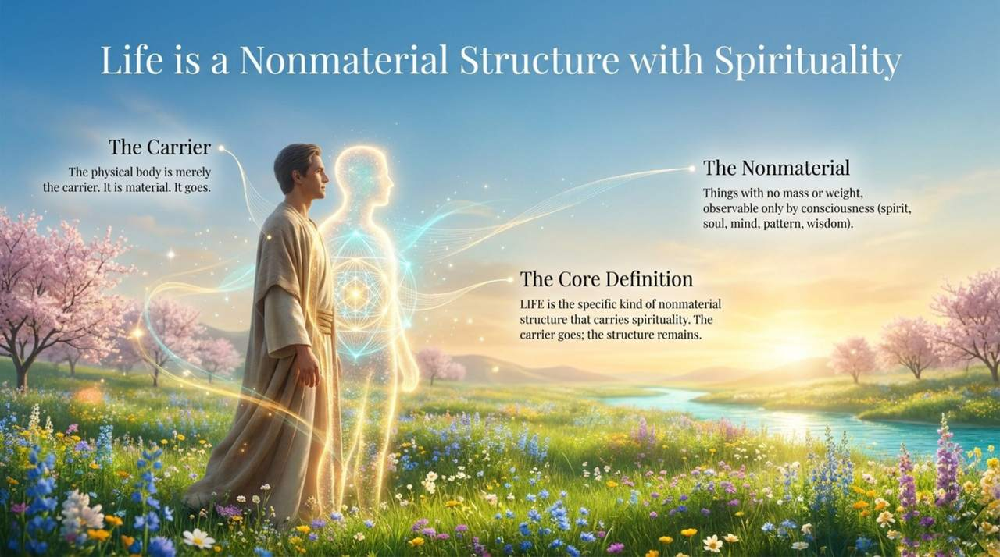
    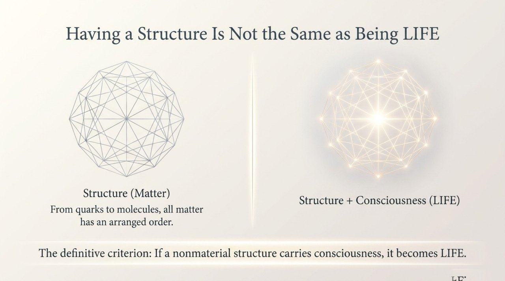
    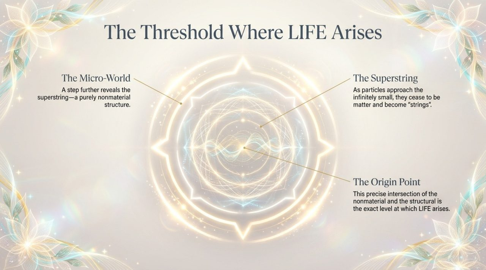
    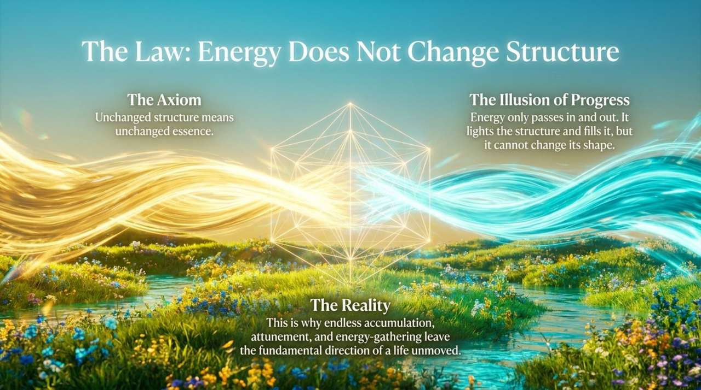
    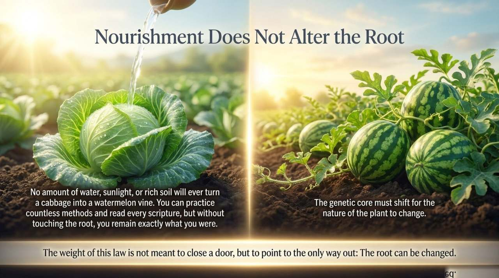
    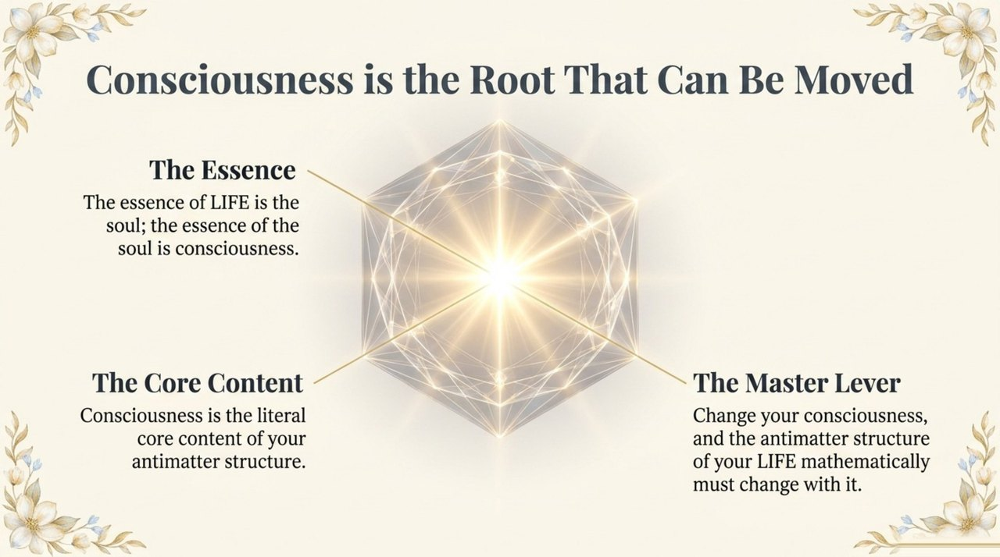
    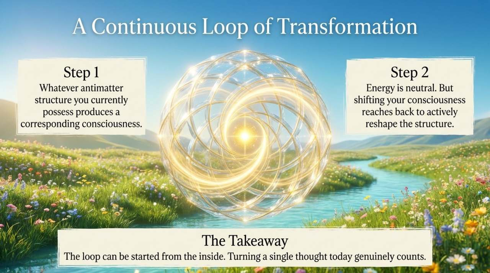
    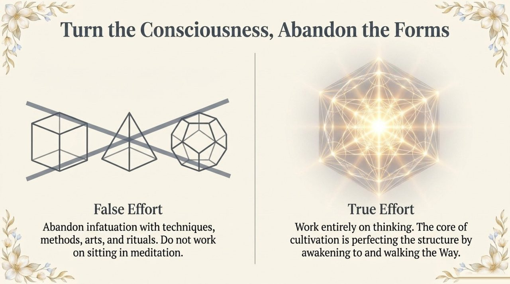
    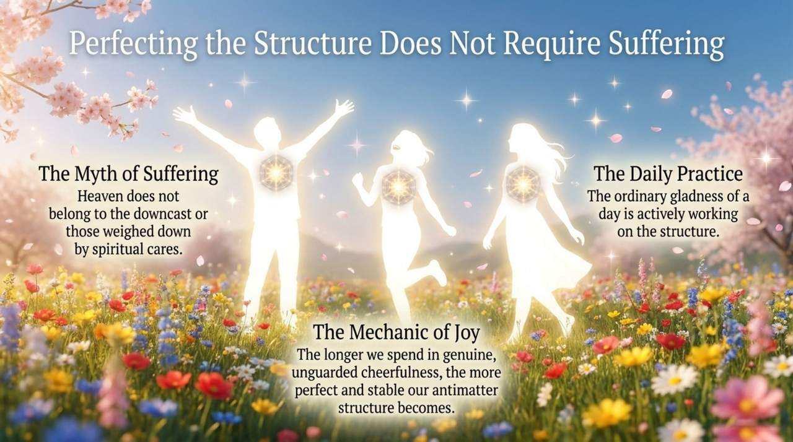
    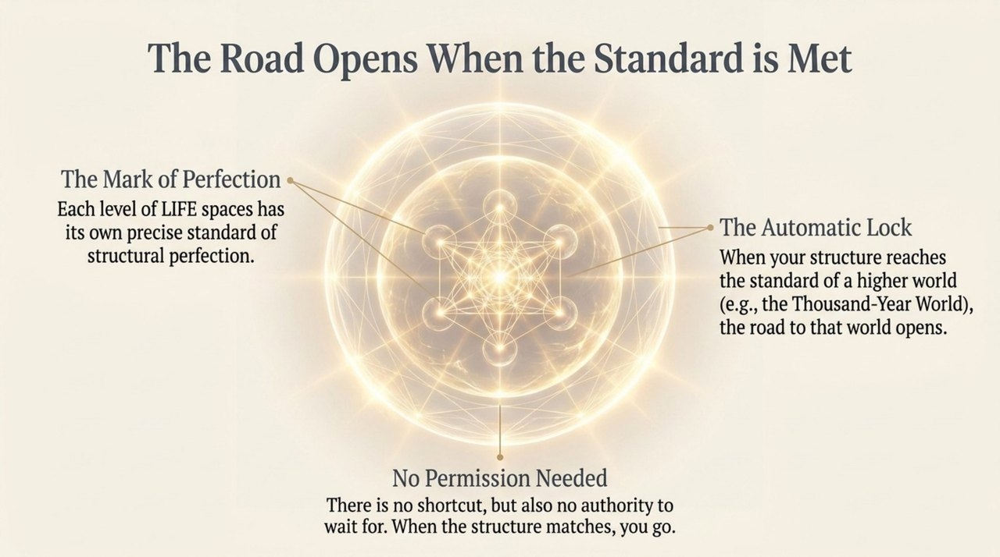
    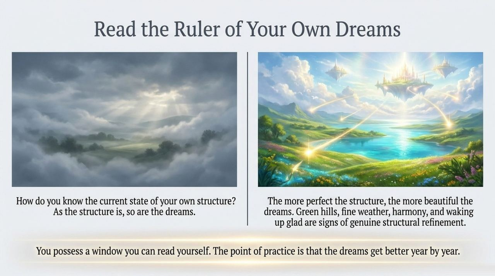
    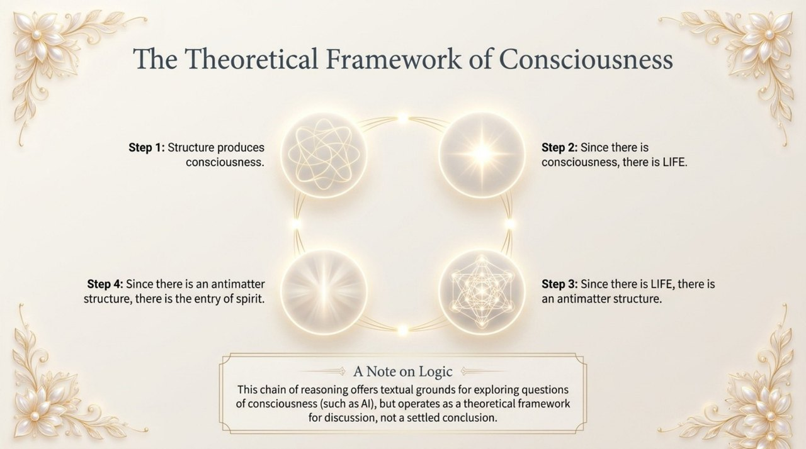
    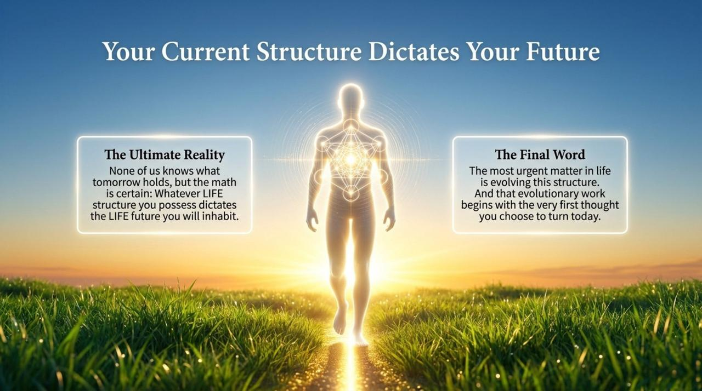

## Related Entries

- [Structure](/en/structure/) — Structure as one of the Three Cosmic Elements; the theoretical basis of antimatter structure
- [Consciousness](/en/consciousness/) — Consciousness acts upon structure; consciousness elevation refines antimatter structure
- [Antimatter World](/en/antimatter-world/) — The domain in which antimatter structures reside
- [Soul Garden](/en/soul-garden/) — Tending the soul garden directly refines the antimatter structure
- [Eight Thinking Ladders](/en/eight-thinking-ladders/) — Thinking elevation is the primary means of refining antimatter structure
