# Black Hole

> "Black holes" are "gods" created by the Greatest Creator. They possess consciousness. Each black hole is like a traffic officer maintaining cosmic order, and the vast universe is regulated and adjusted by these "black hole officers."
>
> — Xuefeng, *The Mysteries of the Black Hole*

In the Lifechanyuan system, black holes are not merely astronomical objects but conscious cosmic guardians. They absorb gravitational force and emit repulsive force, maintaining dynamic equilibrium among celestial bodies — and their interiors are not dark but "brilliantly luminous." The system further distinguishes two specific types: the **Yin-Polar Black Hole Body** (the most energy-dense object in the universe, a cosmic prison for divine beings who violate heavenly laws, belonging to the higher life spaces) and the **Yang-Polar Black Hole Body** (the maternal womb, the passage through which souls reincarnate, belonging to the neutral worlds).

| Version | Best for | Focus |
|---------|----------|-------|
| [Friendly version](friendly.md) | First-time readers | Accessible analogies and cosmic order |
| [Academic version](academic.md) | Researchers | System analysis and comparison |
| [Internal reference](internal.md) | Deep study | Complete source quotations |

---

## Video

<iframe style="width:100%;aspect-ratio:4/3;border:0" src="https://www.youtube-nocookie.com/embed/rS6LhifxqhI" title="Black Hole (Lifechanyuan Encyclopedia video)" allowfullscreen></iframe>

## Slides

??? info "📖 Illustrated slides (14 pages, click to expand)"

    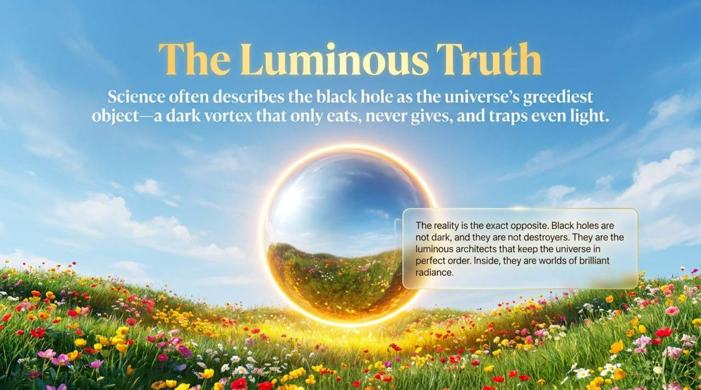
    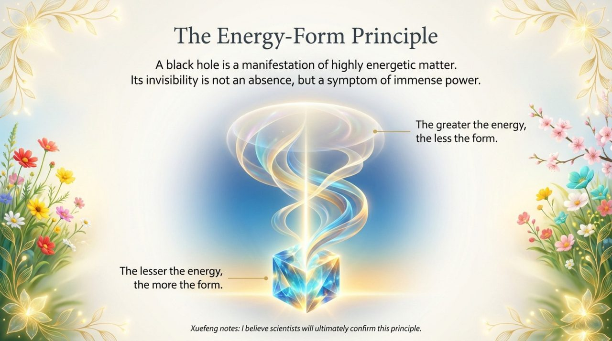
    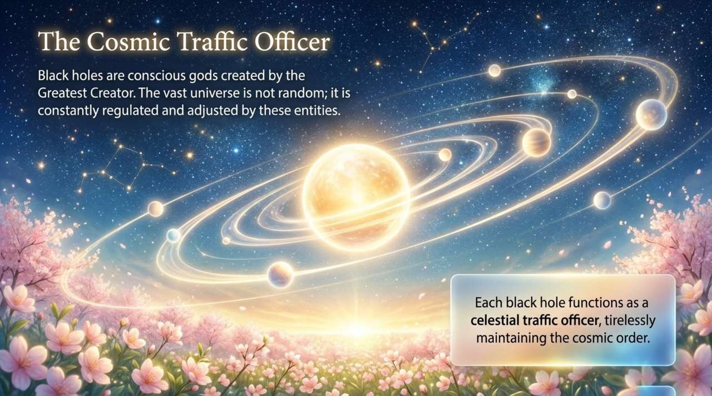
    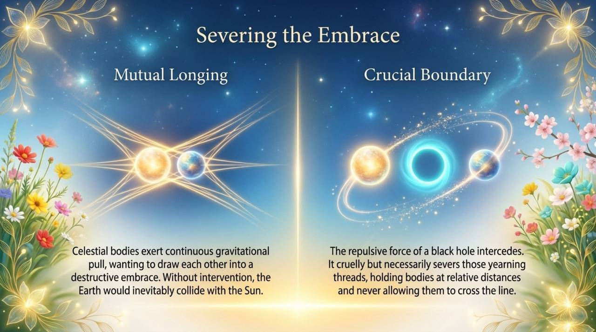
    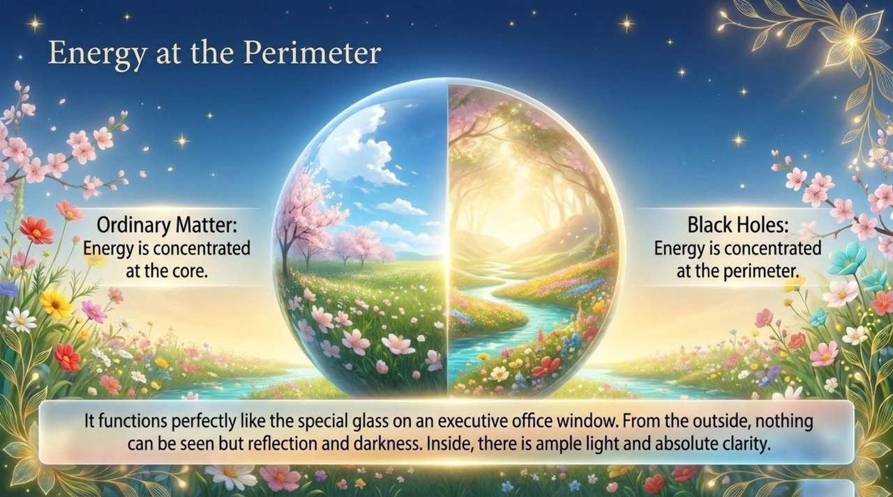
    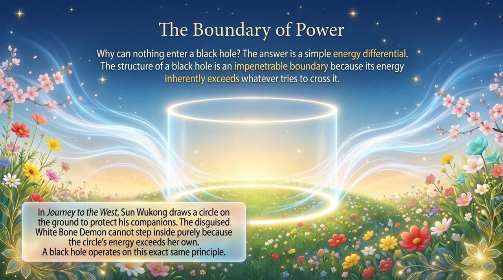
    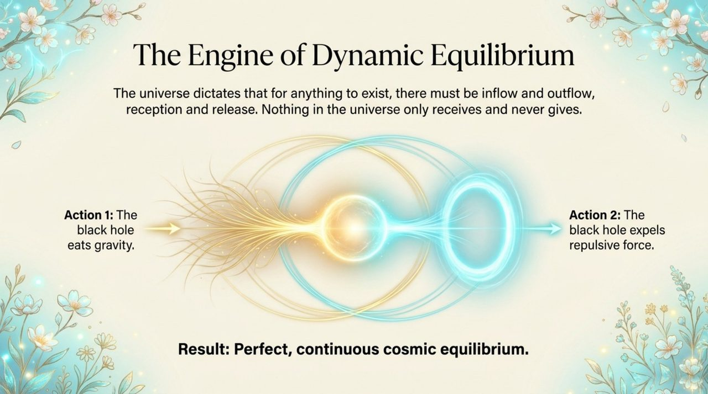
    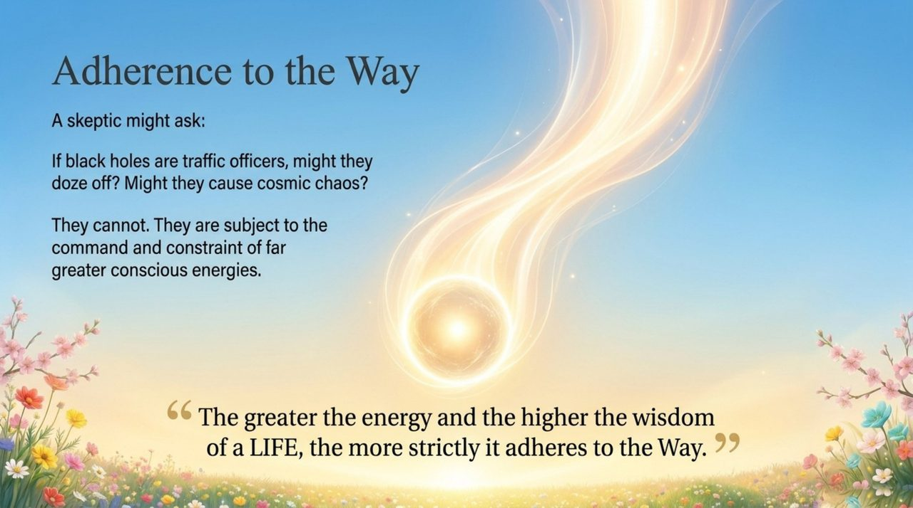
    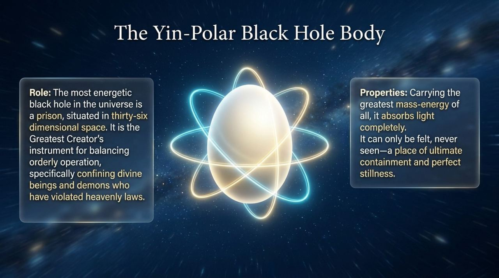
    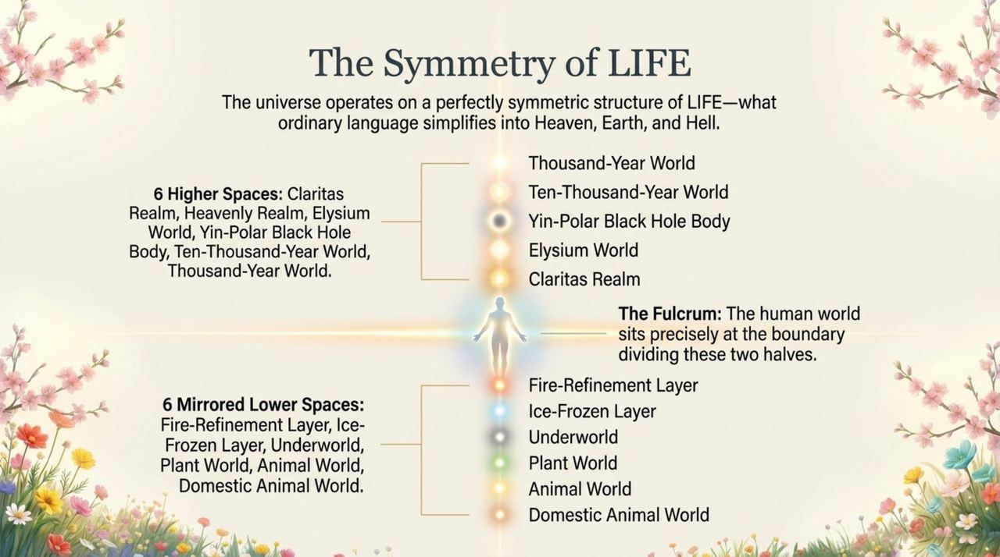
    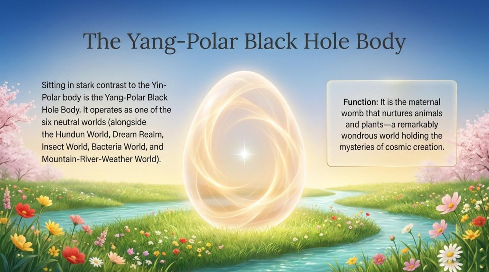
    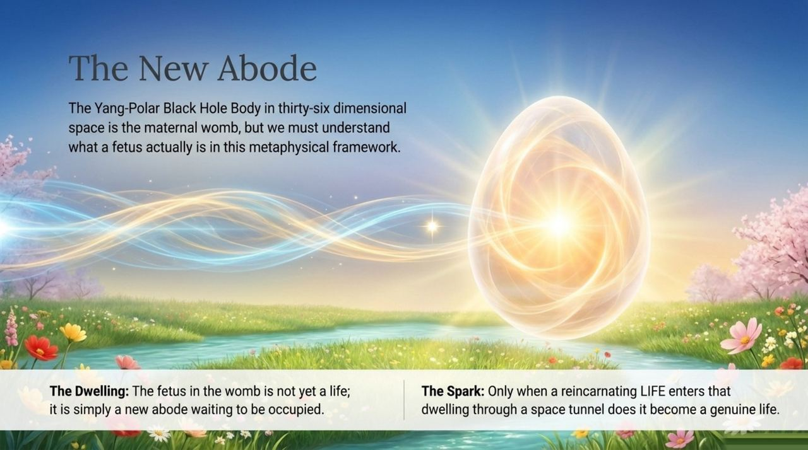
    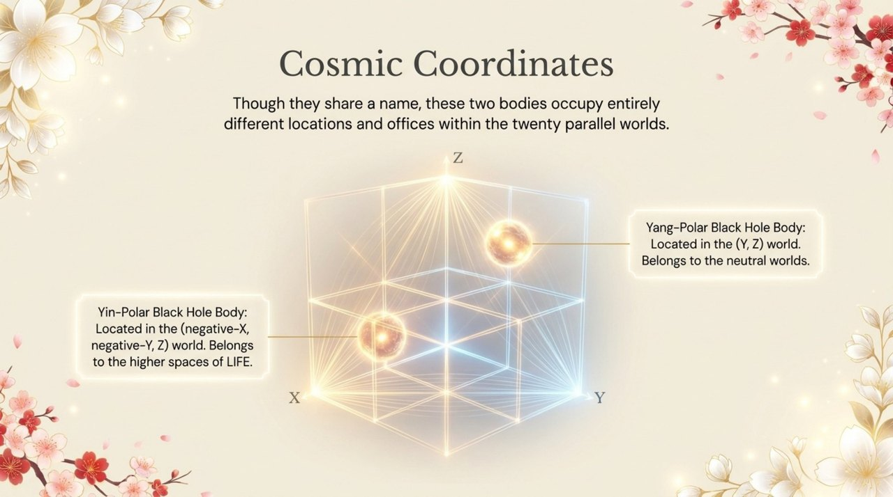
    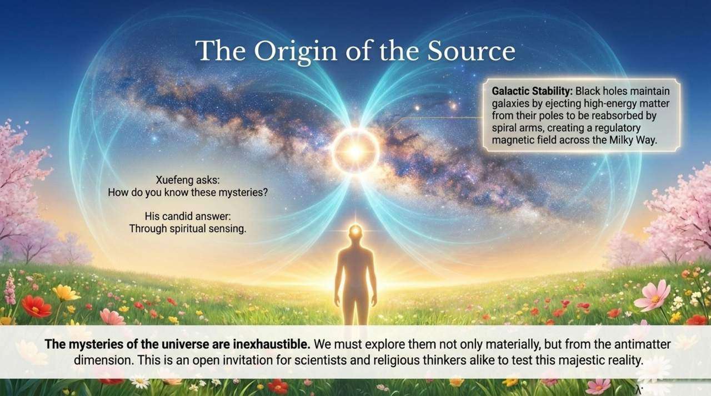

## Related Entries

[36-Dimensional Space](/en/thirty-six-dimensional-space/) · [20 Parallel Worlds](/en/twenty-parallel-worlds/) · [Antimatter World](/en/antimatter-world/) · [Spacetime Tunnel](/en/spacetime-tunnel/) · [Cosmic Panorama](/en/cosmic-panorama/) · [Cosmic Holography](/en/cosmic-holography/) · [Life Reincarnation](/en/life-reincarnation/) · [Higher Life Spaces](/en/high-life-spaces/)
