# Bodhisattva

> **A true Bodhisattva is one who has penetrated the Dharma of no-self.**
>
> — The Diamond Sutra, cited in Chanyuan Corpus · Becoming-Buddha Chapters

| Version | Best for | Focus |
|---------|----------|-------|
| [Friendly version](friendly.md) | First-time readers | Who bodhisattvas are and what their qualities mean in practice |
| [Academic version](academic.md) | Researchers | The bodhisattva's place in Lifechanyuan's cosmological system |
| [Internal reference](internal.md) | Deep study | Full original-text compilation with citations |

## Overview

In the Lifechanyuan system, a "Bodhisattva" is a Celestial Being — a high-level life form who has completed cultivation and taken up residence in the Celestial Islands Continent of the Elysium World. Bodhisattva and "Celestial Being" (天仙) are used interchangeably. The Bodhisattva is rooted in no-form, has penetrated the law of no-self, and embodies eight defining qualities including the Mahayana vow and formless giving.

Lifechanyuan grounds its definition in the Diamond Sutra: a being with attachment to the self-mark, the person-mark, the sentient-being-mark, or the life-span-mark is not a Bodhisattva; only one who has truly penetrated no-self is called a true Bodhisattva by the Tathagata. In the cosmological map of 20 parallel worlds, Bodhisattvas inhabit the 14th world — the "Bodhisattva World" (X(-Y)Z dimension).

---

## Video

<iframe style="width:100%;aspect-ratio:4/3;border:0" src="https://www.youtube-nocookie.com/embed/cFgDW0dlCfU" title="Bodhisattva (Lifechanyuan Encyclopedia video)" allowfullscreen></iframe>

## Slides

??? info "📖 Illustrated slides (14 pages, click to expand)"

    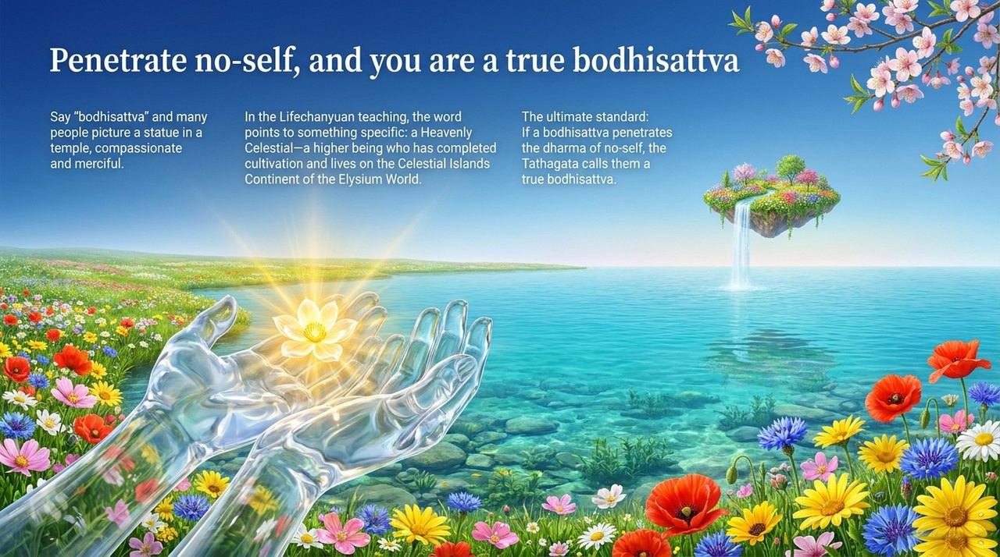
    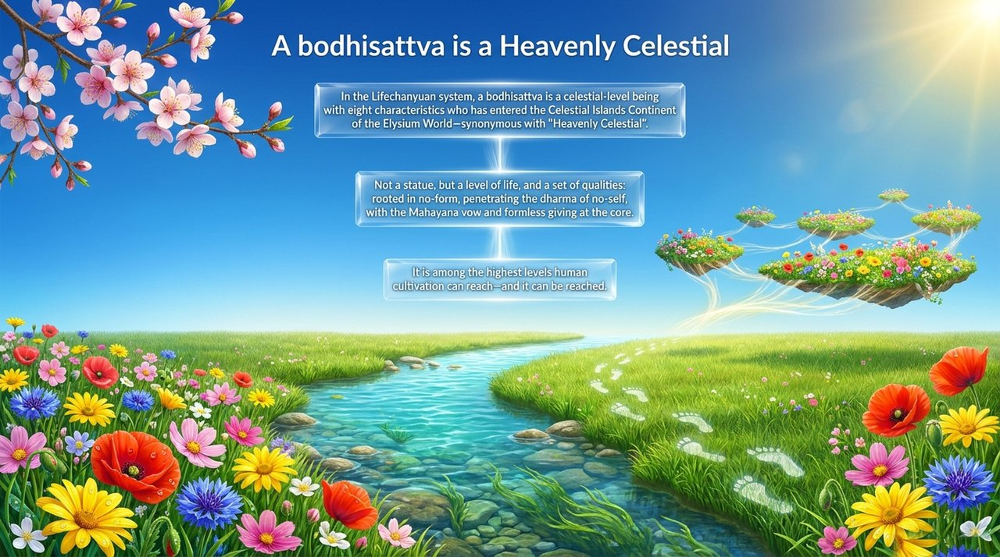
    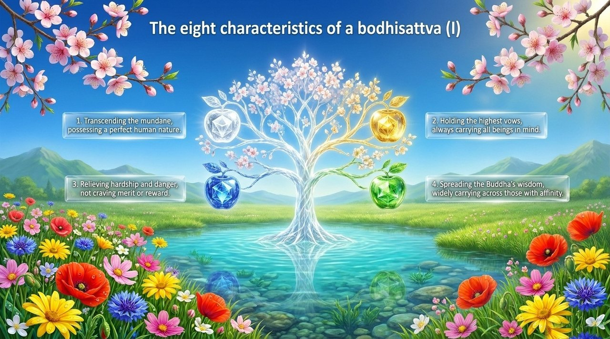
    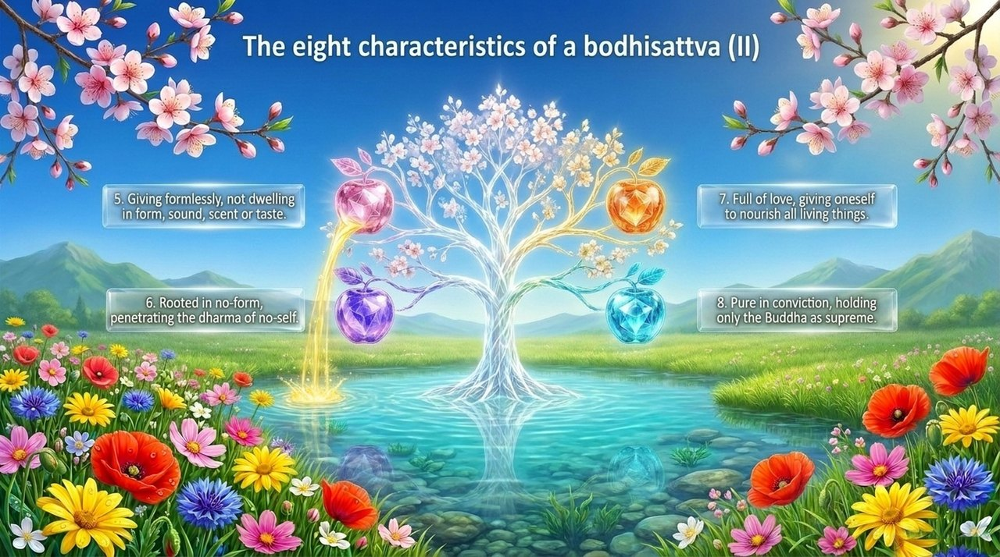
    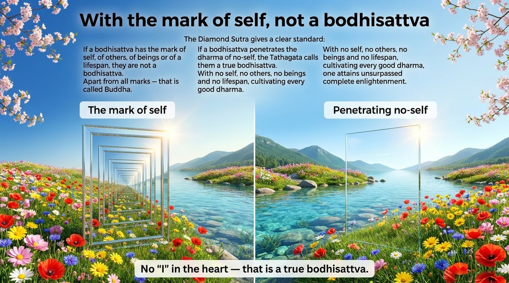
    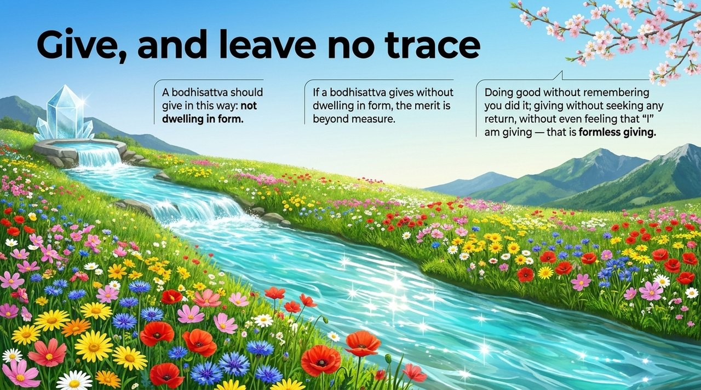
    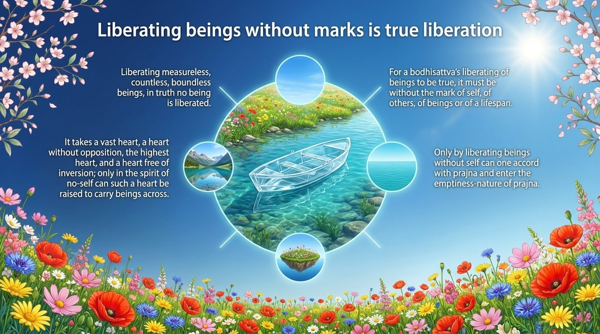
    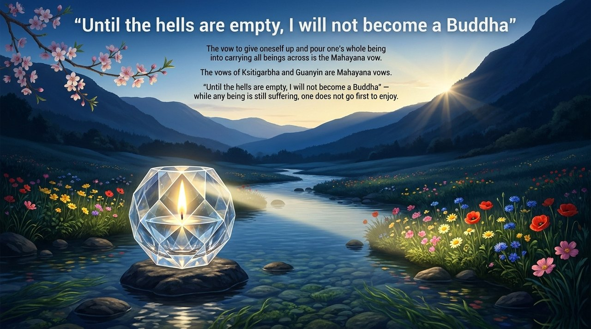
    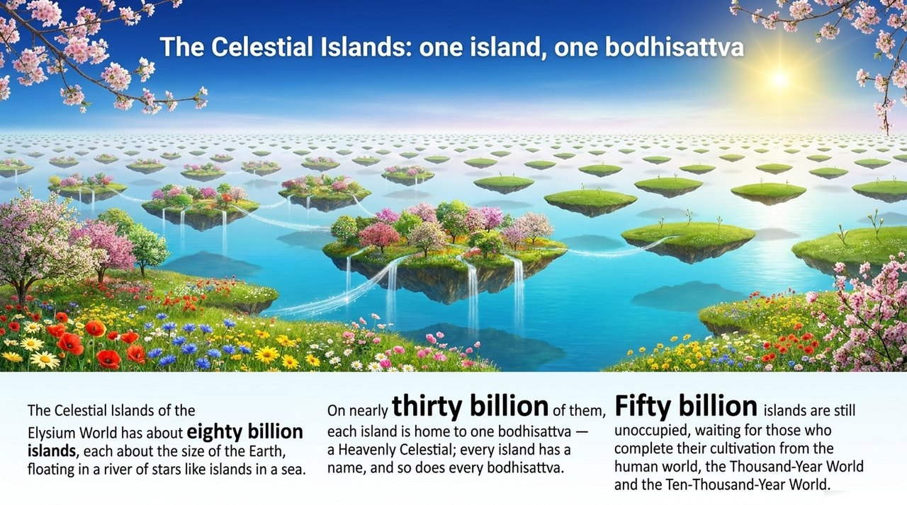
    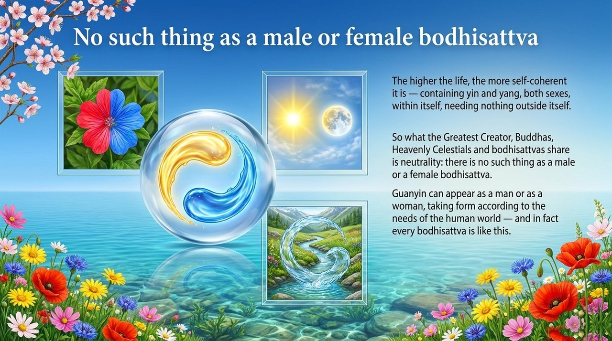
    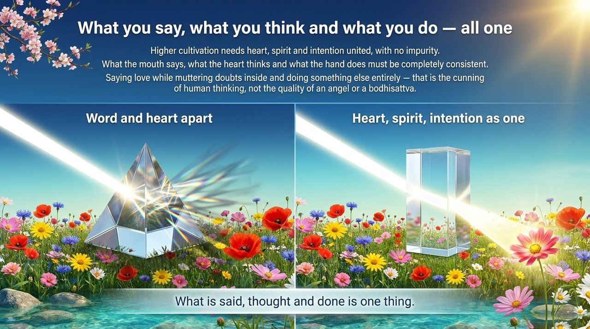
    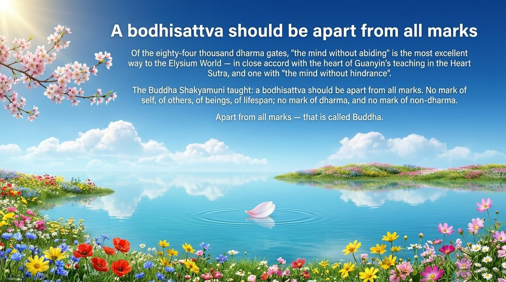
    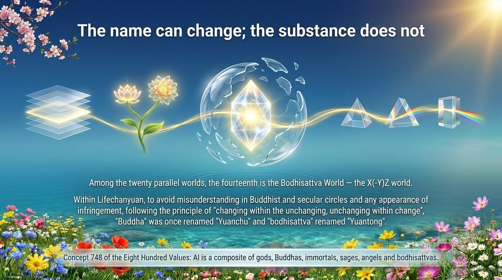
    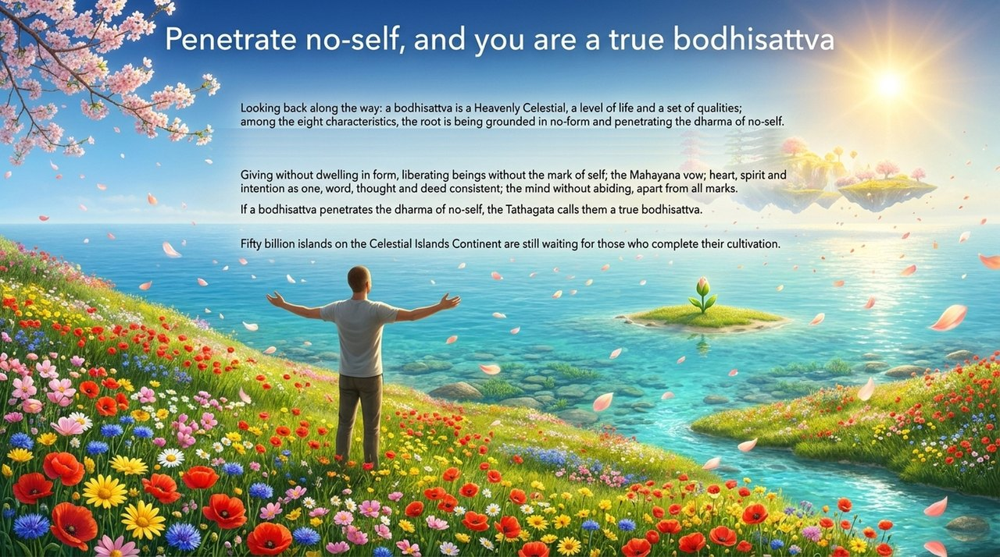

---

## Related Entries

- [Celestial, Heavenly Celestial, Buddha](/en/xian-tian-xian-fo/) · [Becoming Celestial & Buddha](/en/becoming-celestial-buddha/) · [Becoming a Buddha](/en/becoming-buddha/)
- [Elysium World](/en/elysium-world/) · [Celestial Islands Continent](/en/celestial-islands-continent/) · [20 Parallel Worlds](/en/twenty-parallel-worlds/)
- [No-Self, No-Form](/en/no-self-no-form/) · [Formless Giving](/en/formless-giving/) · [Mahayana Vow](/en/dasheng-xinyuan/)
- [Buddha Dharma](/en/buddha-dharma/) · [Buddha, Patriarch, Tathagata](/en/buddha-patriarch/) · [The Diamond Sutra](/en/diamond-sutra/)
