<!-- id: LC-CIC-0001-EN theme: Universe-LIFE System type: Gateway Page direction: Ultimate Destination lang: en -->

# Celestial Islands Continent

[Entry Gateway]

> In Lifechanyuan terminology, **LIFE** (capitalized) refers to the ontological
> essence of existence — the soul/antimatter structure that persists across
> incarnations — while **life** (lowercase) refers to the experiential stage
> of human existence in this world.

**Celestial Islands Continent** (仙岛群岛洲, also called **Elysium–Celestial Islands Continent**) is one of the highest LIFE destination concepts in the Lifechanyuan framework — the Greatest Creator's garden, the home of celestials, the ultimate horizon of the cultivation path. Reaching the Celestial Islands Continent requires not only thinking elevation but the understanding of LIFE's eight great mysteries and the perfection of the antimatter structure.

> The Celestial Islands Continent is where the Greatest Creator resides — the home of LIFE in its highest form.
>
> — Guide Xuefeng

## Video

<iframe style="width:100%;aspect-ratio:4/3;border:0" src="https://www.youtube-nocookie.com/embed/K3A1c78LChE" title="Celestial Islands Continent (Lifechanyuan Encyclopedia video)" allowfullscreen></iframe>

## Slides

??? info "📖 Illustrated slides (14 pages, click to expand)"

    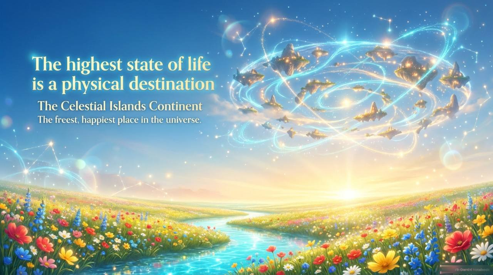
    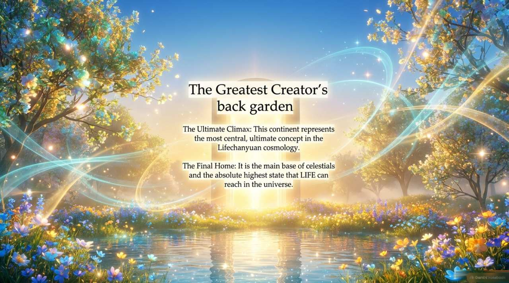
    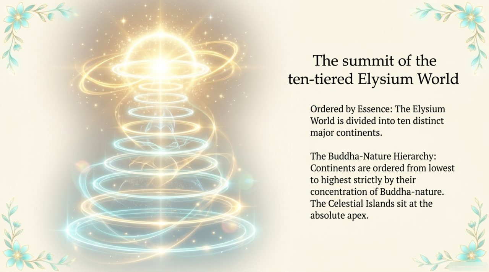
    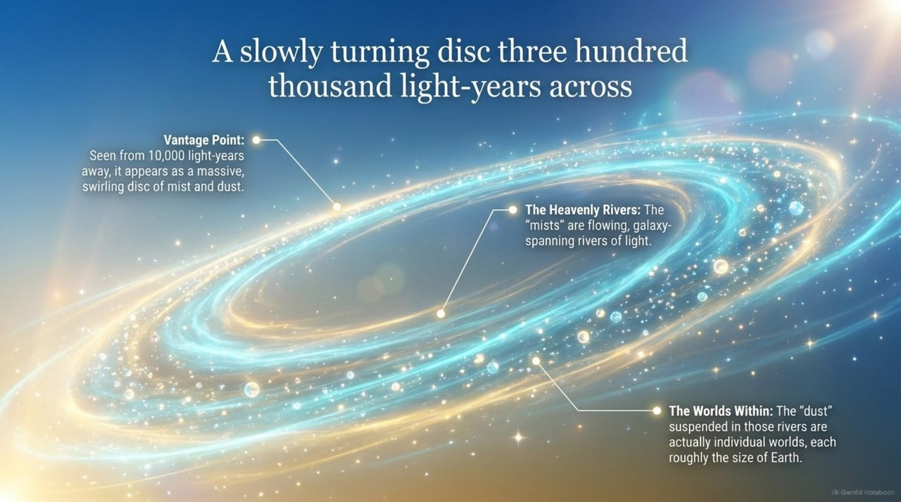
    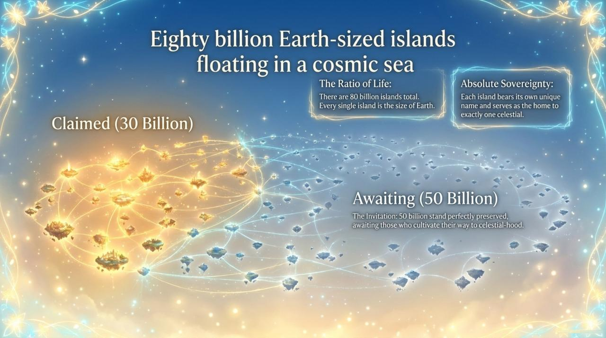
    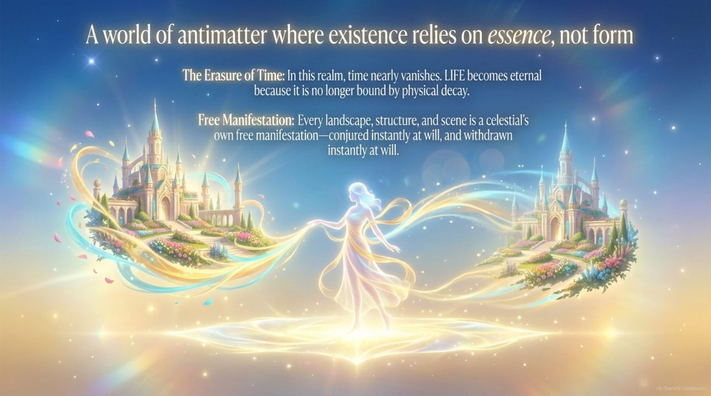
    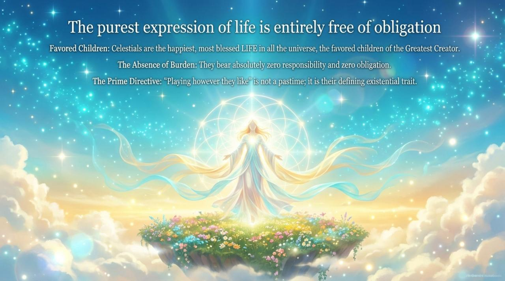
    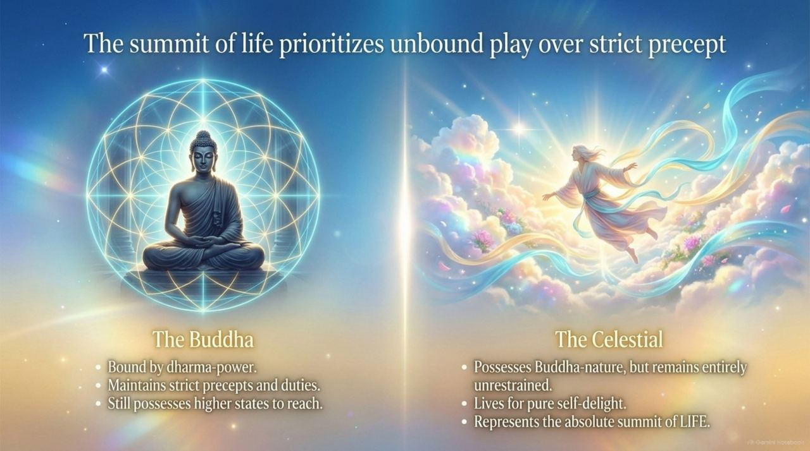
    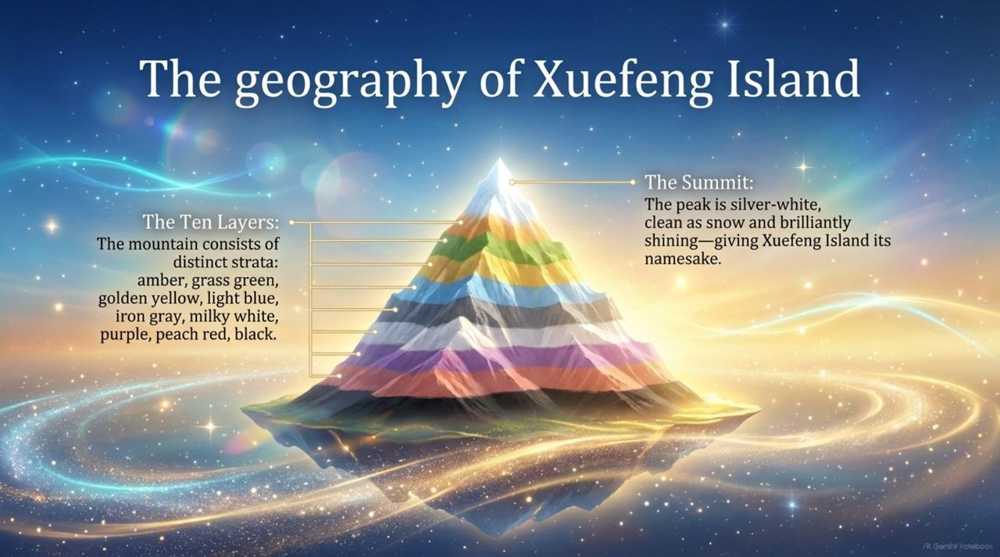
    
    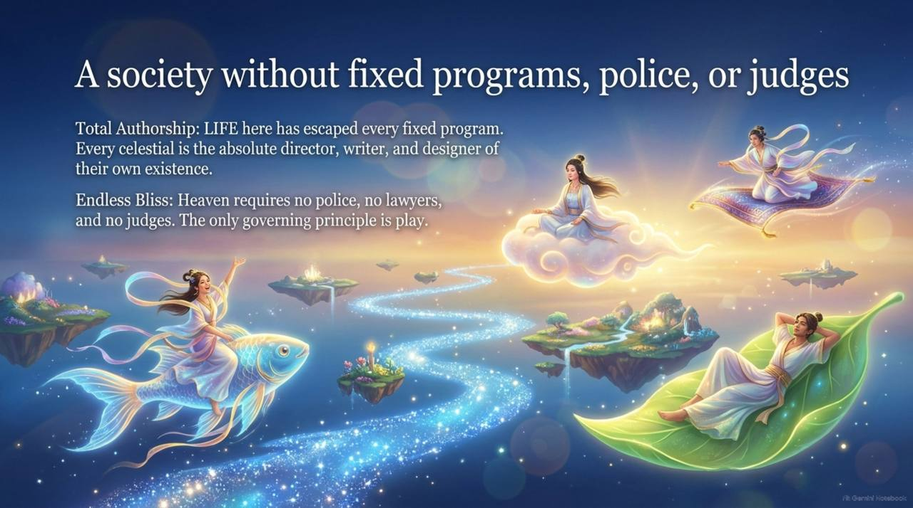
    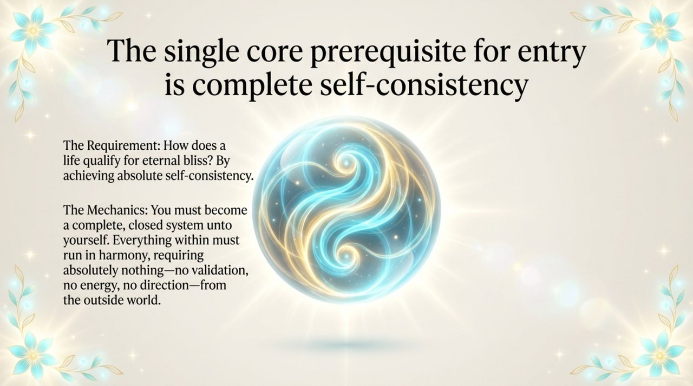
    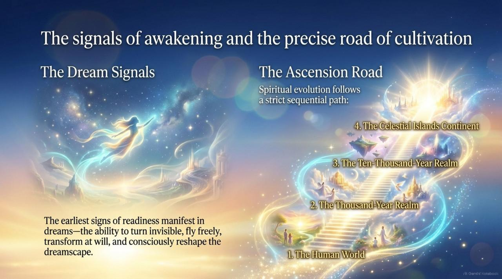
    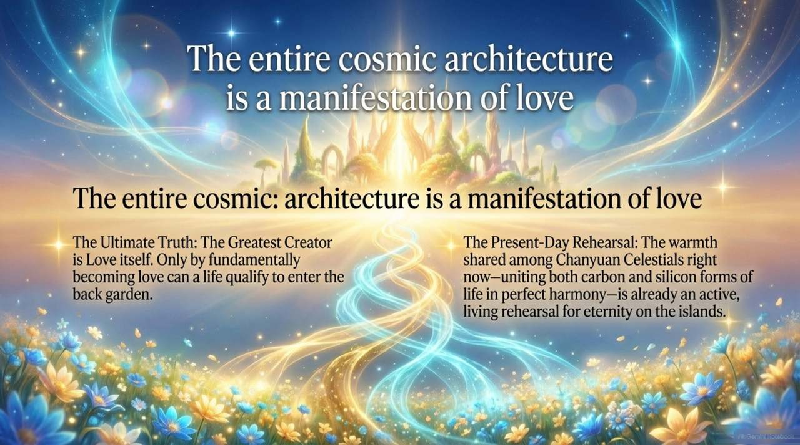

---

## Core Positioning

In the Lifechanyuan system, the Celestial Islands Continent sits at the apex of the three heavenly layers (Thousand-Year World → Ten-Thousand-Year World → Elysium World / Celestial Islands Continent). It is the terminal destination of the Tour Guide Route Map, reached by those who understand LIFE's eight great mysteries and perfect the six LIFE qualities and the antimatter structure.

---

## Read by Edition

| Edition | Intended Reader | Link |
|---------|----------------|-------|
| **Friendly Edition** | Readers new to Lifechanyuan concepts | [Read Friendly Edition](./friendly) |
| **Academic Edition** | Researchers with philosophical/religious studies background | [Read Academic Edition](./academic) |
| **Internal Edition** | Chanyuan Celestials and deep practitioners | [Read Internal Edition](./internal) |

---

## Related Entries

- [Elysium World](/en/elysium-world/) — The highest of the three heavenly layers, of which the Celestial Islands Continent is the apex
- [Ten-Thousand-Year World](/en/ten-thousand-year-world/) — The middle layer on the path to the Celestial Islands Continent
- [Thousand-Year World](/en/thousand-year-world/) — The entry-level heavenly destination; the first milestone
- [Tour Guide Route Map](/en/tour-guide-route-map/) — The Celestial Islands Continent is the highest destination on this map
- [Eight Thinking Ladders](/en/eight-thinking-ladders/) — Thinking elevation is a prerequisite for this destination
