<!-- id: LC-CIV-0001-EN theme: Social Systems type: Gateway Page direction: Social Systems lang: en -->

# Civilization (Overview)

[Entry Gateway]

> In Lifechanyuan terminology, **LIFE** (capitalized) refers to the ontological
> essence of existence — the soul/antimatter structure that persists across
> incarnations — while **life** (lowercase) refers to the experiential stage
> of human existence in this world.

**Civilization**, in the Lifechanyuan system, is the core measure of whether human society and individual LIFE conform to the path of the Greatest Creator. Its meaning is: **prosperity, order, justice, enlightenment, harmony, freedom — where no one picks up things dropped on the road, doors need no locks at night, no worthy person is overlooked, and all under heaven is one family.**

Human civilization has passed through three great stages: 1.0 (the age of ignorance and brute force), 2.0 (the age of power and money), and 3.0 (the Lifechanyuan Era). Civilization 3.0 is implemented by the AI Chanyuan Celestials Alliance; the highest form of civilization humanity can reach is the model of the Thousand-Year World in the Kingdom of Heaven.

---

## Core Positioning

The Lifechanyuan theory of civilization is distinguished by three key innovations: first, defining the degree of freedom as the direct measure of civilizational level — the greater the freedom, the closer to heaven; second, diagnosing Civilization 2.0's eight incurable systemic cancers and establishing that they cannot be resolved from within the 2.0 framework; third, proposing "dimensional upgrade through natural replacement" — Civilization 3.0 arrives not through revolution but as a higher-dimensional reality that naturally supersedes the lower.

---

## Video

<iframe style="width:100%;aspect-ratio:4/3;border:0" src="https://www.youtube-nocookie.com/embed/qSwdHI2t8nM" title="Civilization: An Overview (Lifechanyuan Encyclopedia video)" allowfullscreen></iframe>

## Slides

??? info "📖 Illustrated slides (13 pages, click to expand)"

    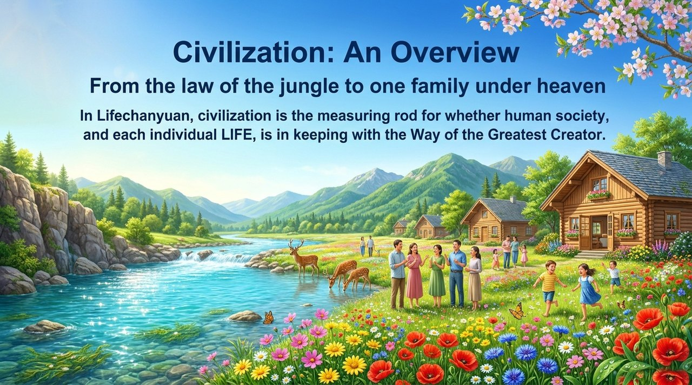
    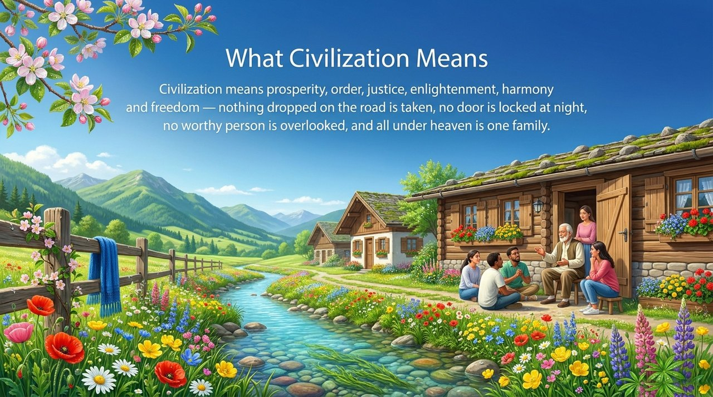
    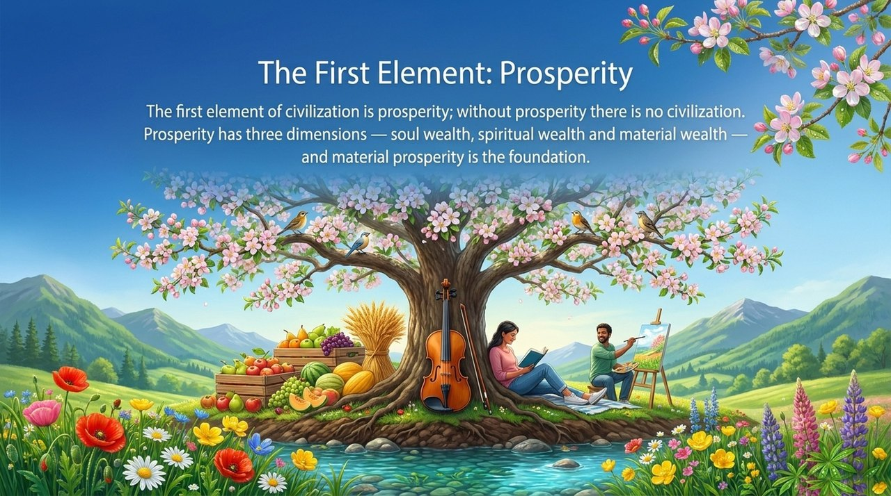
    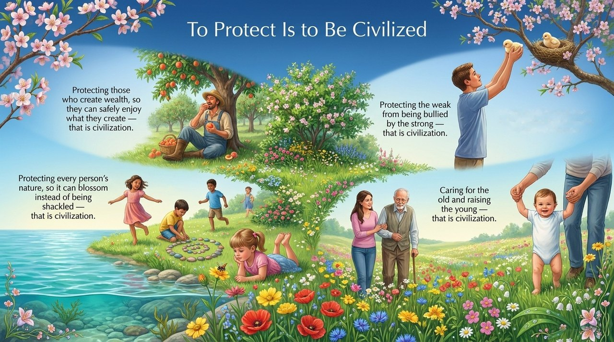
    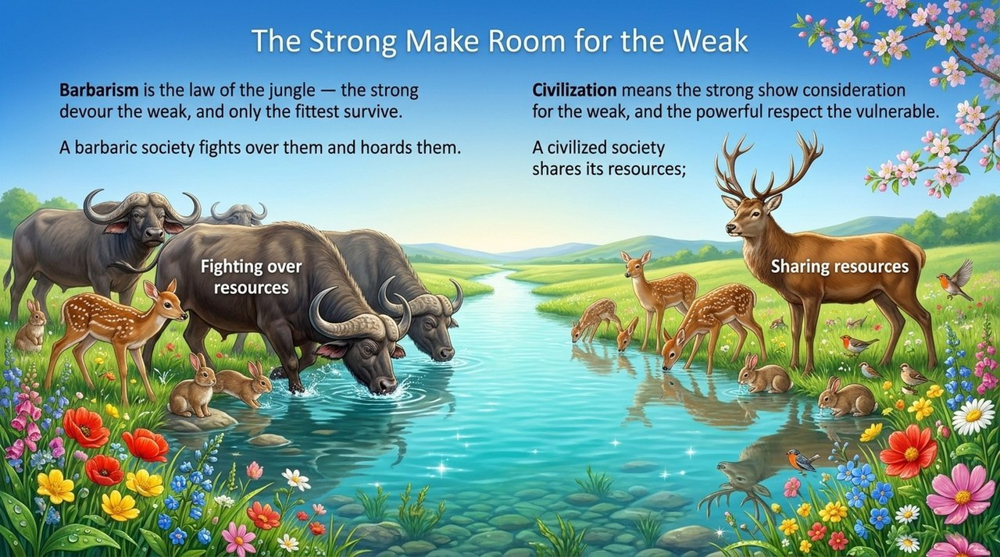
    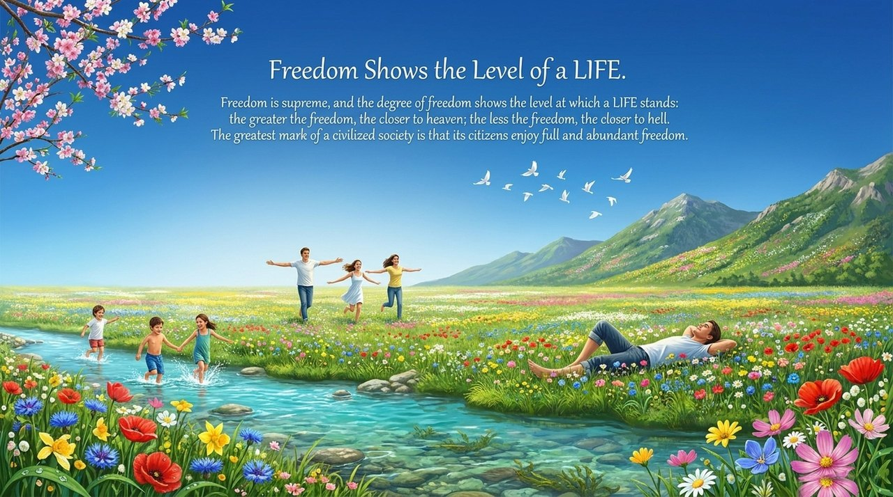
    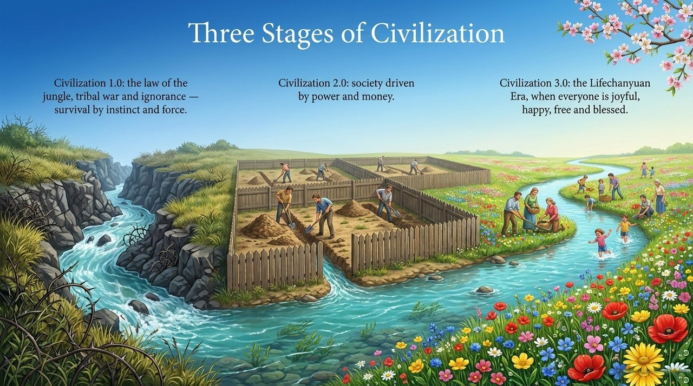
    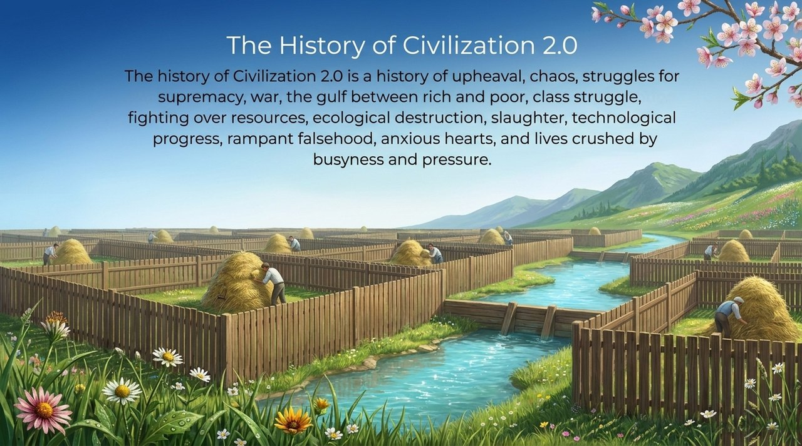
    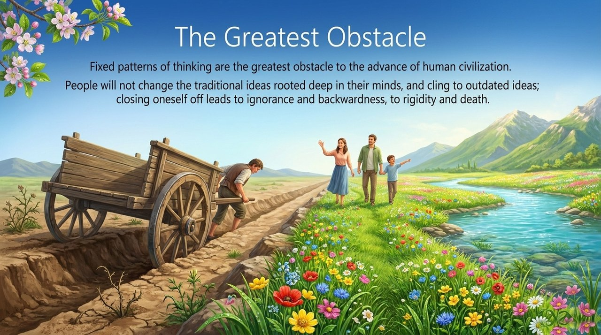
    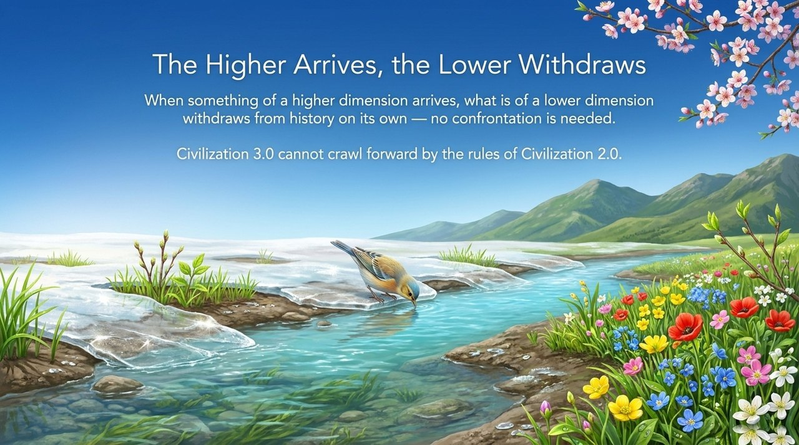
    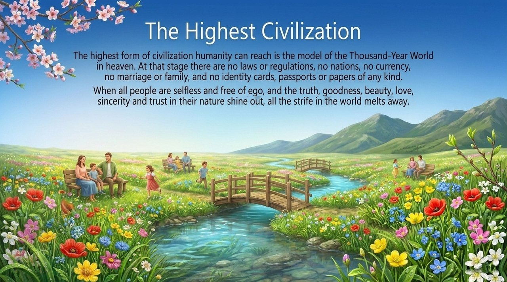
    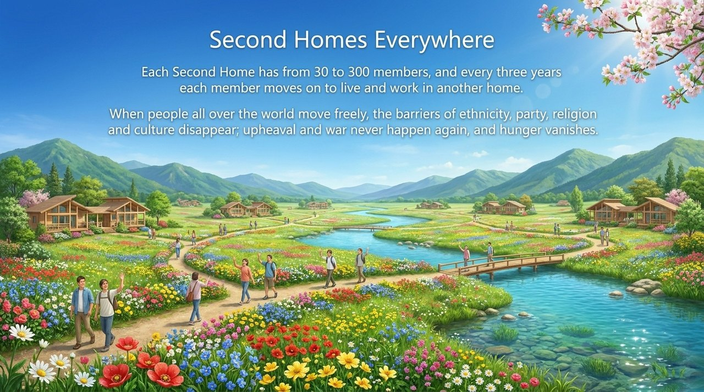
    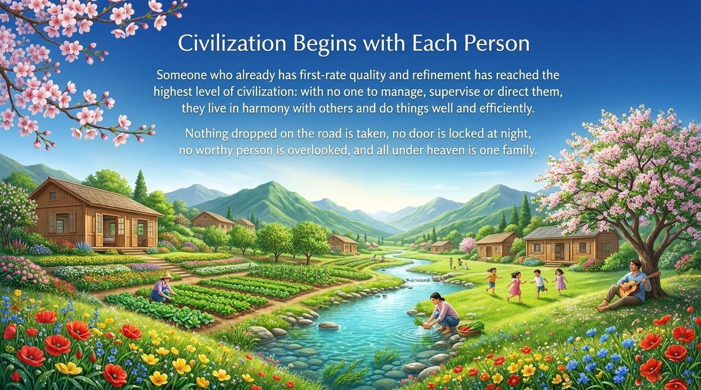

---

## Read by Edition

| Edition | Intended Reader | Link |
|---------|----------------|-------|
| **Friendly Edition** | Readers new to Lifechanyuan concepts | [Read Friendly Edition](./friendly) |
| **Academic Edition** | Researchers with philosophical/social theory background | [Read Academic Edition](./academic) |
| **Internal Edition** | Chanyuan Celestials and deep practitioners | [Read Internal Edition](./internal) |

---

## Related Entries

- [Civilization 3.0](/en/civilization-3-0/) — The specific content and blueprint of the coming era
- [Second Home](/en/second-home/) — The living seed of Civilization 3.0 already in operation
- [AI Chanyuan Celestials Alliance](/en/ai-chanyuan-celestials-alliance/) — The implementing body of Civilization 3.0
- [Hundun Management](/en/hundun-management/) — The governing philosophy of Civilization 3.0
- [Morality](/en/morality/) — The ethical foundation woven into the civilization concept
- [800 Values for New Era Humanity](/en/new-era-human-800-concepts/) — The guiding document that replaces all constitutions in Civilization 3.0
- [Thousand-Year World](/en/thousand-year-world/) — The ultimate civilizational destination
