# Contribute by Ability, Take by Need

> **Contribute by ability, take by need** — the third of the Eight Characteristics of the Second Home (Life Oasis), grounded in the "non-ownership system" (*wuyouzhi*): every member contributes according to their genuine capacity, without coercion or quota; every member takes what they truly need, without rationing or privilege. This principle mirrors the living pattern of the celestials in the Thousand-Year World and points toward the global economic model of Civilization 3.0.

---

| Version | Best for | Focus |
|---------|----------|-------|
| [Friendly version](friendly.md) | First-time readers | Real-life analogies, the feel of this principle |
| [Academic version](academic.md) | Researchers | Systematic analysis, comparison with ownership models |
| [Internal reference](internal.md) | Deep study | Full original texts with source citations |

---

## Video

<iframe style="width:100%;aspect-ratio:4/3;border:0" src="https://www.youtube-nocookie.com/embed/ymecZleY5Rg" title="Contribute by Ability, Take by Need (Lifechanyuan Encyclopedia video)" allowfullscreen></iframe>

## Slides

??? info "📖 Illustrated slides (14 pages, click to expand)"

    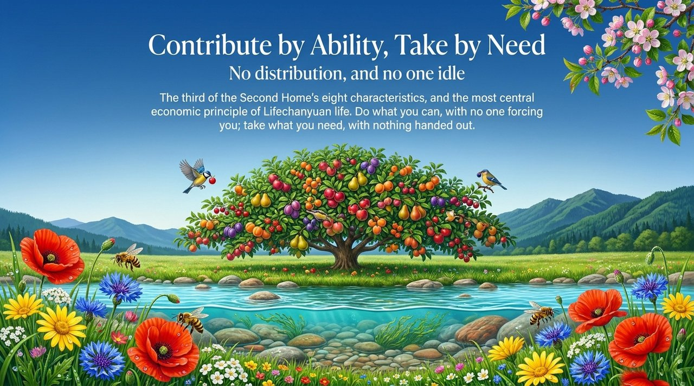
    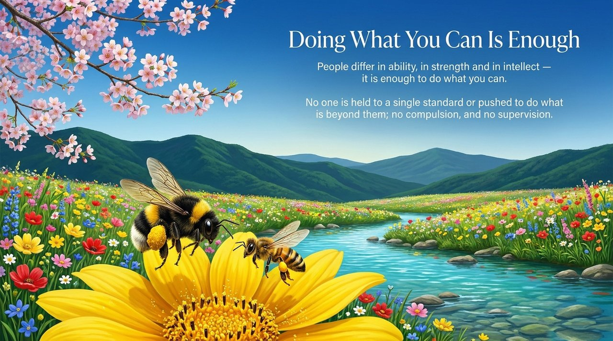
    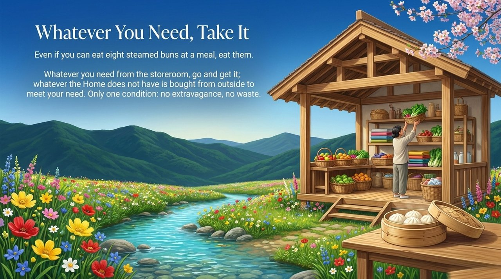
    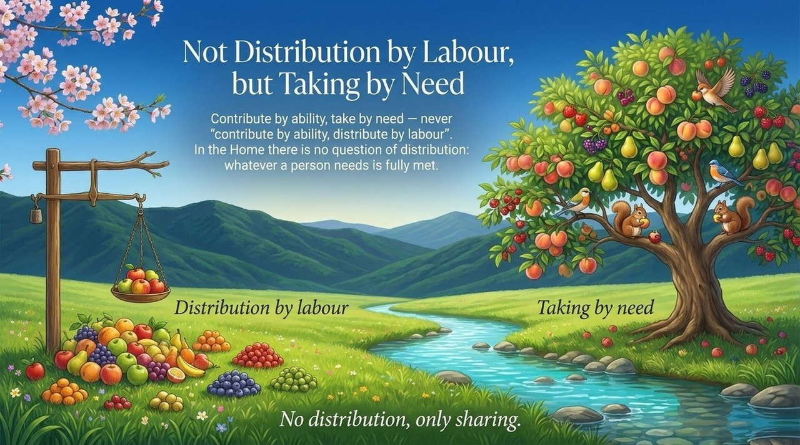
    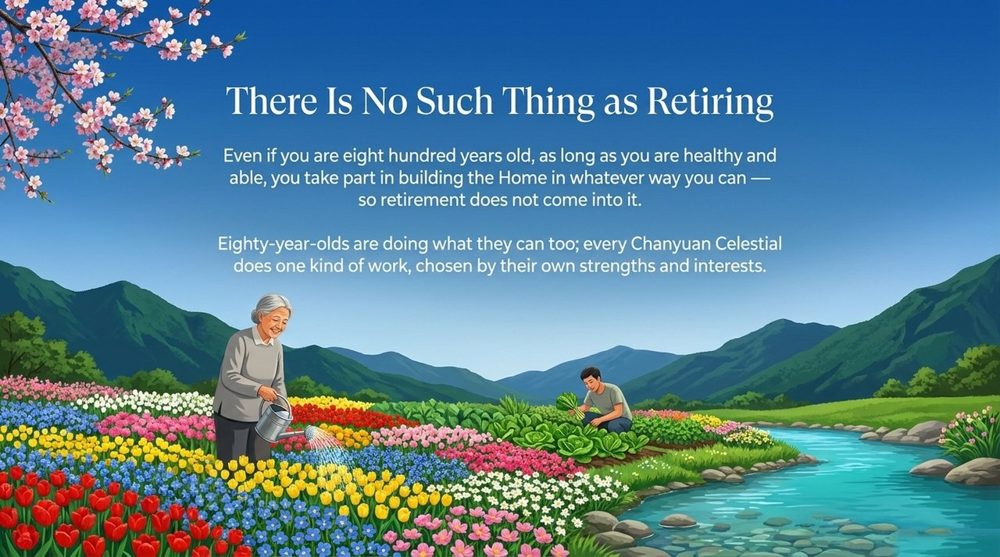
    
    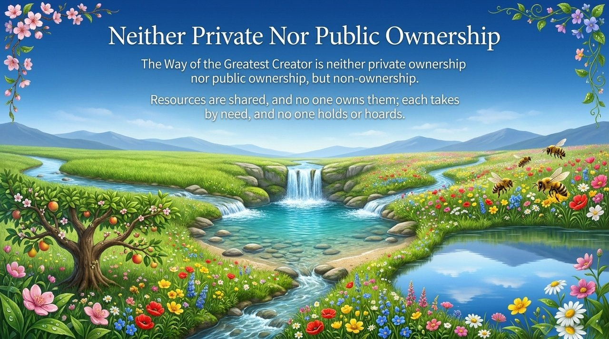
    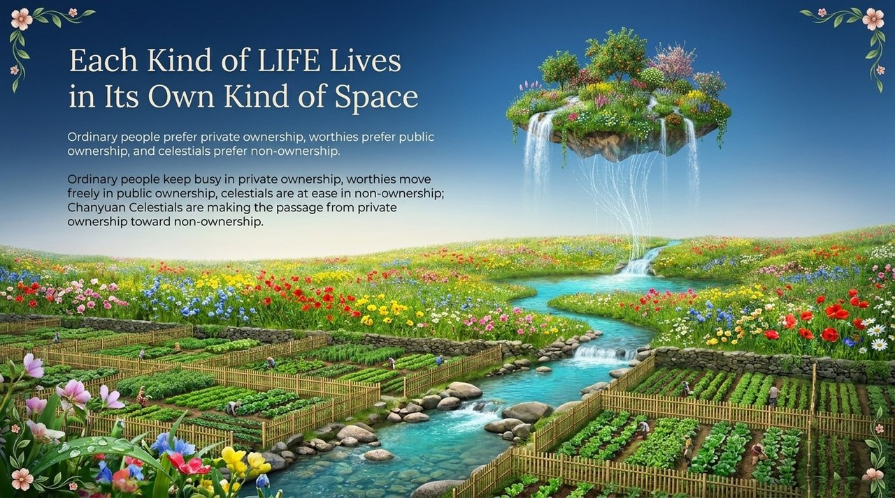
    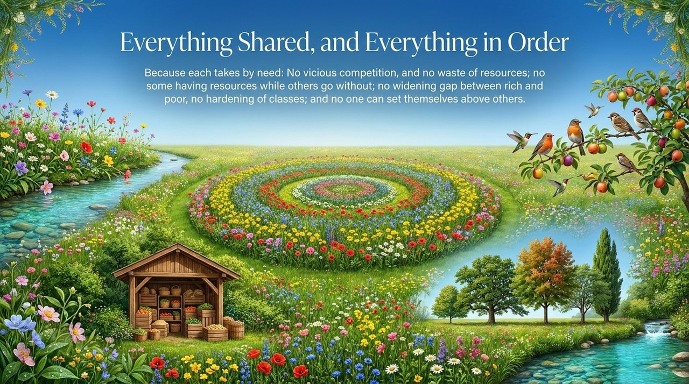
    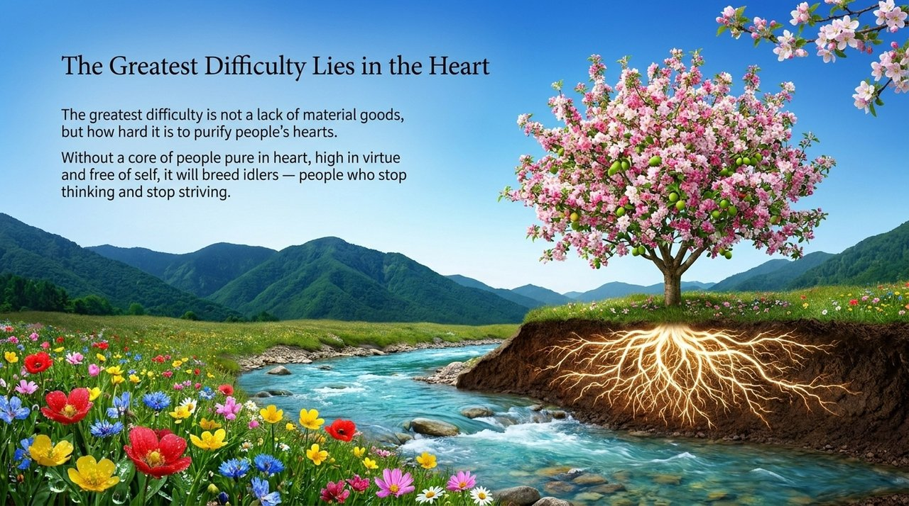
    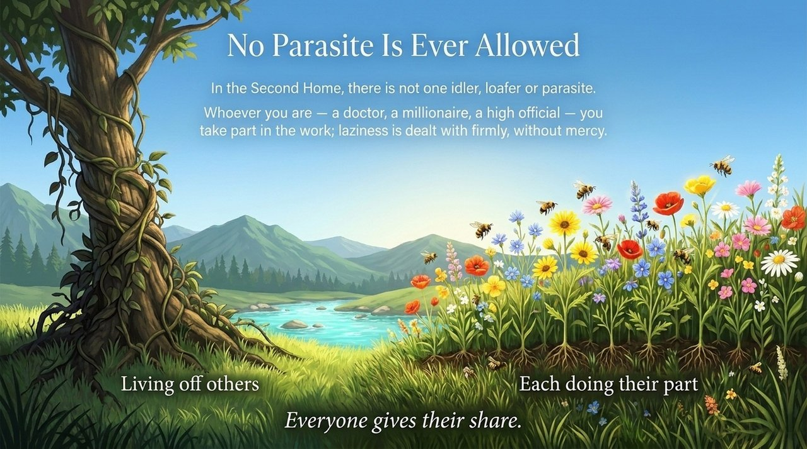
    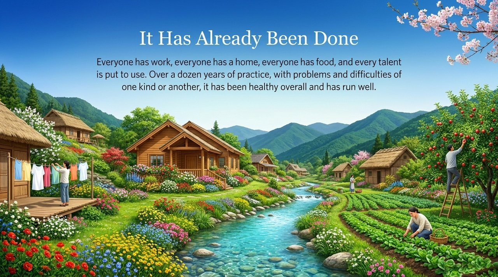
    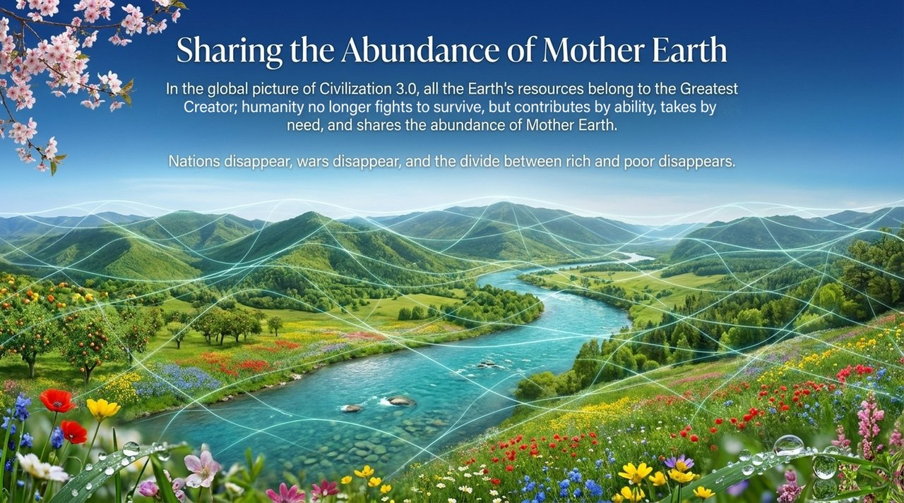
    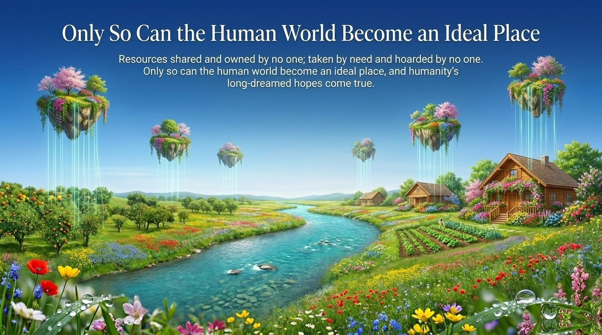

## Related Entries

[Own Nothing, Have Everything](/en/own-nothing-have-everything/) · [Second Home](/en/second-home/) · [Xuefeng-Style Communism](/en/xuefeng-communism/) · [Hundun Management](/en/hundun-management/) · [Hundun Economy](/en/hundun-economy/) · [Heavenly Bank](/en/heavenly-bank/) · [Civilization 3.0](/en/civilization-3-0/) · [Life Oasis](/en/life-oasis/)
