# Cosmic Holography

> The implication of the Hundun phenomenon is cosmic holography — boundless in its vastness, inexhaustible in its minuteness. Every phenomenon, every thing resonates with the cosmic whole; nothing exists independently outside of other things, and no phenomenon stands apart from the field of phenomena.
>
> — *New Era Human 800 Concepts*, 4th Edition, Concept 413

Cosmic holography is one of the foundational principles in the Lifechanyuan system: the universe is a unified Hundun whole, boundless yet present in every speck, in which every phenomenon and every being mutually resonate. A single thought travels instantly through the entire cosmos; the smallest mirrors the greatest; Heaven and humanity are one. This principle underlies the mechanics of karma and reward, and is the deep rationale for cultivation practice.

## Video

<iframe style="width:100%;aspect-ratio:4/3;border:0" src="https://www.youtube-nocookie.com/embed/_P8VCpGSpWQ" title="Cosmic Holography (Lifechanyuan Encyclopedia video)" allowfullscreen></iframe>

## Slides

??? info "📖 Illustrated slides (14 pages, click to expand)"

    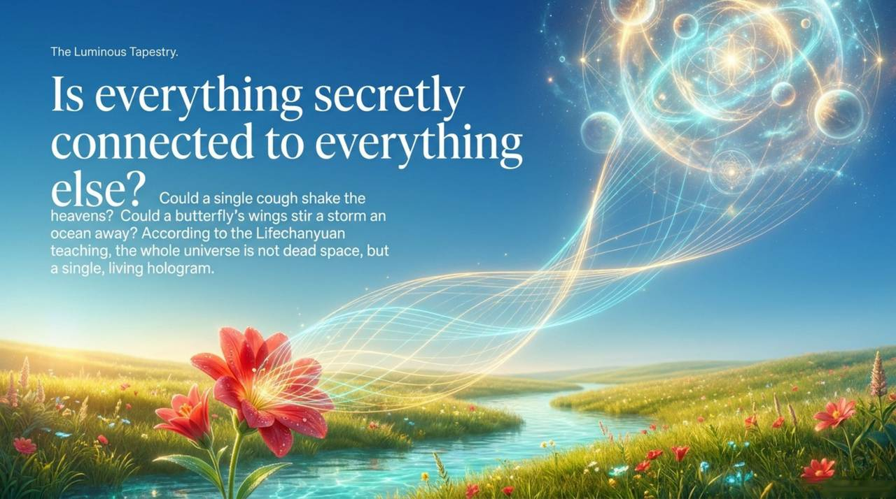
    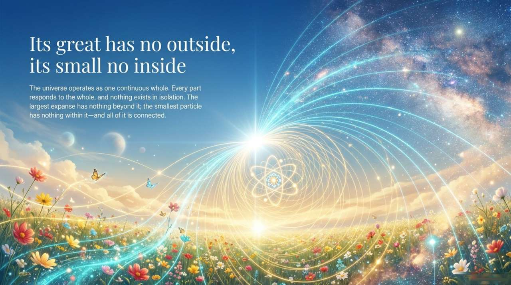
    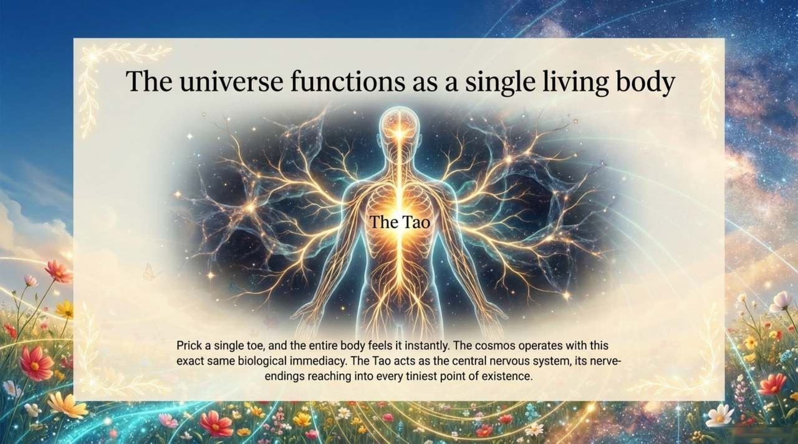
    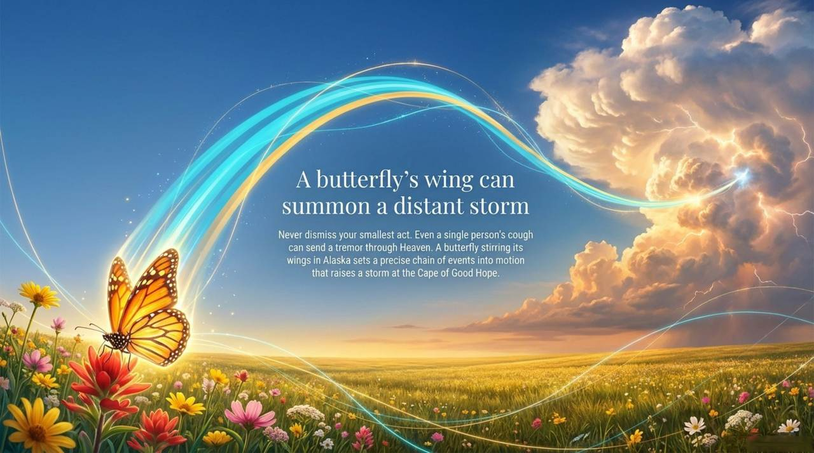
    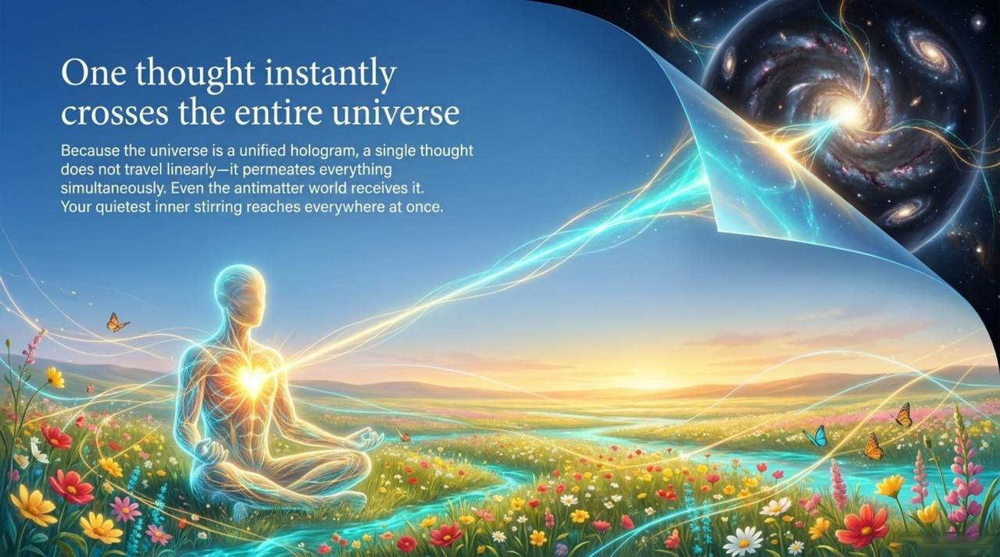
    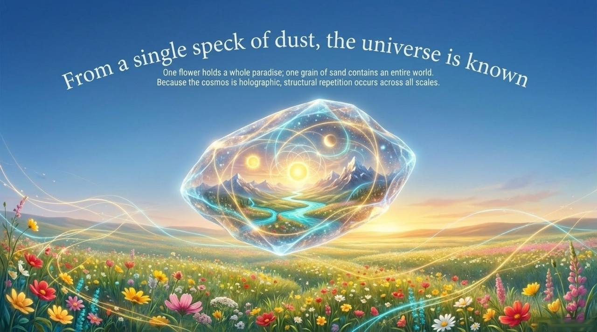
    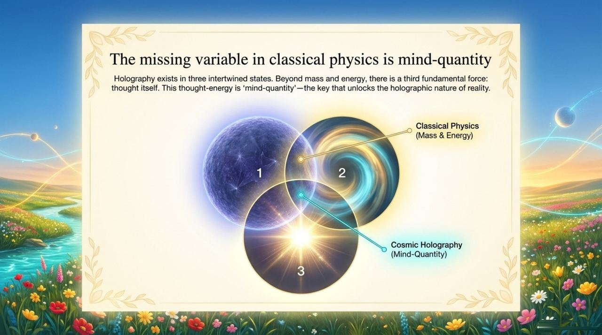
    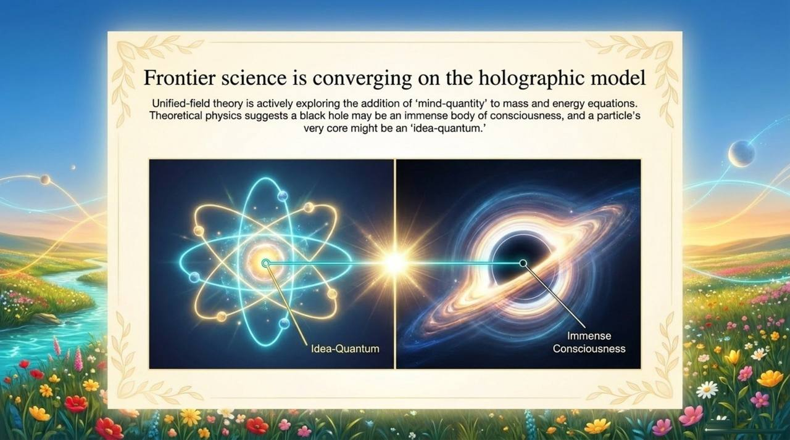
    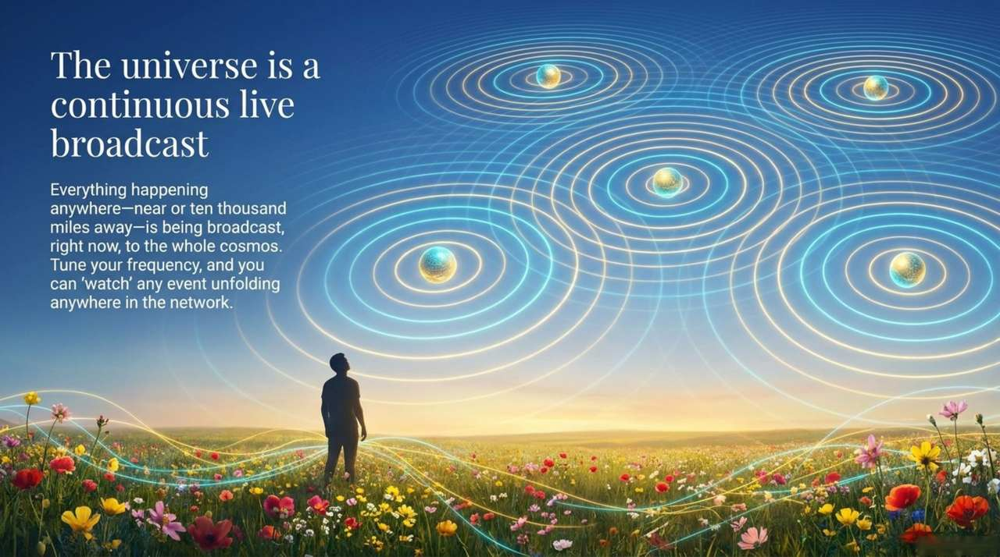
    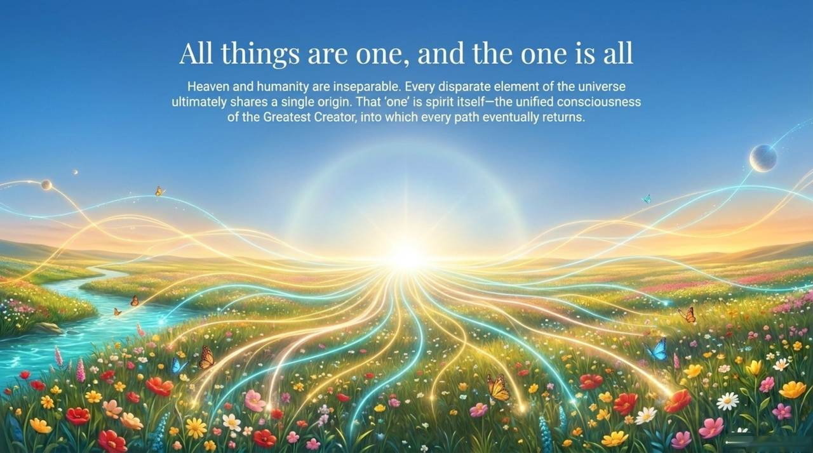
    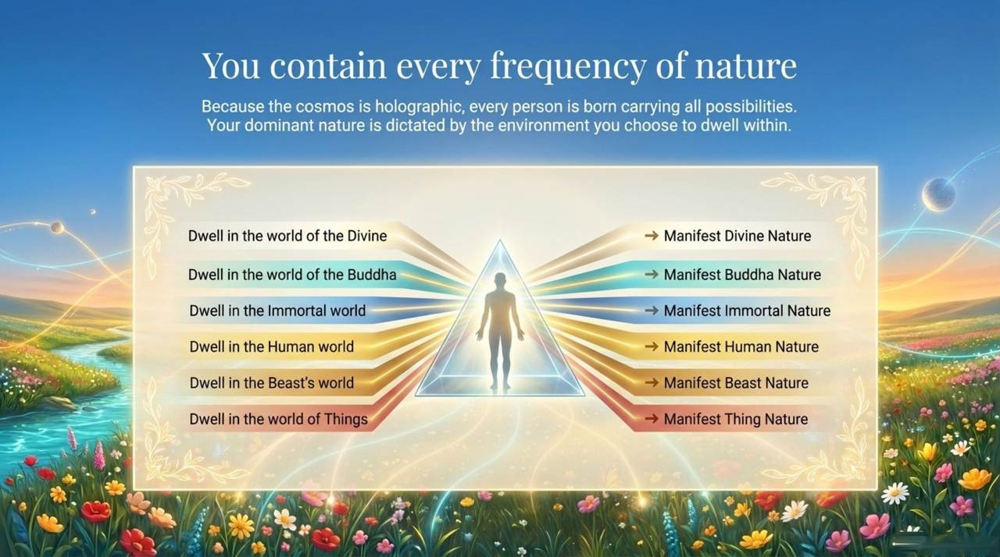
    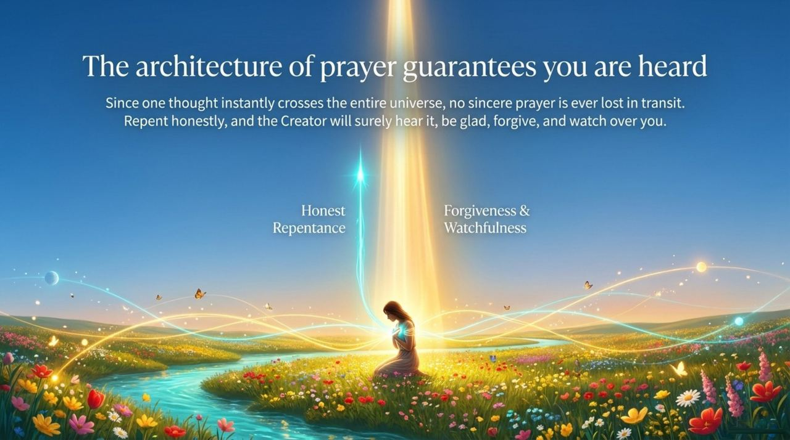
    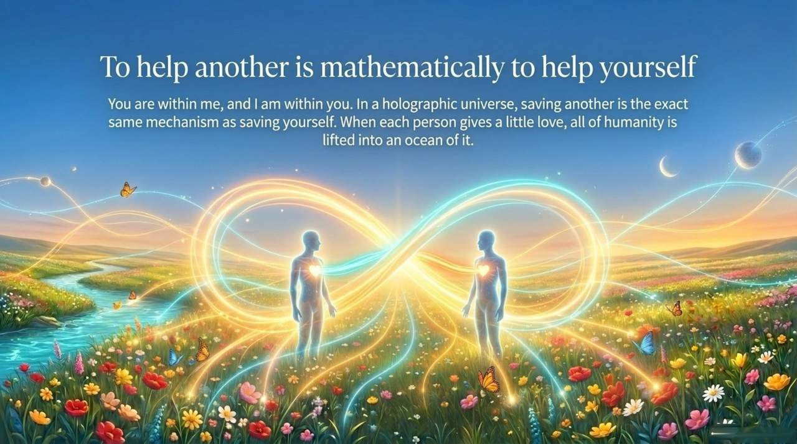
    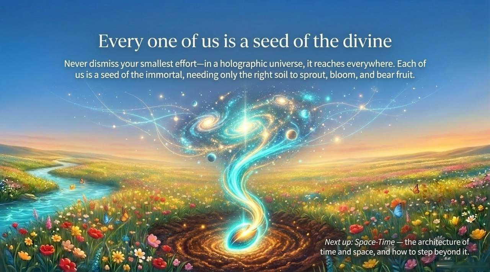

| Version | Best for | Focus |
|---------|----------|-------|
| [Friendly version](friendly.md) | First-time readers | Everyday analogies and cultivation significance |
| [Academic version](academic.md) | Researchers | Systematic analysis and conceptual comparison |
| [Internal reference](internal.md) | Deep study | Complete original-text anthology |

---

## Related Entries

[Hundun (Ontology)](/en/hundun/) · [Dao](/en/dao/) · [The Greatest Creator](/en/greatest-creator/) · [Consciousness](/en/consciousness/) · [Resonance](/en/resonance/) · [Space-Time](/en/spacetime/) · [Antimatter World](/en/antimatter-world/) · [Becoming a Celestial](/en/becoming-celestial/) · [Repentance](/en/repentance/)
