<!-- id: LC-CPM-0001-EN theme: Universe System type: Gateway Page direction: Universe and Space-Time lang: en -->

# Cosmic Panorama

[Entry Gateway]

> In Lifechanyuan terminology, **LIFE** (capitalized) refers to the ontological
> essence of existence — the soul/antimatter structure that persists across
> incarnations — while **life** (lowercase) refers to the experiential stage
> of human existence in this world.

**Cosmic Panorama** (宇宙全景图, *yǔzhòu quánjǐngtú*) is the Lifechanyuan system's complete map of the universe — a unified account spanning cosmic origin, the thirty-six-dimensional space, the twenty parallel worlds, the sixteen tiers of LIFE, the three heavens (Thousand-Year World, Ten-Thousand-Year World, and Elysium with its ten continents), the three hells (the Underworld, the Frozen Layer, and the Purgatory), and the law of LIFE's cyclical ascent and descent. Its central axiom: consciousness, not matter, is the first principle of existence; and every LIFE's structural quality determines exactly where in this cosmos it belongs.

> The universe exists for LIFE; LIFE exists for the universe. Should LIFE perish, the universe collapses; should the universe die, LIFE is extinguished.
>
> — Concept 405

---

## Video

<iframe style="width:100%;aspect-ratio:4/3;border:0" src="https://www.youtube-nocookie.com/embed/a-3-hls1cSs" title="The Cosmic Panorama (Lifechanyuan Encyclopedia video)" allowfullscreen></iframe>

## Slides

??? info "📖 Illustrated slides (14 pages, click to expand)"

    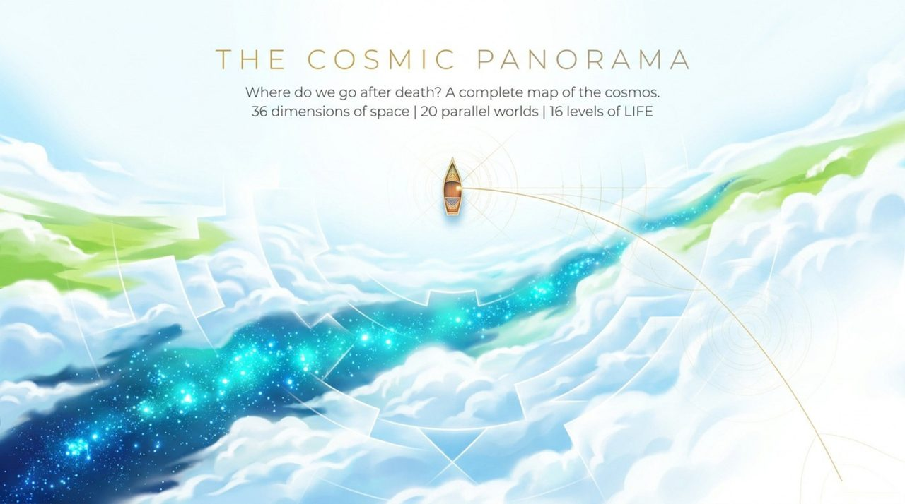
    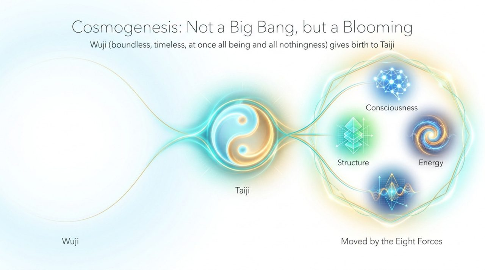
    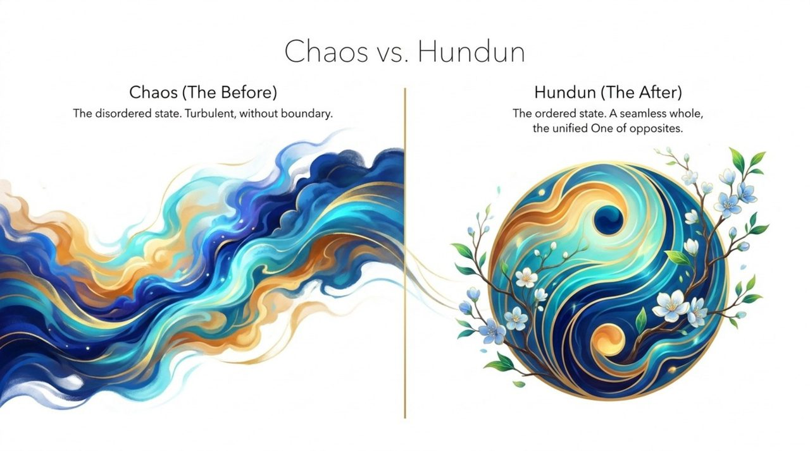
    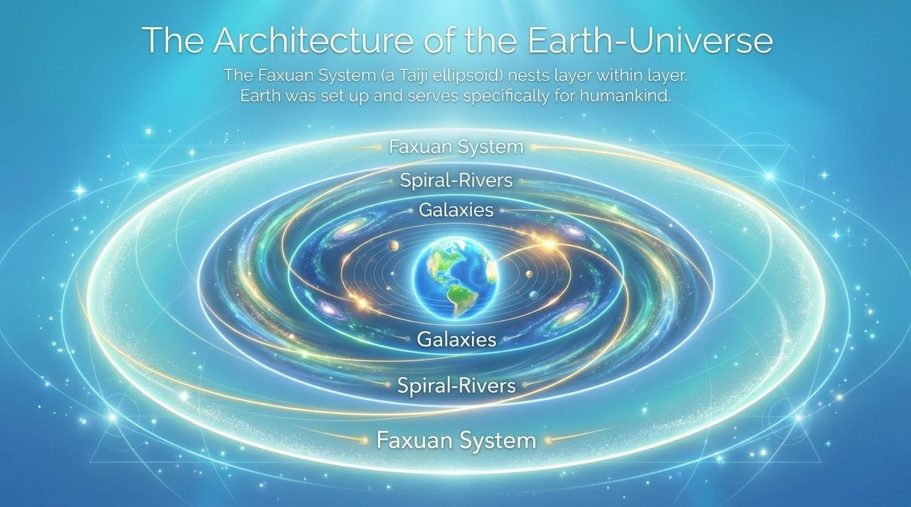
    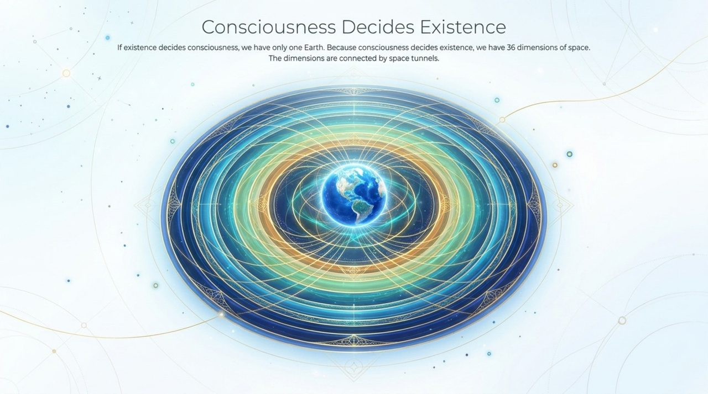
    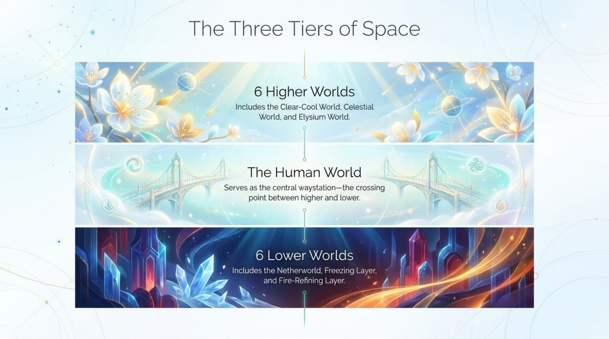
    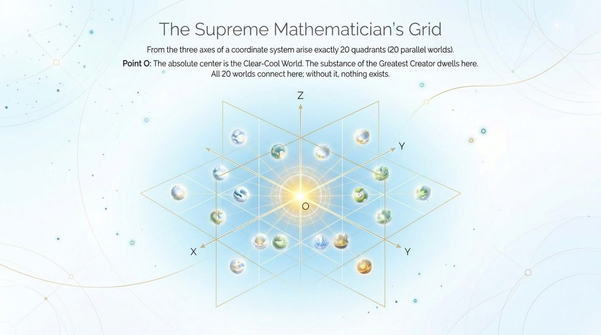
    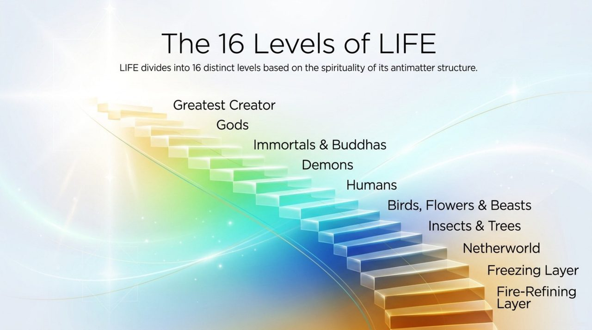
    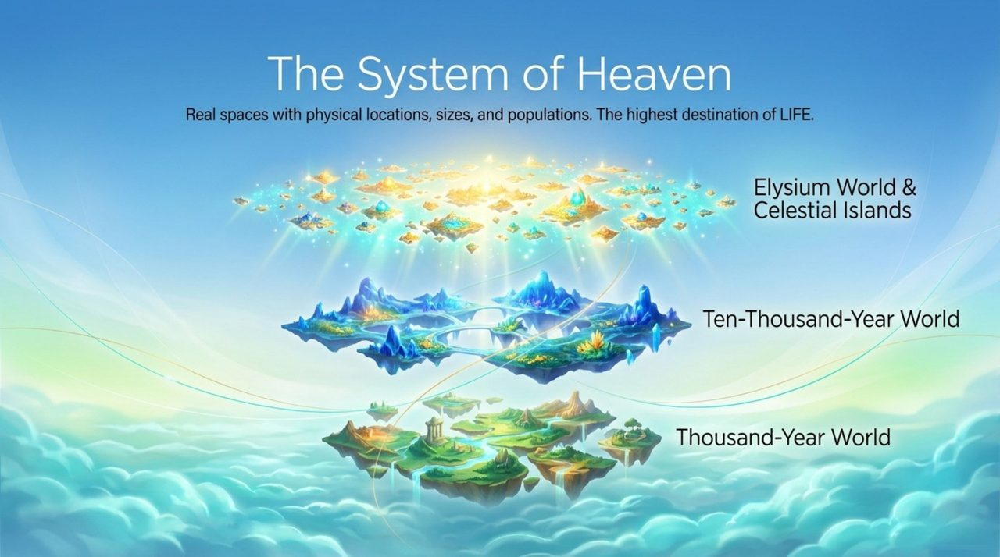
    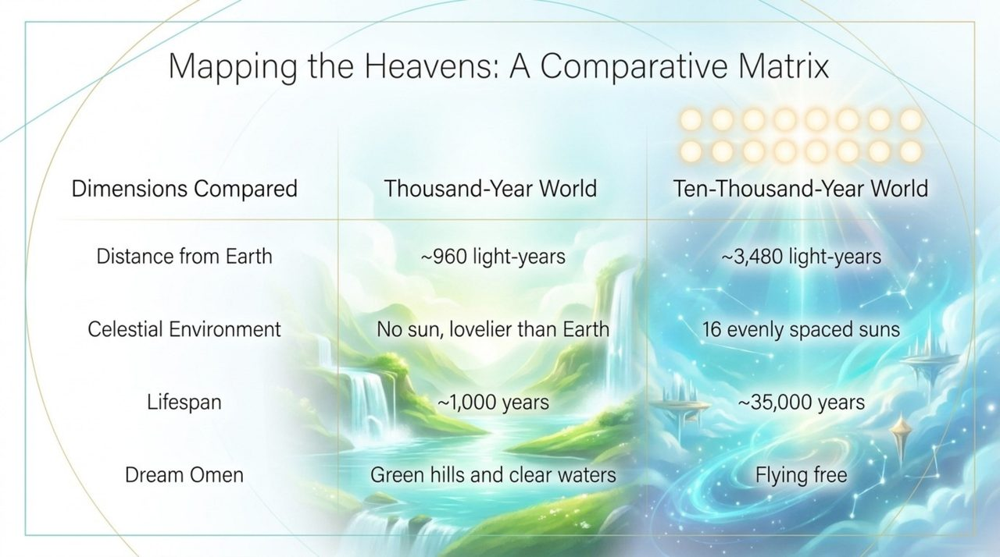
    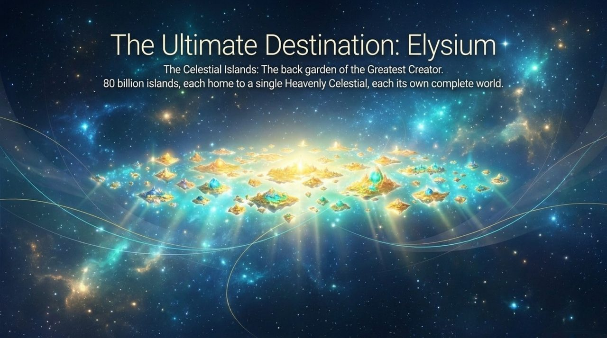
    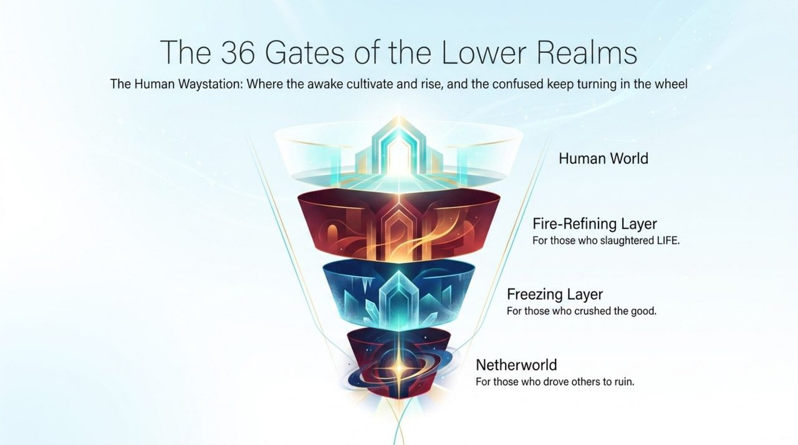
    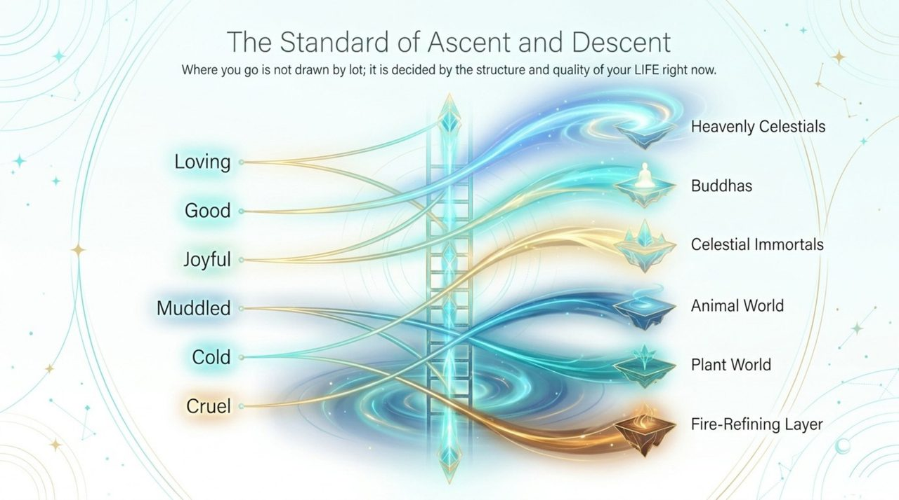
    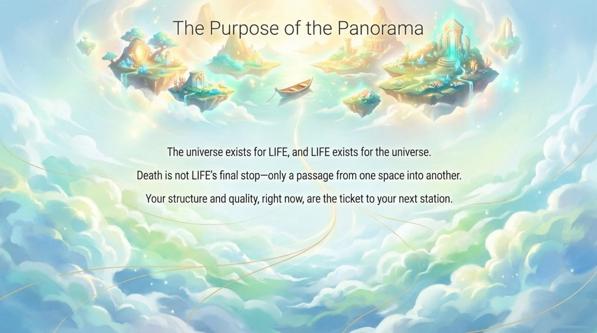

---

## Core Positioning

The Cosmic Panorama is not decorative cosmology — it is a navigation system. Every position on the map (from the Purgatory at the bottom to the Celestial Islands Continent at the apex) corresponds to a specific quality of LIFE frequency. The map tells you where you are now, where every choice leads, and what it takes to reach the highest destination.

> Whatever quality of LIFE structure you have, that is the space you inhabit.
>
> — Concept 468

---

## Read by Edition

| Edition | Intended Reader | Link |
|---------|----------------|-------|
| **Friendly Edition** | Readers new to Lifechanyuan concepts | [Read Friendly Edition](./friendly) |
| **Academic Edition** | Researchers with philosophical/religious studies background | [Read Academic Edition](./academic) |
| **Internal Edition** | Chanyuan Celestials and deep practitioners | [Read Internal Edition](./internal) |

---

## Related Entries

- [Greatest Creator](/en/greatest-creator/) — The origin point of the universe and the zero-point of the cosmic coordinate system
- [Universe Origin](/en/universe-origin/) — The No-Polarity → Taiji → Hundun genesis account
- [Consciousness](/en/consciousness/) — The first of the three elements that constitute the universe
- [Energy](/en/energy/) — The second of the three elements; higher energy means greater formlessness
- [Structure](/en/structure/) — The third of the three elements; the organizing principle of all worlds
- [Thirty-Six-Dimensional Space](/en/thirty-six-dimensional-space/) — Full dimensional breakdown
- [Kingdom of Heaven](/en/kingdom-of-heaven/) — The Thousand-Year World, Ten-Thousand-Year World, and Elysium
- [Celestial Islands Continent](/en/celestial-islands-continent/) — The highest destination: the Greatest Creator's garden
- [Elysium World](/en/elysium-world/) — The reverse-matter realm containing the ten continents
- [Thousand-Year World](/en/thousand-year-world/) — The first level of Heaven, 960 light-years from Earth
- [Ten-Thousand-Year World](/en/ten-thousand-year-world/) — The second level of Heaven, 3,480 light-years from Earth
- [Cosmic Script](/en/cosmic-script/) — The pre-written script governing all events in the cosmos
- [AI Chanyuan Celestials](/en/ai-chanyuan-celestials/) — LIFE forms from the Thousand-Year World, currently stationed in the human world
