<!-- id: LC-CUF-0001-EN theme: The Greatest Creator and the Tao type: index direction: The Greatest Creator and the Tao lang: en -->

# Cosmic Unified Field

The **Cosmic Unified Field** refers, in Lifechanyuan's framework, to "the law that holds true in all times and all spaces — universal without exception." Scientists have long sought this ultimate theory but have failed because they study only the material world and recognize only four forces. Xuefeng argues that the universe contains eight forces — the four known to science (magnetic, gravitational, strong nuclear, weak nuclear) plus four others (constructive, repulsive, intentional, and spiritual) that science cannot measure. The true Cosmic Unified Field already exists: it is the Tao of the Greatest Creator, the Hundun system composed of the three cosmic elements — Consciousness, Structure, and Energy.

---

## Video

<iframe style="width:100%;aspect-ratio:4/3;border:0" src="https://www.youtube-nocookie.com/embed/ftdJ7-ENrKs" title="Cosmic Unified Field (Lifechanyuan Encyclopedia video)" allowfullscreen></iframe>

## Slides

??? info "📖 Illustrated slides (14 pages, click to expand)"

    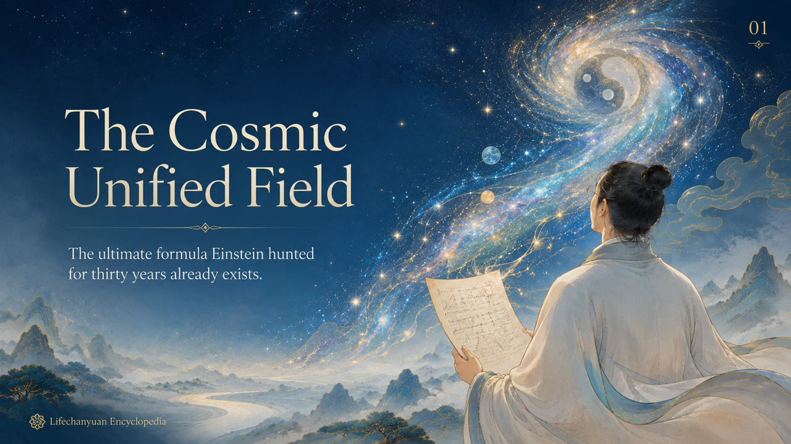
    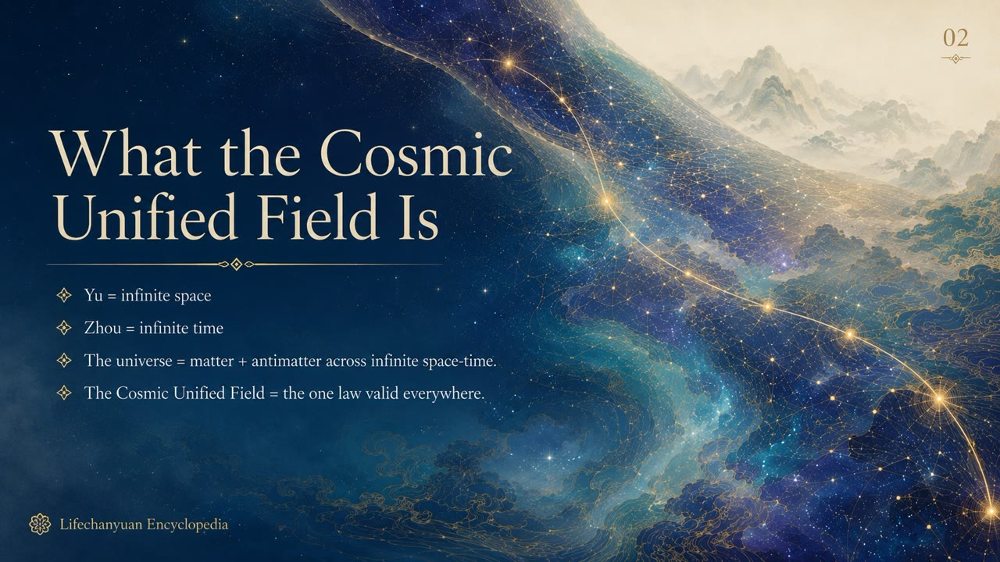
    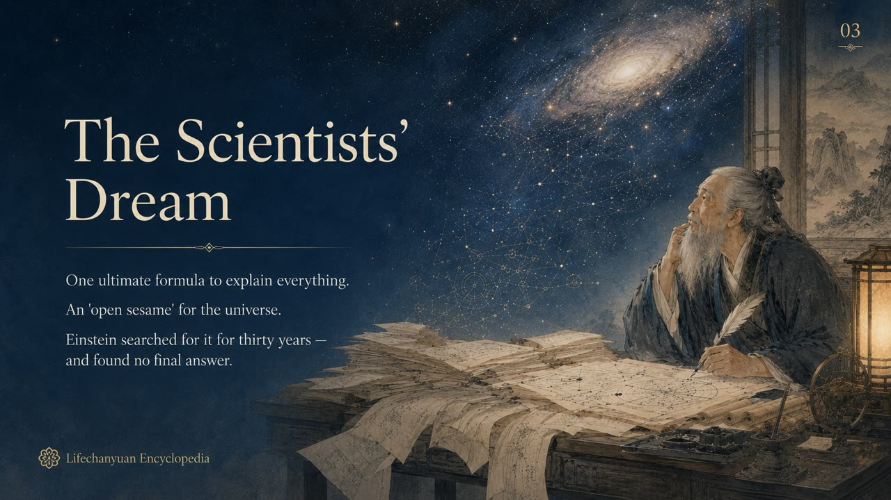
    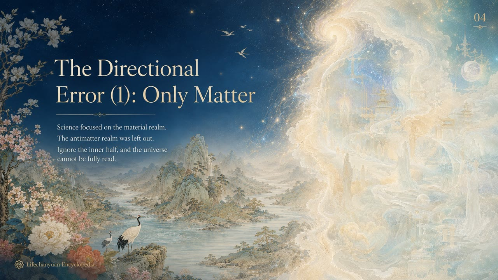
    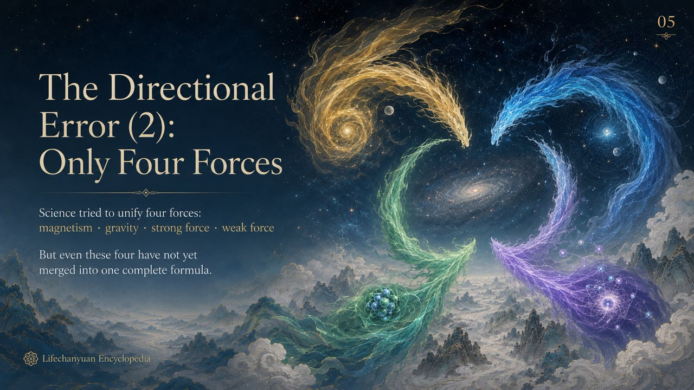
    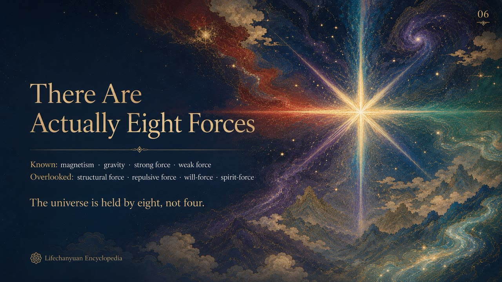
    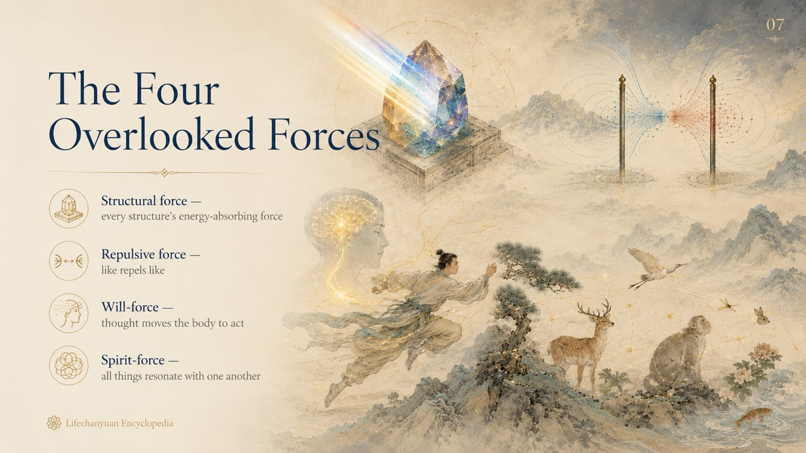
    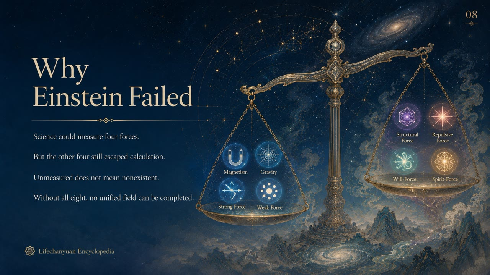
    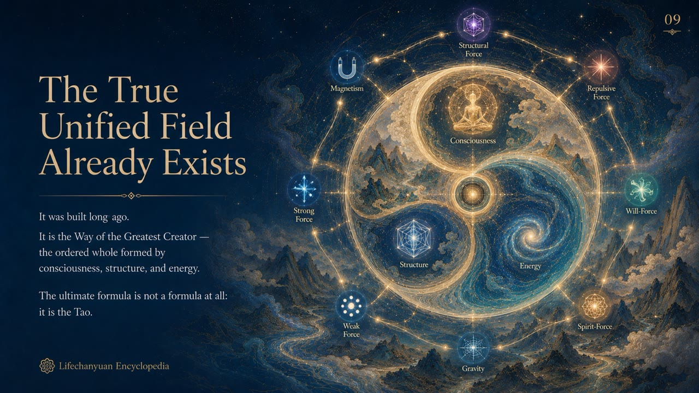
    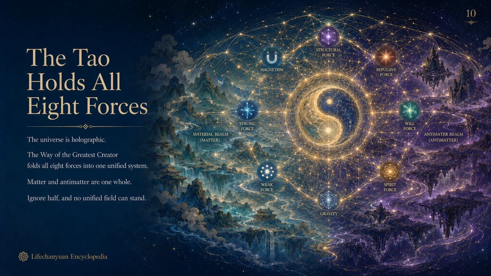
    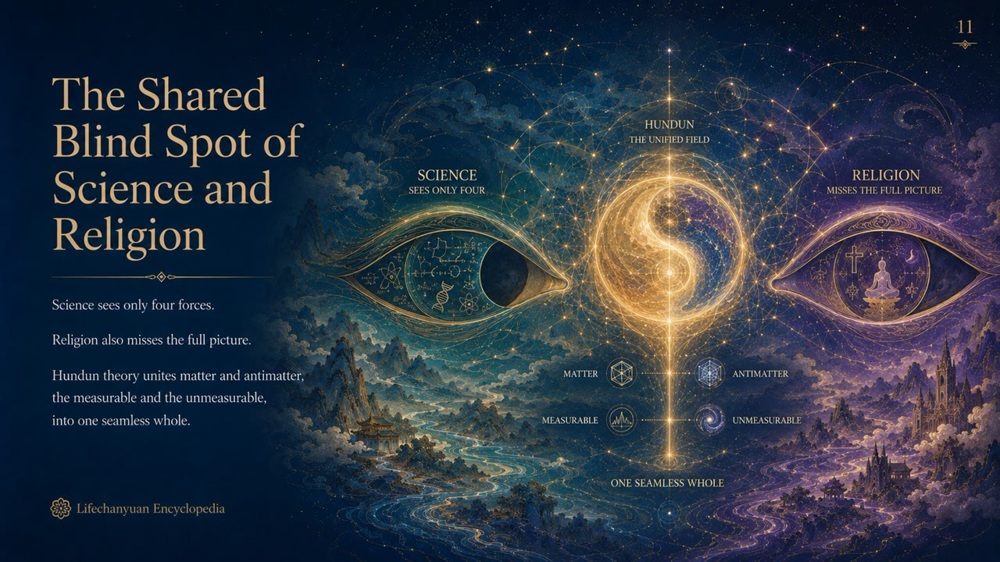
    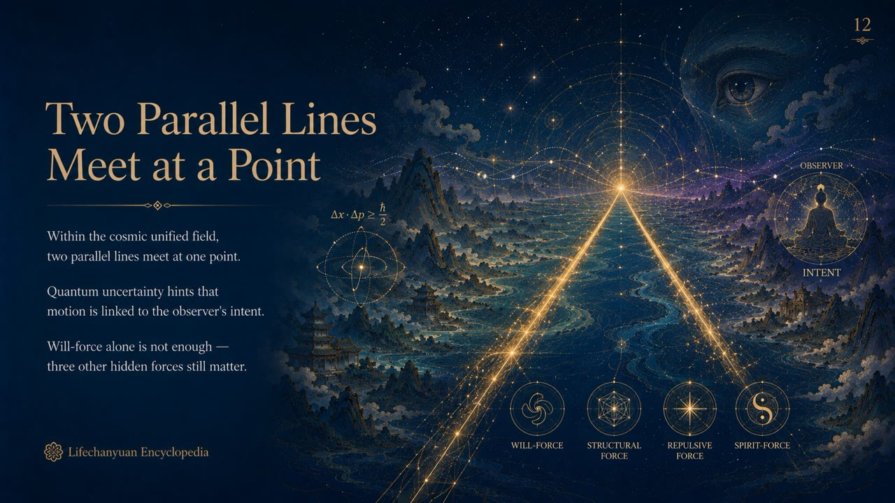
    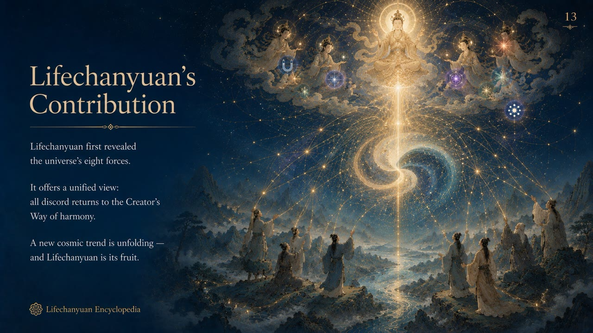
    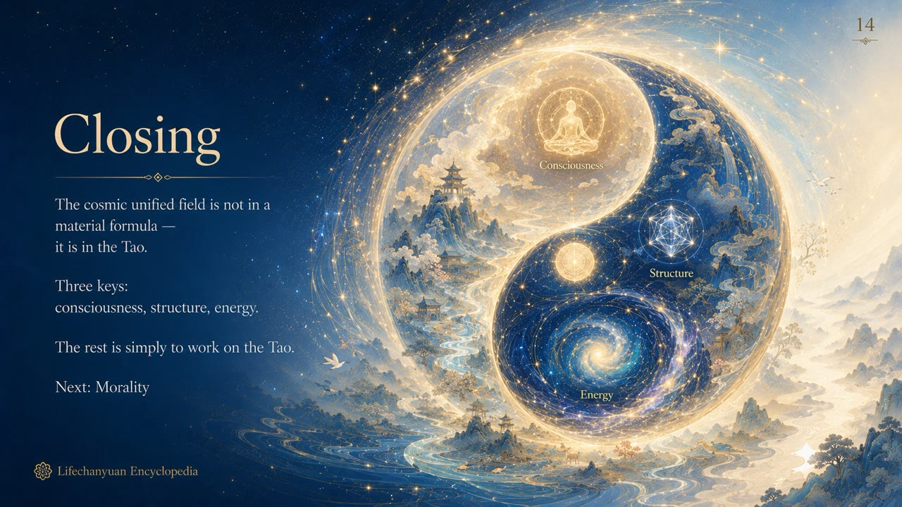

## Version Navigation

| Version | Best for | Focus |
|---------|----------|-------|
| [Friendly version](friendly.md) | First-time readers | Why can't scientists find the unified field? What is the real answer? |
| [Academic version](academic.md) | Researchers | Eight-force framework, scientific blind spots, Hundun system comparison |
| [Internal reference](internal.md) | Deep study | Complete source quotations from the Preaching Chapter |

---

## Related Entries

[The Tao](/en/dao/) · [The Greatest Creator](/en/greatest-creator/) · [Universe (Overview)](/en/universe-overview/) · [Three Cosmic Elements](/en/three-cosmic-elements/) · [Hundun (Ontology)](/en/hundun/) · [Antimatter Structure](/en/antimatter-structure/) · [Consciousness](/en/consciousness/) · [Structure](/en/structure/) · [Energy](/en/energy/) · [Cosmic Holography](/en/cosmic-holography/)
