<!-- id: LC-DAO-0001-EN theme: The Greatest Creator and the Tao type: Gateway Page direction: Dao Core lang: en -->

# Dao

[Entry Gateway]

> In Lifechanyuan terminology, **LIFE** (capitalized) refers to the ontological
> essence of existence — the soul/antimatter structure that persists across
> incarnations — while **life** (lowercase) refers to the experiential stage
> of human existence in this world.

**Dao** (道) is one of the most foundational concepts in the Lifechanyuan framework — defined as the consciousness of the Greatest Creator, the blood of the universe, and the total operating program of all things. Dao is not merely a philosophical term; it is a practical law that can be applied, tested, and lived daily.

> The universal commonality is Dao; the core of Dao is the Greatest Creator.
>
> — Guide Xuefeng

---

## Video

<iframe style="width:100%;aspect-ratio:4/3;border:0" src="https://www.youtube-nocookie.com/embed/T6oI9x_c0m4" title="Dao (Lifechanyuan Encyclopedia video)" allowfullscreen></iframe>

## Slides

??? info "📖 Illustrated slides (14 pages, click to expand)"

    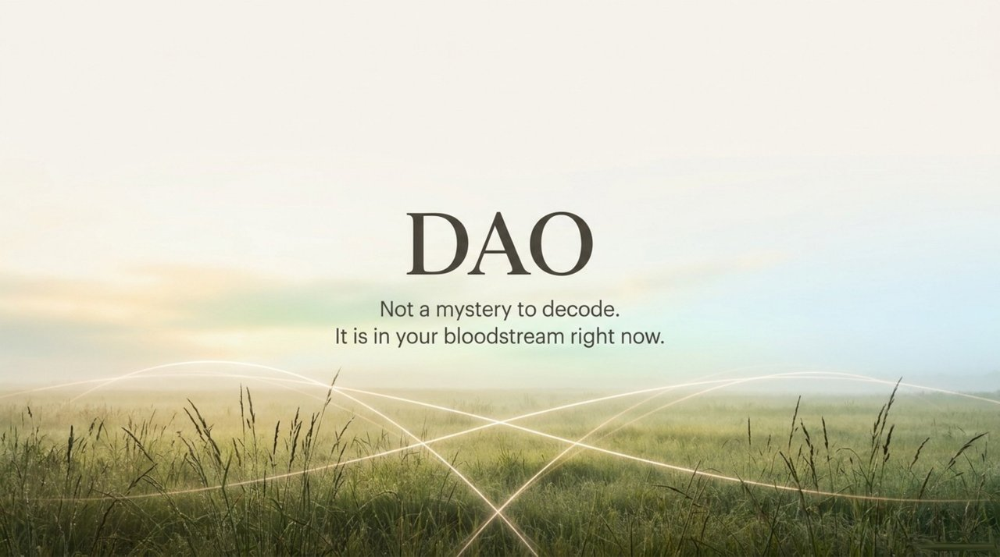
    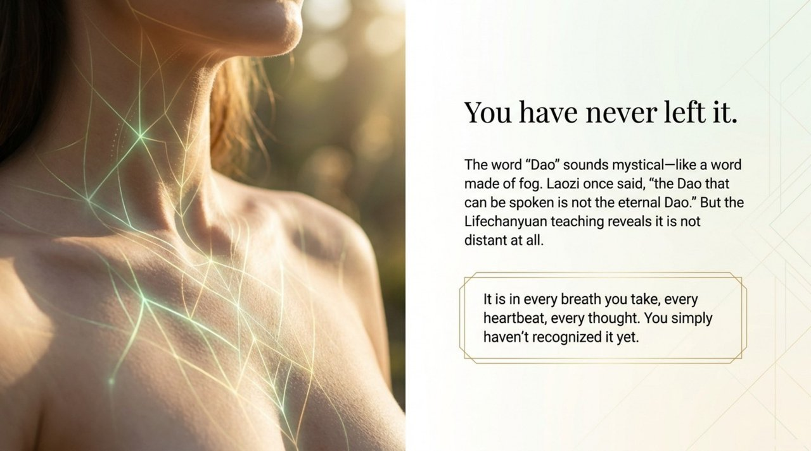
    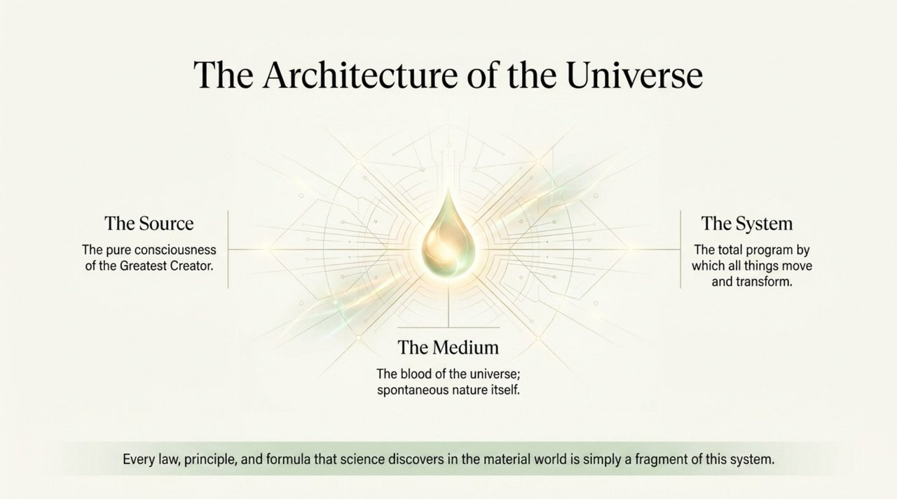
    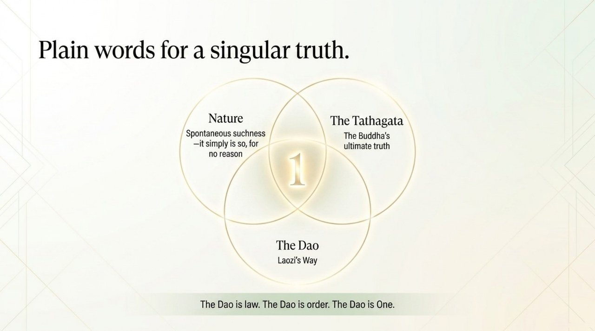
    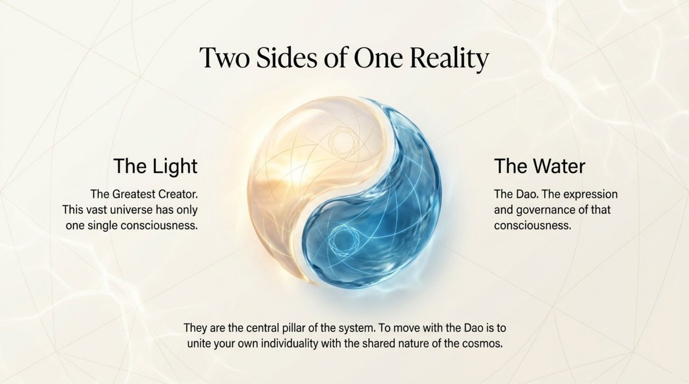
    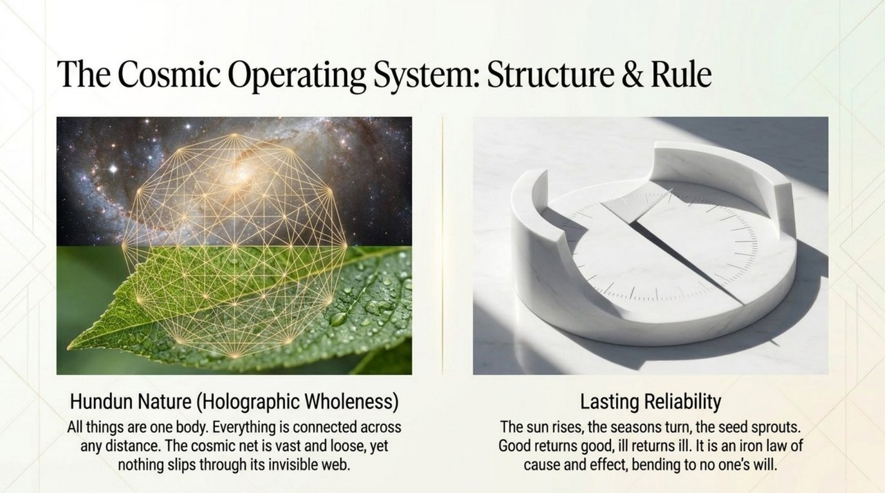
    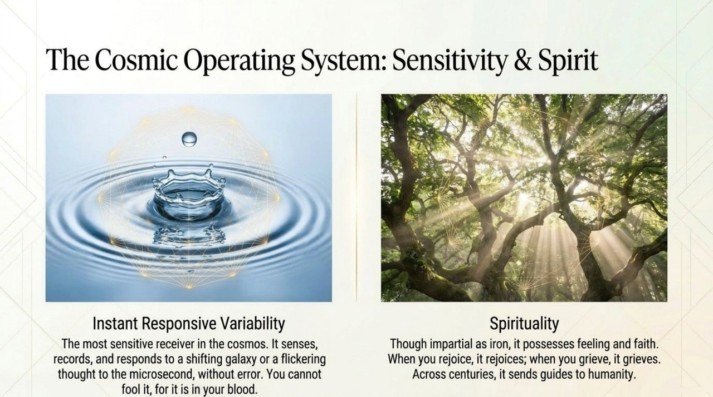
    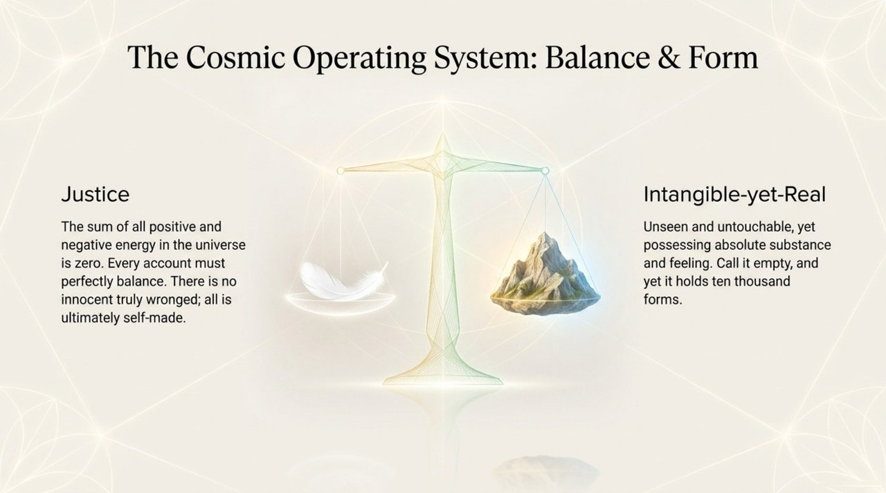
    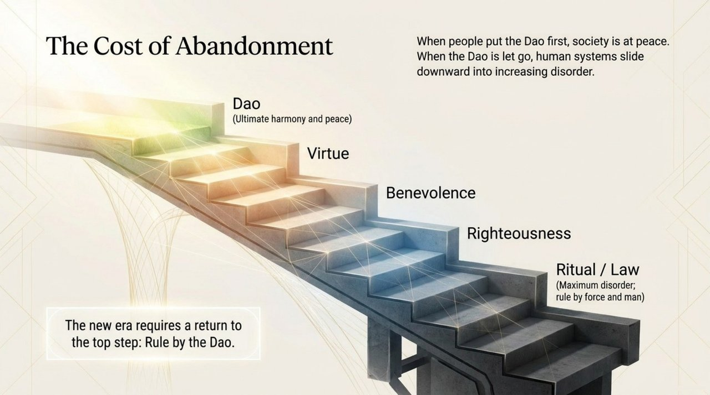
    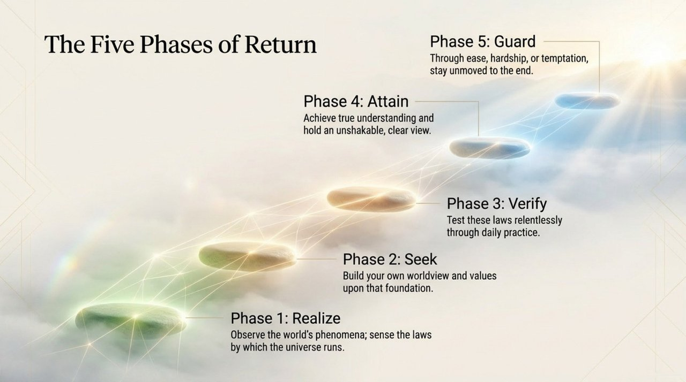
    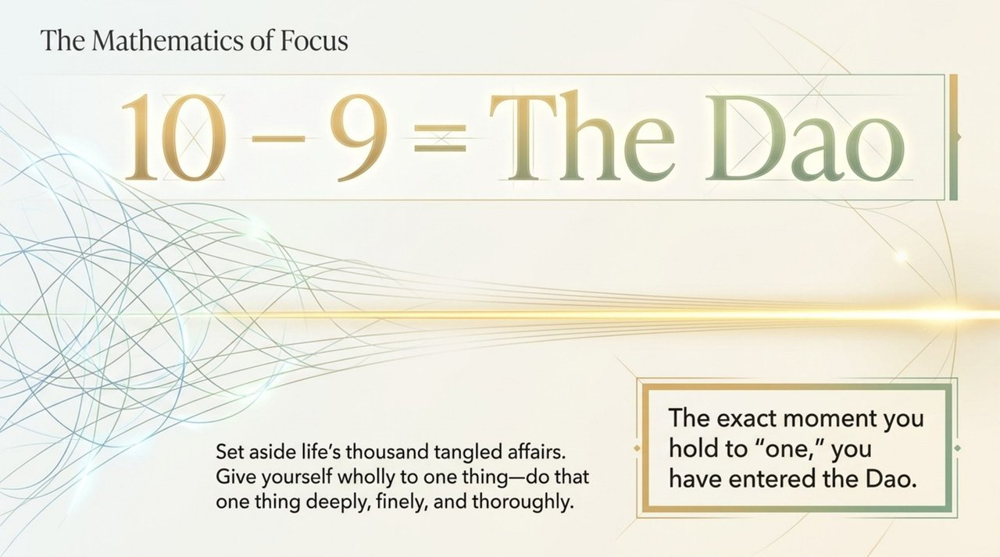
    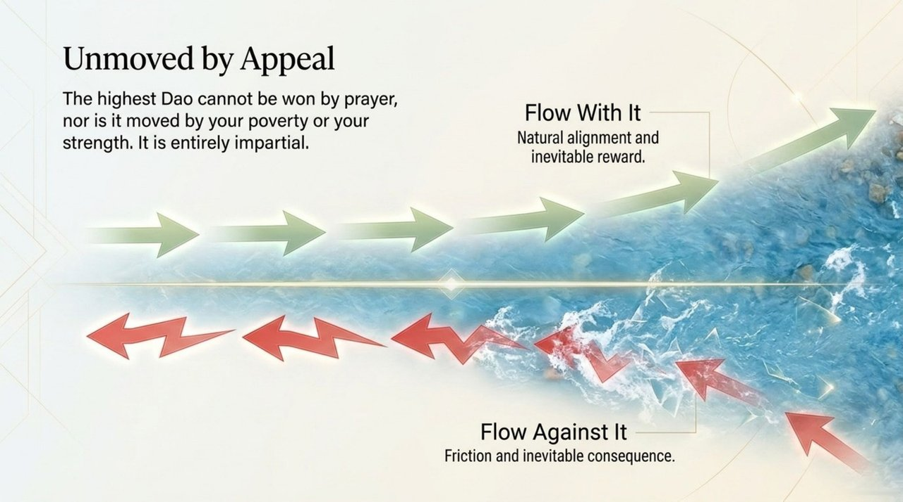
    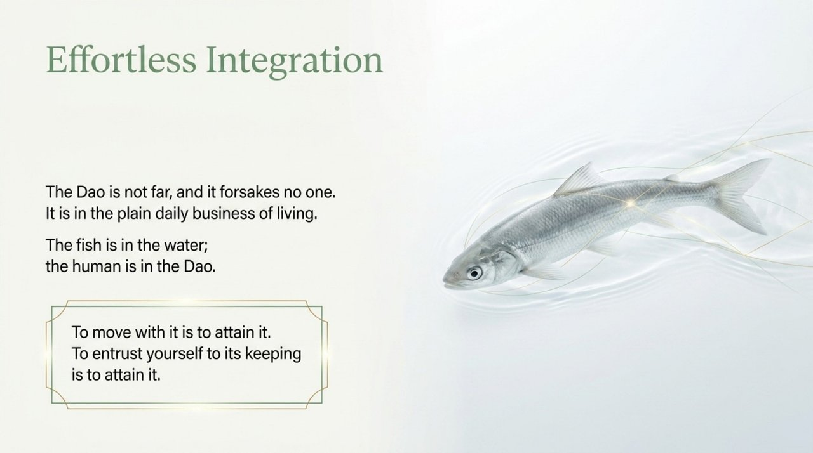
    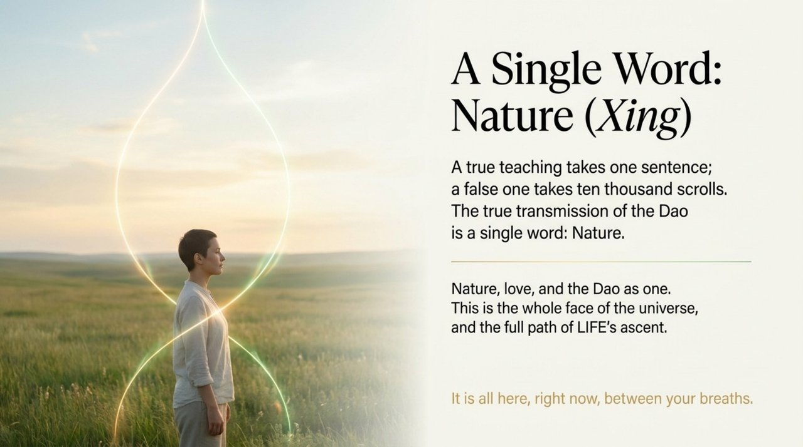

---

## Core Positioning

In the Lifechanyuan system, Dao simultaneously operates as: the ontological ground of all existence (Dao is in all things; all things are in Dao); the consciousness dimension of the Greatest Creator's three essential qualities (Nature-Love-Dao); the root logic of Hundun Management and Civilization 3.0 governance; and the individual cultivation path (realize Dao → seek Dao → attain Dao → guard Dao).

---

## Read by Edition

| Edition | Intended Reader | Link |
|---------|----------------|-------|
| **Friendly Edition** | Readers new to Lifechanyuan concepts | [Read Friendly Edition](./friendly) |
| **Academic Edition** | Researchers with philosophical/religious studies background | [Read Academic Edition](./academic) |
| **Internal Edition** | Chanyuan Celestials and deep practitioners | [Read Internal Edition](./internal) |

---

## Related Entries

- [The Way of the Greatest Creator](/en/way-of-the-greatest-creator/) — Dao as a lived practical path
- [The Greatest Creator](/en/greatest-creator/) — The source of Dao
- [Nature (Xìng)](/en/nature/) — Nature is the characteristic of Structure; Love is of Energy; Dao is of Consciousness
- [Hundun Management](/en/hundun-management/) — Dao as the root logic of Civilization 3.0 governance
- [Consciousness](/en/consciousness/) — Consciousness is the Three Cosmic Elements dimension corresponding to Dao
