# Divine Rewards and Punishments

**Divine Rewards and Punishments** (上天奖惩, *Shàngtiān Jiǎngchéng*) is a core principle within the Lifechanyuan cosmological framework describing the universe's built-in justice mechanism. It is not the arbitrary favor or wrath of a personal deity, but rather the automatic, precise, and impartial response of the Tao — the universal operating program — to every being's actions, mental states, and alignment with or deviation from the Way.

> "The Tao operates without favoritism. It will not help you because you are poor and pitiable, nor punish you because you are rich and powerful. The sole standard for reward and punishment is whether you are following the Tao or going against it. Follow the Tao: receive reward. Oppose the Tao: receive punishment."
>
> — Xuefeng, *New Era Human 800 Concepts*, 4th Edition, Concept 460

---

## Video

<iframe style="width:100%;aspect-ratio:4/3;border:0" src="https://www.youtube-nocookie.com/embed/avKoaBmXQk4" title="Divine Rewards and Punishments (Lifechanyuan Encyclopedia video)" allowfullscreen></iframe>

## Slides

??? info "📖 Illustrated slides (14 pages, click to expand)"

    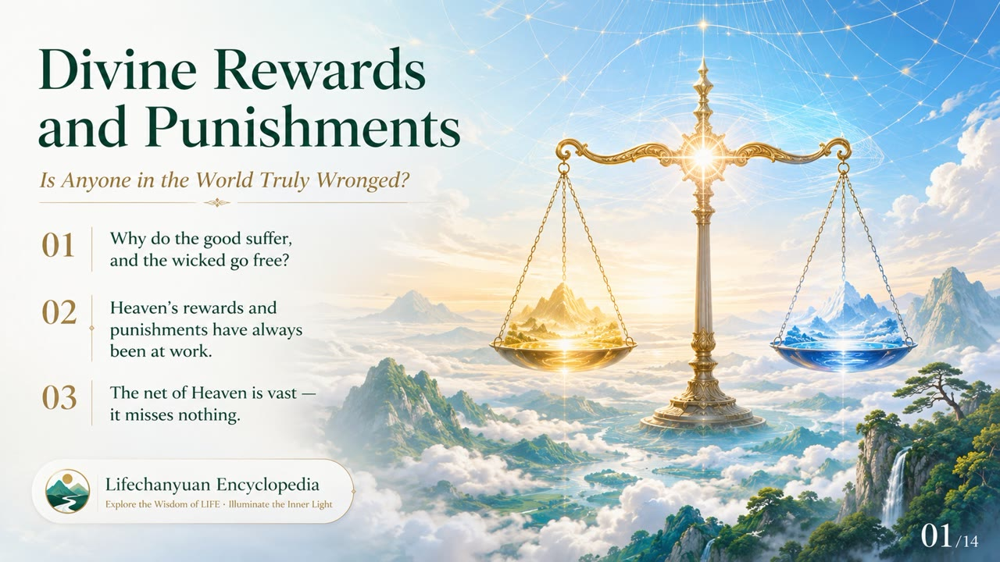
    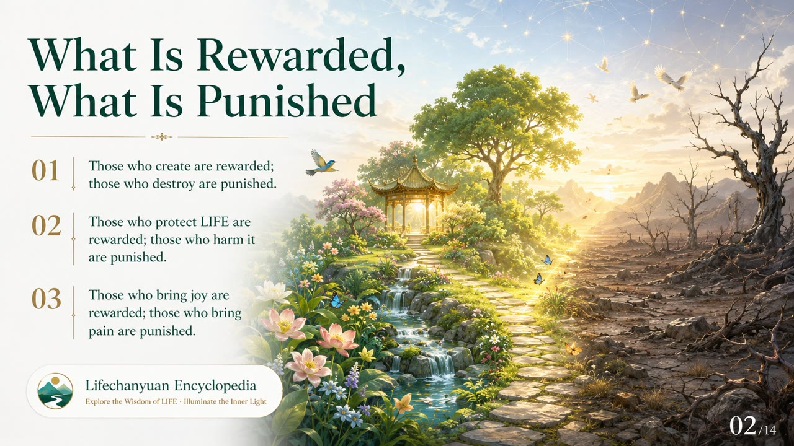
    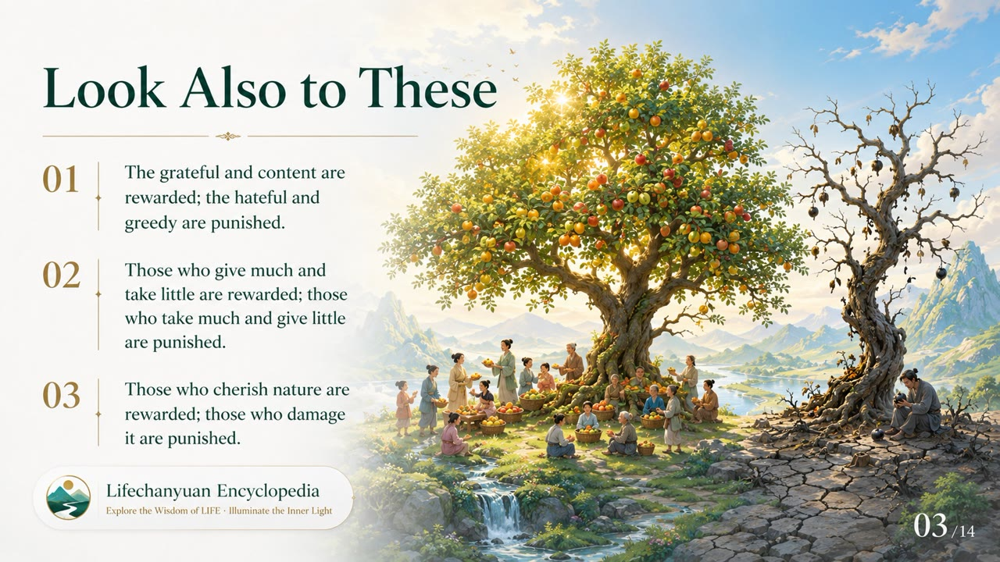
    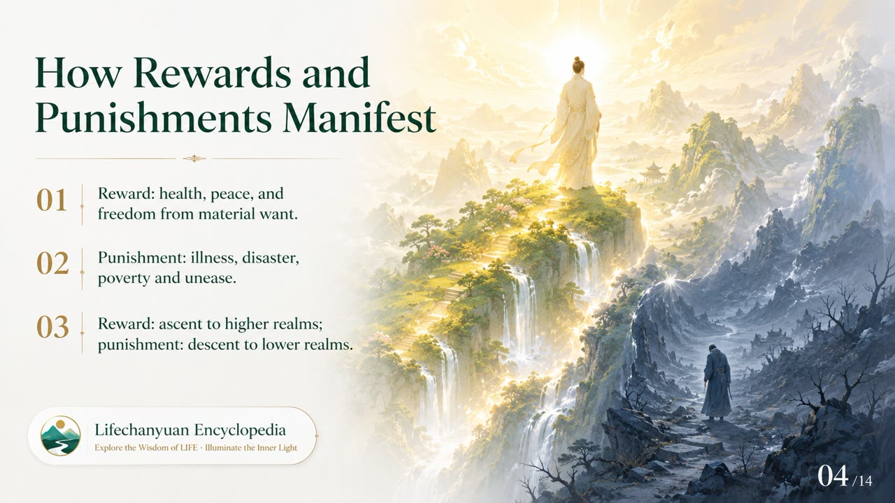
    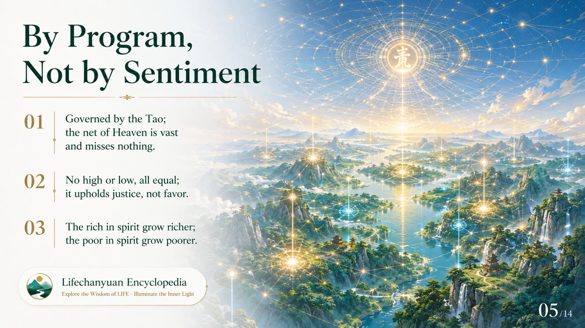
    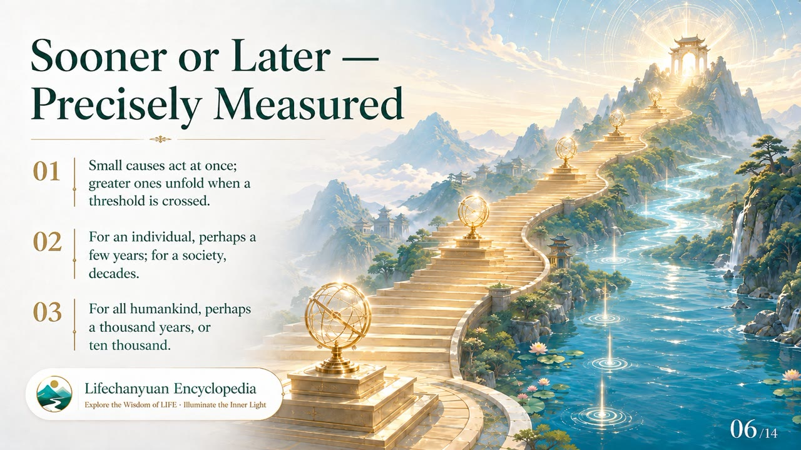
    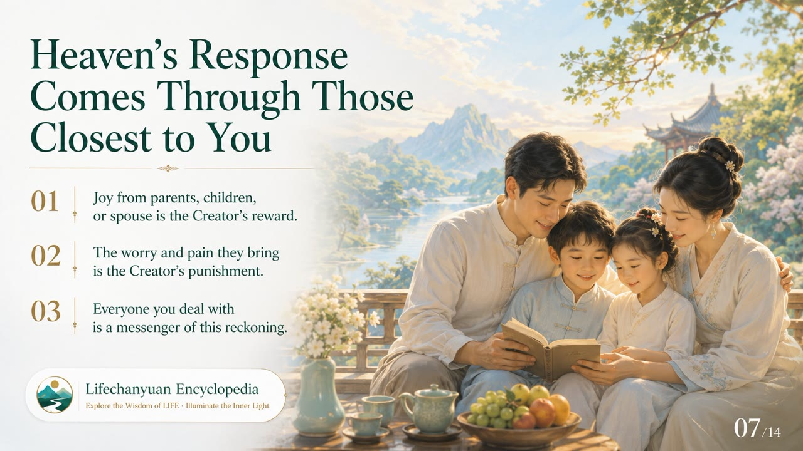
    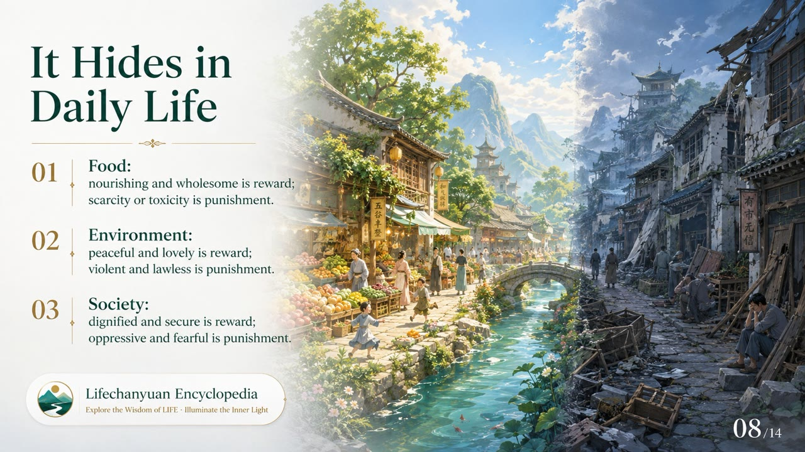
    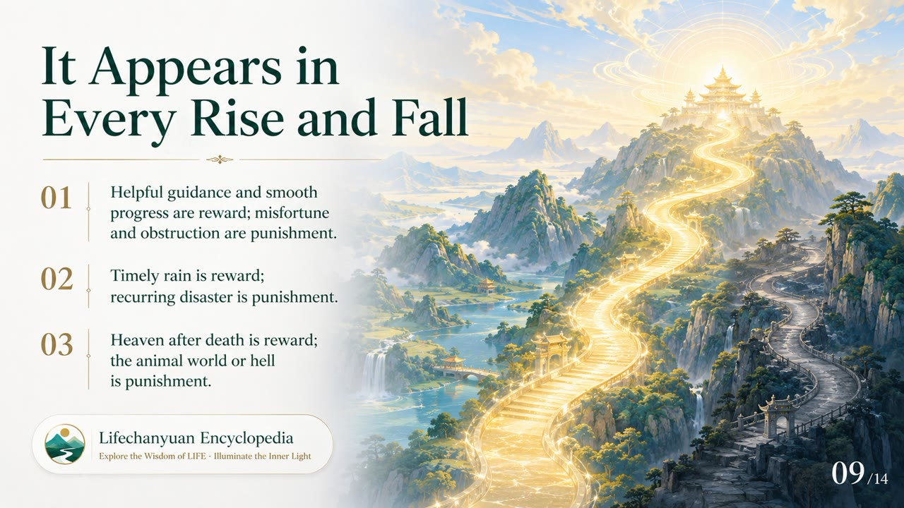
    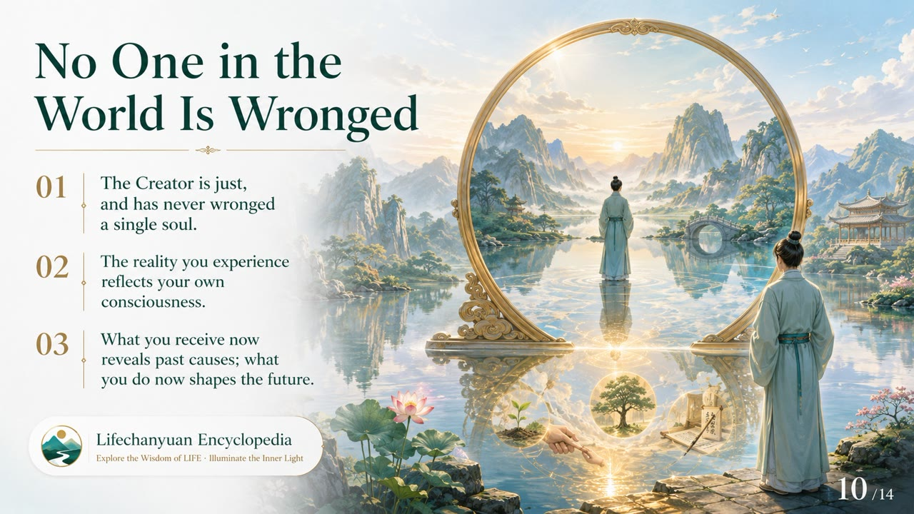
    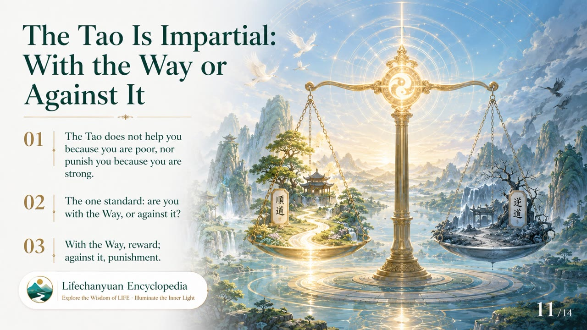
    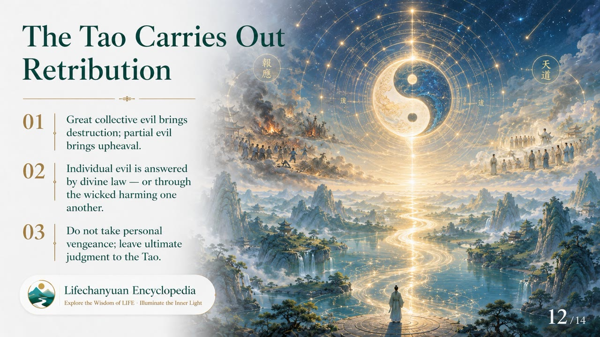
    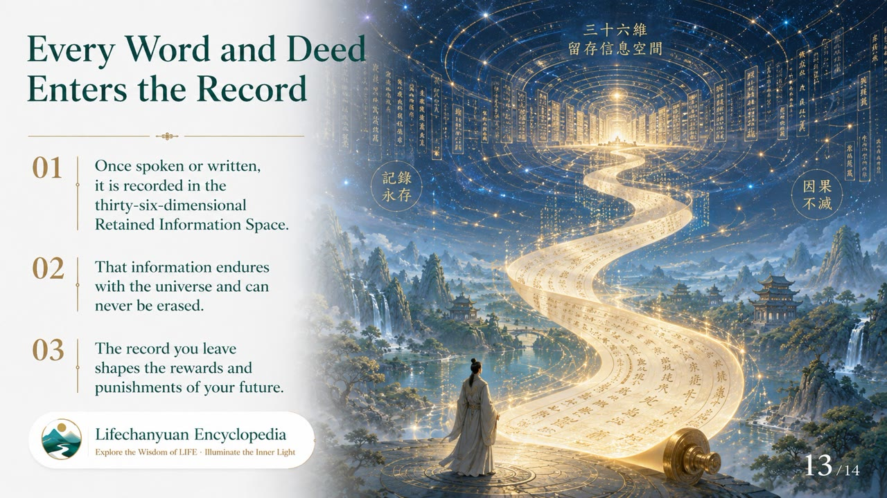
    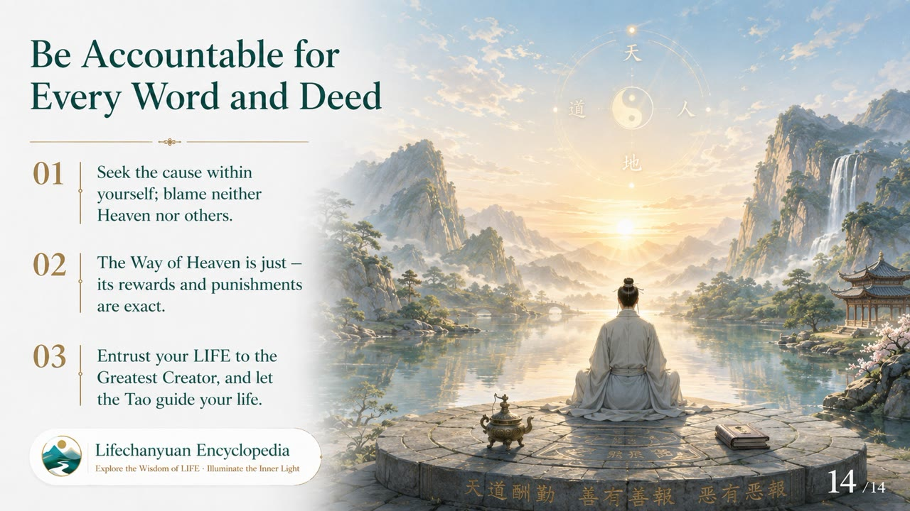

## Version Navigation

| Version | Best for | Focus |
|---------|----------|-------|
| [Friendly version](friendly.md) | First-time readers | How does cosmic justice work in daily life? |
| [Academic version](academic.md) | Researchers | Systematic analysis of standards, mechanisms, timing, and channels |
| [Internal reference](internal.md) | Deep study | Complete original texts, unaltered |

---

## Related Entries

[Karma · Retribution · Reincarnation](/en/karma-retribution-reincarnation/) · [The Tao](/en/dao/) · [The Greatest Creator](/en/greatest-creator/) · [Heavenly Bank](/en/heavenly-bank/) · [Hell](/en/hell/) · [Heavenly Treasures](/en/heavenly-treasures/) · [Levels of Life](/en/levels-of-life/) · [Cosmic Holography](/en/cosmic-holography/) · [Debt Repayment](/en/debt-repayment/) · [Life Visa](/en/life-visa/)
