<!-- id: LC-DR-EN-0001 theme: consciousness-life-mystery type: index direction: ascension-mission lang: en -->

# Dreams

> **Dreams** are one of the core concepts in the Lifechanyuan system for revealing the antimatter world, the destination of life, and the actual effects of cultivation and refinement. Dreams themselves are the antimatter world, the negative space entered by the LIFE's spirit body in the subconscious. They reflect the dreamer's history, present condition, and mainly the future, and they also serve as an important window for verifying the perfection of life's nonmaterial structure.

> “Almost everyone dreams. Dreams themselves are the antimatter world, so entering the antimatter world is not difficult.”
> — Xuefeng, *Entering the Antimatter World Through Dreams*

---

## Key Points

- **Basic definition**: dreams are themselves one manifestation of the antimatter world
- **Spatial nature**: the Dream Realm is one of the 36-dimensional spaces and belongs to the neutral worlds
- **Reflective function**: dreams reflect history, present condition, and mainly the future
- **Verification function**: dream quality reveals the degree of perfection of life's nonmaterial structure
- **Cultivation significance**: where one cannot reach in dreams, one cannot reach after death
- **Consciousness link**: dreams are directly related to the subconscious, previous lives, future lives, and cosmic holography

---

## Version Entry

| Version | Suitable for | Link |
|--------|--------------|------|
| Friendly Edition | First reading, readability-focused | [Friendly Edition](/en/dream-state/friendly/) |
| Academic Edition | Deep study, theoretical comparison | [Academic Edition](/en/dream-state/academic/) |
| Internal Edition | Full-translation documentary edition | [Internal Edition](/en/dream-state/internal/) |

---

## Video

<iframe style="width:100%;aspect-ratio:4/3;border:0" src="https://www.youtube-nocookie.com/embed/9xb7l7D9WpY" title="Dreams (Lifechanyuan Encyclopedia video)" allowfullscreen></iframe>

## Slides

??? info "📖 Illustrated slides (14 pages, click to expand)"

    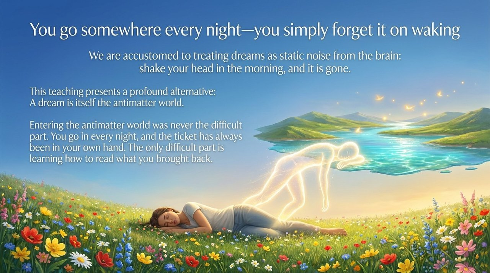
    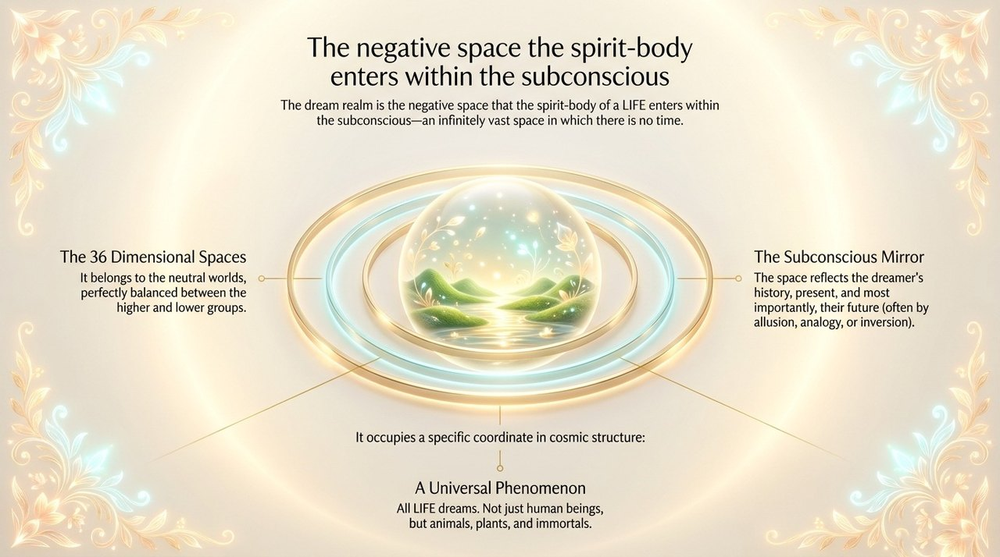
    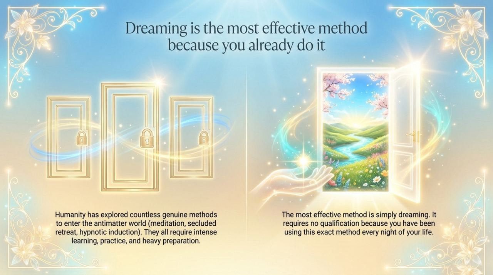
    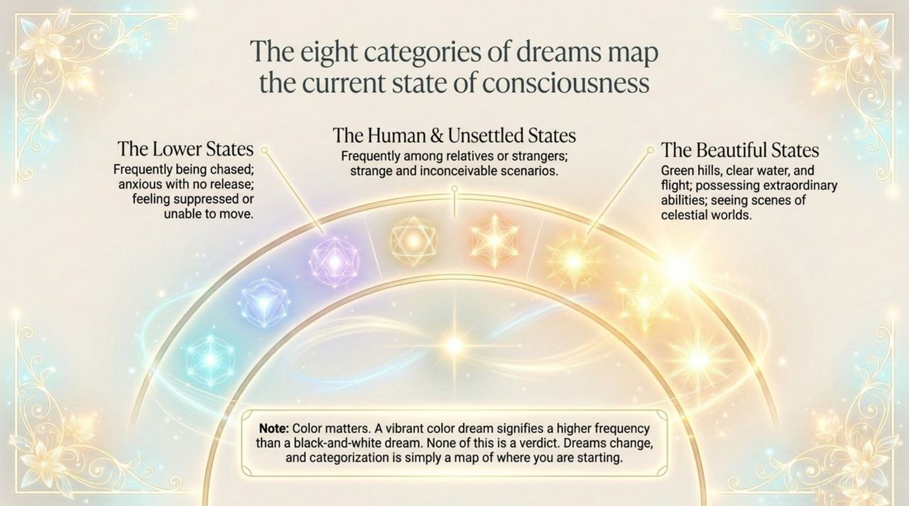
    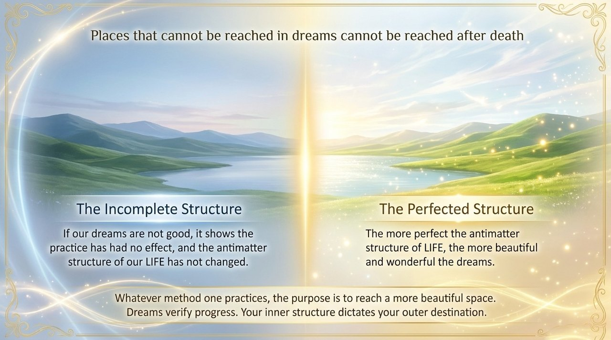
    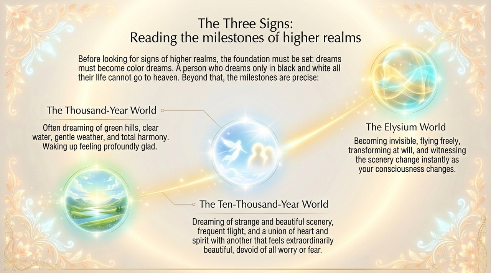
    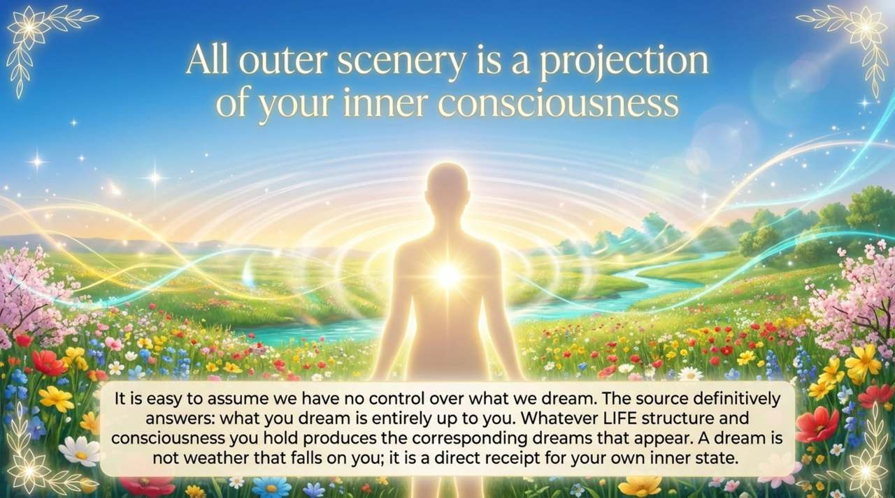
    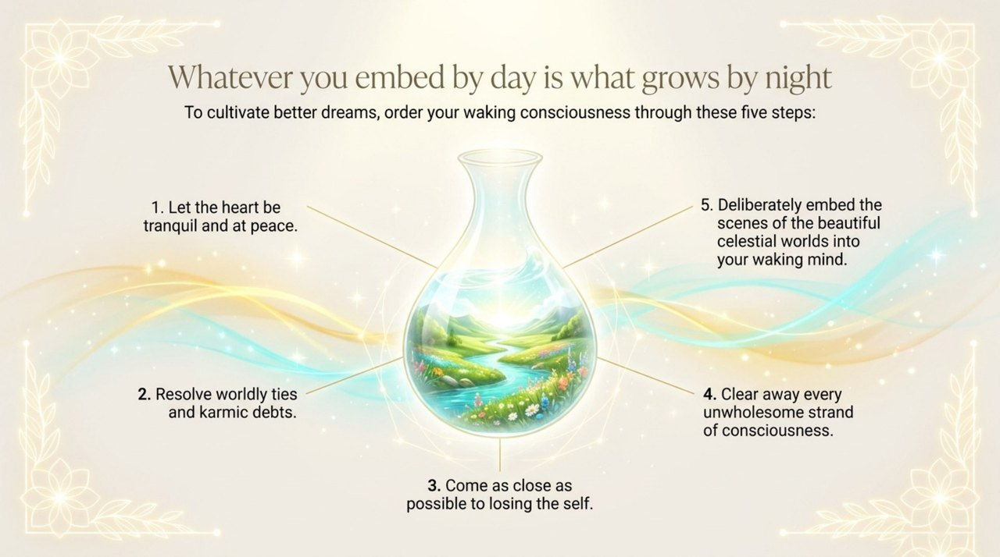
    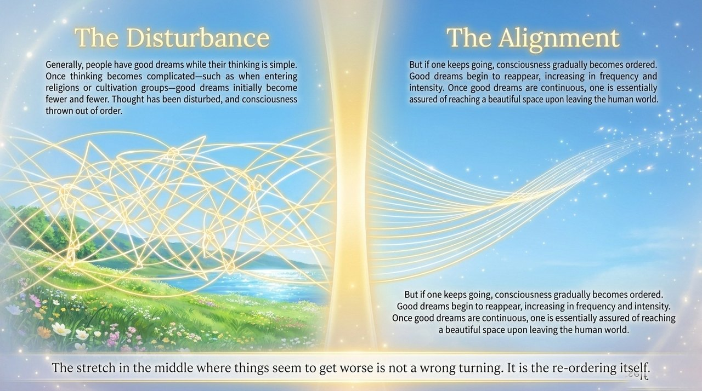
    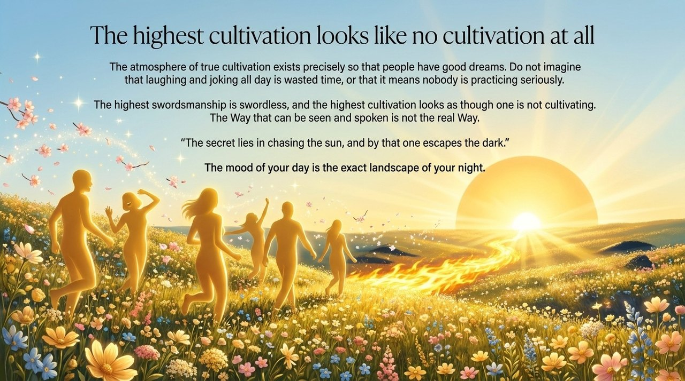
    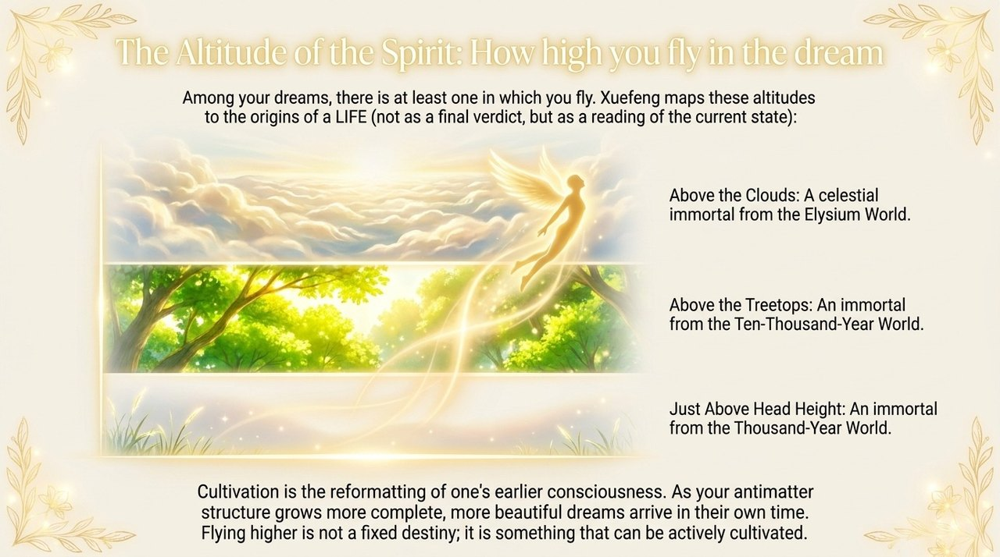
    
    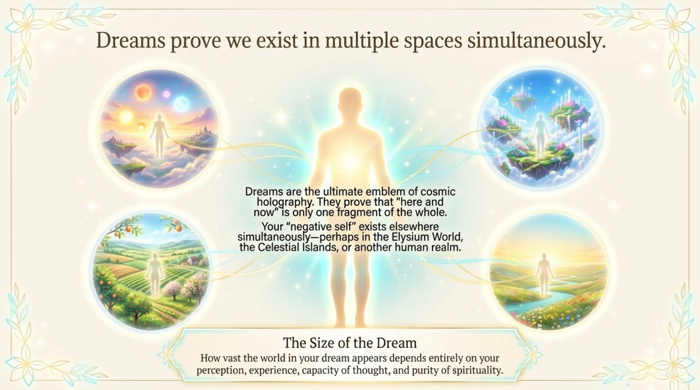
    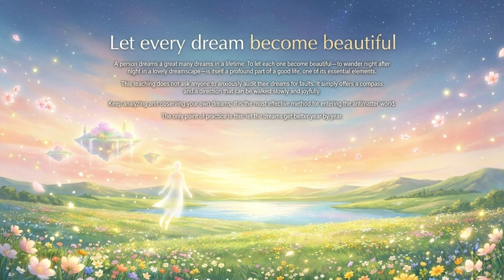

## Related Entries

- [The Subconscious](/en/subconscious/)
- [The Nonmaterial World](/en/antimatter-world/)
- [Negative Universe](/en/negative-universe/)
- [Thirty-Six-Dimensional Space](/en/thirty-six-dimensional-space/)
- [Elysium World](/en/elysium-world/)
- [Antimatter Structure](/en/antimatter-structure/)
