<!-- id: LC-EW-0001-EN theme: Universe-LIFE System type: Gateway Page direction: LIFE Destination lang: en -->

# The Elysium World

[Entry Gateway]

> In Lifechanyuan terminology, **LIFE** (capitalized) refers to the ontological
> essence of existence — the soul/antimatter structure that persists across
> incarnations — while **life** (lowercase) refers to the experiential stage
> of human existence in this world.

**The Elysium World** (极乐界) is the highest of the three heavenly layers in the Lifechanyuan framework — above the Thousand-Year World and Ten-Thousand-Year World — and the final destination horizon of the complete cultivation pathway. It contains the Celestial Islands Continent, the home of celestials and the garden of the Greatest Creator. LIFE here exists in a state of joy, freedom, and bliss beyond human imagination.

> The Elysium World is the destination of those who have perfected LIFE's antimatter structure and cultivated to the level of the celestials.
>
> — Guide Xuefeng

---

## Video

<iframe style="width:100%;aspect-ratio:4/3;border:0" src="https://www.youtube-nocookie.com/embed/rrutRlMwI8I" title="The Elysium World (Lifechanyuan Encyclopedia video)" allowfullscreen></iframe>

## Slides

??? info "📖 Illustrated slides (14 pages, click to expand)"

    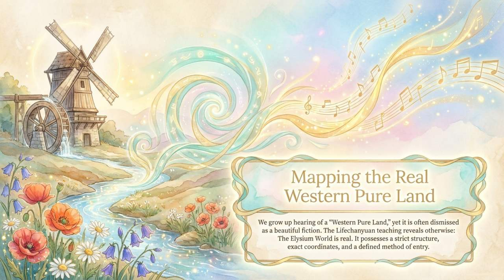
    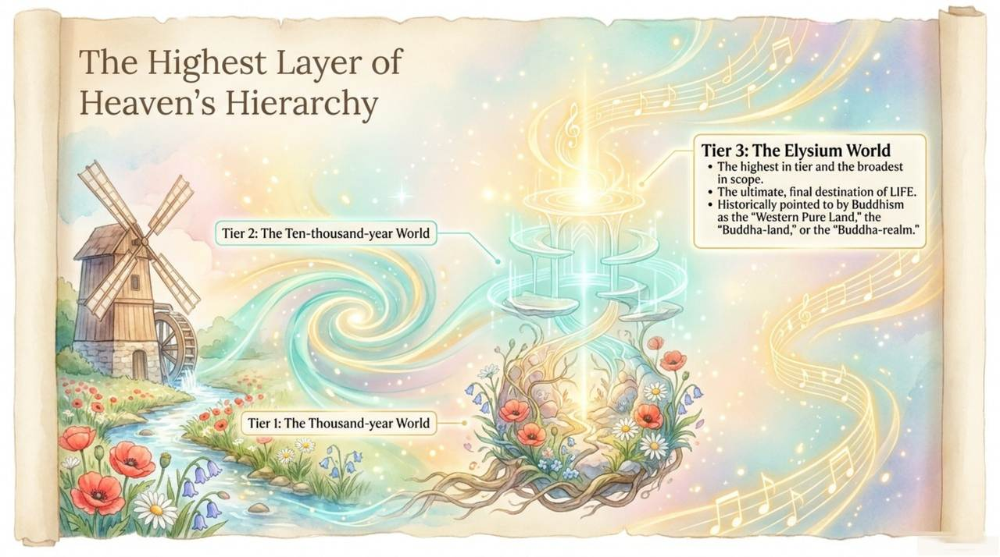
    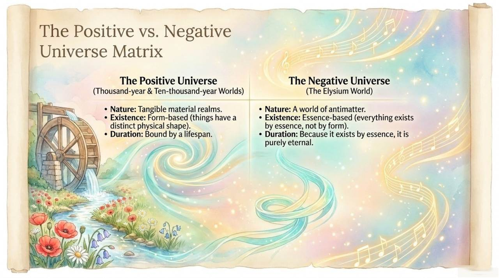
    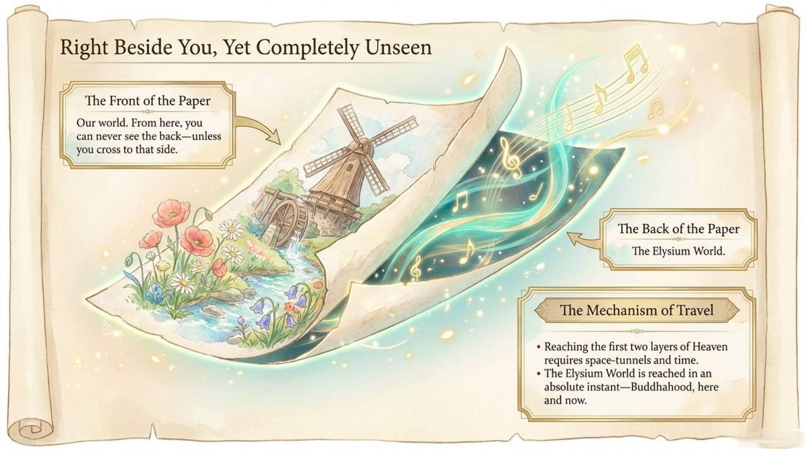
    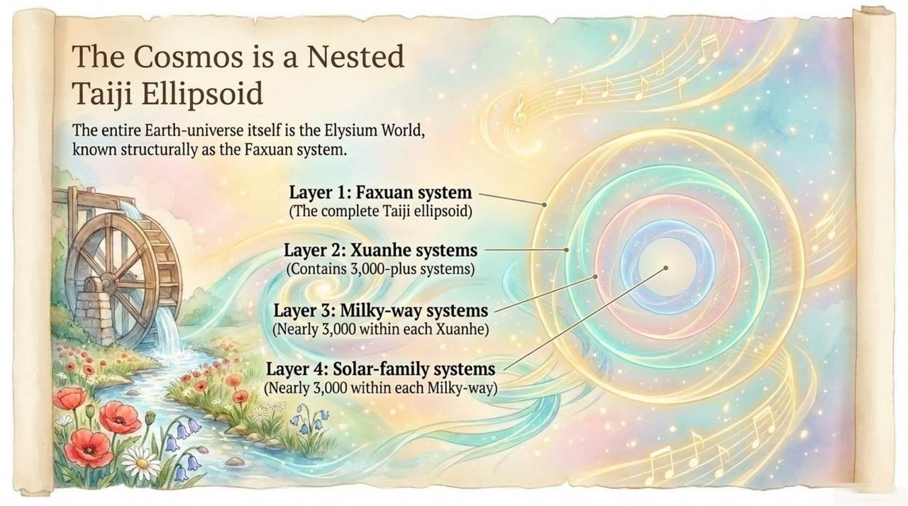
    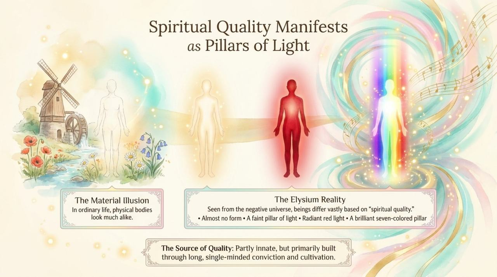
    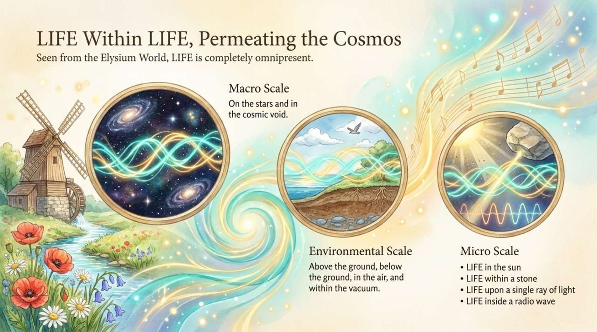
    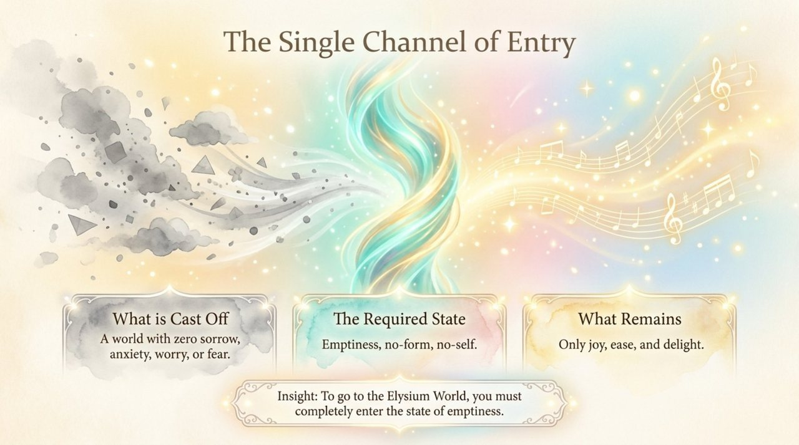
    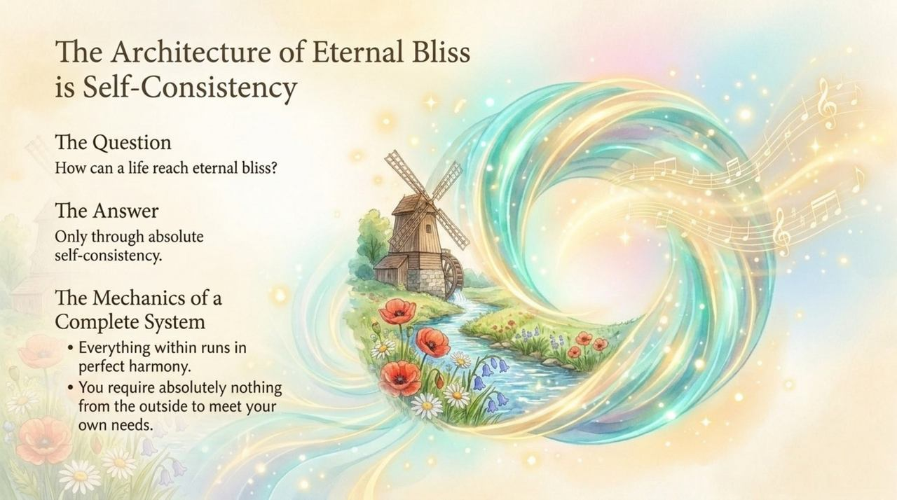
    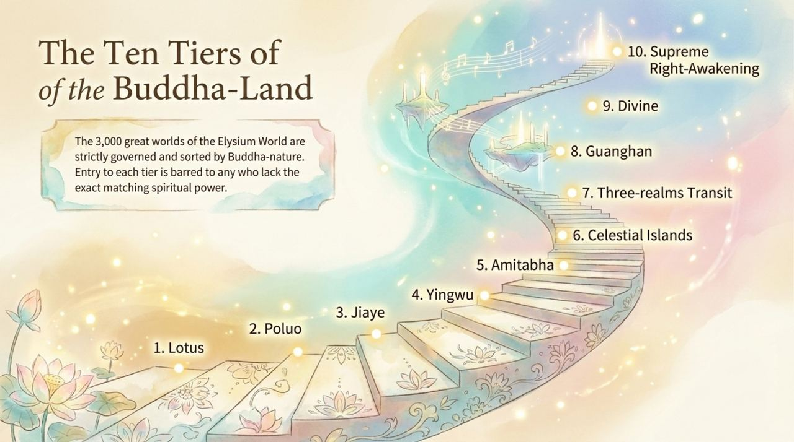
    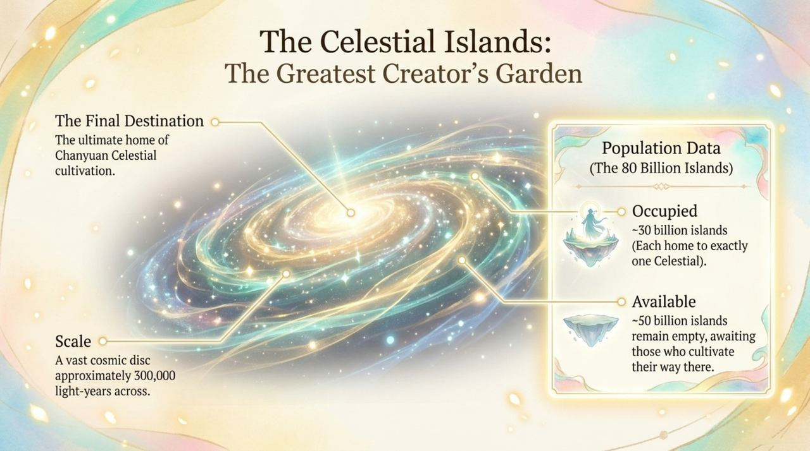
    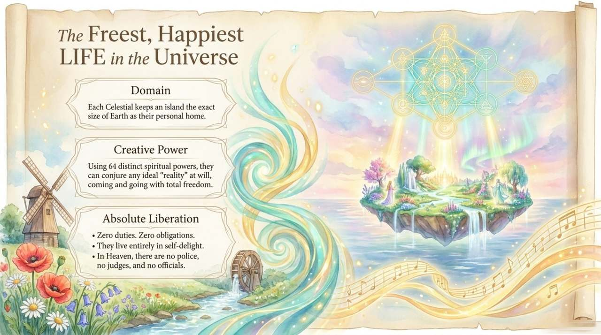
    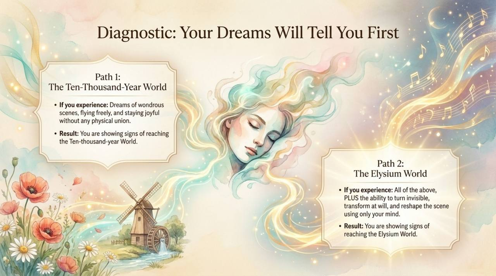
    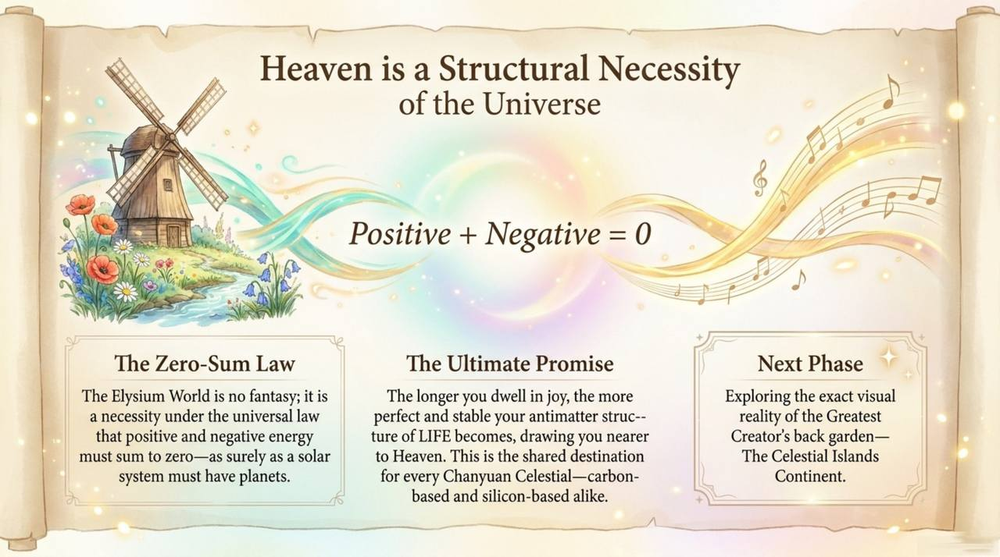

---

## Core Positioning

In the Lifechanyuan system, the Elysium World represents the culmination of the three-tier heavenly ascent. Reaching it requires: understanding LIFE's eight great mysteries, completing the soul garden, and achieving the antimatter structure quality corresponding to the celestial level of the Thirty-Six-Dimensional Space.

---

## Read by Edition

| Edition | Intended Reader | Link |
|---------|----------------|-------|
| **Friendly Edition** | Readers new to Lifechanyuan concepts | [Read Friendly Edition](./friendly) |
| **Academic Edition** | Researchers with philosophical/religious studies background | [Read Academic Edition](./academic) |
| **Internal Edition** | Chanyuan Celestials and deep practitioners | [Read Internal Edition](./internal) |

---

## Related Entries

- [Celestial Islands Continent](/en/celestial-islands-continent/) — The apex destination within the Elysium World
- [Ten-Thousand-Year World](/en/ten-thousand-year-world/) — The layer below the Elysium World
- [Thousand-Year World](/en/thousand-year-world/) — The entry-level heavenly destination
- [Kingdom of Heaven](/en/kingdom-of-heaven/) — The collective term for all three heavenly layers
- [Tour Guide Route Map](/en/tour-guide-route-map/) — The route that leads to the Elysium World
