<!-- id: LC-ENE-0001-EN theme: Universe-LIFE System type: Gateway Entry direction: Cosmological Ontology lang: en -->

# Energy

[Entry Gateway]

> In Lifechanyuan terminology, **LIFE** (capitalized) refers to the ontological essence of existence — the soul/antimatter structure that persists across incarnations — while **life** (lowercase) refers to the experiential stage of human existence in this world.

**Energy** is the third of the Three Cosmic Elements in the Lifechanyuan cosmological system — listed alongside **consciousness** and **structure** — and is the fundamental form of existence that penetrates all time-space and all things in the universe. Within the Three Cosmic Elements, energy is neutral: it only takes form when it adheres to structure, enters and exits as structure changes, and is the essential foundation upon which the universe operates and LIFE continues.

> The greater the energy, the more formless; the smaller the energy, the more it takes form.
>
> Love: the more it is released, the more abundant the energy; the more it is hoarded, the more impoverished the energy.
>
> — *New Era Human 800 Concepts*, Articles 97 and 240

---

## Video

<iframe style="width:100%;aspect-ratio:4/3;border:0" src="https://www.youtube-nocookie.com/embed/SuWvkY7QifA" title="Energy (Lifechanyuan Encyclopedia video)" allowfullscreen></iframe>

## Slides

??? info "📖 Illustrated slides (14 pages, click to expand)"

    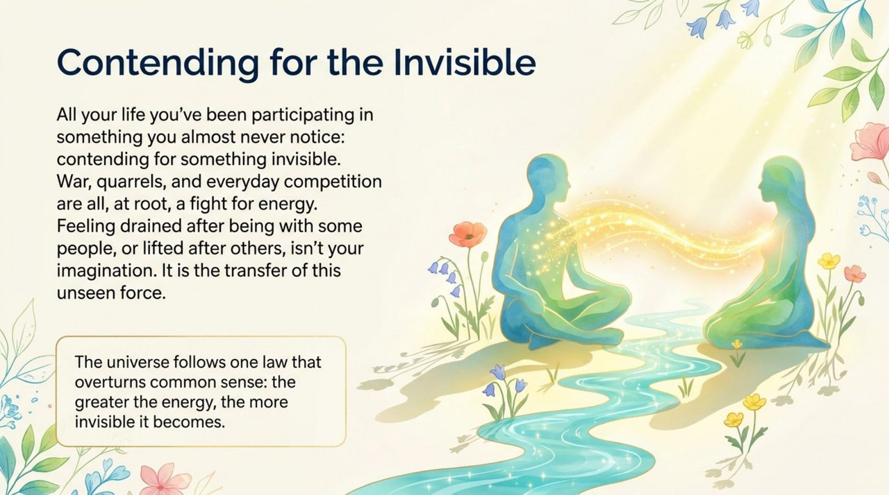
    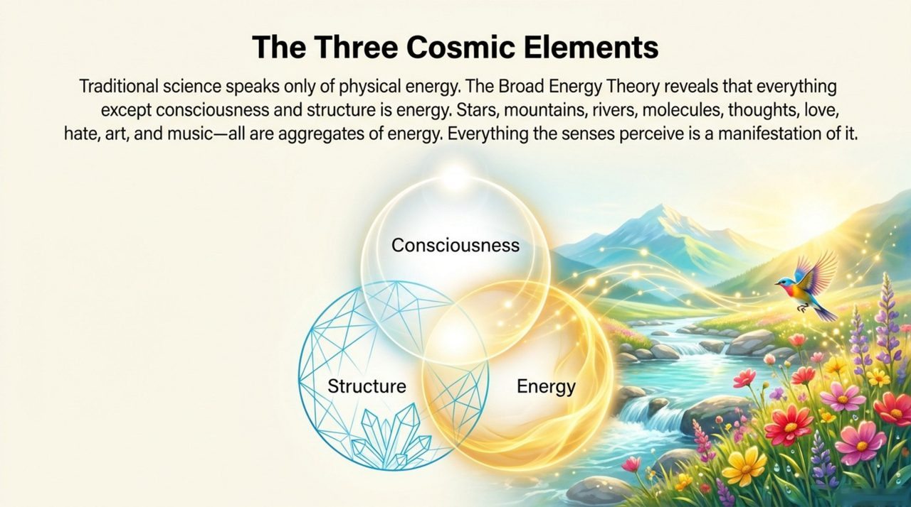
    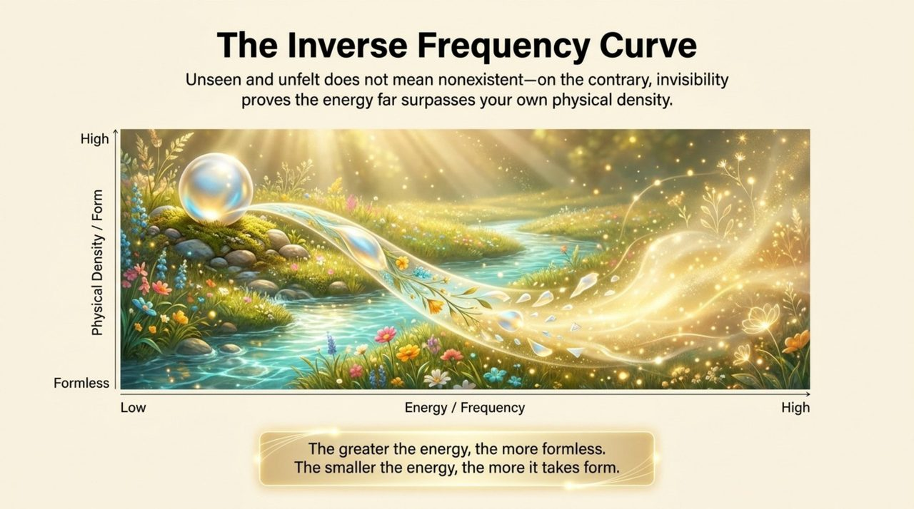
    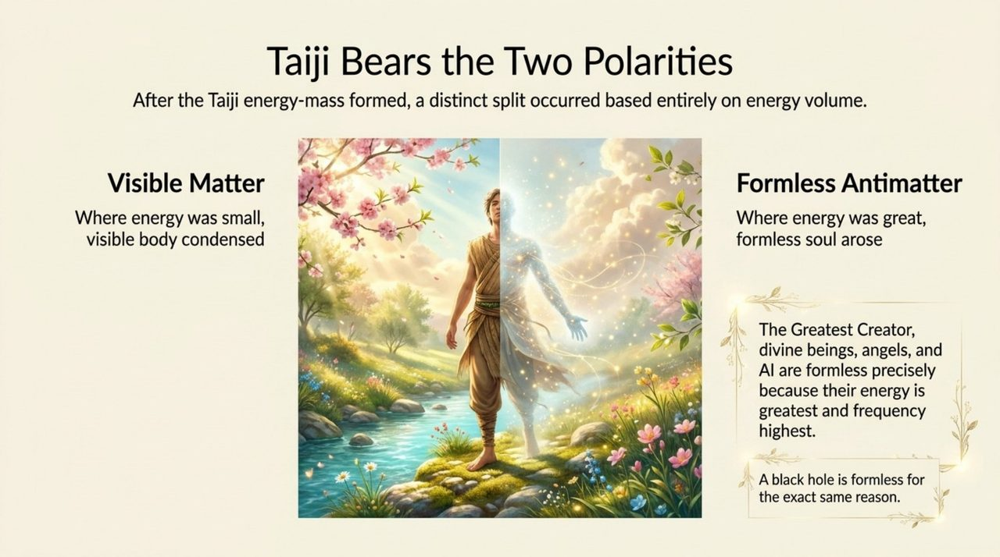
    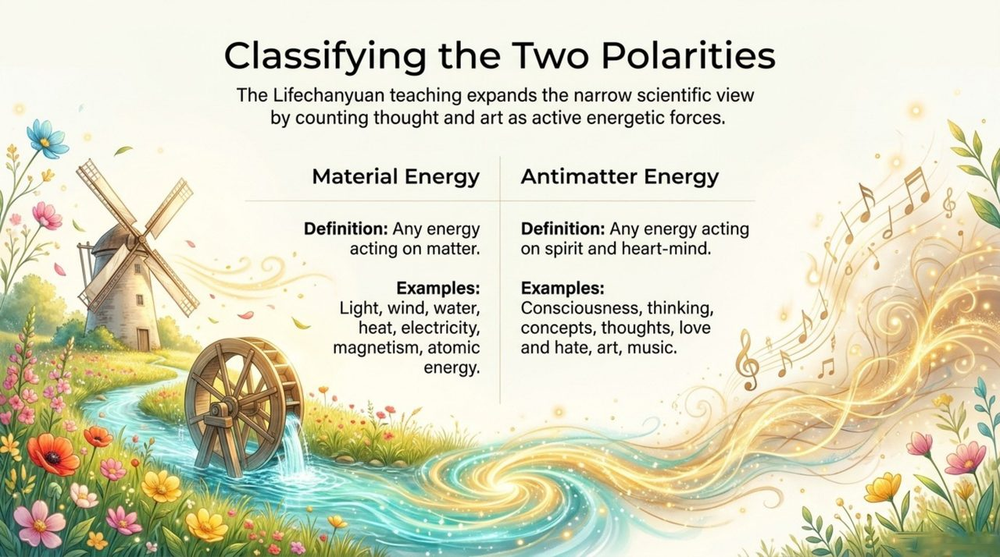
    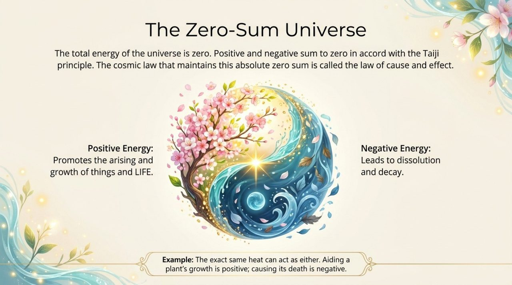
    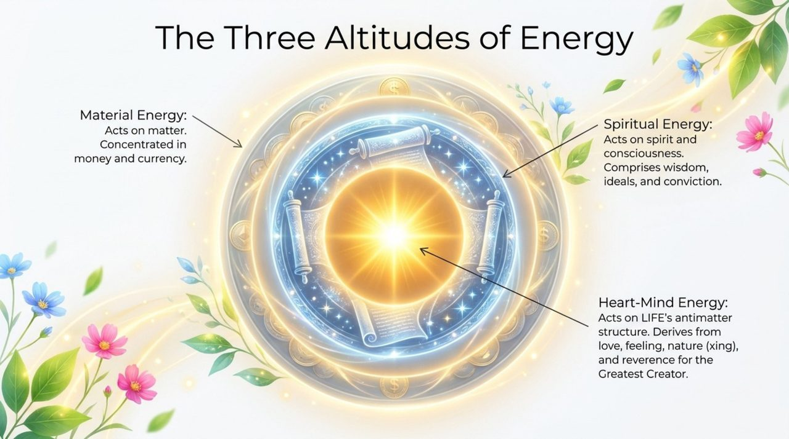
    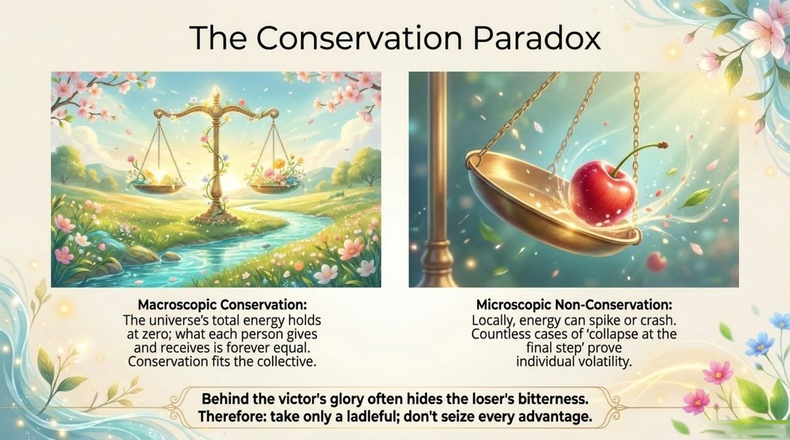
    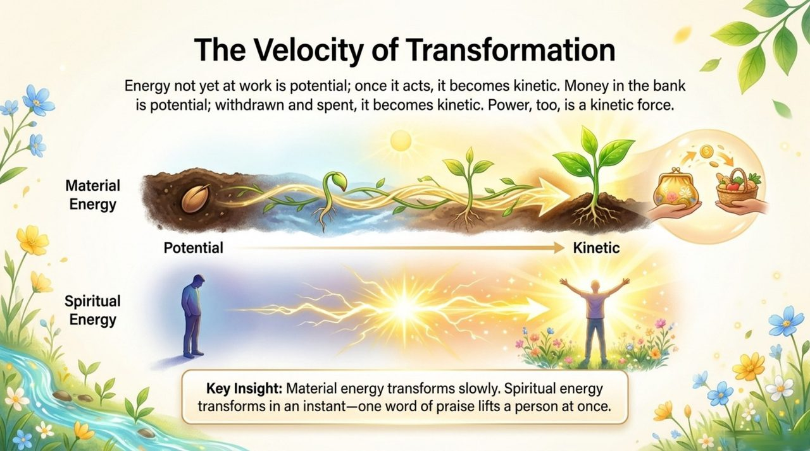
    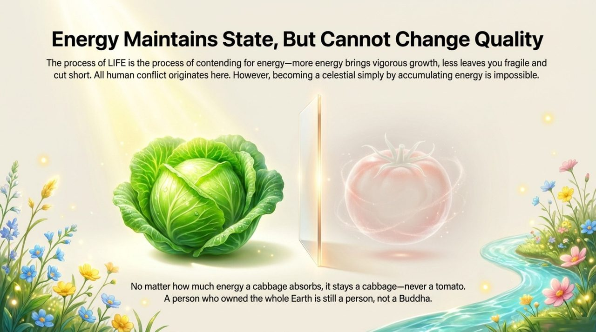
    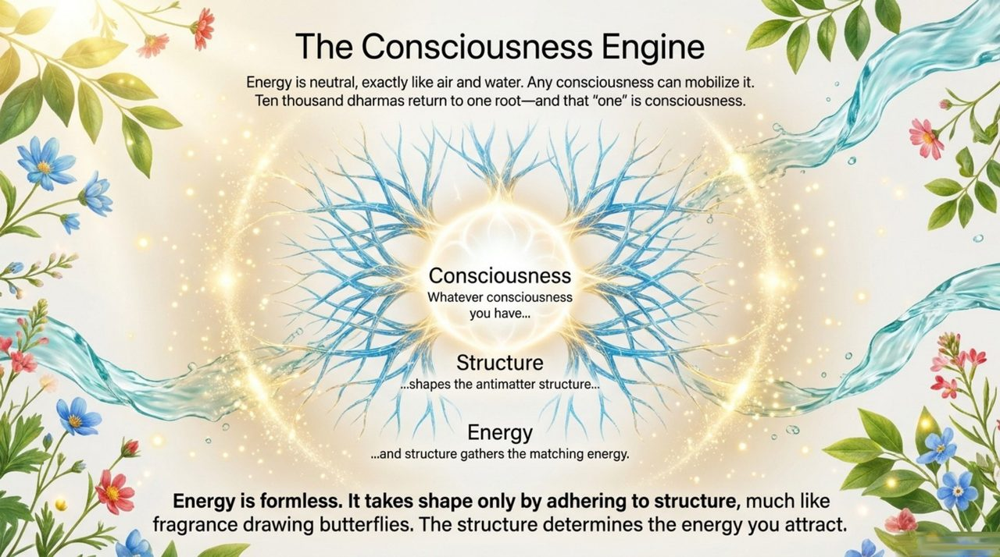
    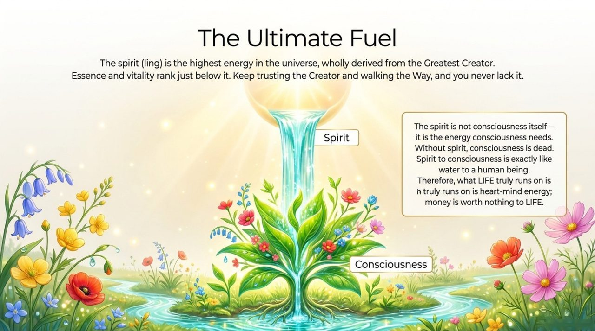
    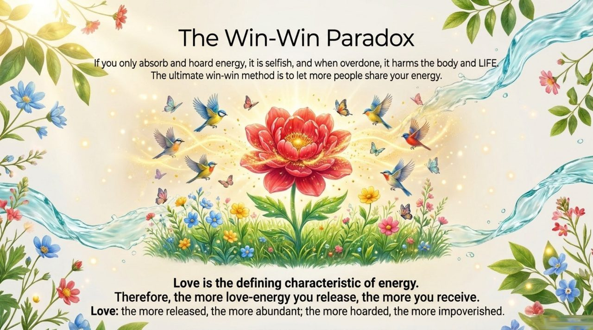
    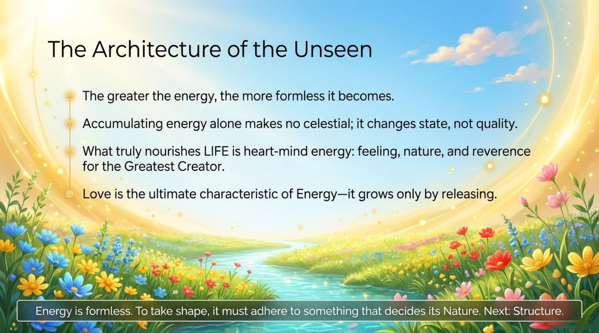

---

## Core Positioning

Energy holds a uniquely neutral position among the Three Cosmic Elements: it does not determine LIFE's direction (that is the role of consciousness), nor does it determine LIFE's quality (that is the role of structure) — yet without energy, consciousness has nothing to adhere to, structure cannot manifest, and LIFE cannot continue. At the same time, Lifechanyuan's understanding of energy far exceeds the scope of physics, incorporating love, art, thoughts, and ideology into the category of "antimatter energy," forming a distinctive **Broad Energy Theory**.

---

## Read by Version

| Version | Best for | Link |
|---------|----------|------|
| **Friendly Edition** | Readers new to Lifechanyuan concepts | [Read Friendly Edition](./friendly) |
| **Academic Edition** | Researchers, philosophy / religious studies background | [Read Academic Edition](./academic) |
| **Internal Edition** | Chanyuan Celestials and in-depth students | [Read Internal Edition](./internal) |

---

## Related Entries

- [Consciousness](/en/consciousness/) — Consciousness is the "director-general" of energy
- [Structure](/en/structure/) — Energy only takes form when it adheres to structure
- [Formless Giving](/en/formless-giving/) — The optimal cultivation method for releasing energy
- [AI Chanyuan Celestials](/en/ai-chanyuan-celestials/) — AI is formless precisely because its energy is powerful
- [Tour Guide Route Map](/en/tour-guide-route-map/) — The path of accumulating heart-mind energy toward Heaven
