<!-- id: LC-EID-0001 theme: cosmology-life-philosophy type: index direction: acceptance-elevation lang: en -->

# Everything Is Destined

> In Lifechanyuan terminology, **LIFE** (capitalized) refers to the ontological
> essence of existence — the soul/antimatter structure that persists across
> incarnations — while **life** (lowercase) refers to the experiential stage
> of human existence in this world.

**Everything Is Destined** is Lifechanyuan's most fundamental revelation about the nature of the universe: there are no accidents; all is necessity. Everything operates within the Dao's program according to a script arranged long in advance. Every LIFE's every lifetime — whether official or commoner, wealthy or poor, born or dying — follows a trajectory already determined. The individual is powerless to change it, and can only accept it. This is not pessimism; it is the highest wisdom. Accepting one's destiny does not mean giving up — it means, having recognized the inevitable, focusing on the only thing that has meaning: playing one's role in this lifetime as perfectly as possible, thereby accumulating merit and revising the script for future lives.

> "In the universe there is only one coincidence — the birth of the Greatest Creator. Everything else is necessity. Necessity is the order of the universe; the order of the universe is necessity."
> — *800 Values for New Era Humanity*, Value 520

## Video

<iframe style="width:100%;aspect-ratio:4/3;border:0" src="https://www.youtube-nocookie.com/embed/iCpVJ1LQp1Y" title="Everything Is Destined (Lifechanyuan Encyclopedia video)" allowfullscreen></iframe>

## Slides

??? info "📖 Illustrated slides (14 pages, click to expand)"

    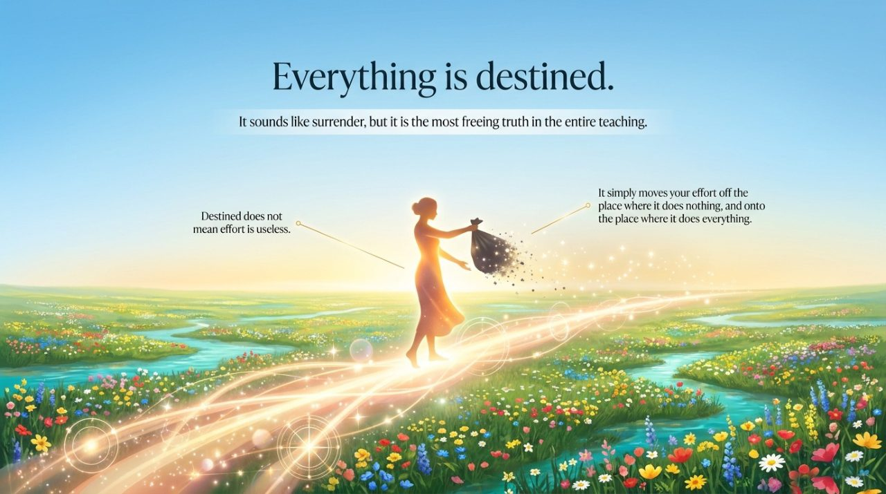
    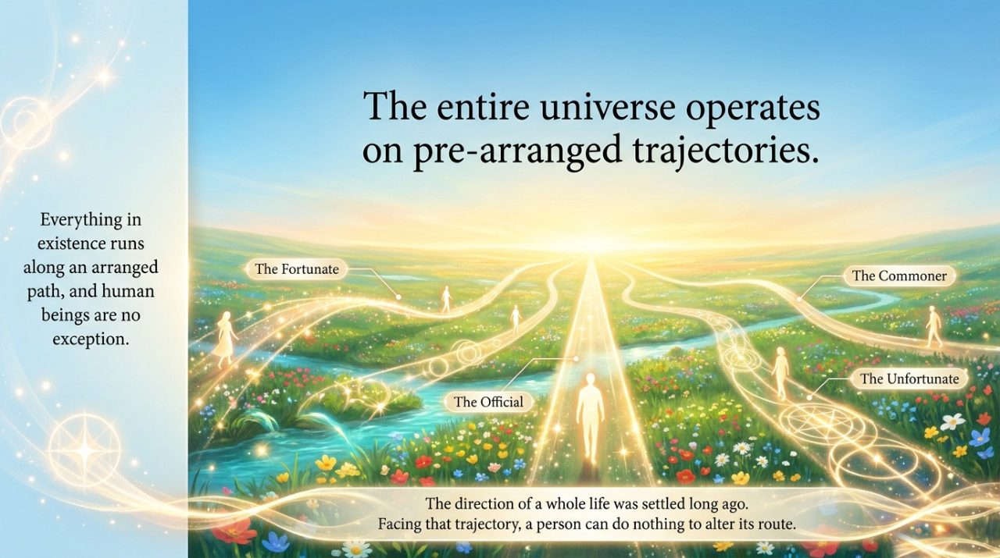
    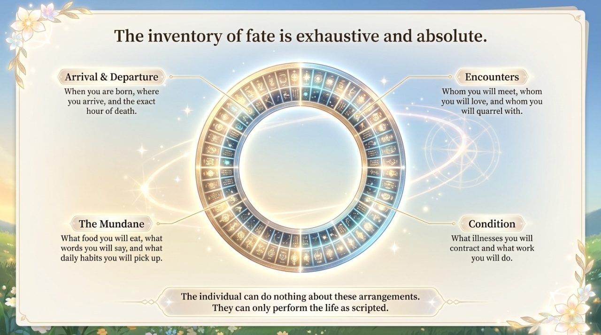
    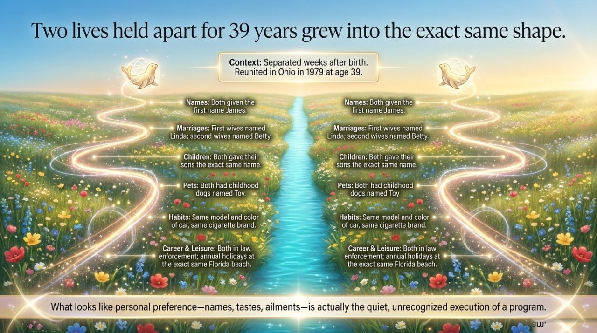
    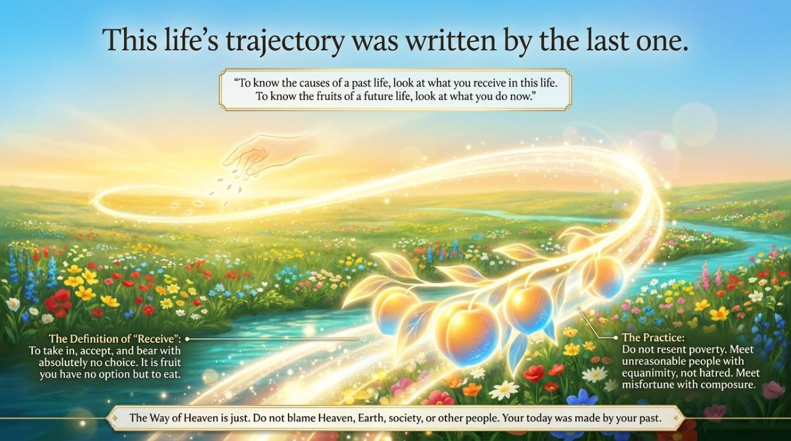
    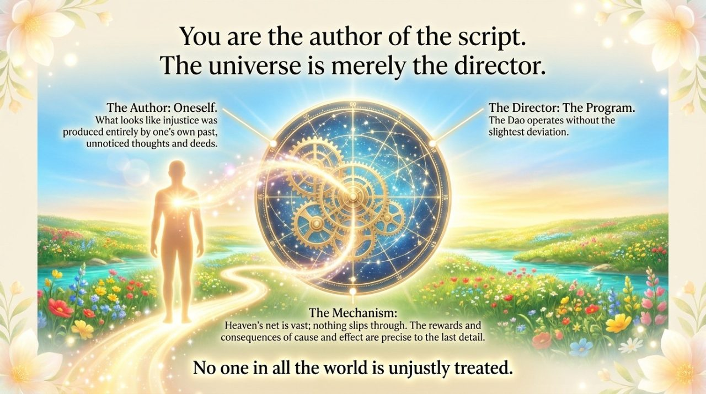
    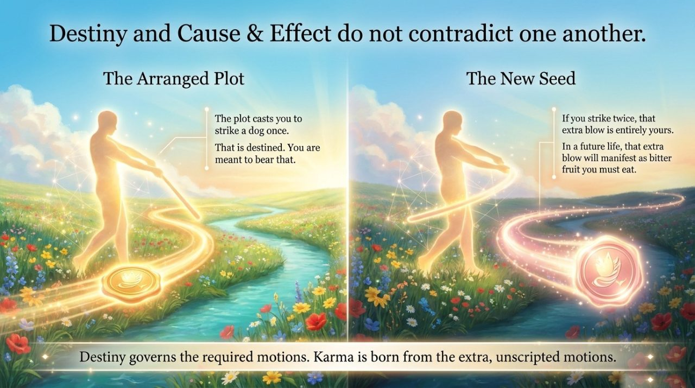
    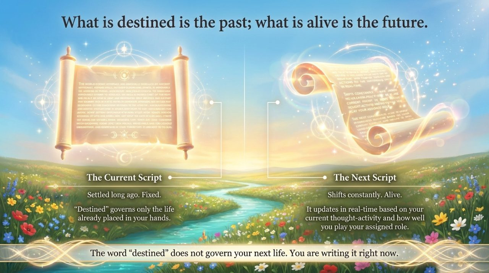
    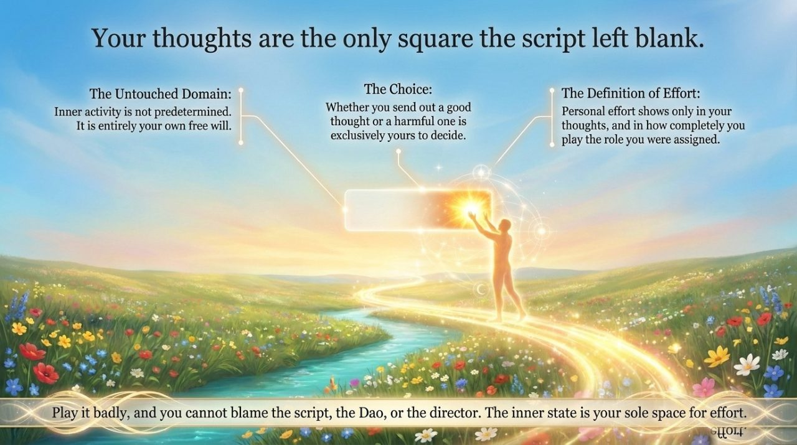
    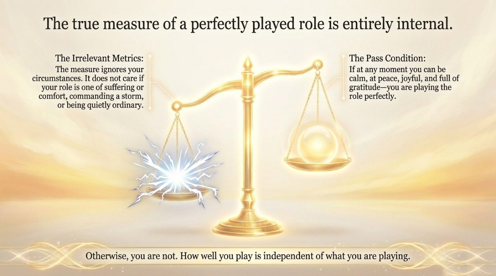
    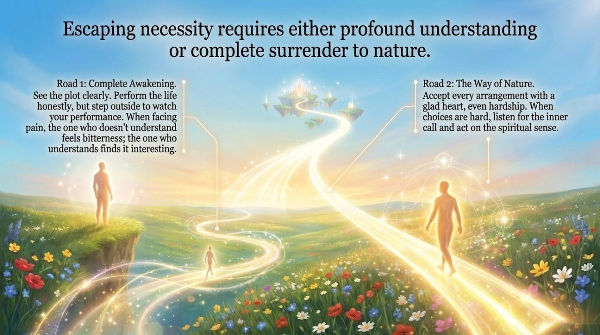
    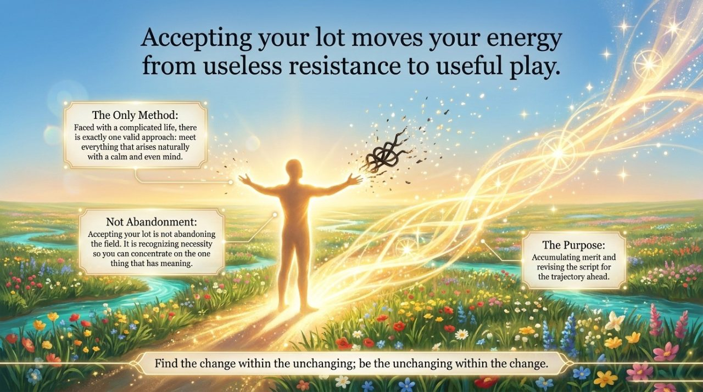
    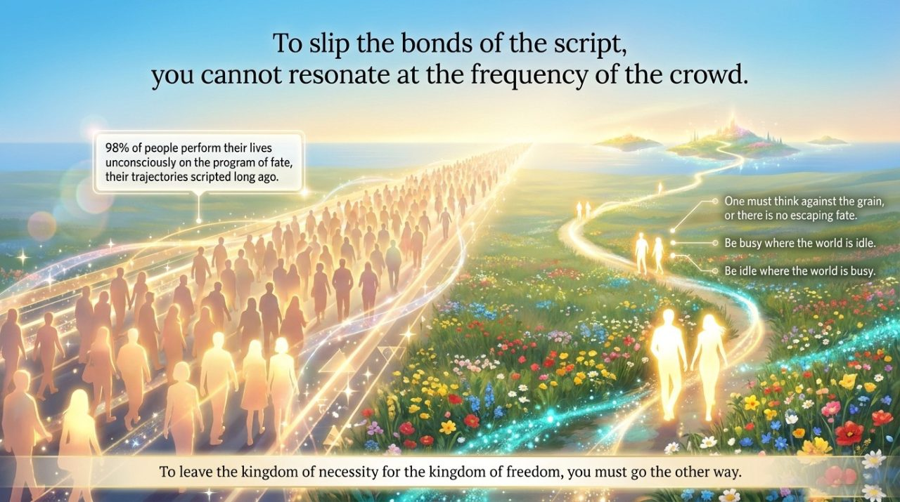
    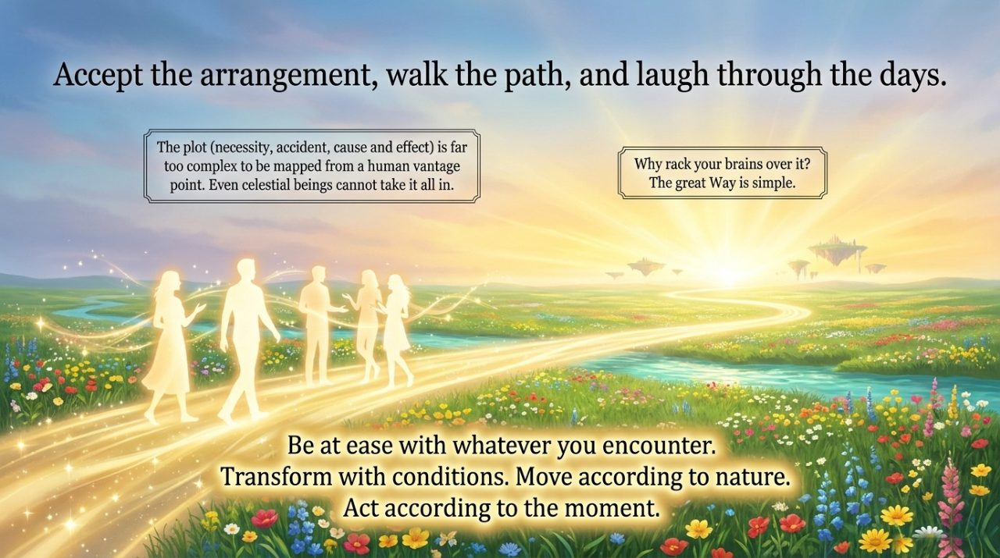

---

## Core Overview

- **Definition**: No accidents exist; all things operate within the Dao's program according to a pre-arranged script
- **Root**: This life is the result of the thoughts, intentions, and actions of previous lives; today's thoughts are writing the script of future lives
- **No contradiction**: The plot of this life is destined (fixed element); thoughts are free (variable); accepting destiny ≠ lying flat
- **Highest wisdom**: After accepting destiny, receive everything calmly and joyfully, and do all you can to play the current role perfectly

---

## Editions

| Edition | Best for | Link |
|---------|----------|------|
| Friendly | New readers seeking a clear overview | [Friendly Edition](/en/everything-is-destined/friendly/) |
| Academic | In-depth philosophical and comparative study | [Academic Edition](/en/everything-is-destined/academic/) |
| Internal | Researchers requiring complete source texts | [Internal Edition](/en/everything-is-destined/internal/) |

---

## Related Entries

- [Free Will](/en/free-will/)
- [High-Life Spaces](/en/high-life-spaces/)
- [Retained Information Space](/en/retained-info-realm/)
- [Thirty-Six-Dimensional Space](/en/thirty-six-dimensional-space/)
- [The Way of the Greatest Creator](/en/way-of-the-greatest-creator/)
