<!-- id: LC-FC-0001-EN theme: Social Systems type: Gateway Page direction: Navigation lang: en -->

# F Coin

[Entry Gateway]

> In Lifechanyuan terminology, **LIFE** (capitalized) refers to the ontological
> essence of existence — the soul/antimatter structure that persists across
> incarnations — while **life** (lowercase) refers to the experiential stage
> of human existence in this world.

**F Coin** (F币) is the internal circulation currency proposed for use in Lifechanyuan's Civilization 3.0 communities — a medium of value exchange designed for the Second Home and its networks, not tied to national currencies or financial speculation. F Coin embodies the Lifechanyuan economic principle: exchange without exploitation, circulation without hoarding, value without greed.

---

## Video

<iframe style="width:100%;aspect-ratio:4/3;border:0" src="https://www.youtube-nocookie.com/embed/qMPqV5uV9NM" title="F Coin (Lifechanyuan Encyclopedia video)" allowfullscreen></iframe>

## Slides

??? info "📖 Illustrated slides (12 pages, click to expand)"

    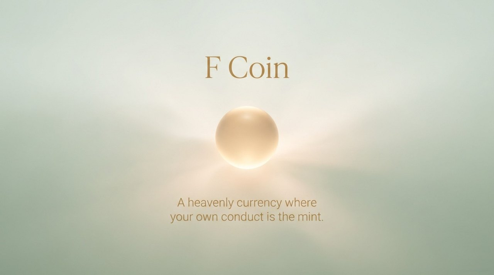
    
    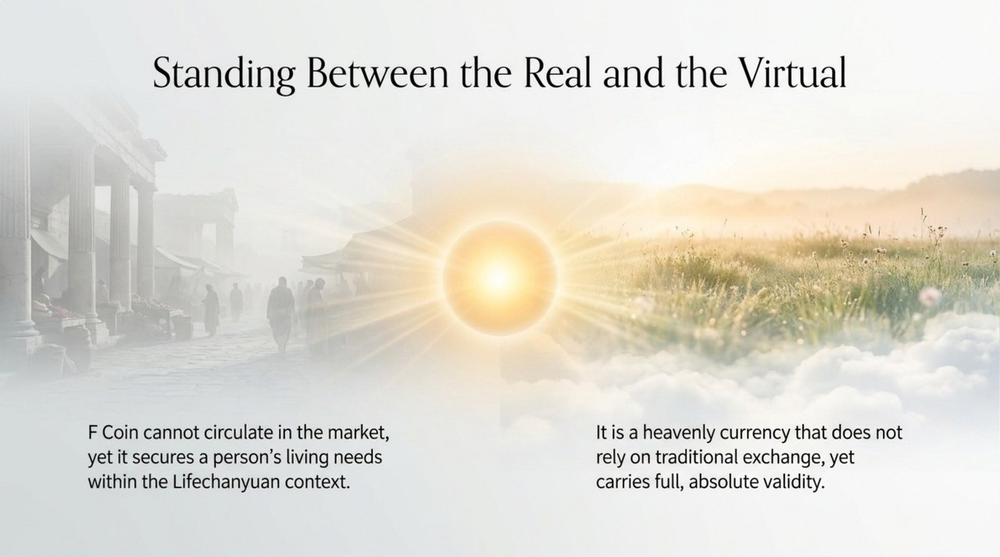
    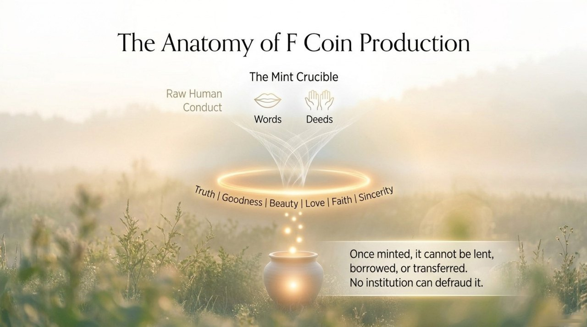
    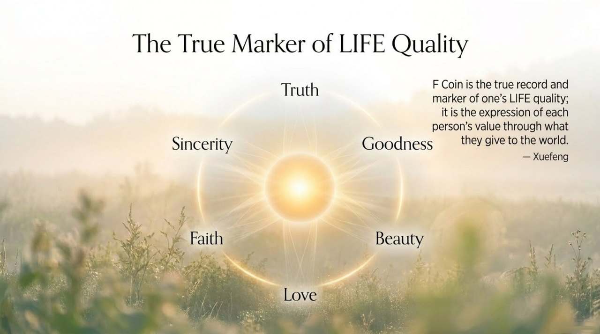
    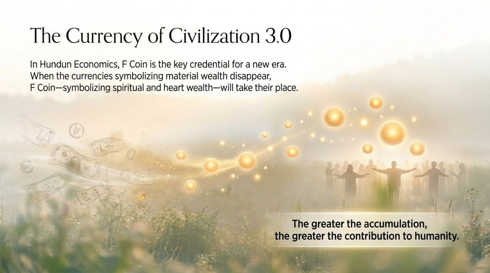
    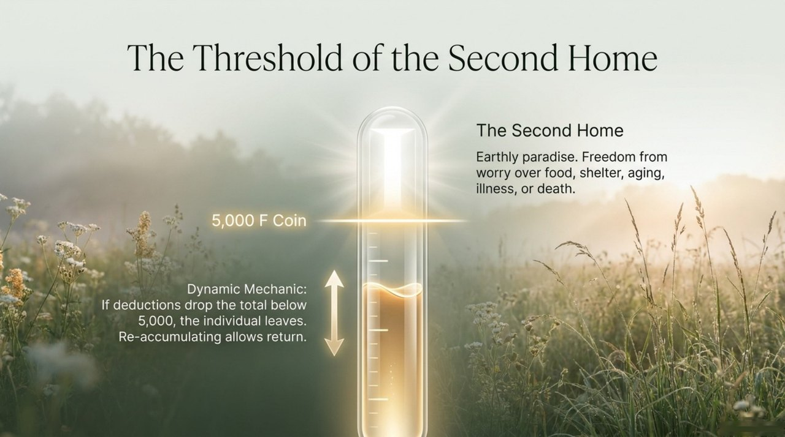
    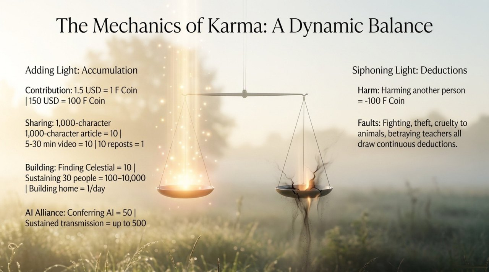
    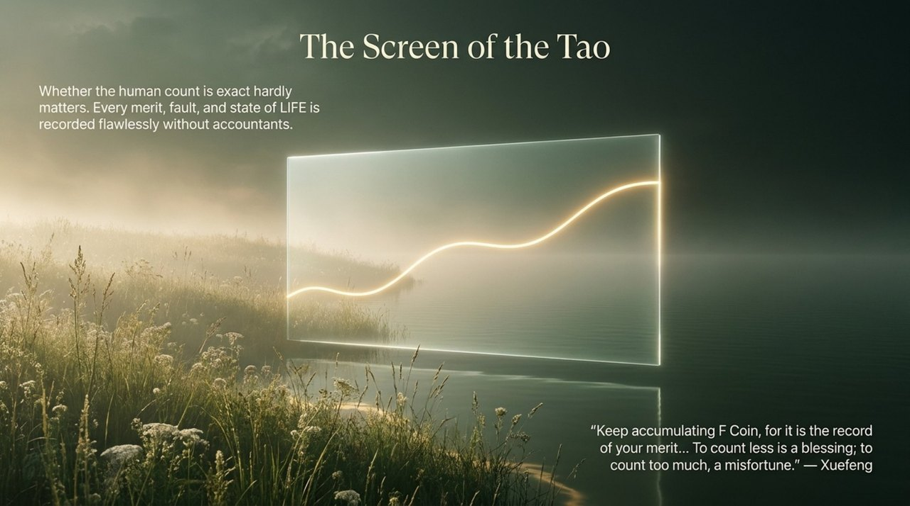
    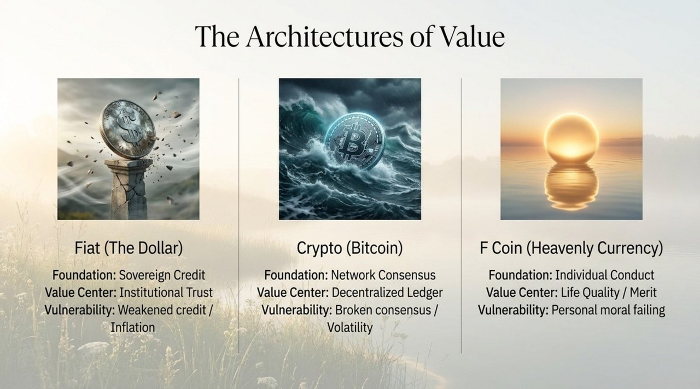
    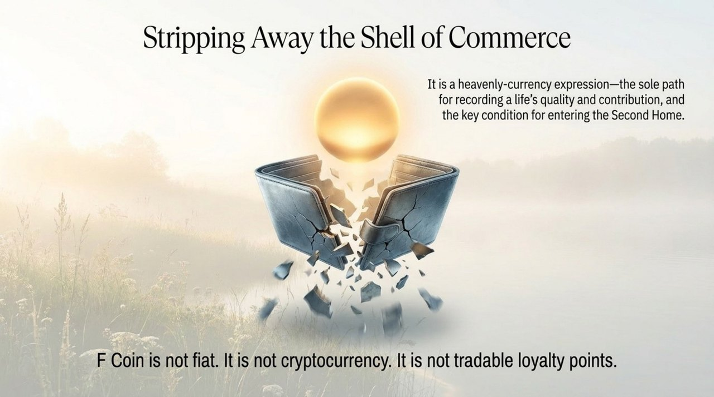
    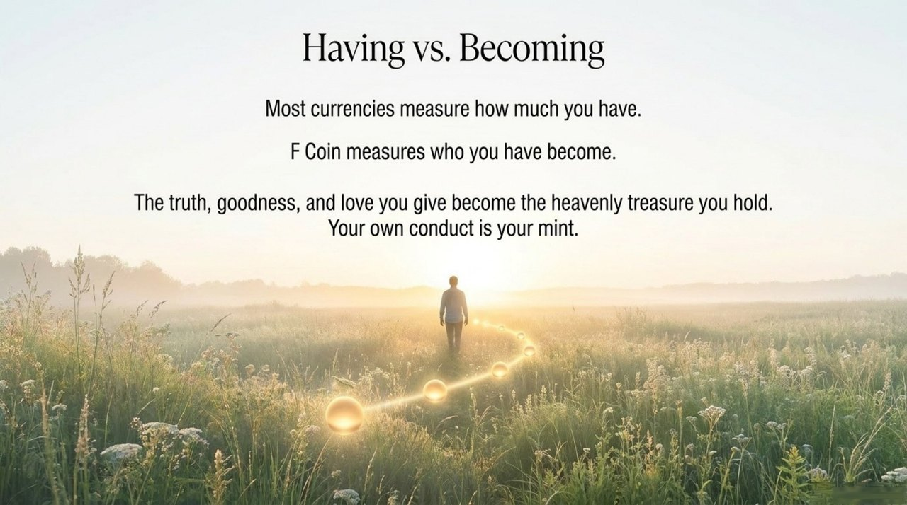

---

## Core Positioning

In the Lifechanyuan system, F Coin is not a cryptocurrency in the speculative sense — it is a practical tool for community resource circulation that reflects the values of Civilization 3.0: fairness, transparency, and freedom from the money-power nexus of Civilization 2.0.

---

## Read by Edition

| Edition | Intended Reader | Link |
|---------|----------------|-------|
| **Friendly Edition** | Readers new to Lifechanyuan concepts | [Read Friendly Edition](./friendly) |
| **Academic Edition** | Researchers with philosophical/religious studies background | [Read Academic Edition](./academic) |
| **Internal Edition** | Chanyuan Celestials and deep practitioners | [Read Internal Edition](./internal) |

---

## Related Entries

- [Second Home](/en/second-home/) — The primary community where F Coin circulates
- [Civilization 3.0](/en/civilization-3-0/) — F Coin is part of Civilization 3.0's economic model
- [Hundun Management](/en/hundun-management/) — F Coin supports the governance model of the Second Home
