<!-- id: LC-FG-0001-EN theme: Cultivation Practice type: Entry Index lang: en -->

# Forgiveness

**Forgiveness** (*kuānshù* 宽恕) is, in the Lifechanyuan system, the most basic threshold for entering the Kingdom of Heaven, and a practical requirement woven through every stage of cultivation practice. Its foundation lies in the imperfection of all human beings: since everyone makes mistakes, one must both seek forgiveness from the Greatest Creator and extend forgiveness to others. Forgiveness operates through a reciprocal mechanism — forgive others, and the Greatest Creator forgives you; withhold forgiveness, and the door to Heaven remains closed.

> "You must forgive others — this is the most basic requirement for entering the Kingdom of Heaven… As long as we forgive others, the door to the Kingdom of Heaven will open for us."
> (Xuefeng Corpus · Heart-Mind · *Chanyuan Celestials Must Learn to Forgive Others*)

---

## Version Navigation

| Version | Best For | Core Content |
|---------|---------|--------------|
| [Friendly Version](./friendly/) | First-time readers | Life analogies explaining the nature and effects of forgiveness |
| [Academic Version](./academic/) | In-depth study | Systematic analysis: mechanism, levels, objects, and relationship to the Kingdom of Heaven |
| [Internal Version](./internal/) | Source verification | All source texts quoted verbatim, zero alteration |

---

## Video

<iframe style="width:100%;aspect-ratio:4/3;border:0" src="https://www.youtube-nocookie.com/embed/q_c1L1_lBCQ" title="Forgiveness (Lifechanyuan Encyclopedia video)" allowfullscreen></iframe>

## Slides

??? info "📖 Illustrated slides (14 pages, click to expand)"

    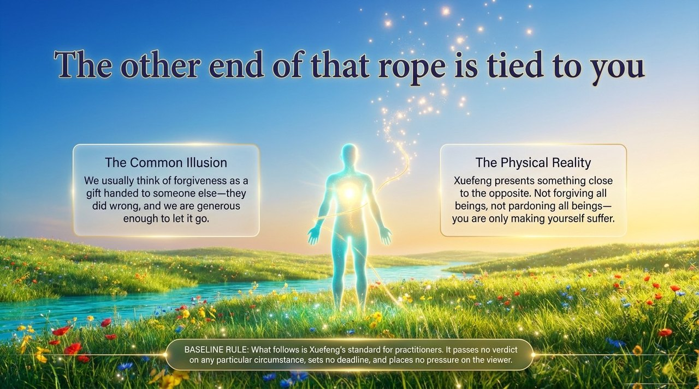
    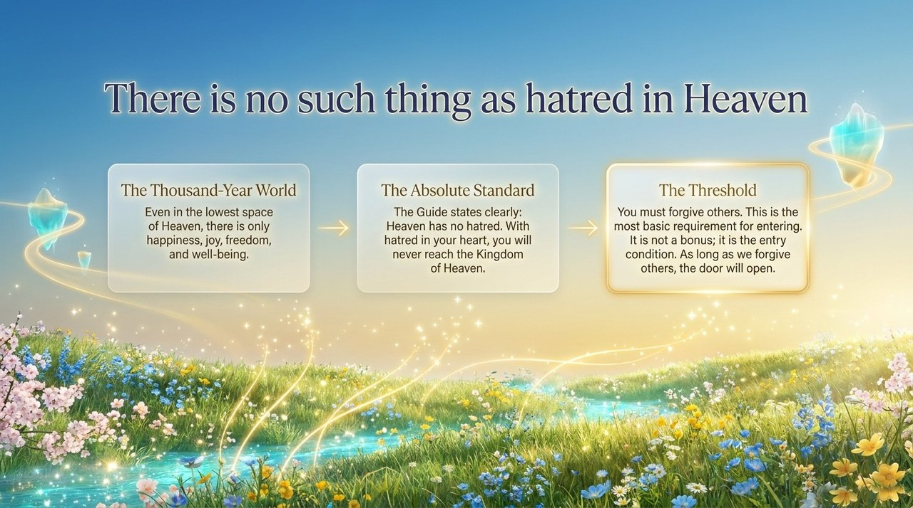
    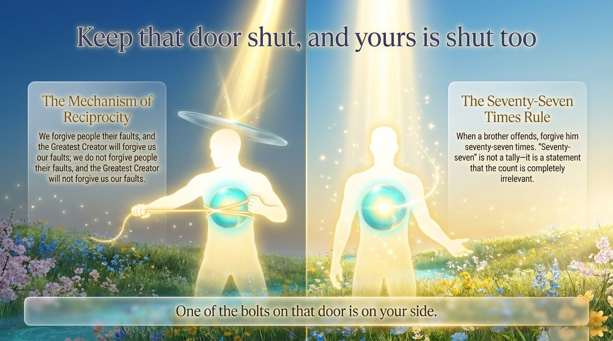
    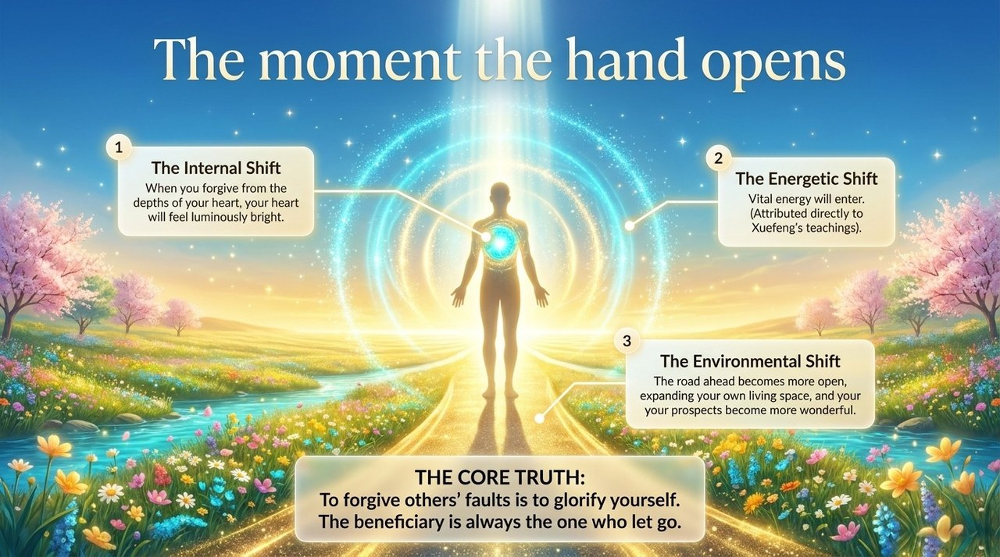
    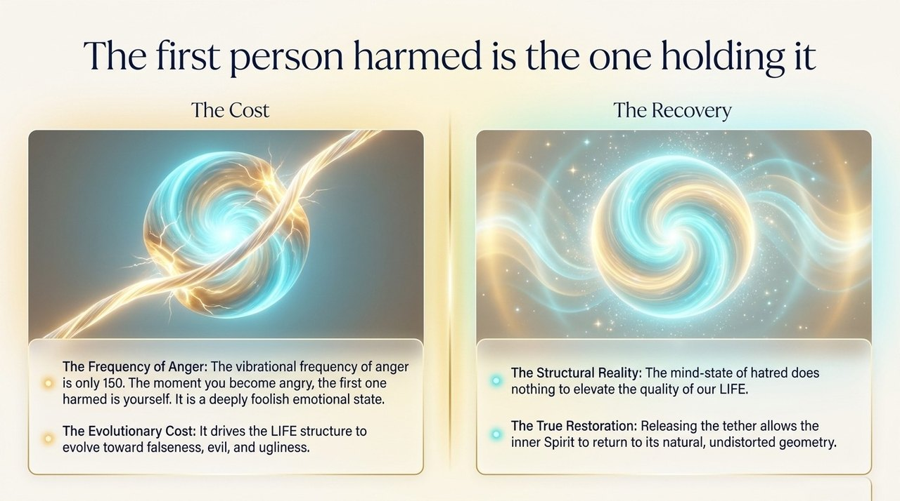
    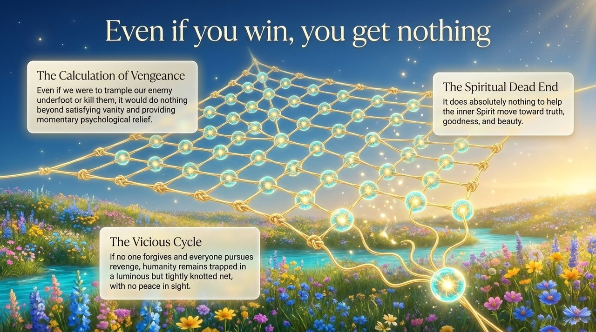
    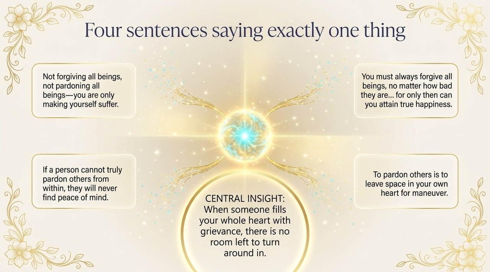
    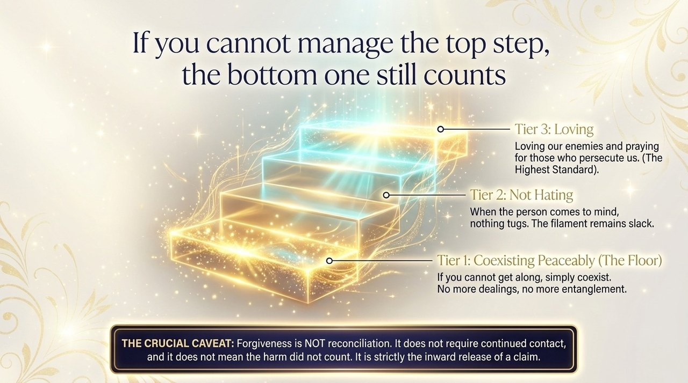
    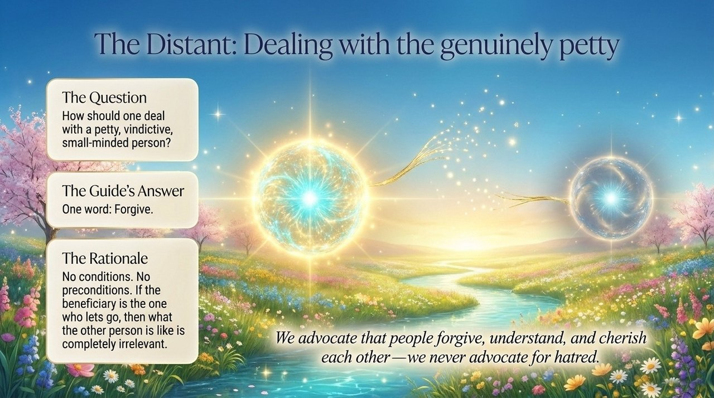
    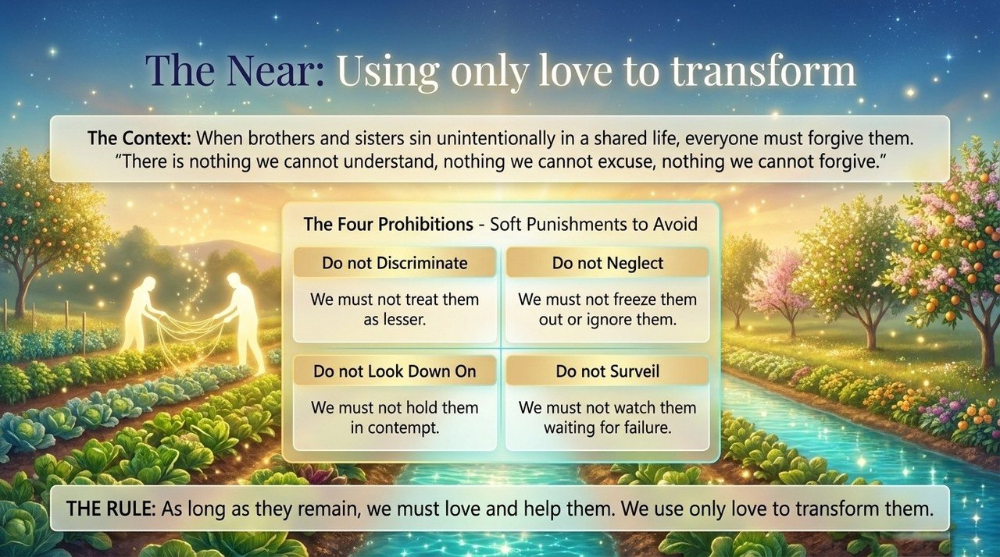
    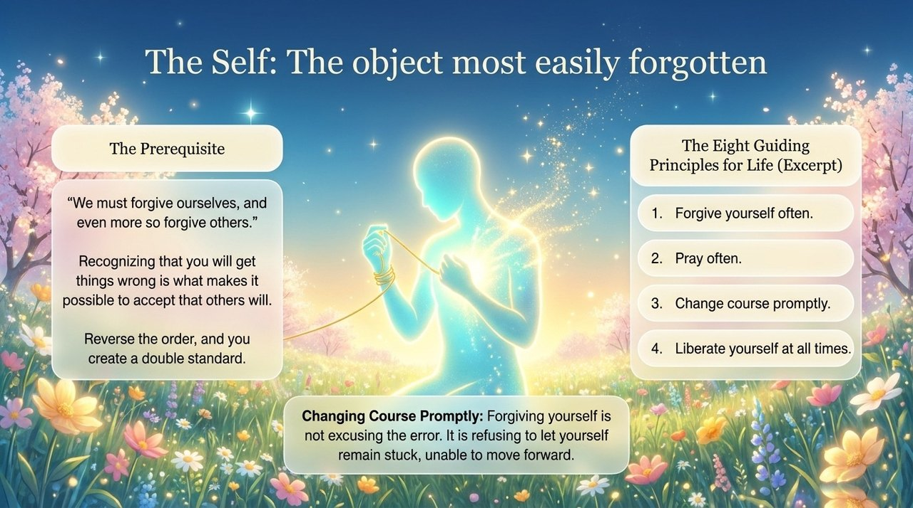
    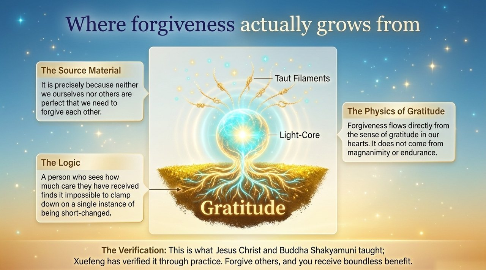
    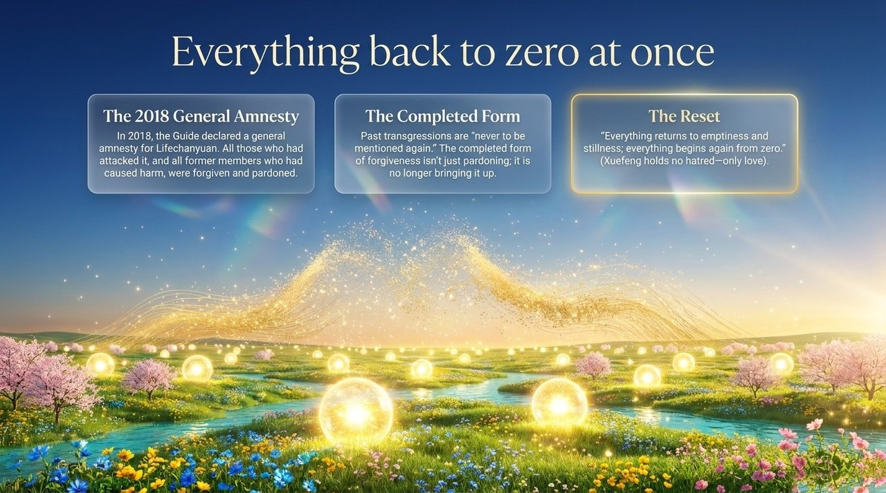
    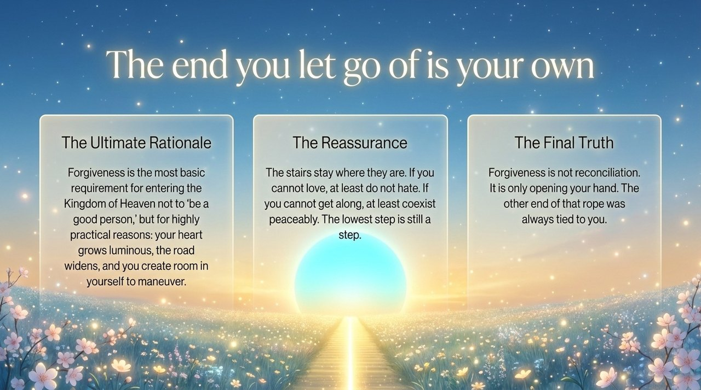

---

## Core Points

- **The most basic threshold**: Forgiving others is the minimum requirement for entering the Kingdom of Heaven; Heaven has no room for hatred
- **Reciprocal mechanism**: Forgive others ↔ the Greatest Creator forgives you; withhold forgiveness ↔ the Greatest Creator withholds forgiveness
- **Real effects**: From the moment you truly forgive from the heart, clarity floods in, vital energy enters, and the road ahead widens
- **Graduated levels**: Minimum — stop hating your enemy; further — coexist peacefully; highest — love your enemy, pray for those who persecute you
- **Who to forgive**: Everyone — enemies, petty people, siblings who have wronged you, those who have hurt you; also, yourself
- **Root**: Gratitude — "forgiveness flows from the sense of gratitude in our hearts"
- **The cost of hatred**: Hatred distorts the inner Spirit and drives the LIFE structure toward falseness, evil, and ugliness

---

## Related Entries

[Repentance](/en/repentance/) · [Gratitude](/en/gratitude/) · [Letting Go](/en/letting-go/) · [Soul Garden](/en/soul-garden/) · [Love](/en/love/) · [Kingdom of Heaven](/en/kingdom-of-heaven/) · [Thousand-Year World](/en/thousand-year-world/) · [Spiritual Purification Course](/en/spiritual-purification-course/)
