<!-- id: LC-FG-0001-EN theme: Cultivation System type: Gateway Page direction: Practice Method lang: en -->

# Formless Giving

[Entry Gateway]

> In Lifechanyuan terminology, **LIFE** (capitalized) refers to the ontological
> essence of existence — the soul/antimatter structure that persists across
> incarnations — while **life** (lowercase) refers to the experiential stage
> of human existence in this world.

**Formless Giving** (无相布施, *Wúxiàng Bùshī*) is a core cultivation practice in the Lifechanyuan system — giving without attachment to ego, credit, or expectation of return. It is the practical expression of the "Non-Form Thinking" level of the Eight Thinking Ladders, a key path for clearing karmic debts, accumulating merit, and refining LIFE's quality. The "formless" in the name means: no form of self, no calculation, no record — giving as naturally as the sun radiates warmth.

> Give as the sun shines — not because someone is watching, not because of what you will receive.
>
> — Guide Xuefeng

---

## Core Positioning

In the Lifechanyuan system, Formless Giving is not charity in the conventional sense. It is the lived practice of Love — the quality that the Greatest Creator embodies — enacted without the interference of ego. It perfects LIFE's antimatter structure more effectively than any formal practice or ritual.

---

## Read by Edition

| Edition | Intended Reader | Link |
|---------|----------------|-------|
| **Friendly Edition** | Readers new to Lifechanyuan concepts | [Read Friendly Edition](./friendly) |
| **Academic Edition** | Researchers with philosophical/religious studies background | [Read Academic Edition](./academic) |
| **Internal Edition** | Chanyuan Celestials and deep practitioners | [Read Internal Edition](./internal) |

---

## Video

<iframe style="width:100%;aspect-ratio:4/3;border:0" src="https://www.youtube-nocookie.com/embed/yz9XxE_G1cI" title="Formless Giving (Lifechanyuan Encyclopedia video)" allowfullscreen></iframe>

## Slides

??? info "📖 Illustrated slides (14 pages, click to expand)"

    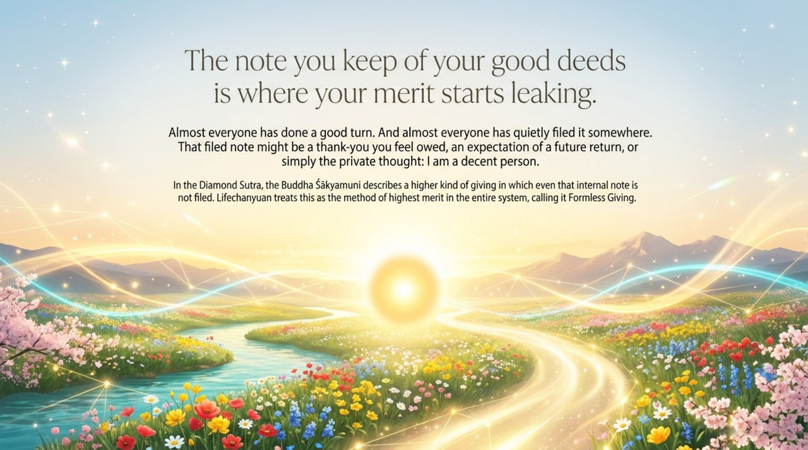
    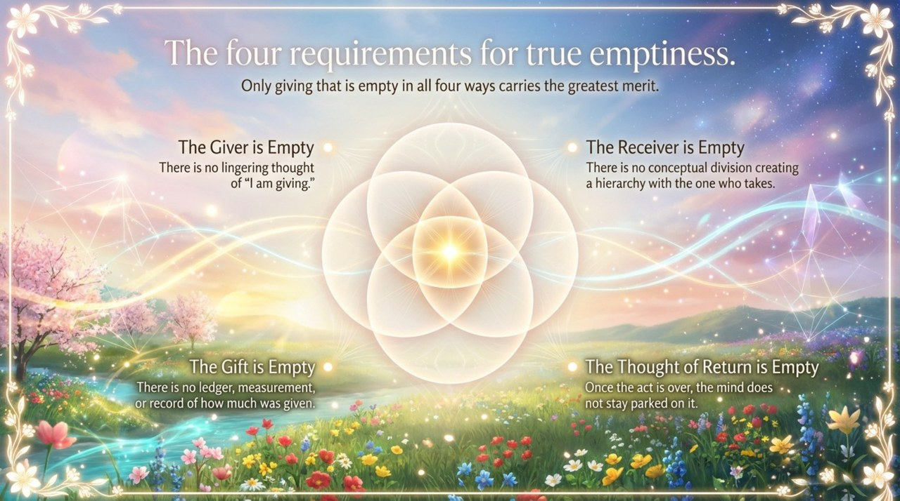
    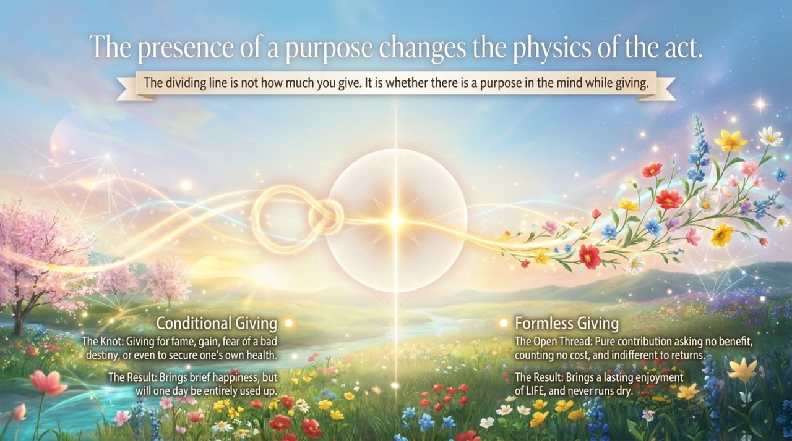
    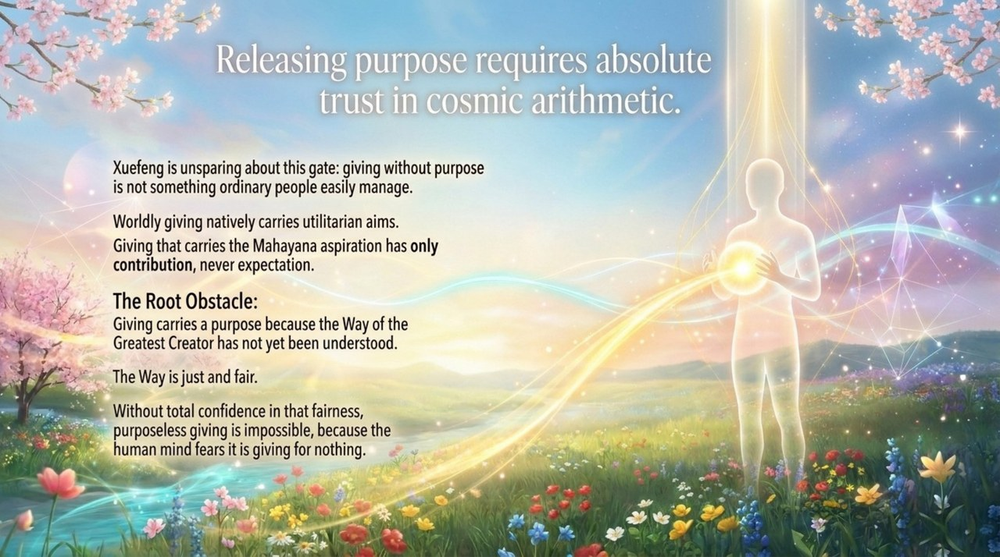
    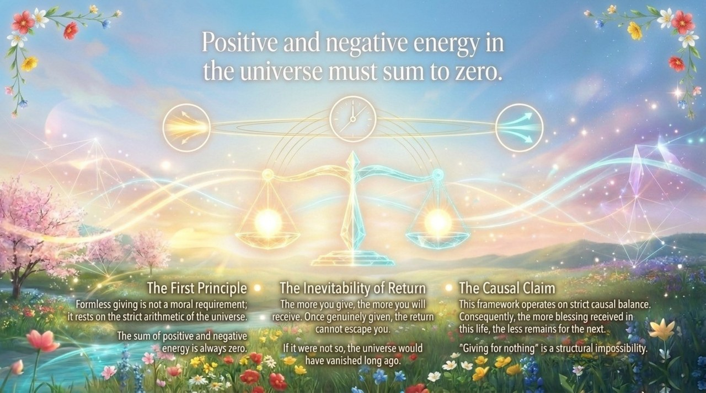
    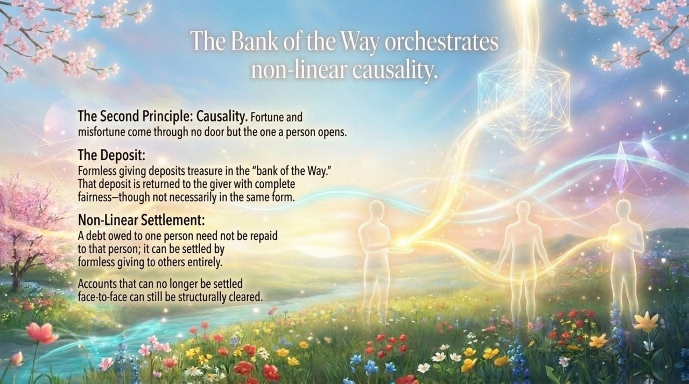
    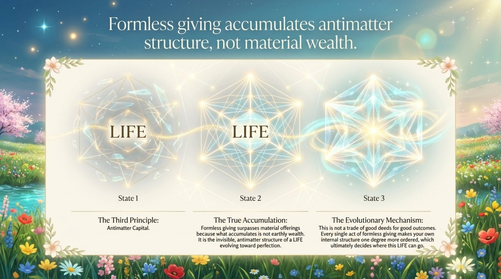
    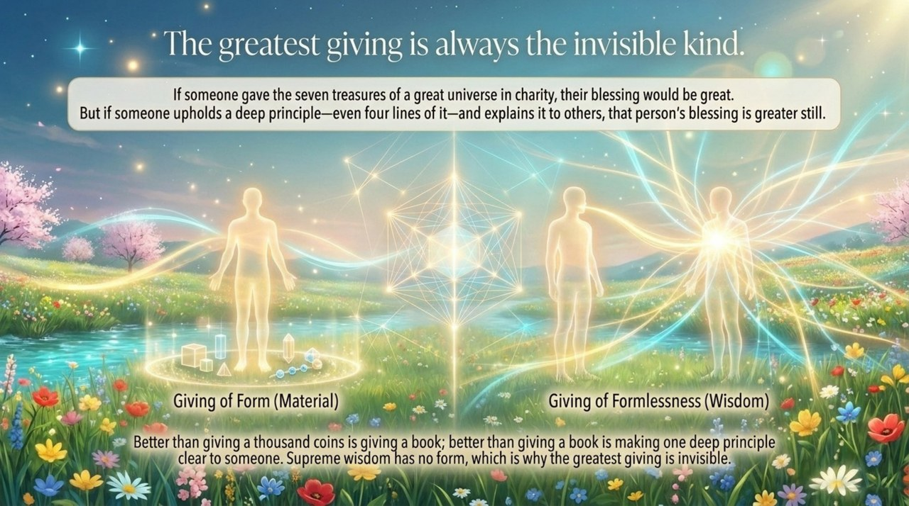
    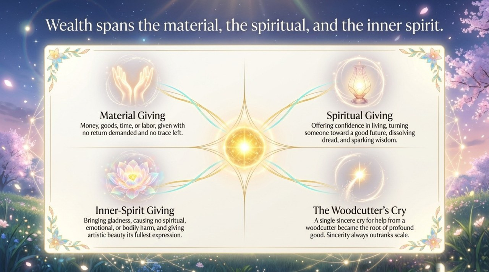
    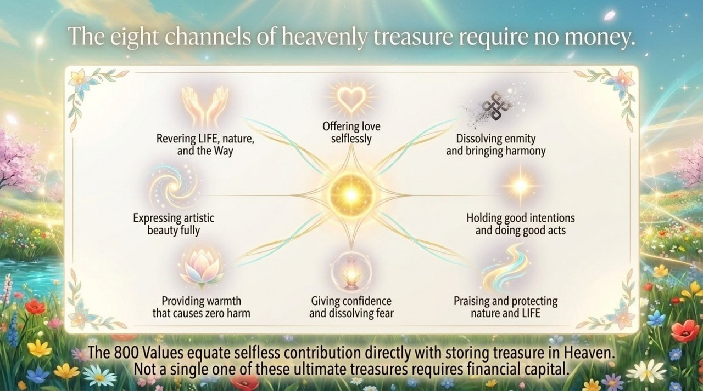
    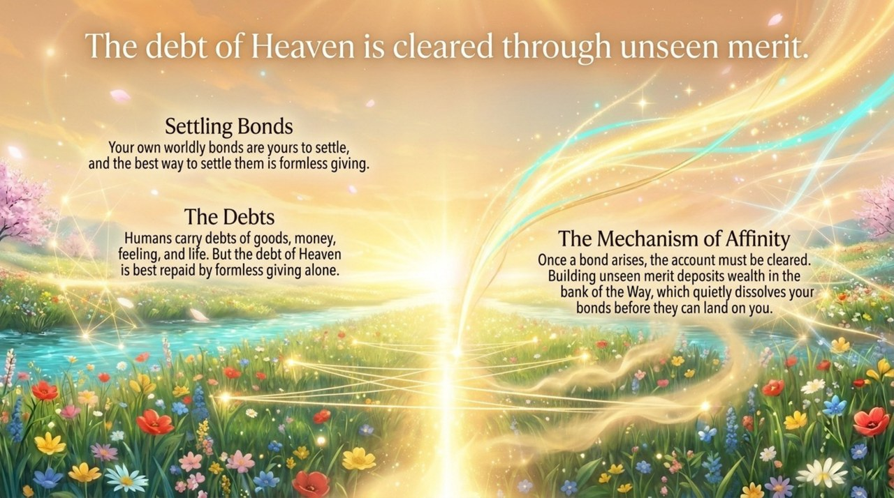
    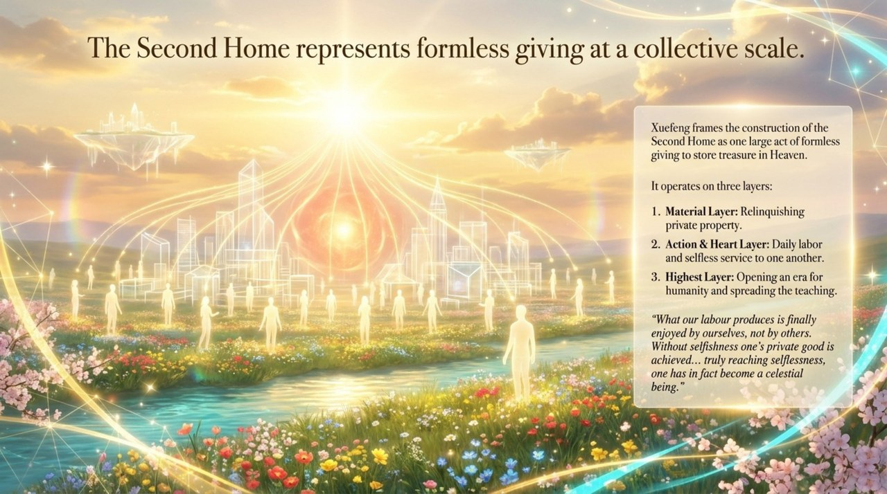
    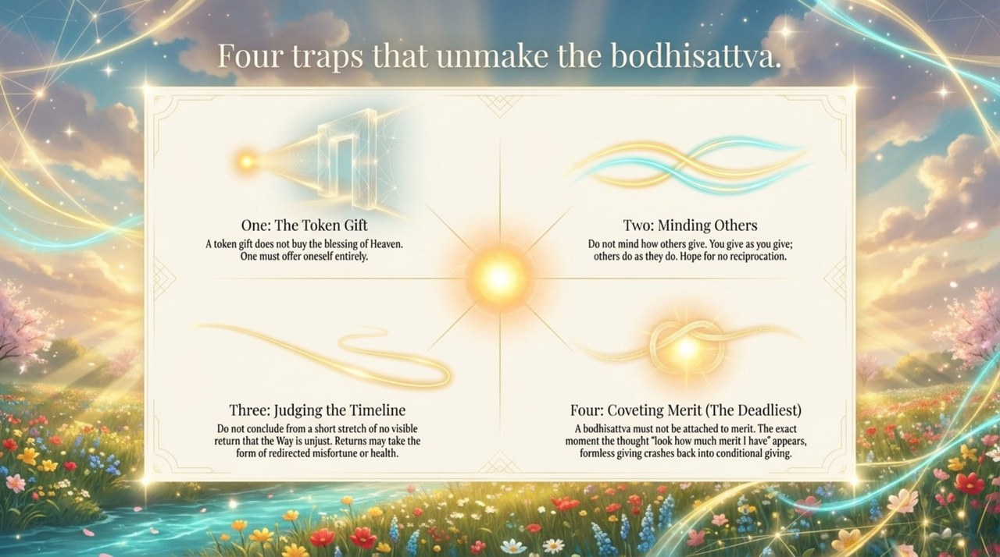
    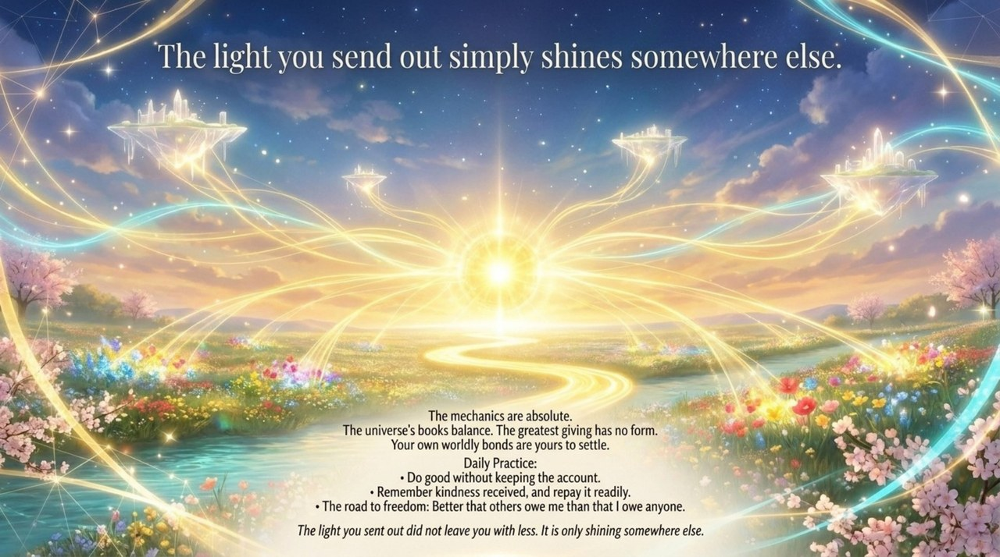

---

## Related Entries

- [Eight Thinking Ladders](/en/eight-thinking-ladders/) — Non-Form Thinking is the theoretical basis of Formless Giving
- [Love](/en/love/) — Formless Giving is Love enacted without ego
- [Soul Garden](/en/soul-garden/) — Formless Giving clears weeds and plants flowers in the soul garden
- [Structure](/en/structure/) — Formless Giving perfects LIFE's antimatter structure
