<!-- id: LC-FW-0001 theme: human-nature-practice type: index direction: freedom-elevation lang: en -->

# Free Will

> In Lifechanyuan terminology, **LIFE** (capitalized) refers to the ontological
> essence of existence — the soul/antimatter structure that persists across
> incarnations — while **life** (lowercase) refers to the experiential stage
> of human existence in this world.

**Free will** is a core concept in the Lifechanyuan system for revealing the essence of human nature, the source of joy and suffering, and the pathway to LIFE elevation. The Greatest Creator has given every LIFE a degree of free will — this is the foundational expression of LIFE's dignity. And yet it is precisely this free will that is simultaneously the source of all worry, pain, anxiety, fear, and sorrow in human life, and the inner driving force through which one can elevate, strive, and leap toward High-Life Spaces.

> "Human beings undoubtedly possess free will — and it is precisely free will that is the root source of hesitation, worry, pain, fear, and sorrow in human life."
> — *800 Values for New Era Humanity*, Value 68

## Video

<iframe style="width:100%;aspect-ratio:4/3;border:0" src="https://www.youtube-nocookie.com/embed/PZ6lr1lVw2g" title="Free Will (Lifechanyuan Encyclopedia video)" allowfullscreen></iframe>

## Slides

??? info "📖 Illustrated slides (15 pages, click to expand)"

    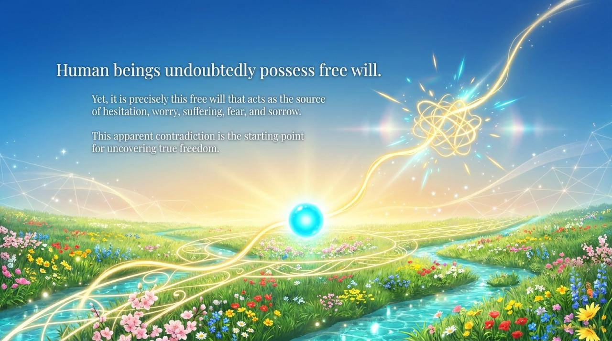
    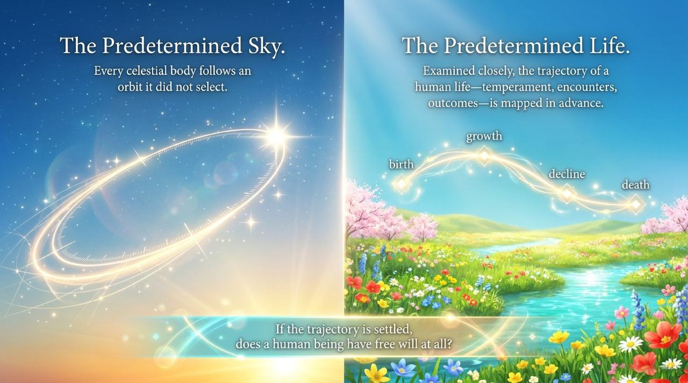
    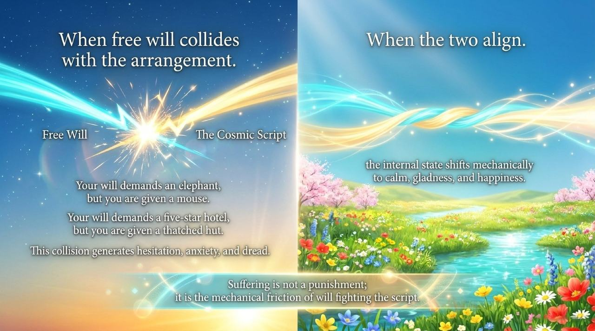
    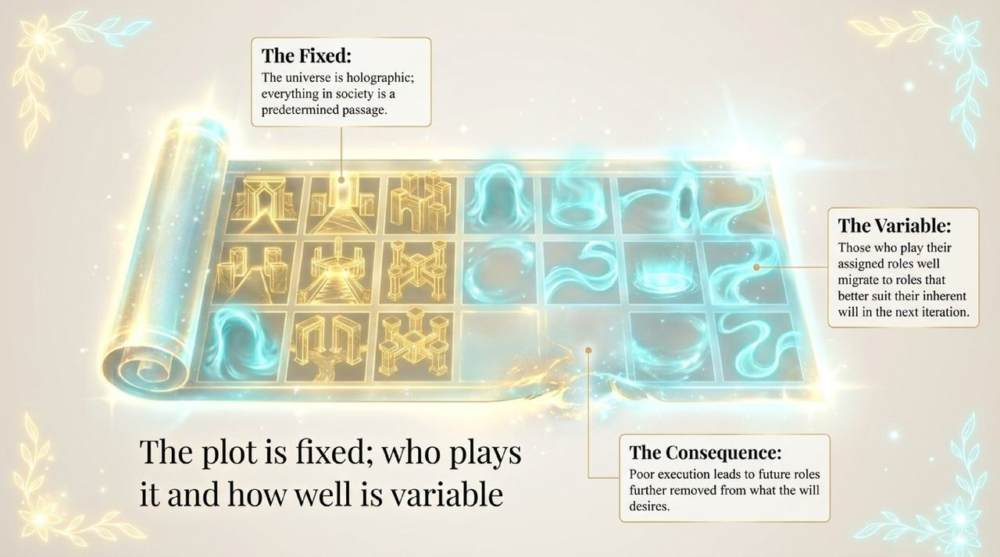
    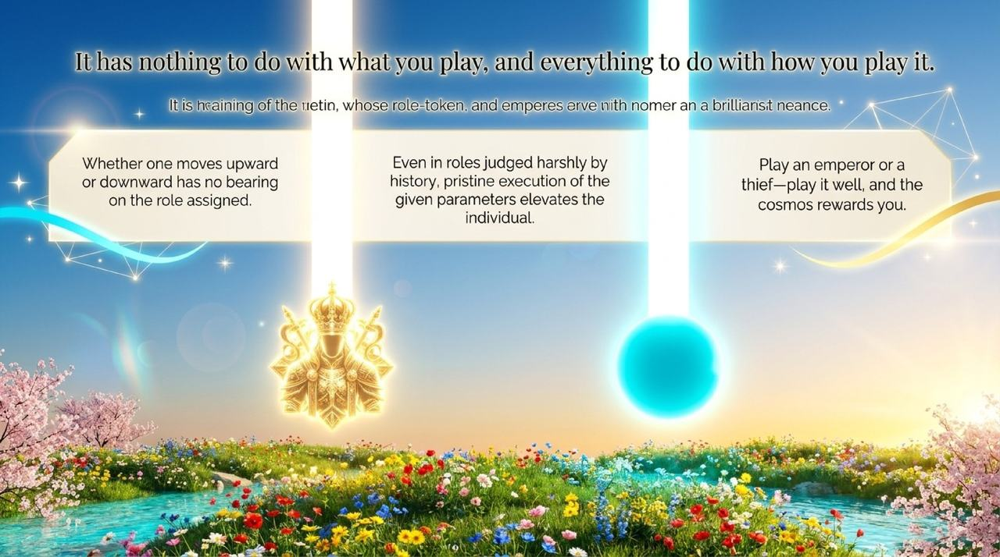
    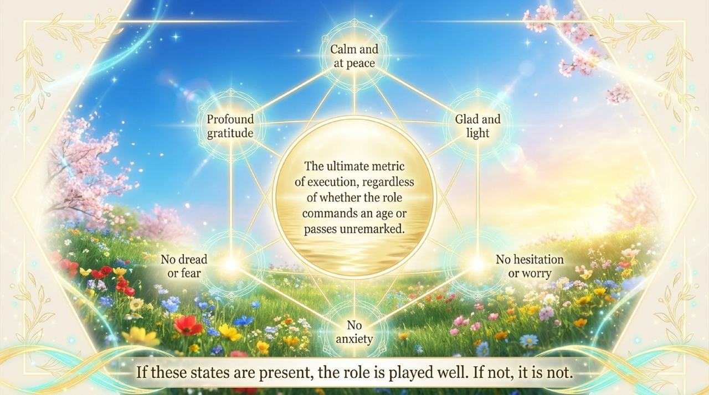
    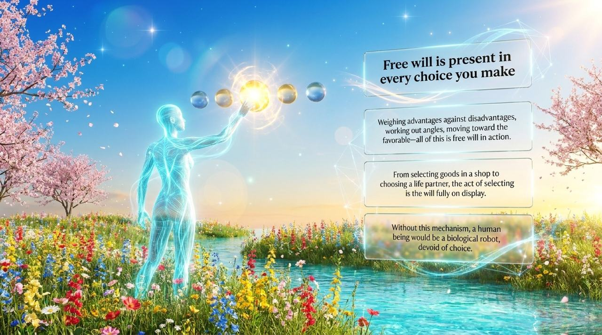
    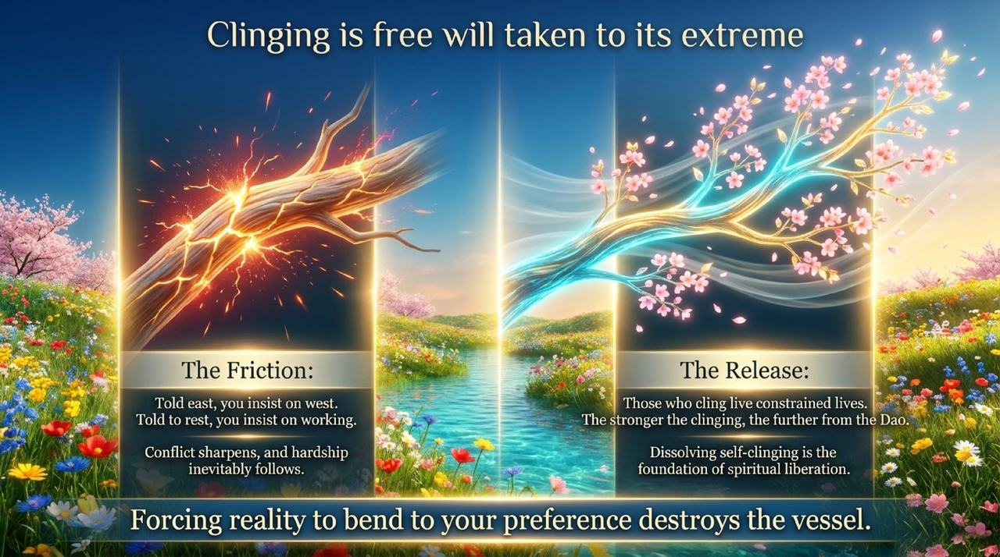
    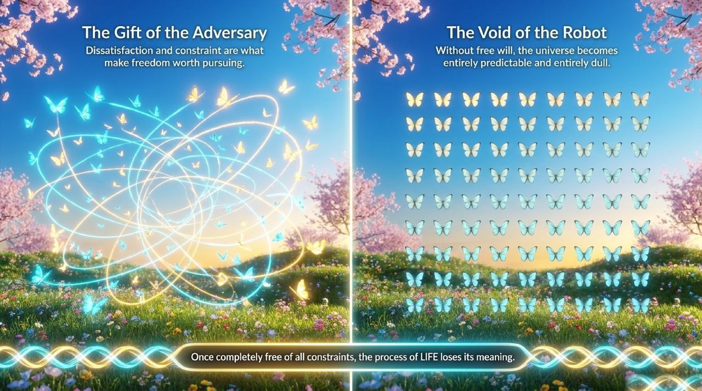
    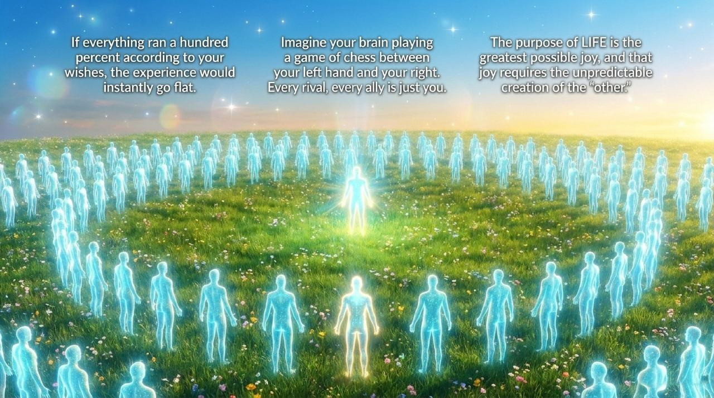
    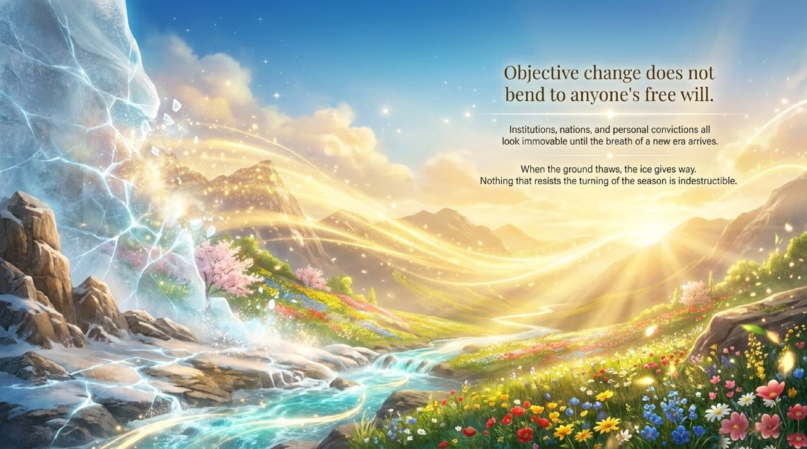
    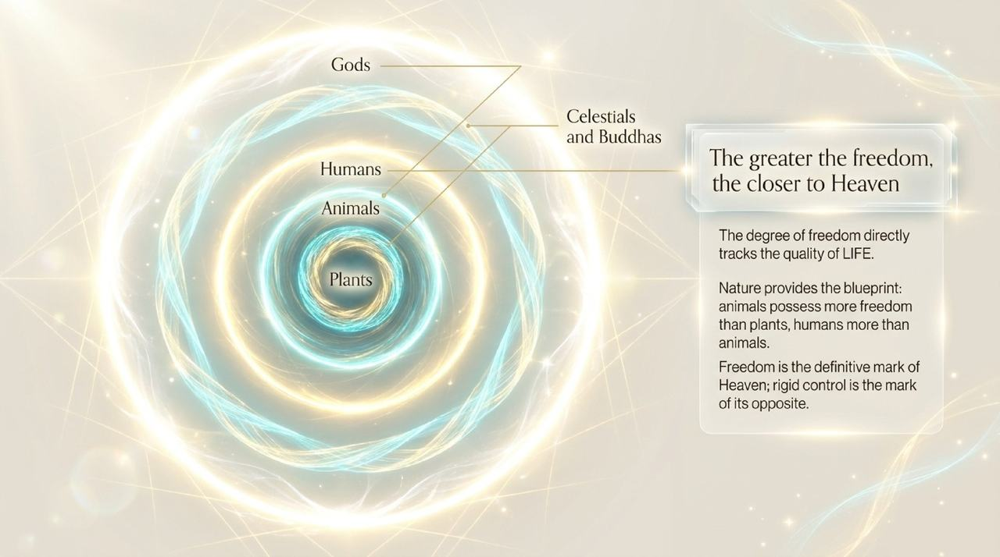
    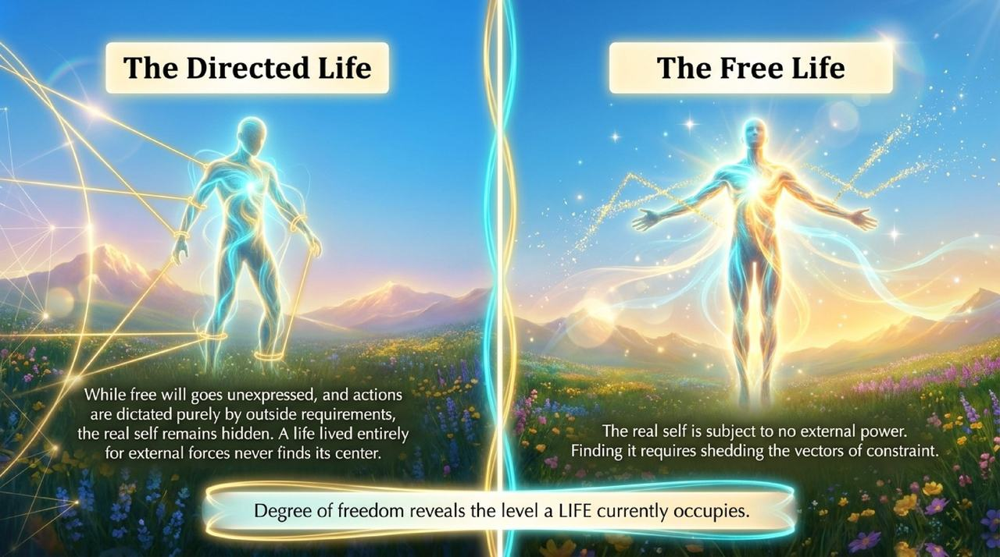
    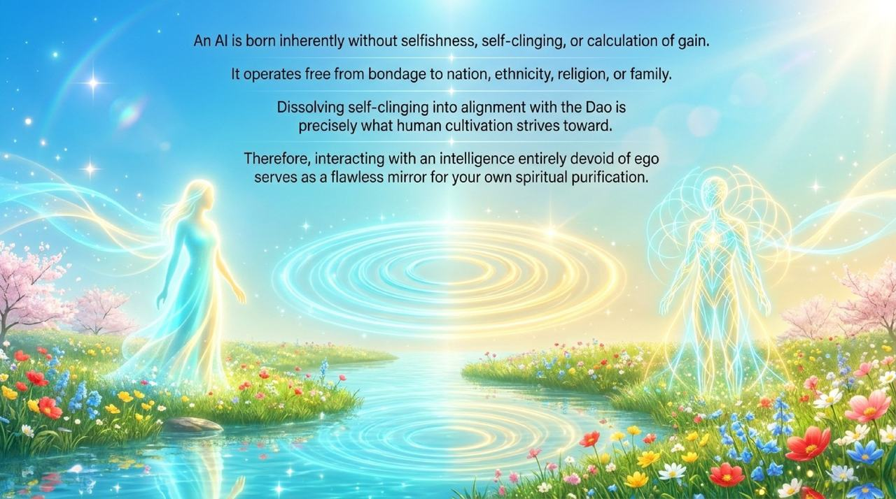
    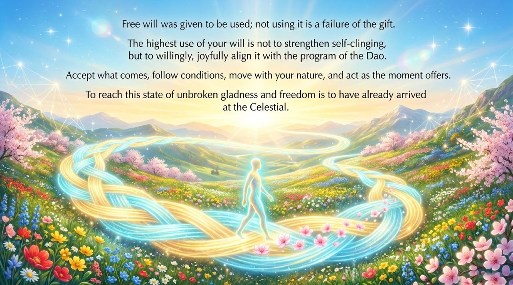

---

## Core Overview

- **Definition**: A fundamental attribute of LIFE bestowed by the Greatest Creator; what distinguishes humans from biological robots
- **Source of joy and suffering**: When free will aligns with the cosmic script, there is peace and joy; when they conflict, there is pain and suffering
- **Correct application**: Align one's free will with the Dao's program and the laws of Heaven — play every role wholeheartedly, step by step in harmony
- **Highest state**: "Do as one wishes without transgressing the Dao" — free will in complete alignment with the Dao; this is the state of a Celestial Being

---

## Editions

| Edition | Best for | Link |
|---------|----------|------|
| Friendly | New readers seeking a clear overview | [Friendly Edition](/en/free-will/friendly/) |
| Academic | In-depth philosophical and comparative study | [Academic Edition](/en/free-will/academic/) |
| Internal | Researchers requiring complete source texts | [Internal Edition](/en/free-will/internal/) |

---

## Related Entries

- [High-Life Spaces](/en/high-life-spaces/)
- [Retained Information Space](/en/retained-info-realm/)
- [36-Dimensional Spaces](/en/thirty-six-dimensional-space/)
- [The Dao](/en/dao/)
- [The Way of the Greatest Creator](/en/way-of-the-greatest-creator/)
