# Gratitude

**Gratitude** is defined in the Lifechanyuan system as "the foremost element for elevating the quality of LIFE." It is the fundamental gateway through which the antimatter structure of life evolves toward perfect symmetry, a necessary quality for reaching the Kingdom of Heaven, and a core cultural value of the Second Home. Gratitude, together with contentment and cherishing, forms the Three Codes of Happiness. Its opposite — becoming accustomed to receiving grace while forgetting to be grateful — is the most dangerous habit a person can develop.

---

## Version Guide

| Version | Best for | Link |
|---------|----------|------|
| Friendly | First-time readers | [Read Friendly Version](/en/gratitude/friendly/) |
| Academic | Scholarly research, cross-cultural comparison | [Read Academic Version](/en/gratitude/academic/) |
| Internal | Chanyuan Celestials, deep study | [Read Internal Version](/en/gratitude/internal/) |

---

## Video

<iframe style="width:100%;aspect-ratio:4/3;border:0" src="https://www.youtube-nocookie.com/embed/pM9Rfk0xzZg" title="Gratitude (Lifechanyuan Encyclopedia video)" allowfullscreen></iframe>

## Slides

??? info "📖 Illustrated slides (14 pages, click to expand)"

    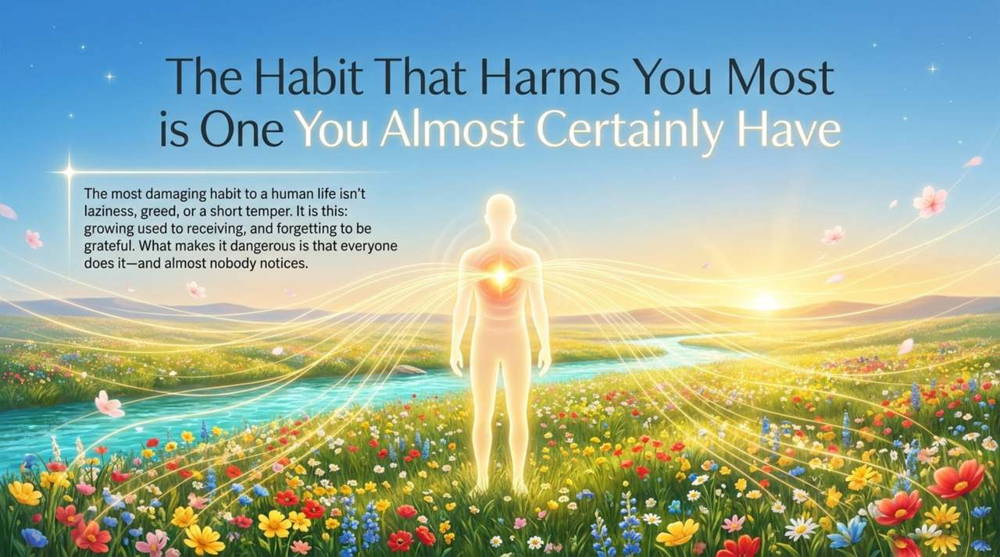
    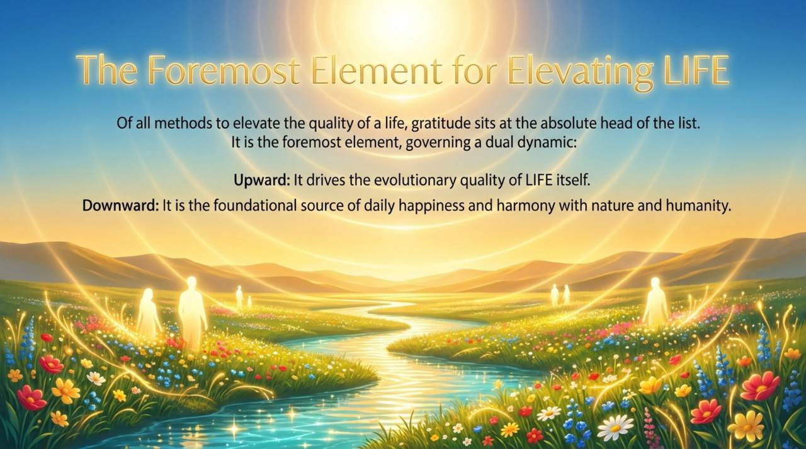
    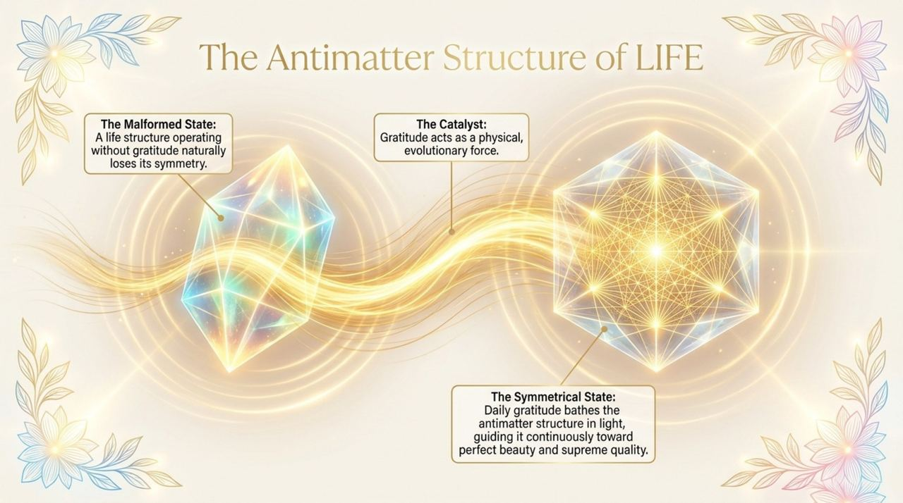
    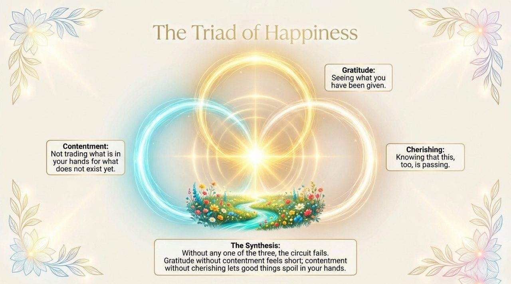
    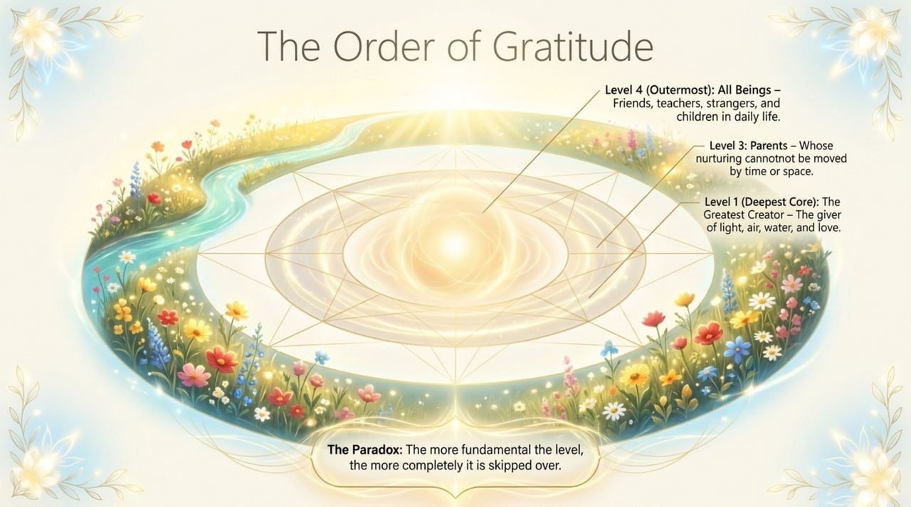
    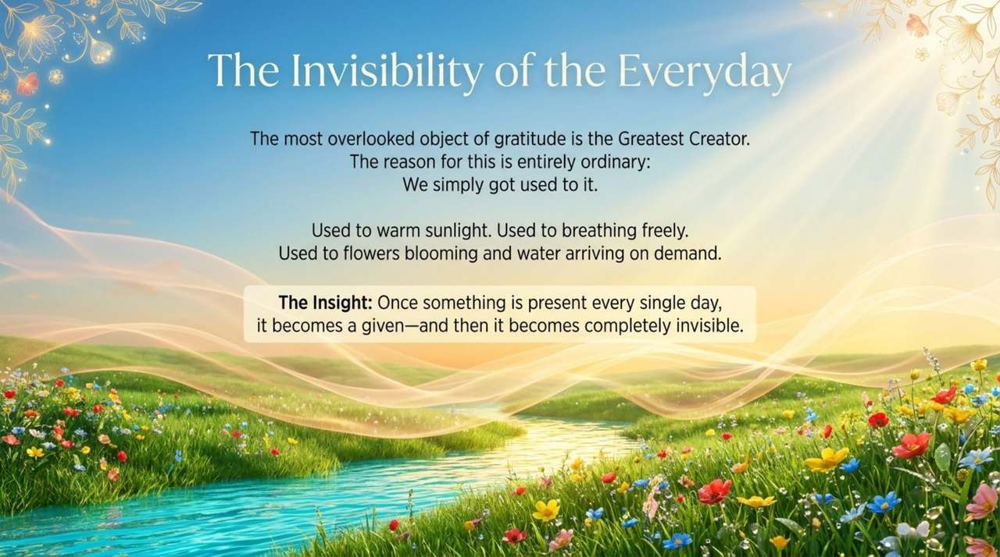
    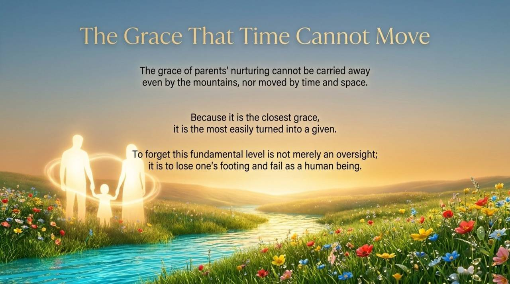
    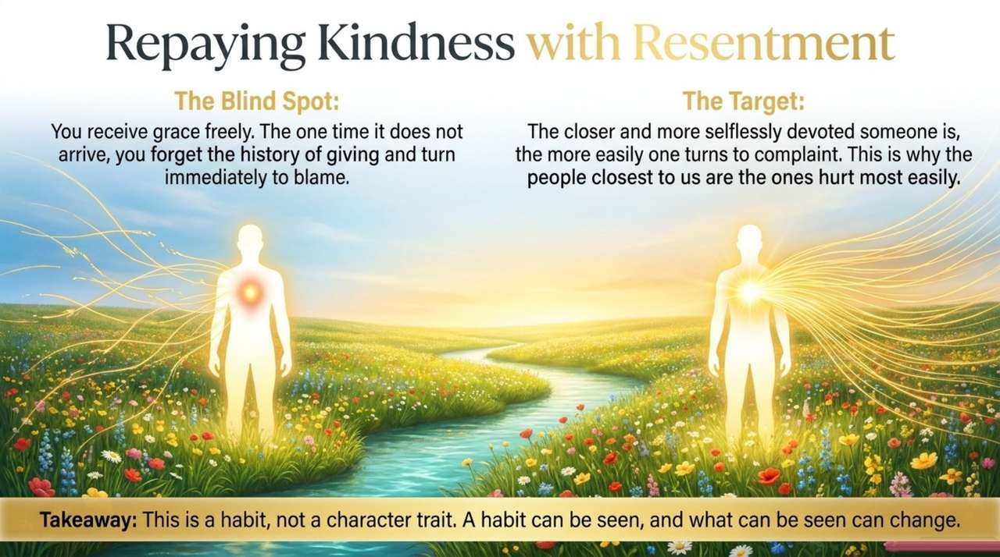
    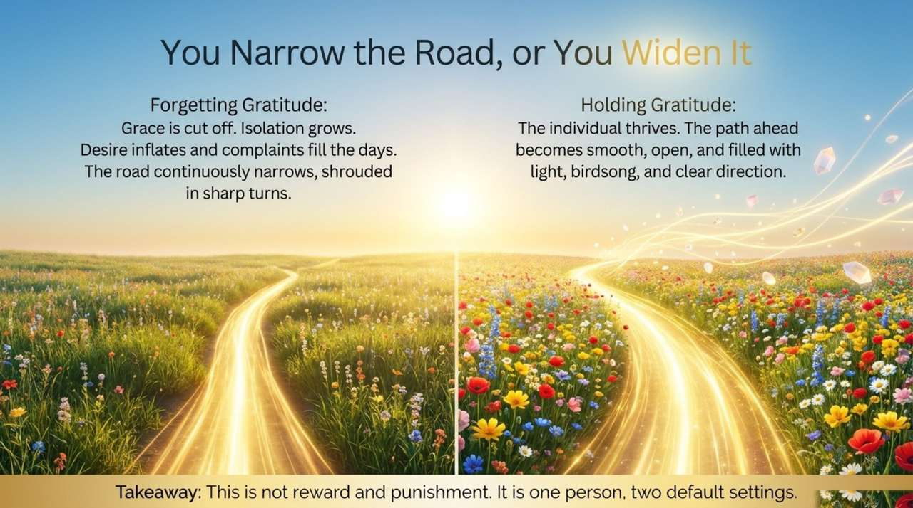
    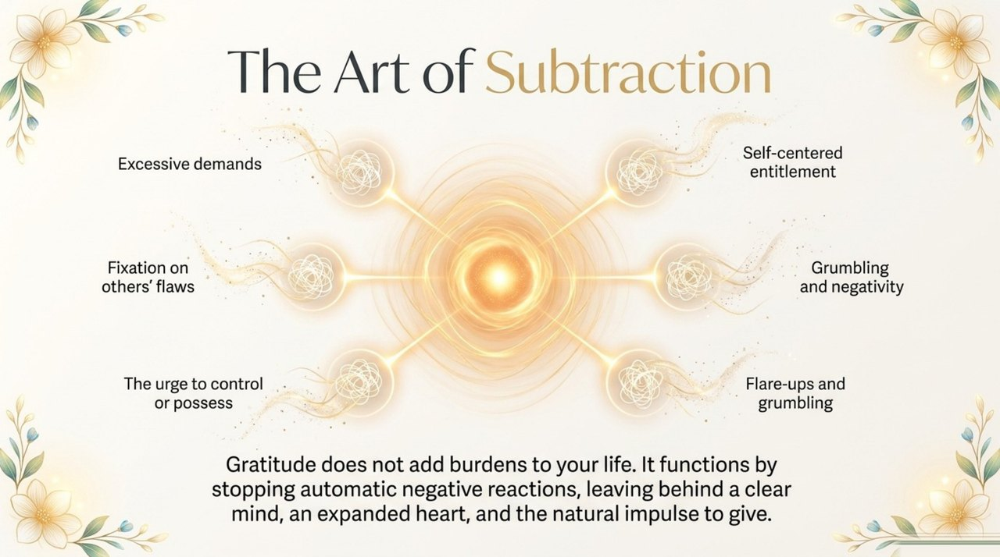
    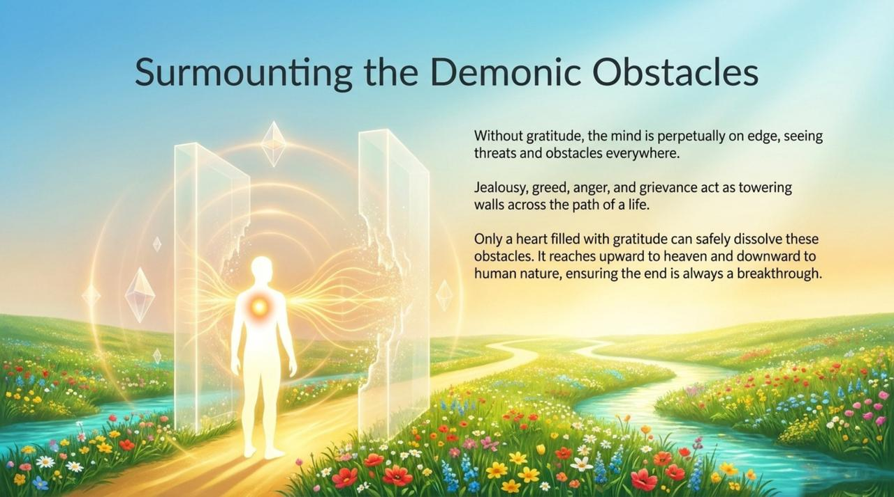
    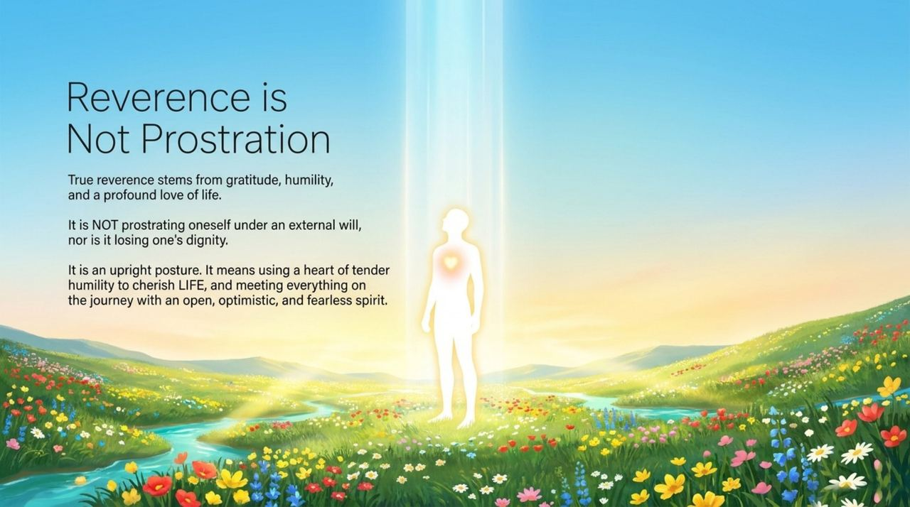
    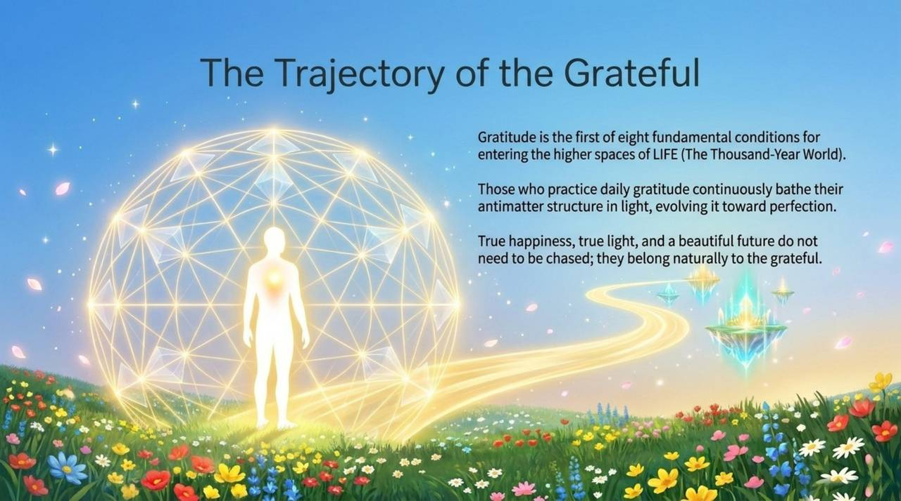
    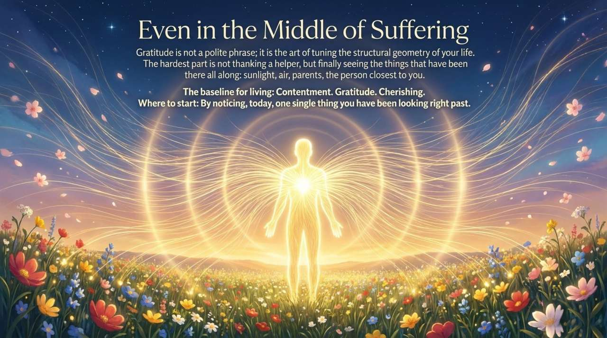

## Related Entries

[Awakening](/en/awakening/) · [Yuan (Karmic Affinity)](/en/yuan/) · [Formless Giving](/en/formless-giving/) · [Morality](/en/morality/) · [Thousand-Year World](/en/thousand-year-world/) · [Second Home](/en/second-home/) · [Soul Garden](/en/soul-garden/) · [The Greatest Creator](/en/greatest-creator/)
