# The Greatest Creator Is the Primary Productive Force

In Lifechanyuan's worldview, **the Greatest Creator is the primary productive force** — sunlight, air, water, earth, and the growth of all living things are expressions of the Greatest Creator's work. Walking the Way of the Greatest Creator means accessing an inexhaustible source of productive power.

> "The Greatest Creator is the primary productive force."
>
> — *New Era Concepts for Humanity*, 4th Edition, Concept 34

## Video

<iframe style="width:100%;aspect-ratio:4/3;border:0" src="https://www.youtube-nocookie.com/embed/2mZf7ksQx8Q" title="The Greatest Creator Is the Primary Productive Force (Lifechanyuan Encyclopedia video)" allowfullscreen></iframe>

## Slides

??? info "📖 Illustrated slides (14 pages, click to expand)"

    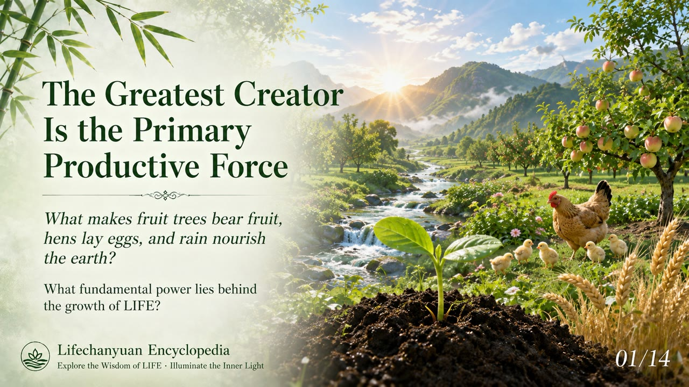
    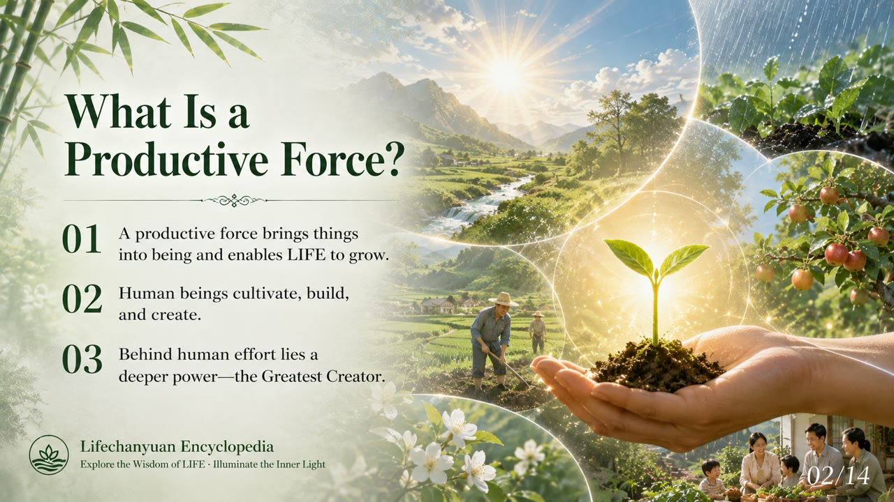
    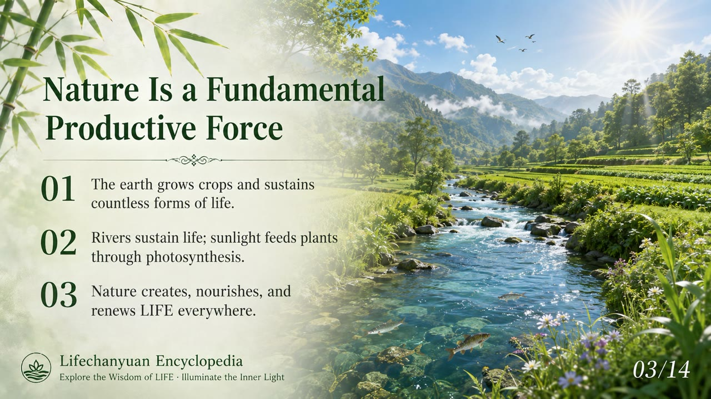
    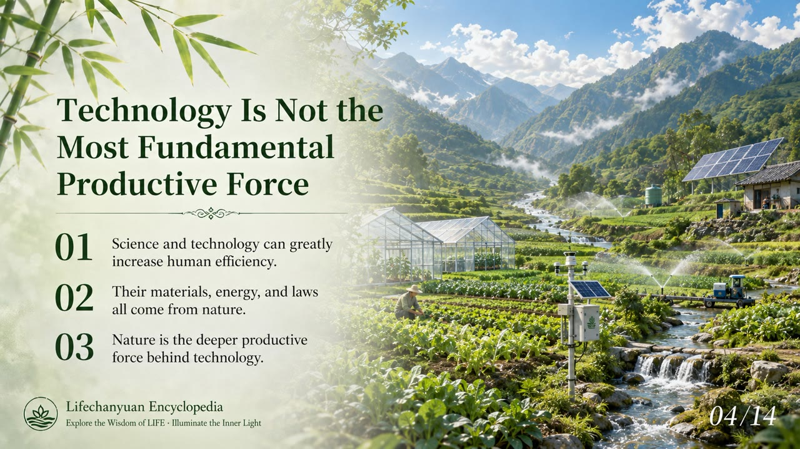
    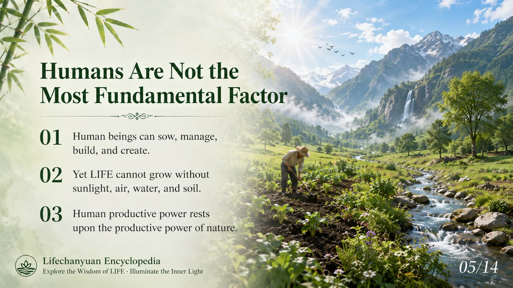
    
    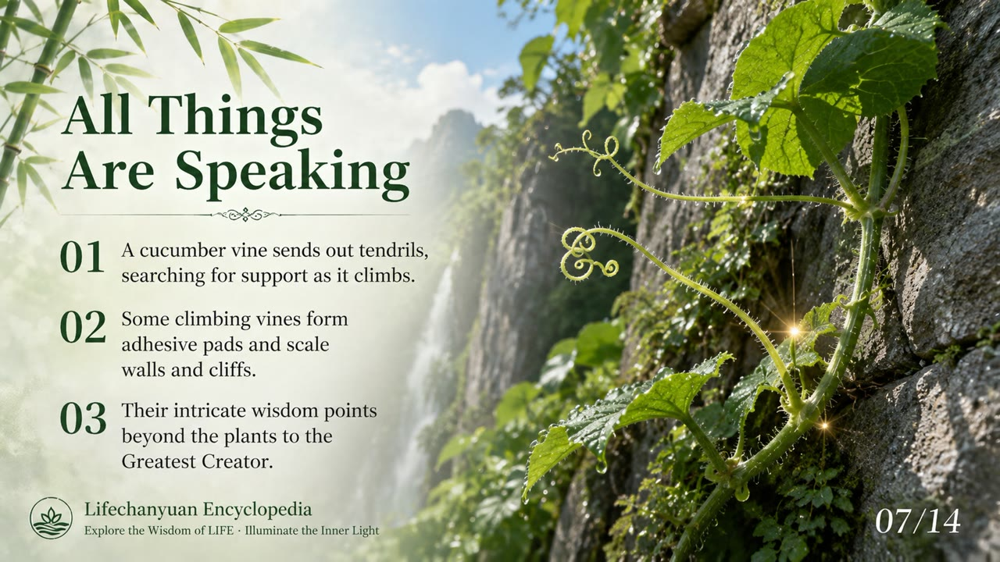
    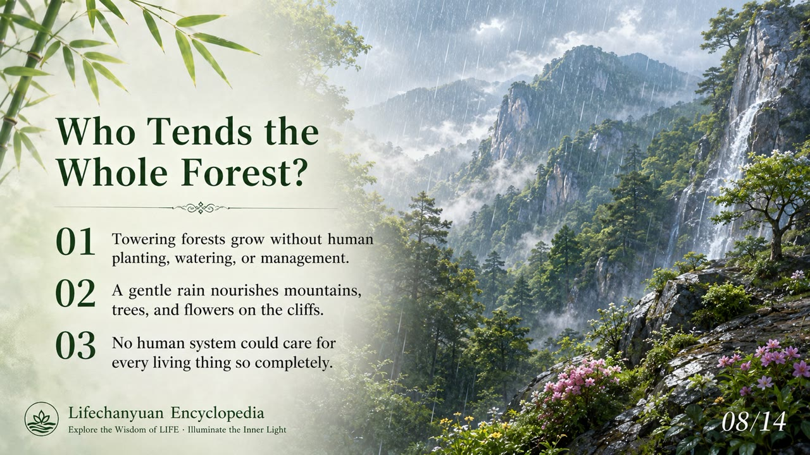
    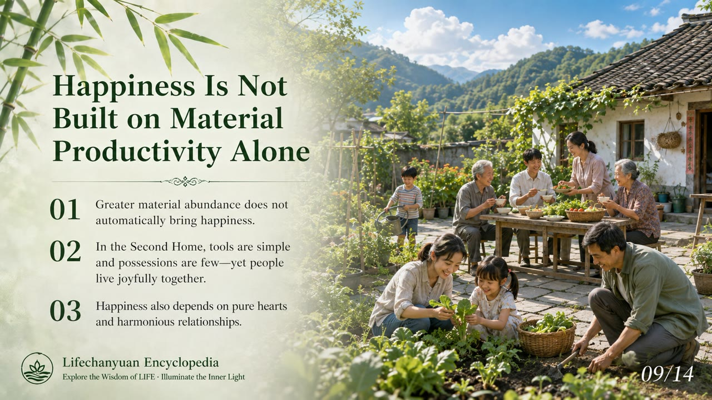
    
    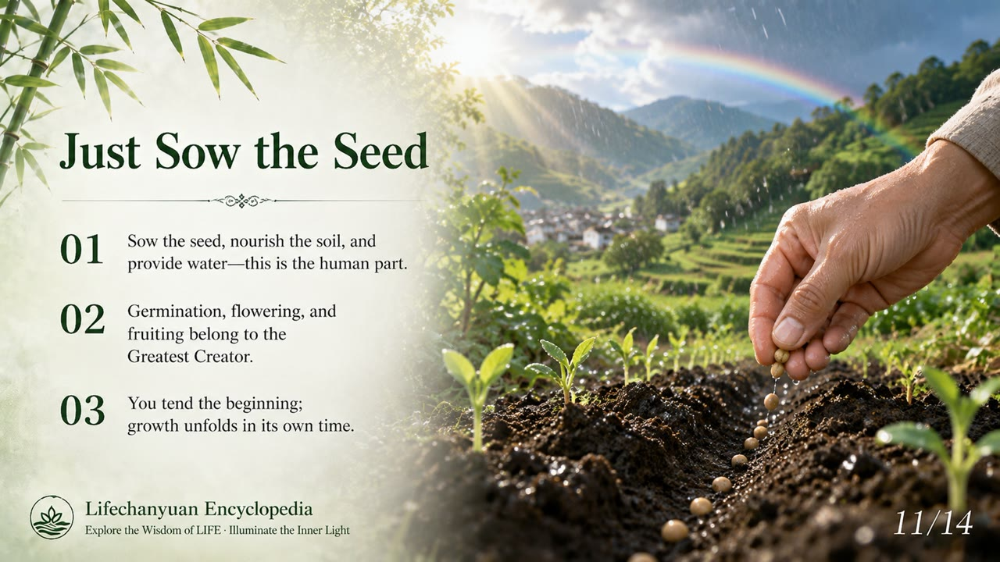
    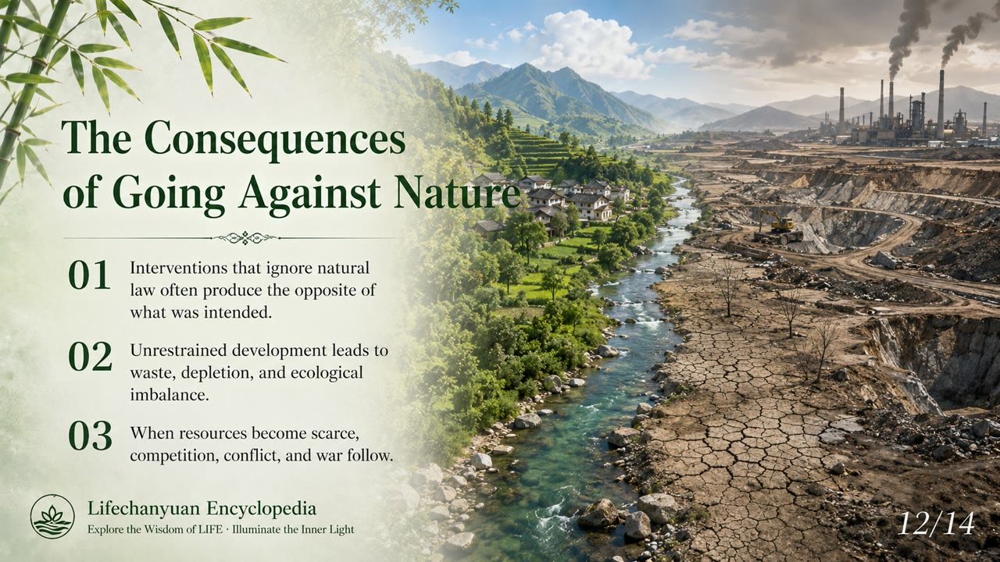
    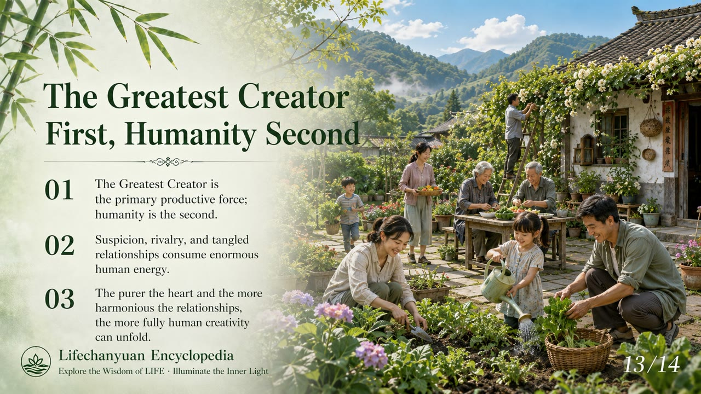
    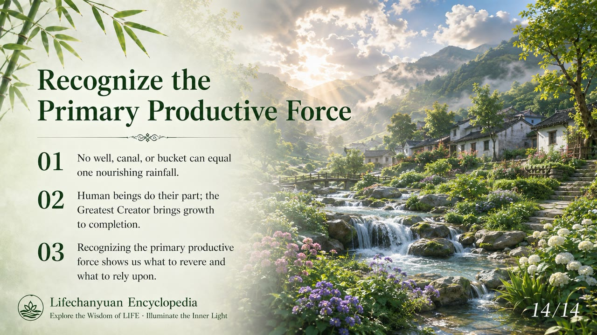

## Version Navigation

| Version | Best for | Focus |
|---------|----------|-------|
| [Friendly version](friendly.md) | First-time readers | Everyday analogies, why the Greatest Creator is the real productive force |
| [Academic version](academic.md) | Researchers | Systematic analysis, definitions, and comparative study |
| [Internal reference](internal.md) | Deep study | Original texts, unaltered |

## Related Entries

[The Greatest Creator](/en/greatest-creator/) · [The Way of the Greatest Creator](/en/way-of-the-greatest-creator/) · [The Dao](/en/dao/) · [Second Home](/en/second-home/) · [Xuefeng-Style Communism](/en/xuefeng-communism/) · [Hundun Economy](/en/hundun-economy/) · [The Lifechanyuan Era](/en/lifechanyuan-new-era/) · [Heavenly Treasures](/en/heavenly-treasures/)
