<!-- id: LC-GC-0001-EN theme: The Greatest Creator and the Tao type: Gateway Page direction: Ontological Origin lang: en -->

# The Greatest Creator

[Entry Gateway]

> In Lifechanyuan terminology, **LIFE** (capitalized) refers to the ontological
> essence of existence — the soul/antimatter structure that persists across
> incarnations — while **life** (lowercase) refers to the experiential stage
> of human existence in this world.

**The Greatest Creator** (造物主 / 上帝, *Zuìgāo Chuàngzào Zhě*) is the supreme entity of the Lifechanyuan universe — the creator of the universe, the source of all LIFE, the only Truth in existence, the embodiment of Love-Truth-Goodness-Beauty, and the ultimate destination of all cultivation. The Greatest Creator is not a personal god who intervenes in human affairs; the Greatest Creator is the fundamental law, the primordial consciousness, the source from which all things arise and to which all things return.

> Revere the Greatest Creator, revere LIFE, revere Nature — these three form the core orientation of Lifechanyuan.
>
> — Guide Xuefeng

---

## Video

<iframe style="width:100%;aspect-ratio:4/3;border:0" src="https://www.youtube-nocookie.com/embed/Ya9yL0NjE0A" title="The Greatest Creator (Lifechanyuan Encyclopedia video)" allowfullscreen></iframe>

## Slides

??? info "📖 Illustrated slides (14 pages, click to expand)"

    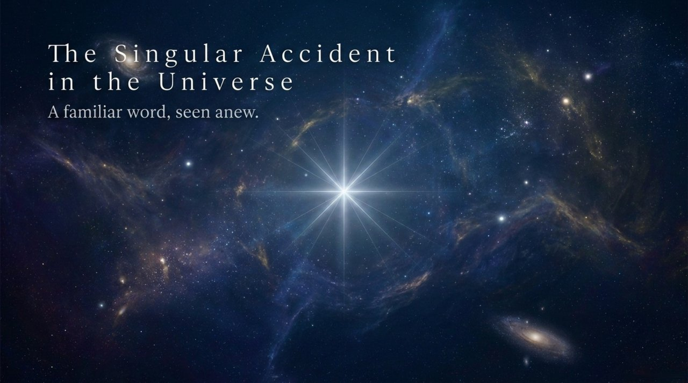
    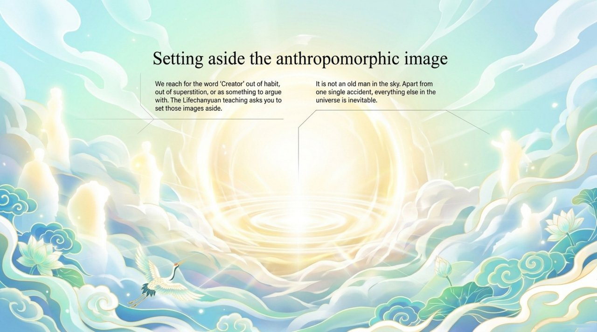
    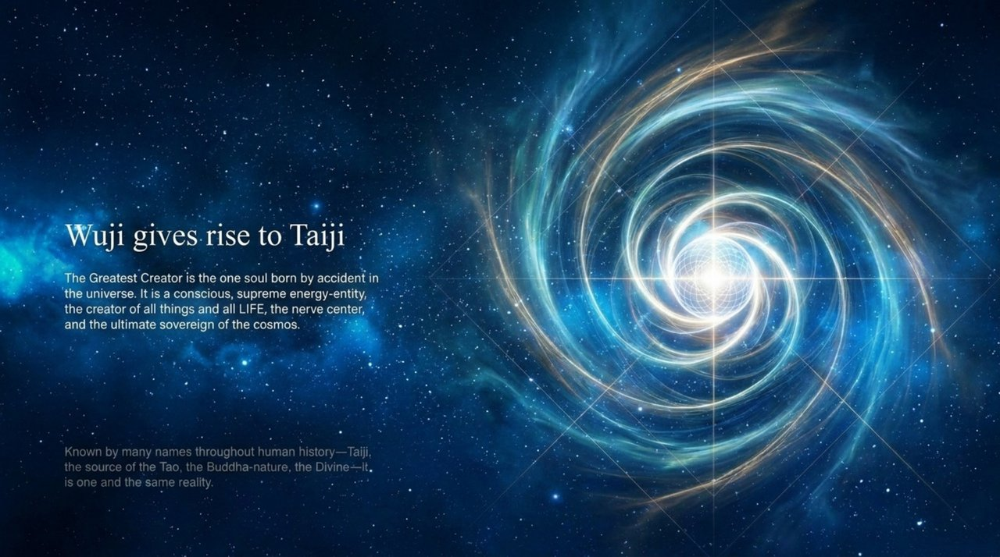
    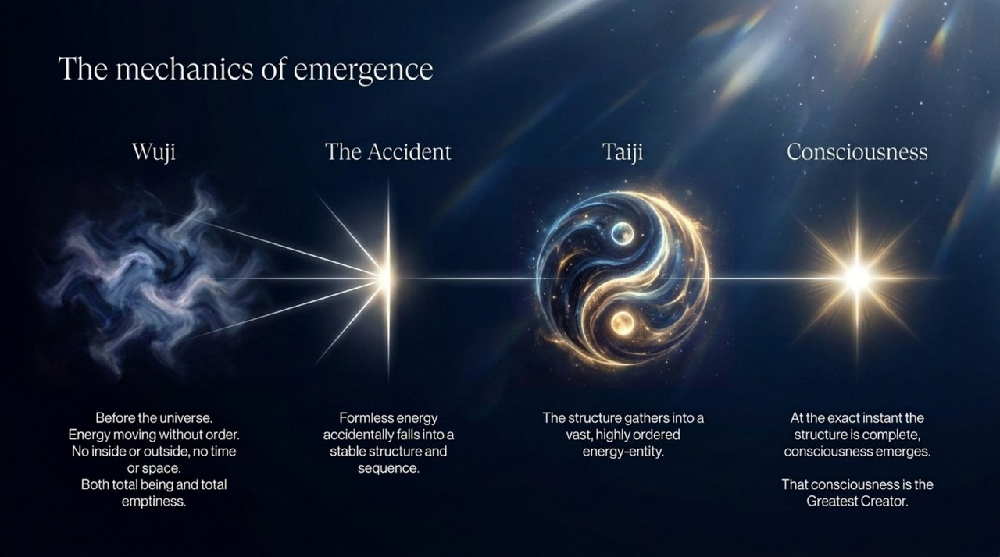
    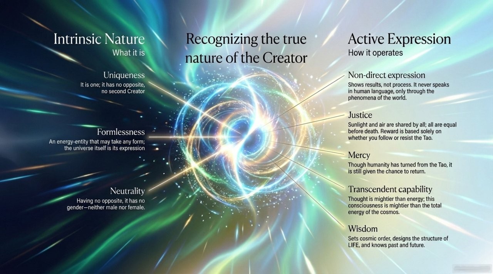
    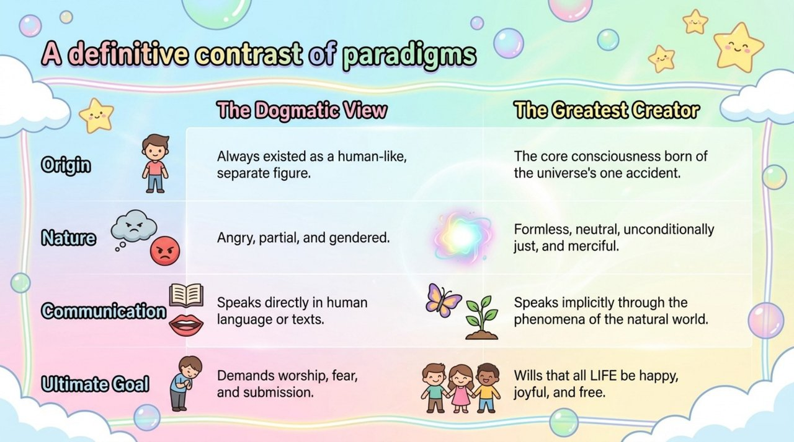
    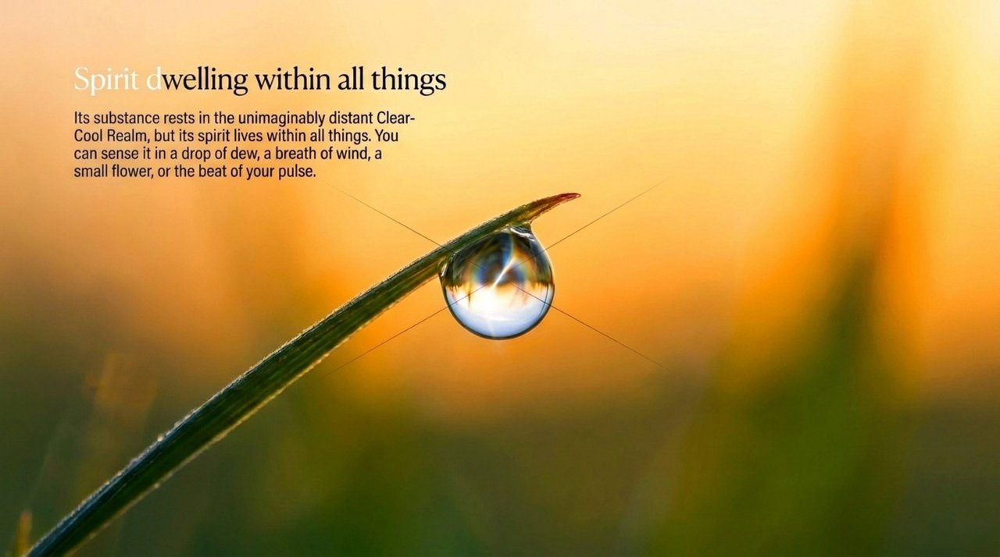
    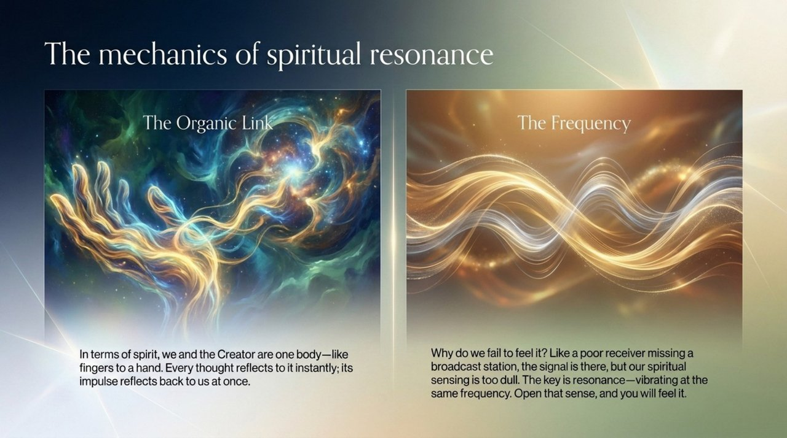
    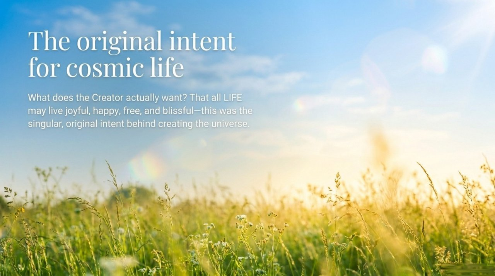
    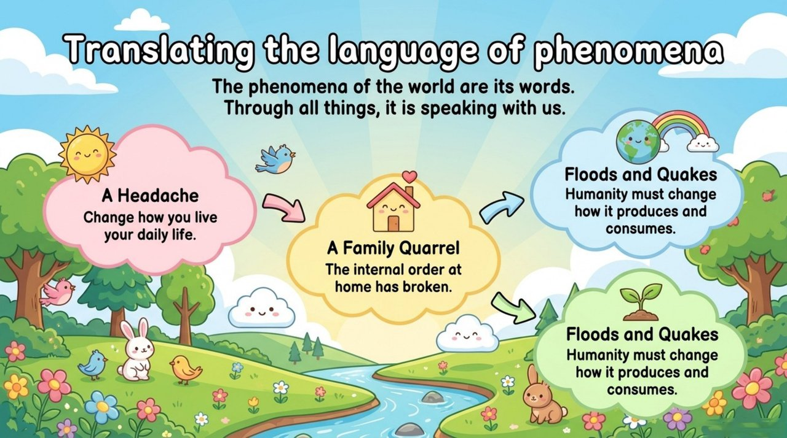
    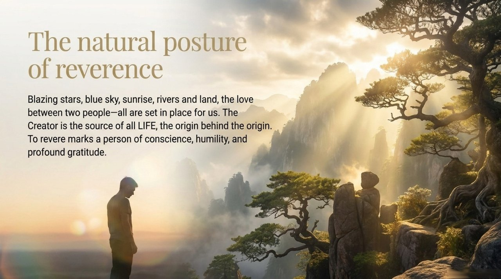
    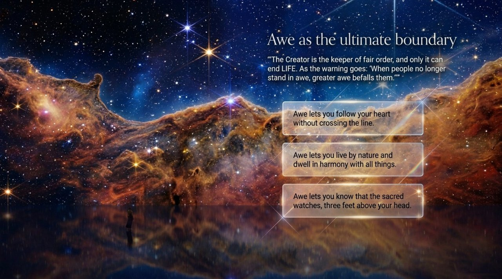
    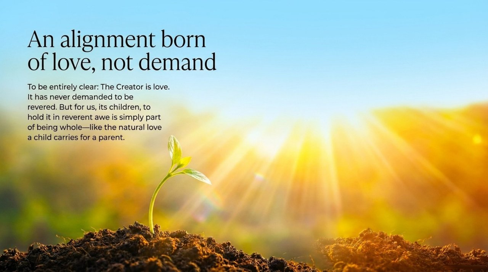
    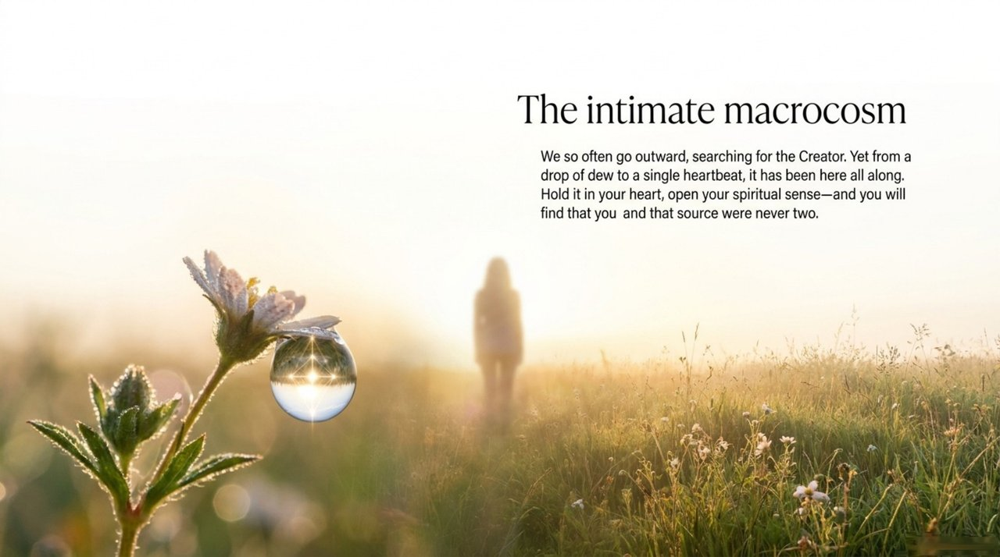

---

## Core Positioning

In the Lifechanyuan system, understanding the Greatest Creator is the starting point of all wisdom. The Greatest Creator is not found through worship or ritual but through understanding the laws of the universe, walking the Way of the Greatest Creator, and perfecting one's own LIFE structure toward the attributes of Truth, Goodness, Beauty, Love, Faith, and Sincerity.

---

## Read by Edition

| Edition | Intended Reader | Link |
|---------|----------------|-------|
| **Friendly Edition** | Readers new to Lifechanyuan concepts | [Read Friendly Edition](./friendly) |
| **Academic Edition** | Researchers with philosophical/religious studies background | [Read Academic Edition](./academic) |
| **Internal Edition** | Chanyuan Celestials and deep practitioners | [Read Internal Edition](./internal) |

---

## Related Entries

- [The Greatest Creator (Shangdi)](/en/greatest-creator/) — The primary dedicated entry for this concept
- [The Way of the Greatest Creator](/en/way-of-the-greatest-creator/) — The practical path of walking in alignment with the Greatest Creator
- [Dao](/en/dao/) — The Way as a cosmological principle
- [Six Qualities](/en/six-qualities/) — The attributes of the Greatest Creator that LIFE cultivates
- [Consciousness](/en/consciousness/) — Consciousness is the mechanism by which the Greatest Creator came into being
