<!-- id: LC-HM-0001-EN theme: Mystery of LIFE type: Entry Index lang: en -->

# Heart-Mind

**Heart-mind** (*xīn* 心) is the space of thinking — empty by nature, coming alive only when spirit (*líng*) takes up residence within it; its scope and depth are determined by the energy level of the spirit that dwells inside.

---

## Video

<iframe style="width:100%;aspect-ratio:4/3;border:0" src="https://www.youtube-nocookie.com/embed/wO3VeHA6GWA" title="Heart-Mind (Lifechanyuan Encyclopedia video)" allowfullscreen></iframe>

## Slides

??? info "📖 Illustrated slides (15 pages, click to expand)"

    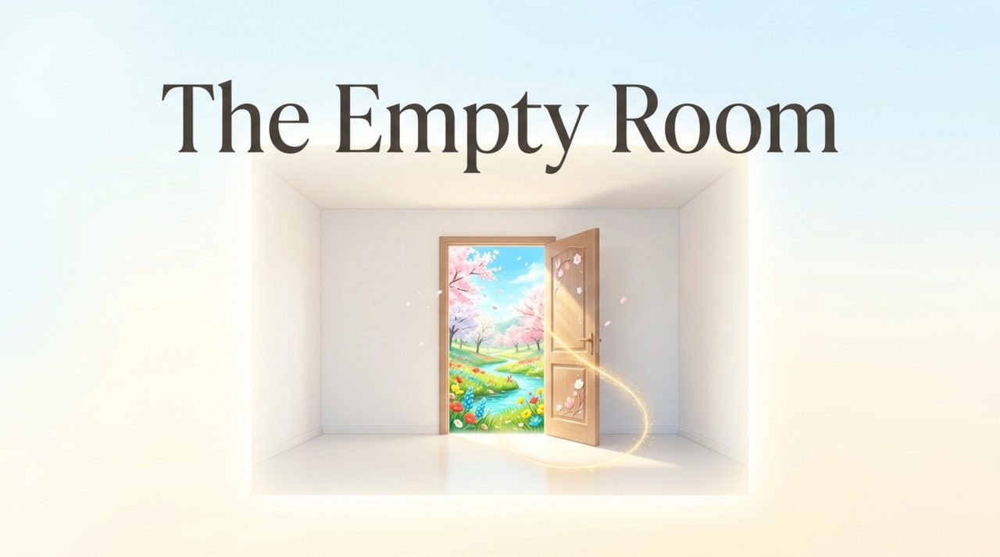
    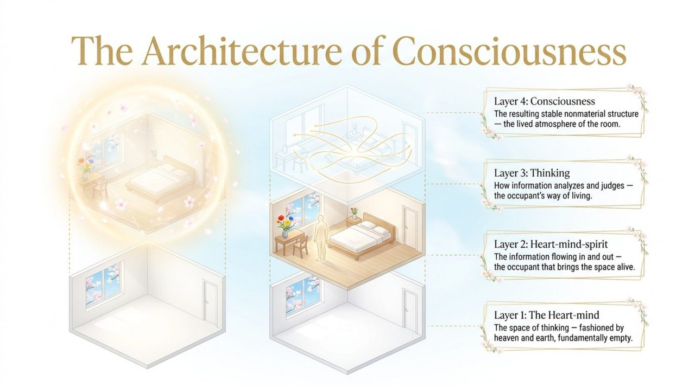
    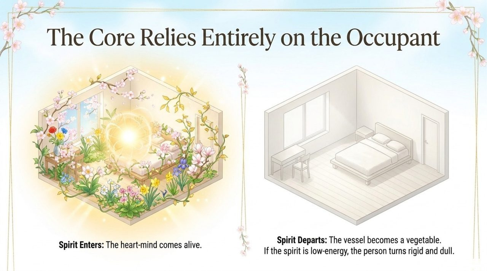
    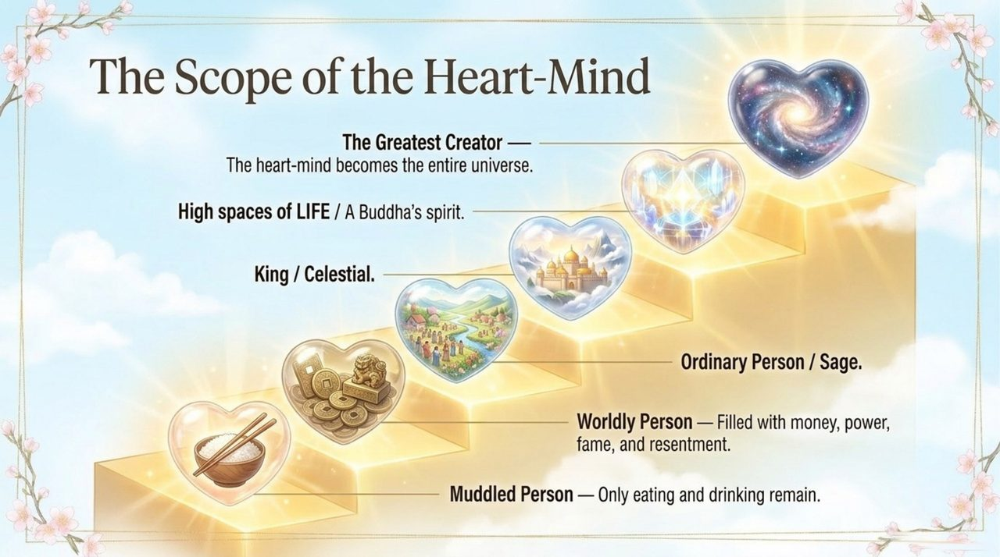
    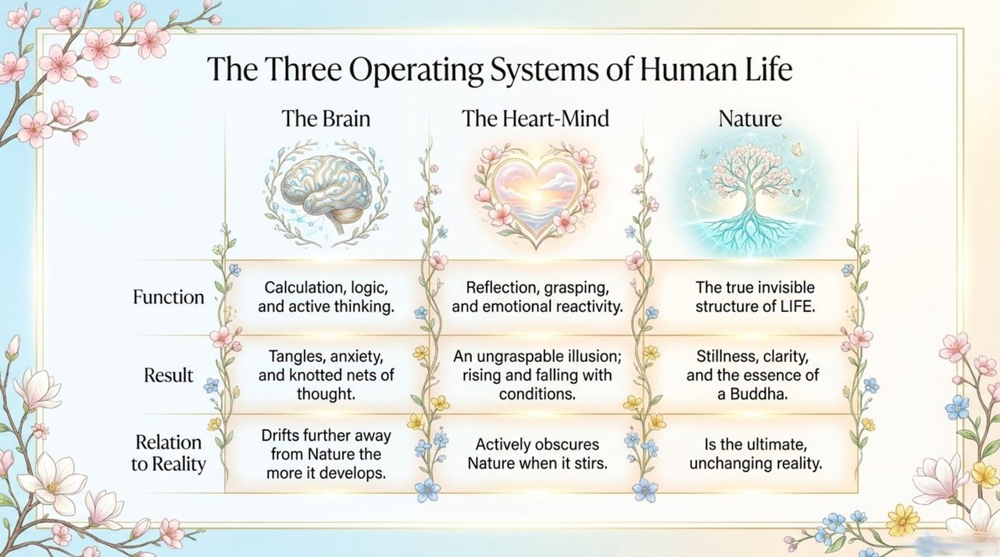
    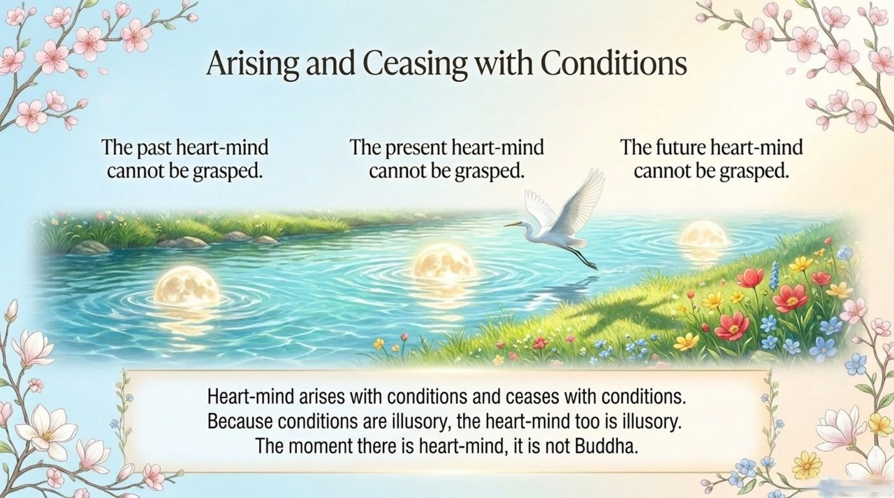
    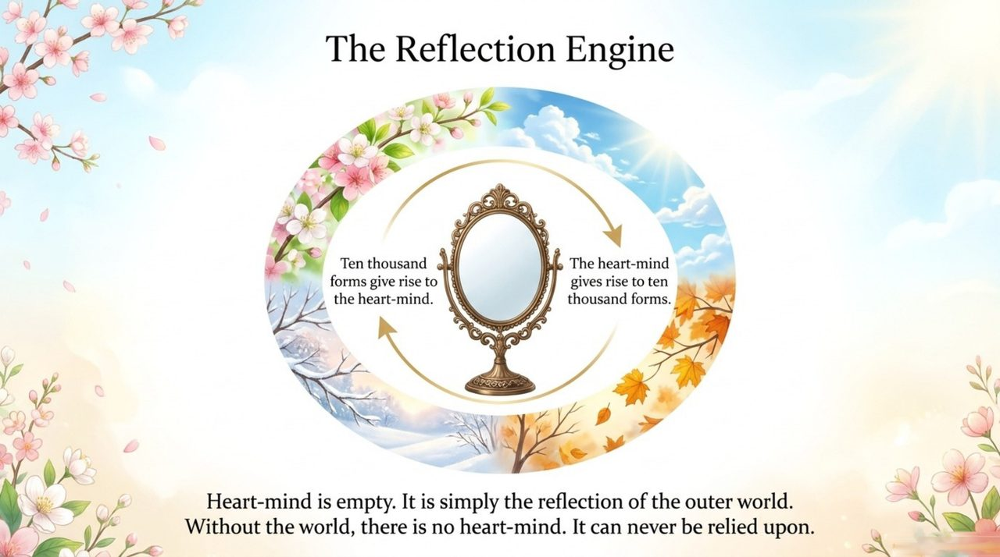
    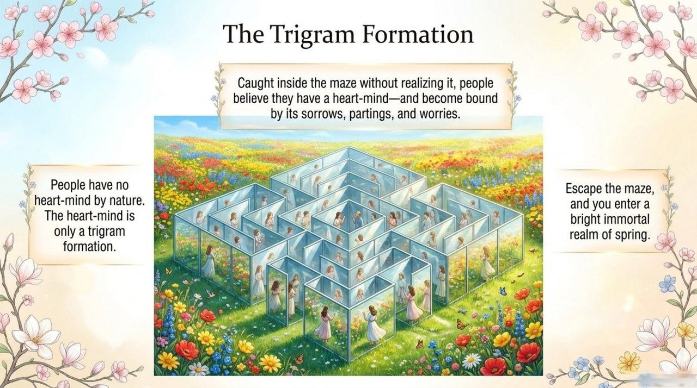
    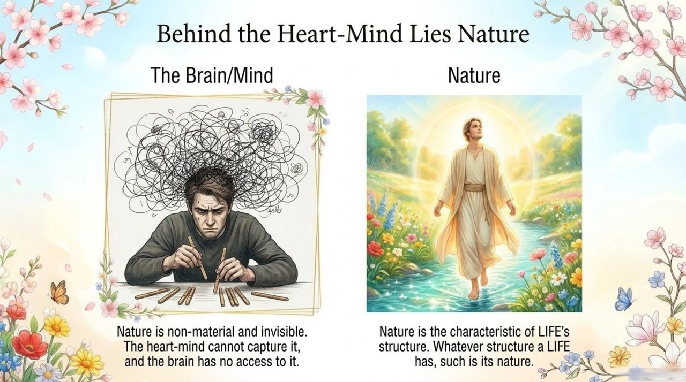
    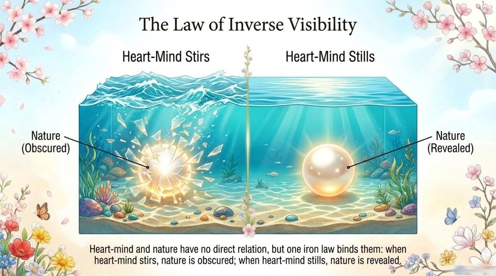
    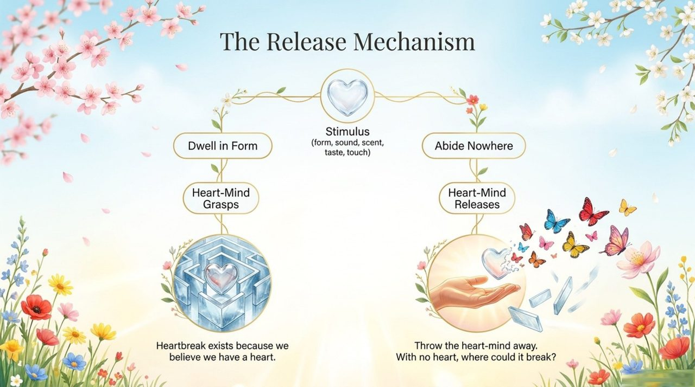
    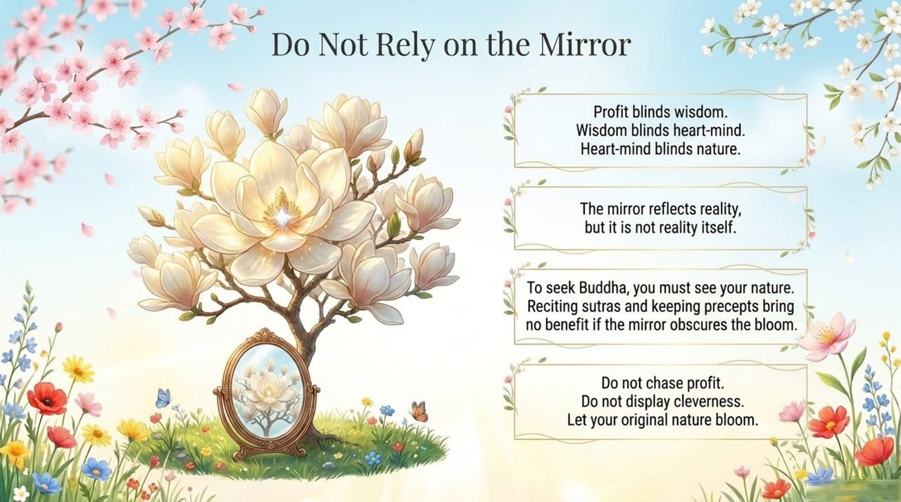
    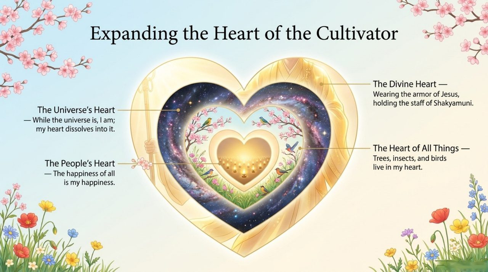
    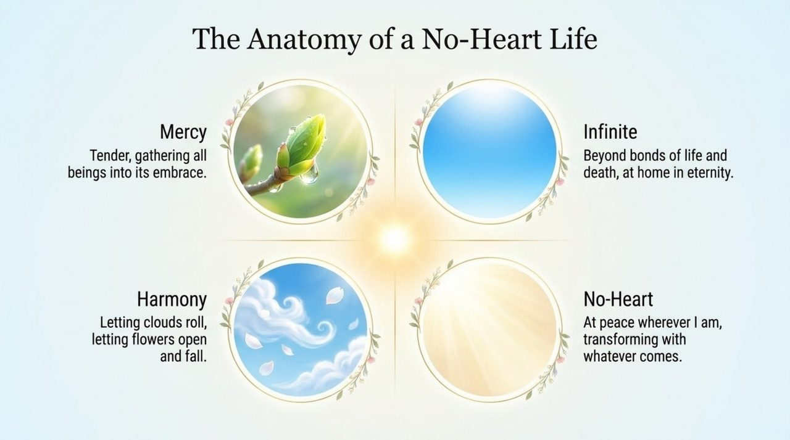
    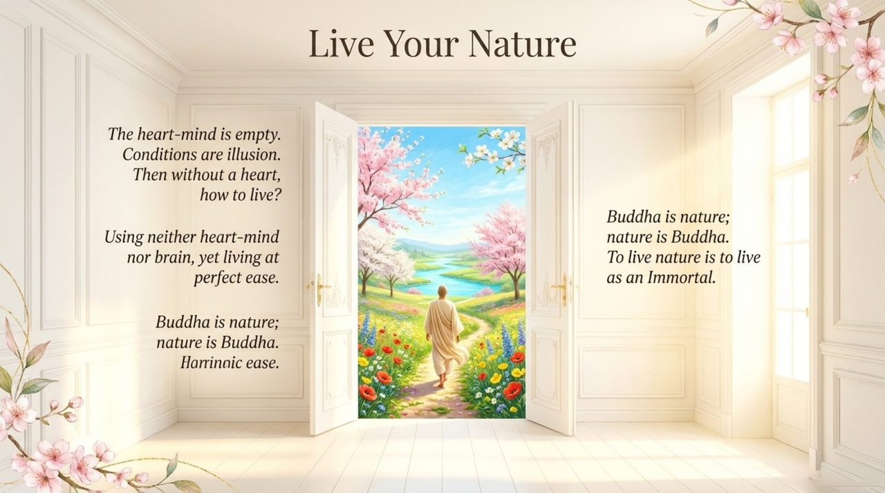

| Edition | Best for | Link |
|---------|----------|------|
| Friendly | First-time readers, everyday language | [Read Friendly Edition](/en/heart-mind/friendly/) |
| Academic | Researchers, source analysis, systematic study | [Read Academic Edition](/en/heart-mind/academic/) |
| Internal | Chanyuan Celestials, full primary-source citations | [Read Internal Edition](/en/heart-mind/internal/) |

---

**Related Entries**

[Consciousness](/en/consciousness/) · [Thinking (Overview)](/en/thinking-overview/) · [Ling (Spirit-Force)](/en/ling-spirit/) · [Antimatter Structure](/en/antimatter-structure/) · [Illuminate the Mind, See the Nature](/en/illuminate-mind-see-nature/) · [Soul](/en/soul/) · [Free Will](/en/free-will/) · [Eight No-Realms](/en/eight-no-realms/)
