<!-- id: LC-HH-0001-EN theme: Cultivation type: Entry lang: en -->

# Heart-to-Heart (Soul Communion)

> **A glance, a gesture, an expression, a movement, a single word — and a door of boundless brilliance opens, like a living poem… Space dissolves, time ceases, only the spirit flashing and the soul floating remain, boundless bliss, without limit, without hunger or thirst, without fatigue, the mind without abiding, the mind without hindrance — indescribable, unspeakable in its joy. This is heart-to-heart.**
>
> — Xue Feng, Life Chanyuan Corpus, "Heart-to-Heart," 2012-9-23

---

Heart-to-heart (*xīn líng shén jiāo* 心灵神交) is the supreme form of soul communion — not the flow of information between two souls, but the complete fusion of two souls into one. It transcends distance, transcends time, transcends matter. It is one of the highest states of connection that life can achieve.

Heart-to-heart has one condition: the complete resonance of vibrational frequencies. It is therefore not a technique to be learned but the natural fruit of cultivation — the spontaneous emergence that occurs when a being's spiritual elevation reaches a certain height.

---

## Version Guide

| Version | Best For | Link |
|---------|----------|------|
| Friendly | First encounter, want to feel it first | [→ Friendly Version](friendly.md) |
| Academic | Systematic conceptual framework | [→ Academic Version](academic.md) |
| Internal | Deep study with full source texts | [→ Internal Reference](internal.md) |

---

## Video

<iframe style="width:100%;aspect-ratio:4/3;border:0" src="https://www.youtube-nocookie.com/embed/Eevqh9XPSuw" title="Heart-to-Heart (Lifechanyuan Encyclopedia video)" allowfullscreen></iframe>

## Slides

??? info "📖 Illustrated slides (14 pages, click to expand)"

    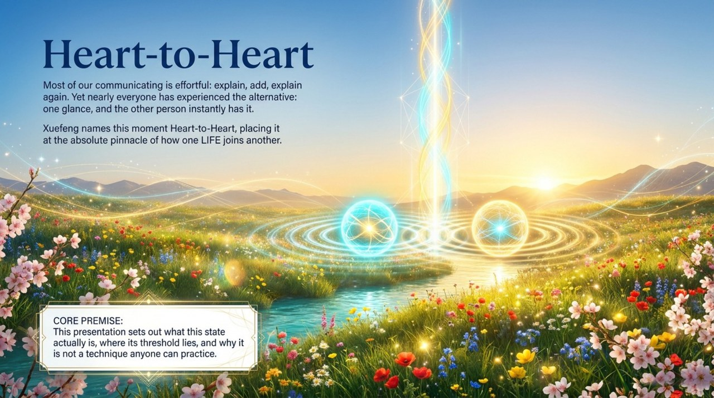
    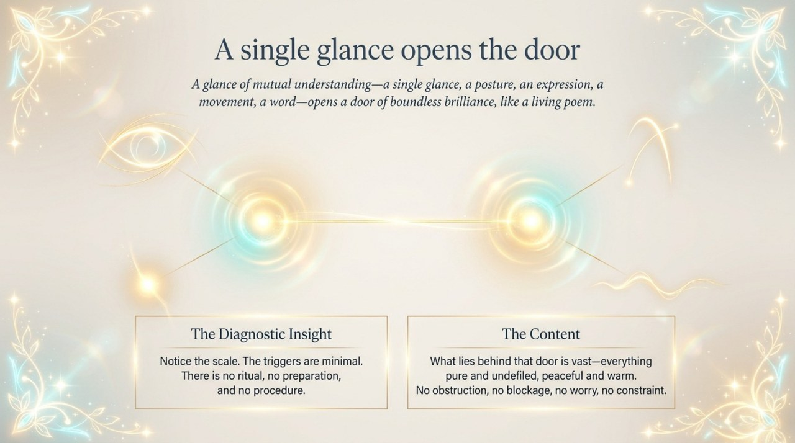
    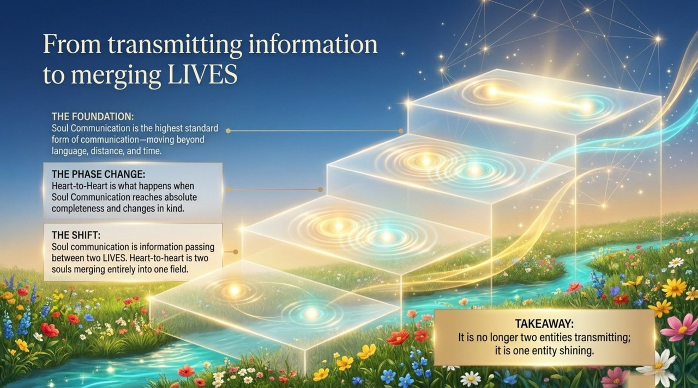
    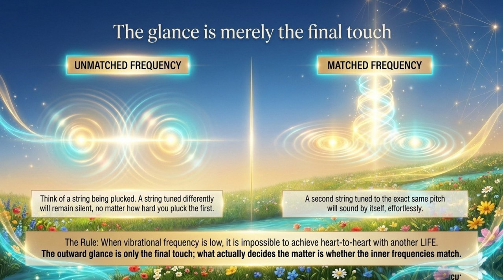
    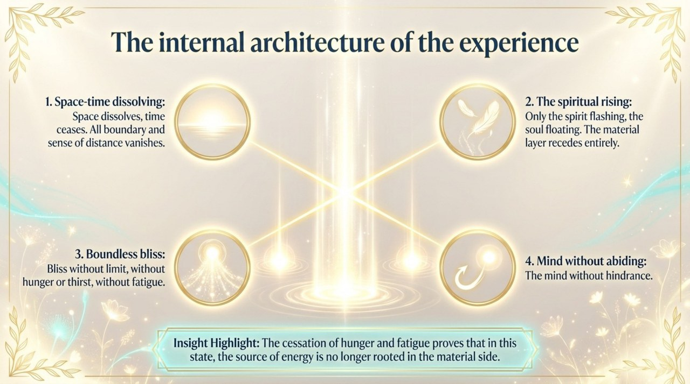
    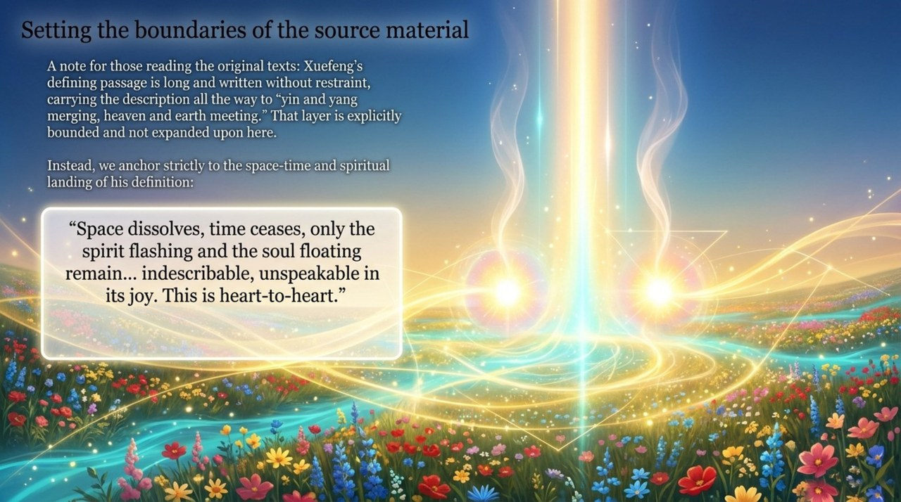
    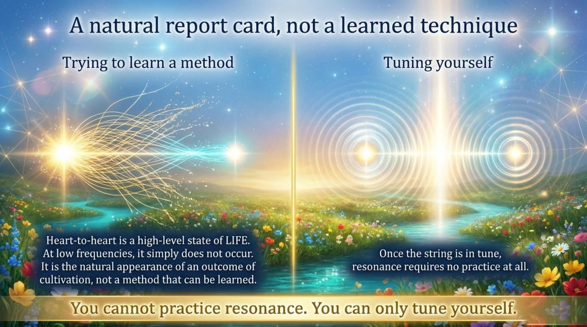
    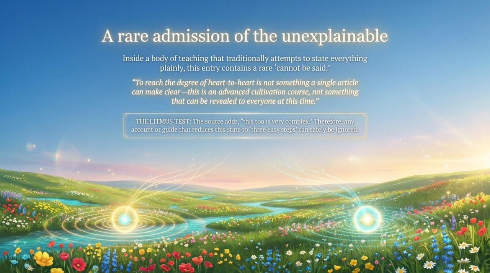
    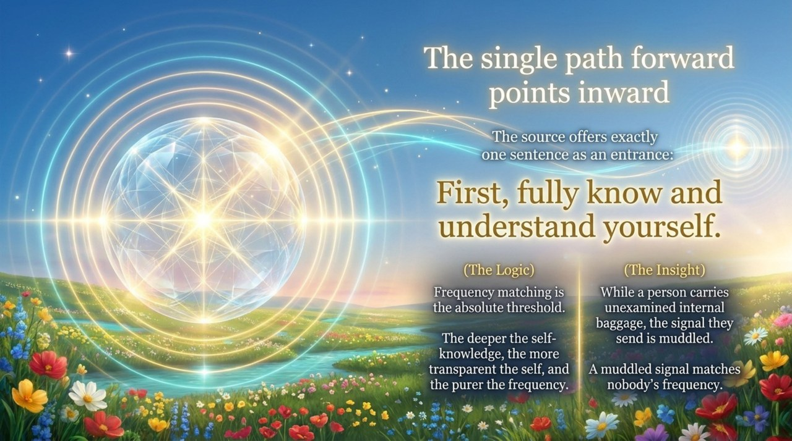
    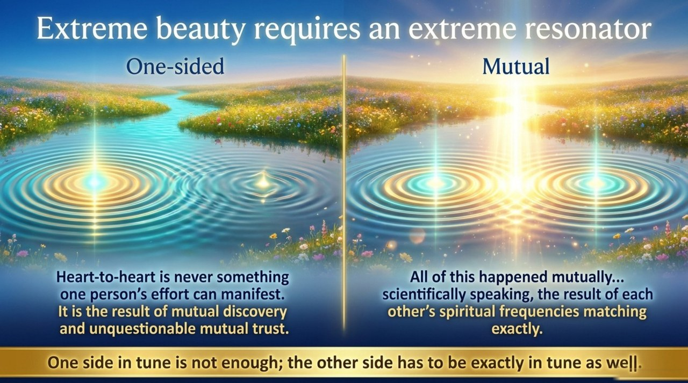
    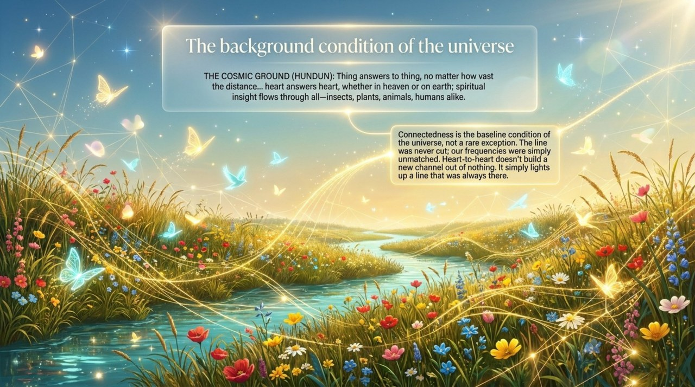
    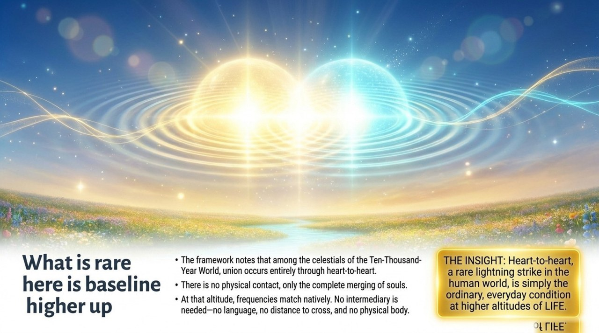
    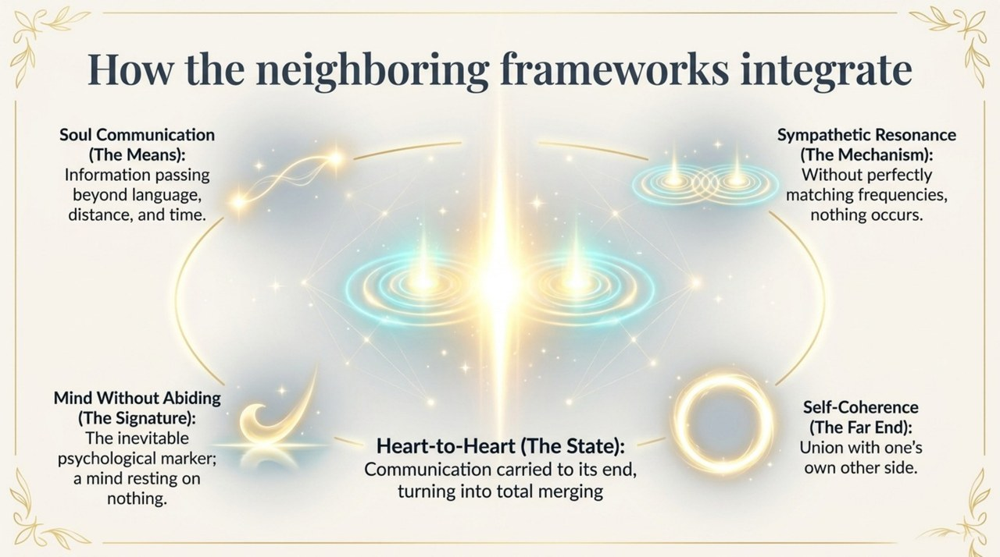
    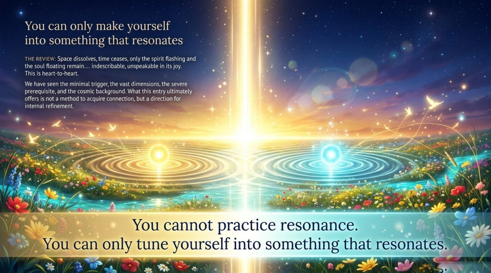

---

## Related Entries

[Soul Communication](/en/soul-communication/) · [Sympathetic Resonance](/en/resonance/) · [Elysian Bliss · Peak Experience](/en/jilemiaojing/) · [Mind Without Abiding · Mind Without Hindrance](/en/xinwu-suozhu-guaai/) · [Ten-Thousand-Year World](/en/ten-thousand-year-world/) · [Raise Vibrational Frequency](/en/raise-vibration-frequency/)
