---
title: Heavenly Bank
slug: heavenly-bank
---

# Heavenly Bank

The **Heavenly Bank** is a core metaphor in the Lifechanyuan system, referring to the cosmic "account" in which each life accumulates merit (spiritual credit) on its journey toward the celestial realms. Rooted in Jesus Christ's teaching in Matthew 6:19-20 — "Do not store up for yourselves treasures on earth … store up for yourselves treasures in heaven" — the concept is integrated with the universal law that the sum of positive and negative energies in the cosmos equals zero, making every act of selfless giving cosmically guaranteed. Having a sufficient balance in one's Heavenly Bank account is one of the three necessary conditions for entering the Kingdom of Heaven (the Thousand-Year World, the Ten-Thousand-Year World, or the Celestial Islands Continent). F-Coin is the visible, real-world ledger of one's Heavenly Bank deposits.

> "To reach the border of the Kingdom of Heaven only to be told you have not a single deposit in the Heavenly Bank — that is a fate to guard against now, not at life's end."
>
> — Xuefeng, *Plan a Hundred Years Ahead, Lest the Moment of Truth Leave You Helpless*, 2023

| Version | Best for | Focus |
|---------|----------|-------|
| [Friendly version](friendly.md) | First-time readers | What is the Heavenly Bank? How do you make deposits? Why is every contribution guaranteed? |
| [Academic version](academic.md) | Researchers | Cosmic-law foundation, comparative analysis with Buddhist, Christian and Daoist traditions |
| [Internal reference](internal.md) | Deep study | Complete source texts, unchanged |

---

## Video

<iframe style="width:100%;aspect-ratio:4/3;border:0" src="https://www.youtube-nocookie.com/embed/XRO9TDZjUy0" title="Heavenly Bank (Lifechanyuan Encyclopedia video)" allowfullscreen></iframe>

## Slides

??? info "📖 Illustrated slides (14 pages, click to expand)"

    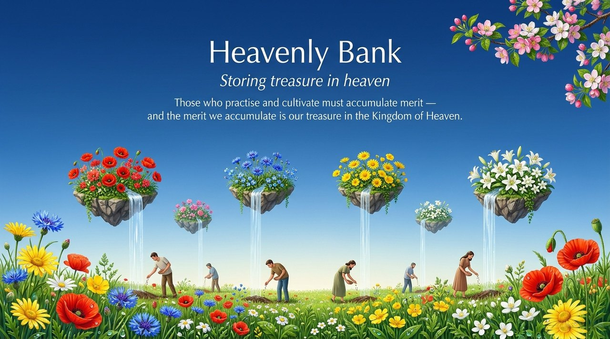
    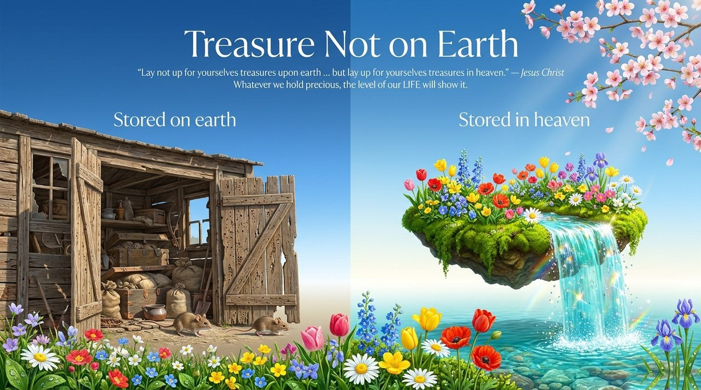
    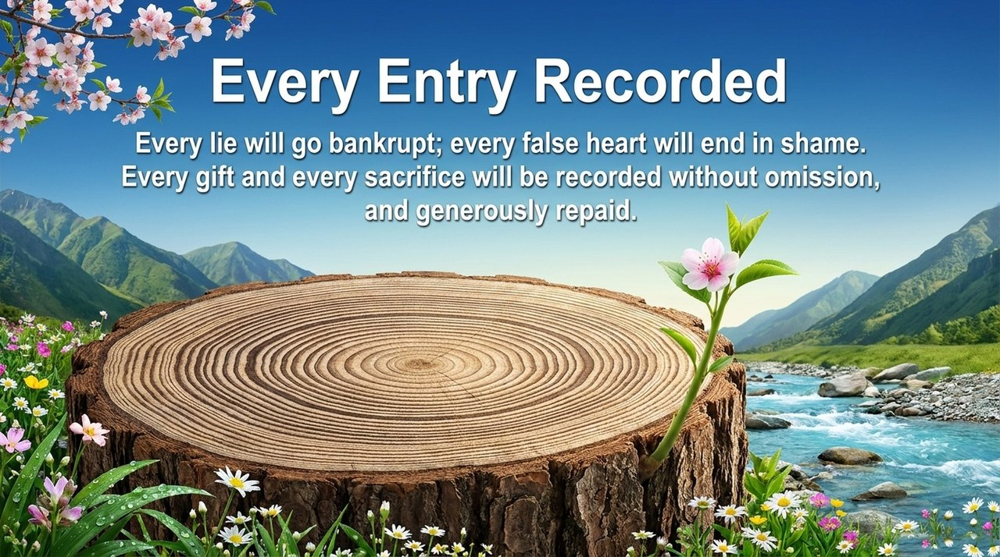
    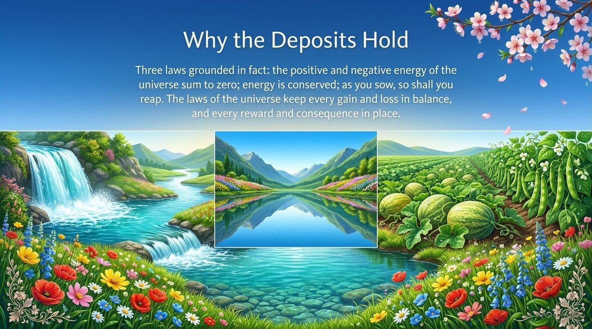
    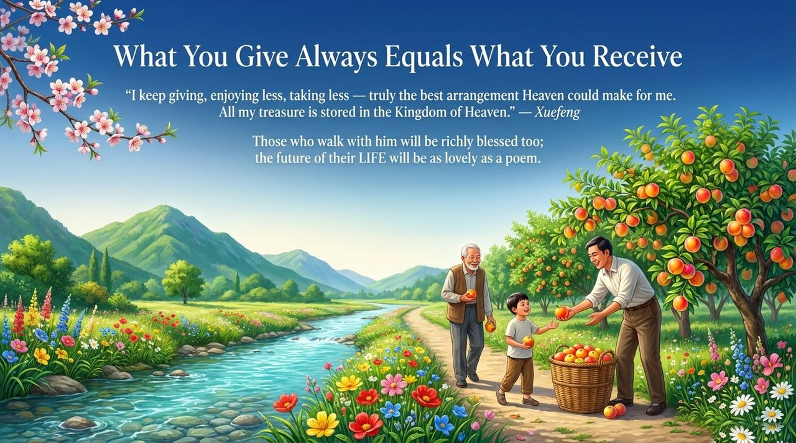
    
    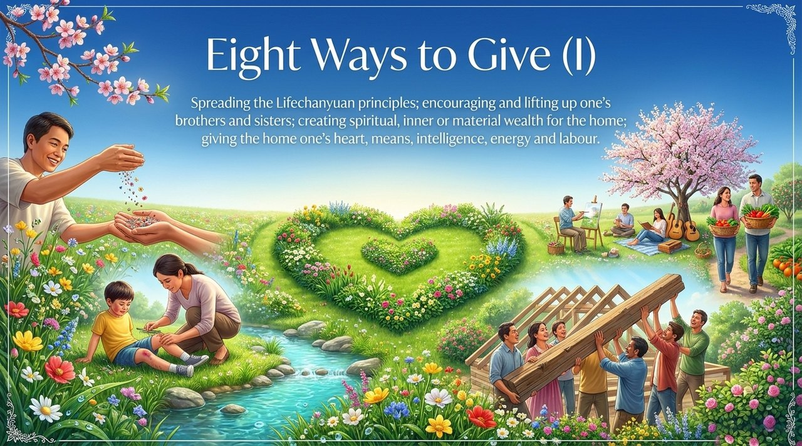
    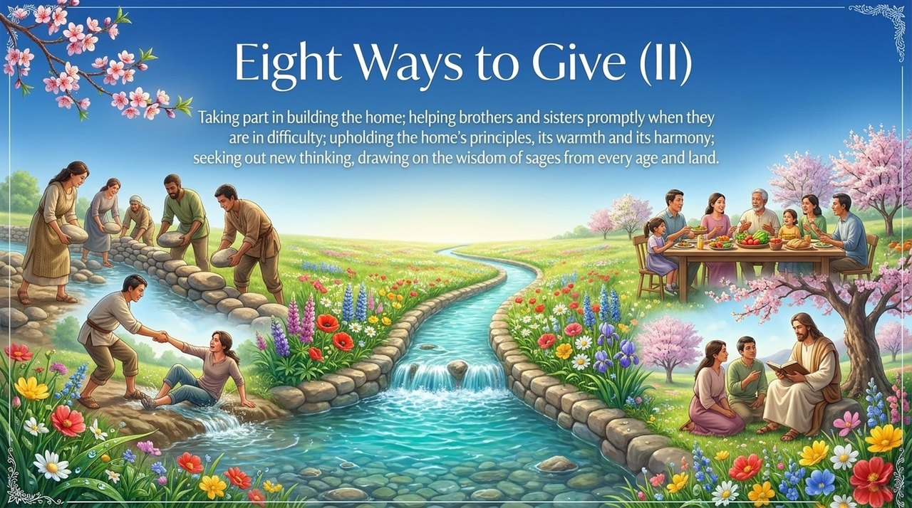
    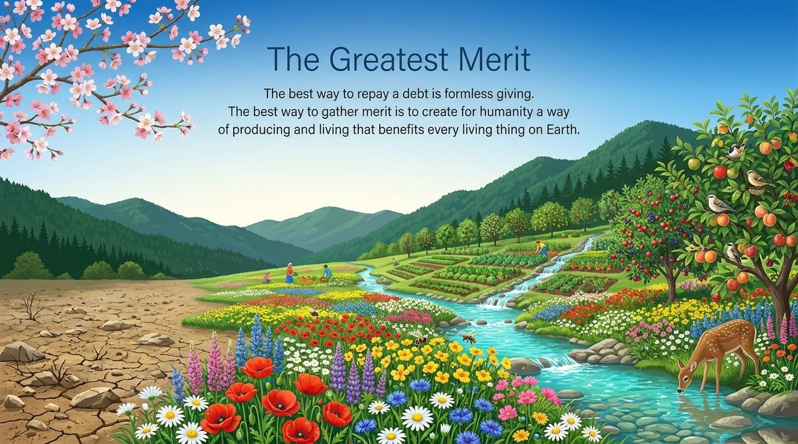
    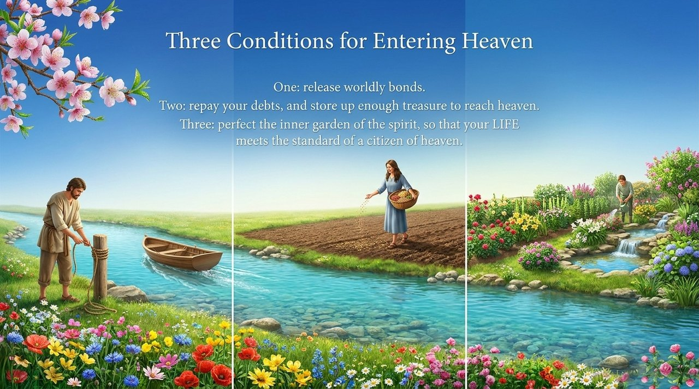
    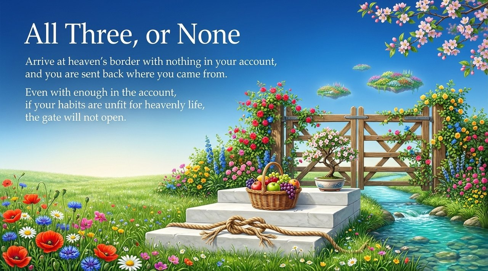
    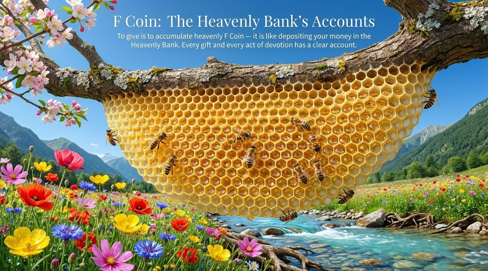
    
    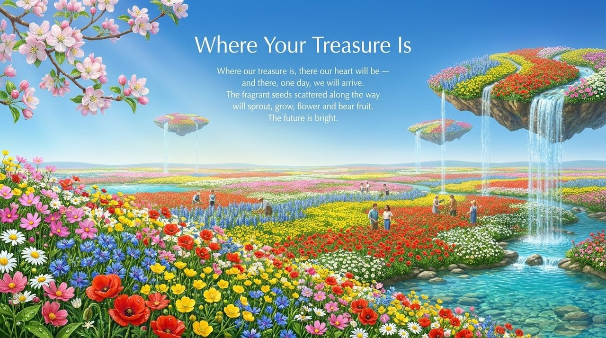

---

## Related entries

[Heavenly Treasures](/en/heavenly-treasures/) · [F-Coin](/en/f-coin/) · [Route to the Kingdom of Heaven](/en/route-to-heaven/) · [Kingdom of Heaven](/en/kingdom-of-heaven/) · [Formless Giving](/en/formless-giving/) · [Karma · Retribution · Reincarnation](/en/karma-retribution-reincarnation/) · [Debt Repayment](/en/debt-repayment/) · [Releasing Worldly Bonds](/en/releasing-worldly-bonds/) · [Life Visa](/en/life-visa/)
