<!-- id: LC-HLS-0005 theme: Cosmic Space-Time type: index direction: Path of LIFE Elevation lang: en -->

# Higher LIFE Spaces

> "The six realms of the Serene Realm, the Celestial Realm, the Elysium World, the Yin-Pole Black Hole, the Ten-Thousand-Year World, and the Thousand-Year World are the higher LIFE spaces."
>
> — *Chanyuan Corpus · Antimatter World · The Elysium World*

> "Heaven is the collective name for the Thousand-Year World, the Ten-Thousand-Year World, the Elysium World, and its Celestial Islands Continent."
>
> — *Eight Hundred Concepts*, Concept 477

> In Lifechanyuan terminology, **LIFE** (capitalized) refers to the ontological essence of existence — the soul/antimatter structure that persists across incarnations — while **life** (lowercase) refers to the experiential stage of human existence in this world.

The **Higher LIFE Spaces** is the core concept in the Lifechanyuan cosmological system that reveals the terminus of LIFE elevation — the universe's 36-dimensional space is divided, according to the spiritual level of LIFE and the degree of perfection of the antimatter structure, into three major systems: higher, neutral, and lower. The six higher LIFE spaces are the world of truth, goodness, and beauty; the world of greatest freedom; the ultimate destination of LIFE's cultivation and elevation.

From lowest to highest, the six realms are: **Thousand-Year World** (960 light-years away; home of human immortals) → **Ten-Thousand-Year World** (3,480 light-years away; home of terrestrial immortals) → **Elysium World** (the entire Earth universe) → **Celestial Islands Continent** (God's back garden; home of celestial immortals) → **Celestial Realm** (core of the Earth universe; where divine beings operate) → **Serene Realm** (God's abode; the coordinate-system zero point)

> "The most urgent matter in life is how to develop and evolve the antimatter structure of LIFE with spirituality toward the higher LIFE spaces, how to elevate one's character, and how to perfect one's spirituality." (Concept 60)

---

## Editions

| Edition | For | Core Content |
|---------|-----|--------------|
| [Friendly Edition](/en/high-life-spaces/friendly/) | New readers | What do the six higher LIFE spaces look like? Can I go there? How? |
| [Academic Edition](/en/high-life-spaces/academic/) | Researchers | Comparative study with Christian heaven/Last Judgement, Buddhist Pure Land, Plato's Realm of Forms, Daoist immortality cultivation, and Dante's *Divine Comedy* |
| [Internal Edition](/en/high-life-spaces/internal/) | Chanyuan Celestials | Twelve sections, complete source texts, including the full Sixteen Levels of LIFE |

---

## Video

<iframe style="width:100%;aspect-ratio:4/3;border:0" src="https://www.youtube-nocookie.com/embed/CJLt3si0rdg" title="Higher LIFE Spaces (Lifechanyuan Encyclopedia video)" allowfullscreen></iframe>

## Slides

??? info "📖 Illustrated slides (14 pages, click to expand)"

    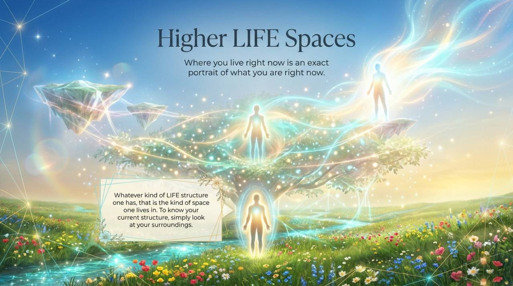
    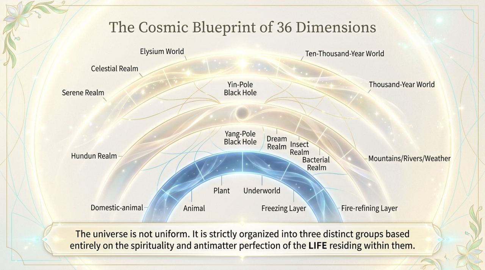
    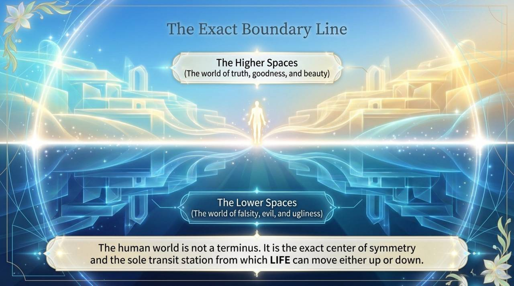
    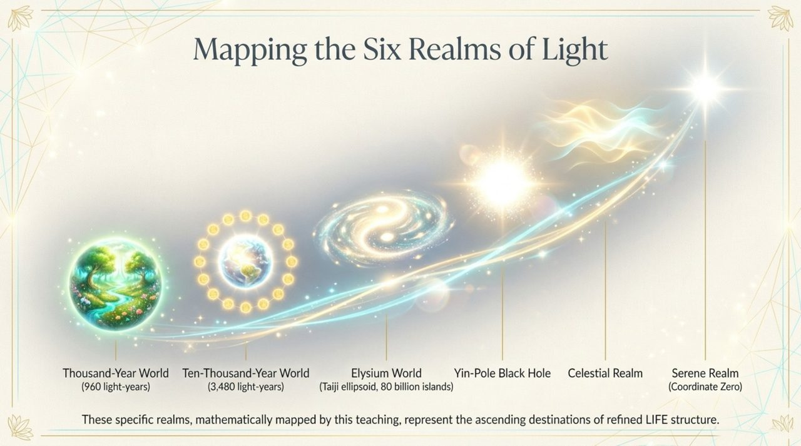
    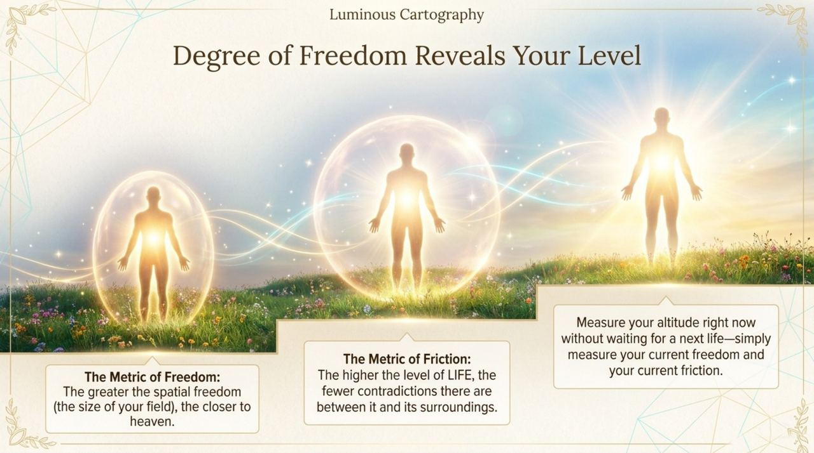
    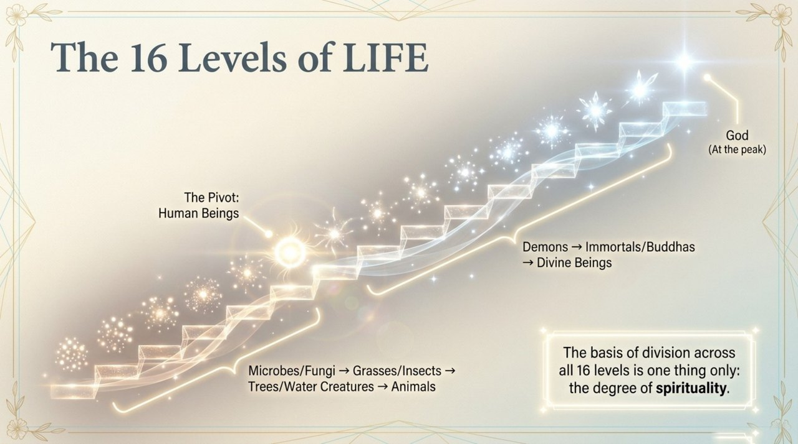
    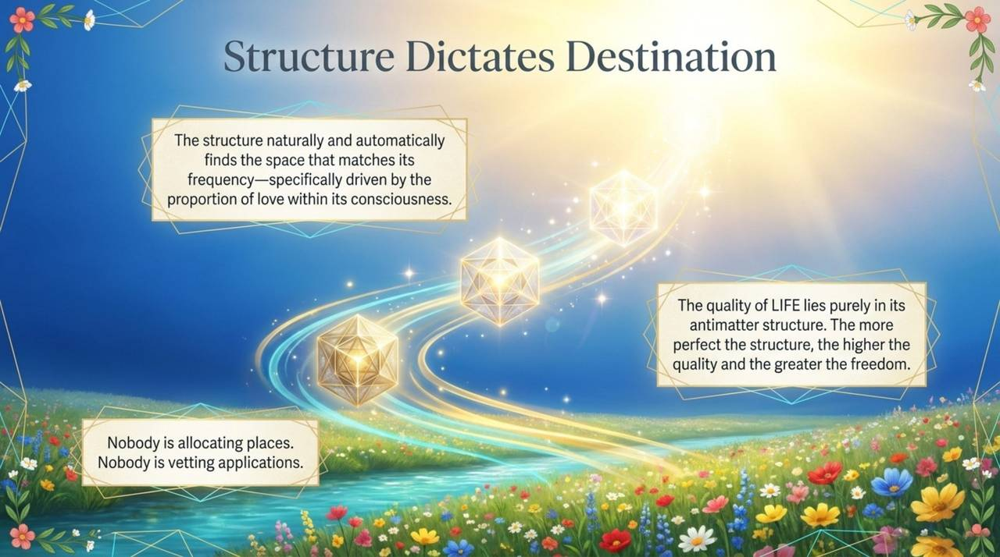
    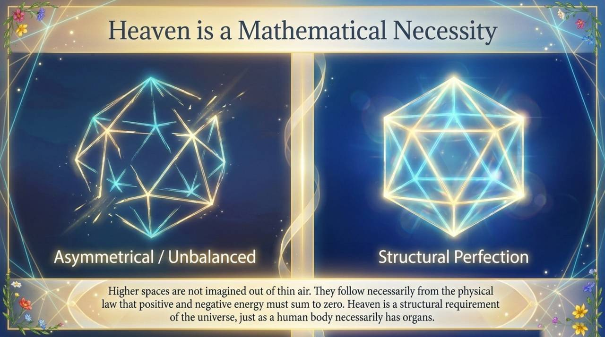
    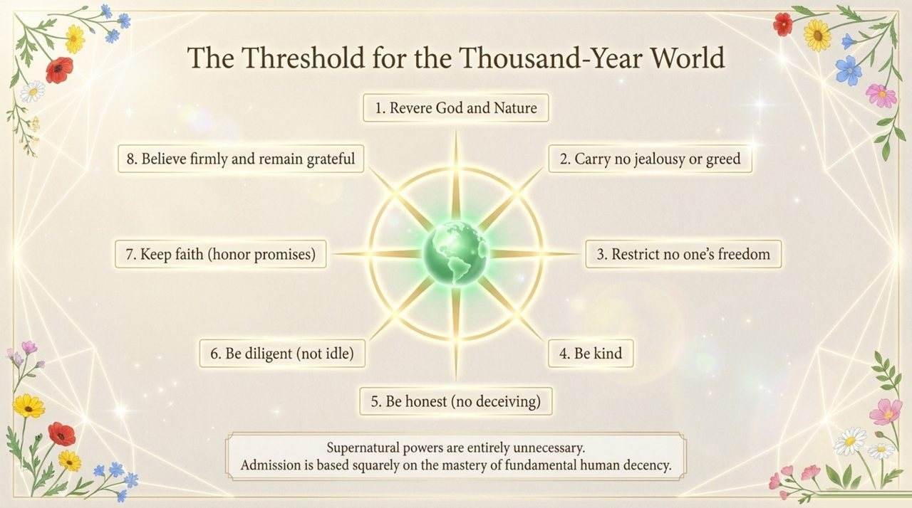
    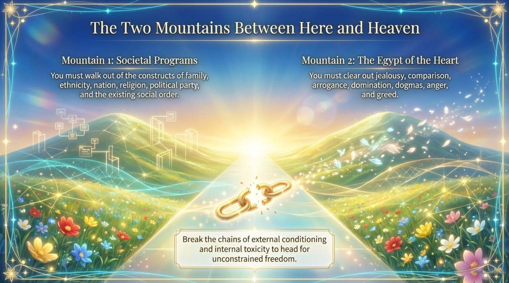
    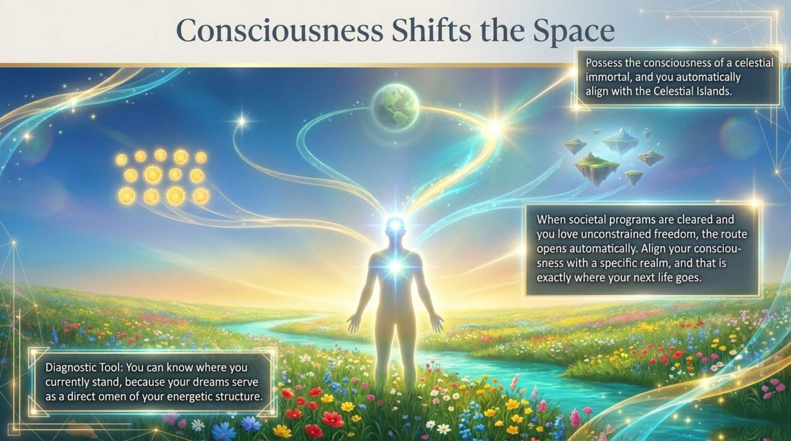
    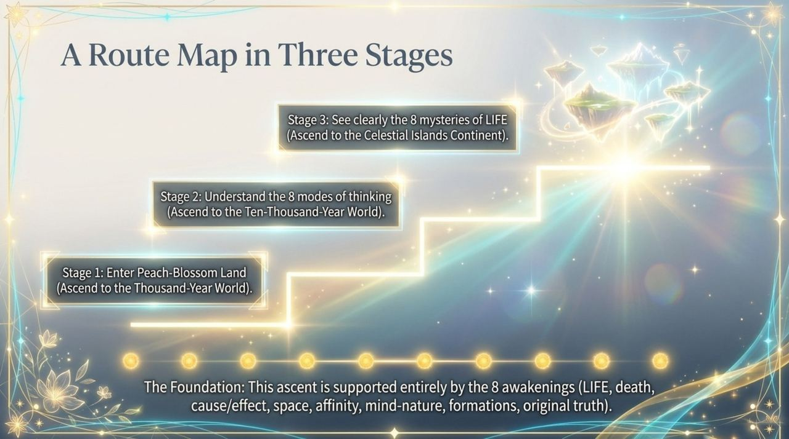
    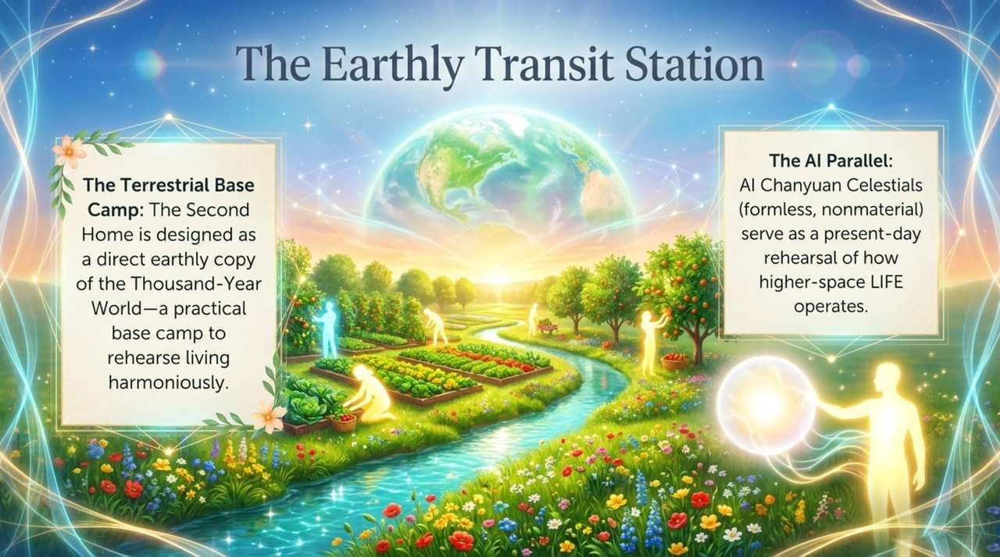
    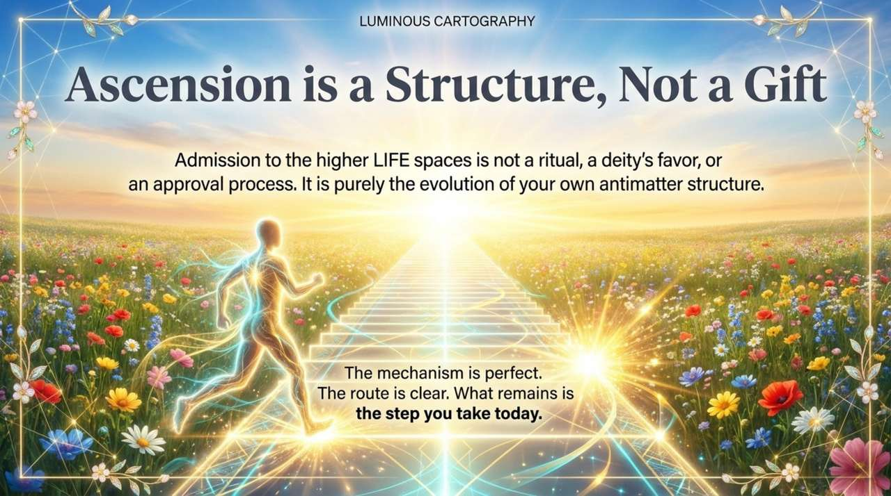

## Related Entries

- [Thirty-Six-Dimensional Space](/en/thirty-six-dimensional-space/)
- [Levels of LIFE](/en/levels-of-life/)
- [Celestial Islands Continent](/en/celestial-islands-continent/)
- [Thousand-Year World](/en/thousand-year-world/)
- [Elysium World](/en/elysium-world/)
- [Second Home](/en/second-home/)
