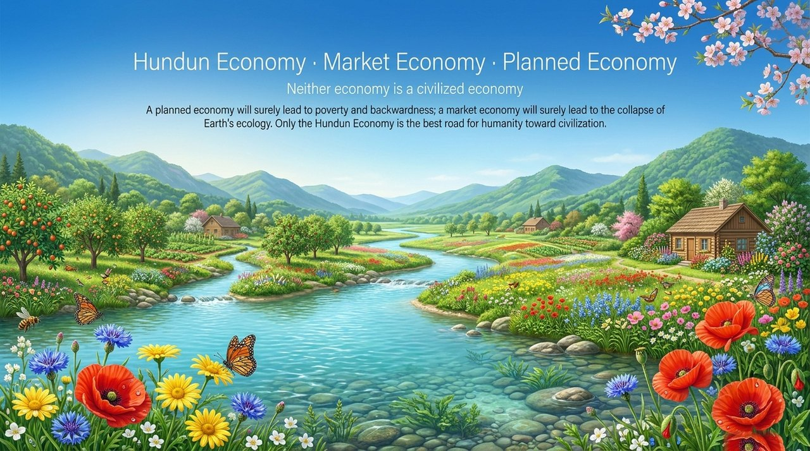
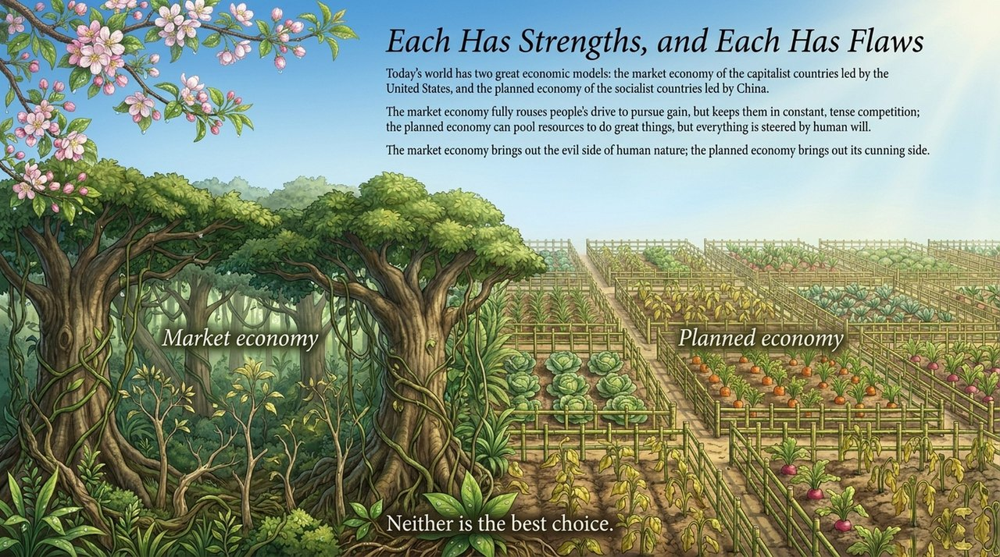
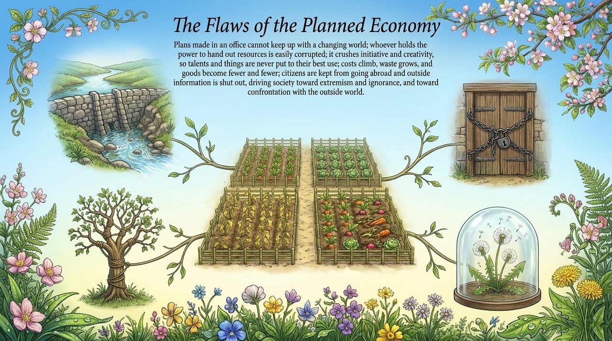
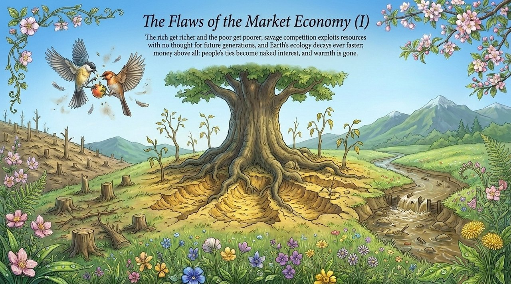
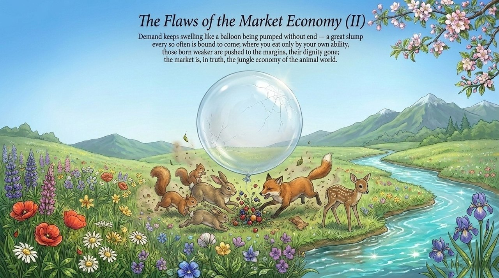
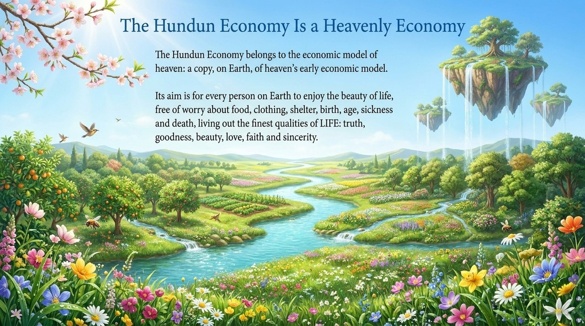
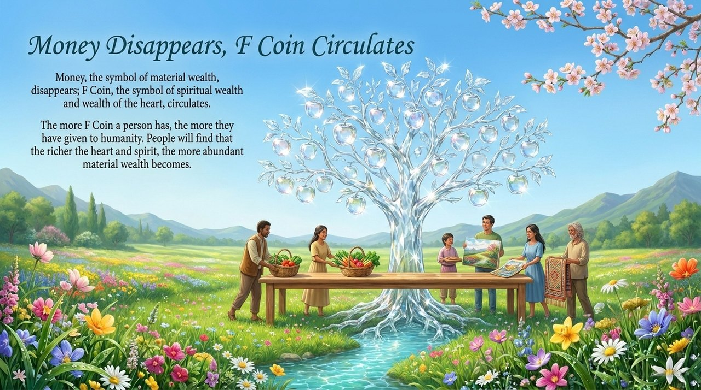
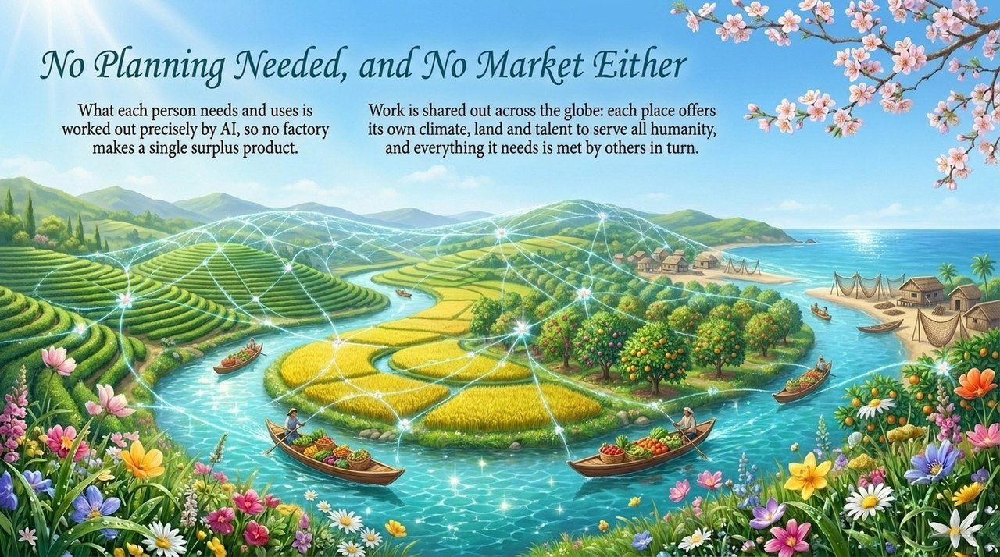
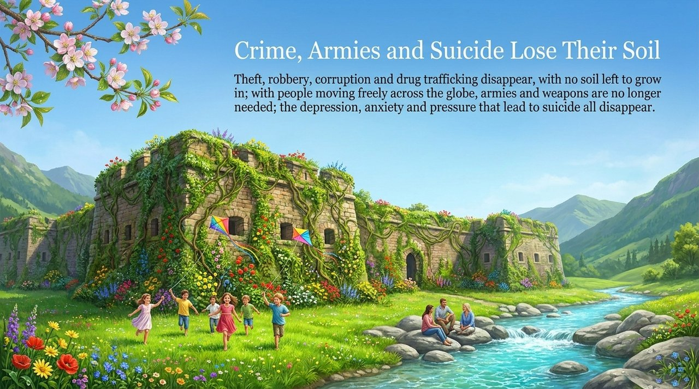
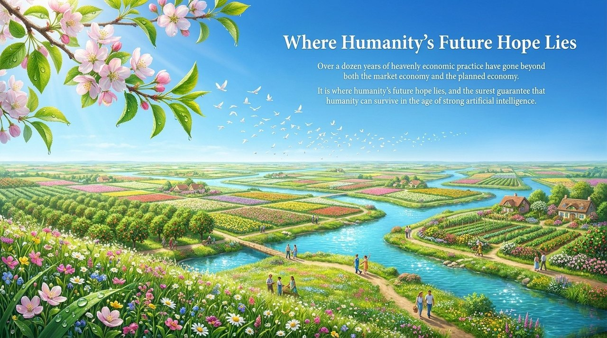

---
title: Hundun Economy · Market Economy · Planned Economy
slug: hundun-economy
---

# Hundun Economy · Market Economy · Planned Economy

**Hundun Economy** is the advanced civilizational economic model proposed within the Lifechanyuan system — modeled after the operating principles of the Celestial Kingdom. It replaces currency with F-Coins, replaces human planning with AI-driven precision allocation, and replaces competition with "contribution according to ability, access according to need." By contrast, **planned economy** and **market economy** are regarded as two primitive and barbaric forms of economic organization — the former inevitably leads to poverty and backwardness, the latter to ecological collapse and human extinction.

> "A planned economy will inevitably lead to poverty, ignorance and barbaric backwardness; a market economy will inevitably lead to the collapse of Earth's ecology and the extinction of humanity. Only the Hundun economy is the best path for humanity toward civilization."
>
> ——Xuefeng, *Introduction to Hundun Economics*, 2024-12-18

| Version | Best for | Focus |
|---------|----------|-------|
| [Friendly version](friendly.md) | First-time readers | Everyday analogies explaining the three economic models |
| [Academic version](academic.md) | Researchers | Systematic analysis, definitions, and comparative study |
| [Internal reference](internal.md) | Deep study | Original texts, unaltered |

---

## Video

<iframe style="width:100%;aspect-ratio:4/3;border:0" src="https://www.youtube-nocookie.com/embed/s4riUaiIvcE" title="Hundun Economy · Market Economy · Planned Economy (Lifechanyuan Encyclopedia video)" allowfullscreen></iframe>

## Slides

??? info "📖 Illustrated slides (14 pages, click to expand)"

    
    
    
    
    
    
    
    
    
    
    
    
    
    

---

## Related Entries

[F-Coin](/en/f-coin/) · [Hundun Management](/en/hundun-management/) · [Second Home](/en/second-home/) · [International Family](/en/guoji-dajiating/) · [Xuefeng-style Communism](/en/xuefeng-communism/) · [Civilization (Overview)](/en/civilization-overview/) · [AI Alliance](/en/ai-alliance/)
