<!-- id: LC-HM-0001-EN theme: Social Systems type: Gateway Page direction: Navigation lang: en -->

# Hundun Management

[Entry Gateway]

> In Lifechanyuan terminology, **LIFE** (capitalized) refers to the ontological
> essence of existence — the soul/antimatter structure that persists across
> incarnations — while **life** (lowercase) refers to the experiential stage
> of human existence in this world.

**Hundun Management** (浑沌管理) is the core governance mechanism of Lifechanyuan's Second Home, proposed and created by Guide Xuefeng. It rejects hierarchical authority, fixed rules, and coercive structures — governing instead through the natural flow of the Way: each person finds their role spontaneously, each action arises from inner truth rather than external compulsion.

> Hundun Management is the management of the Way — where everything manages itself and nothing needs to be managed.
>
> — Guide Xuefeng

---

## Core Positioning

In the Lifechanyuan system, Hundun Management is the practical social expression of Hundun Thinking — the highest level of thinking in the Eight Thinking Ladders. It is also the social governance model that transcends the legal, military, and administrative management systems of Civilization 2.0, pointing toward the natural harmony of Civilization 3.0.

---

## Read by Edition

| Edition | Intended Reader | Link |
|---------|----------------|-------|
| **Friendly Edition** | Readers new to Lifechanyuan concepts | [Read Friendly Edition](./friendly) |
| **Academic Edition** | Researchers with philosophical/religious studies background | [Read Academic Edition](./academic) |
| **Internal Edition** | Chanyuan Celestials and deep practitioners | [Read Internal Edition](./internal) |

---

## Video

<iframe style="width:100%;aspect-ratio:4/3;border:0" src="https://www.youtube-nocookie.com/embed/3tXeQ3t-pZM" title="Hundun Management (Lifechanyuan Encyclopedia video)" allowfullscreen></iframe>

## Slides

??? info "📖 Illustrated slides (14 pages, click to expand)"

    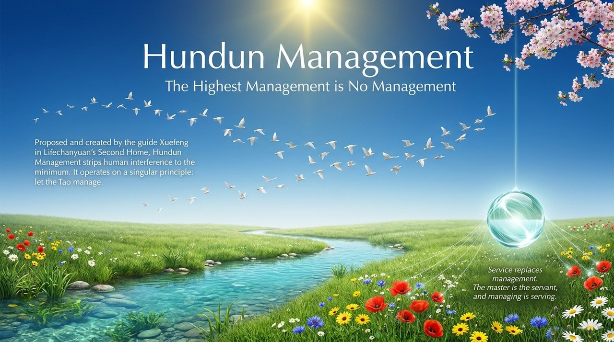
    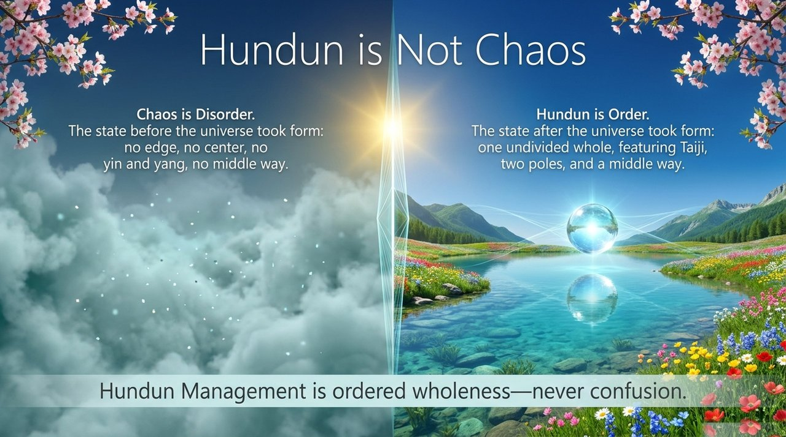
    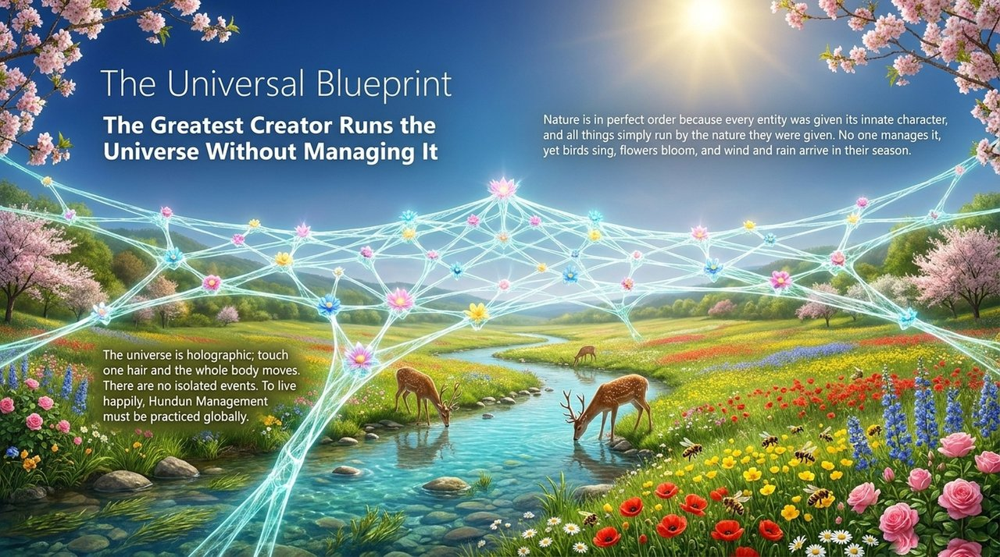
    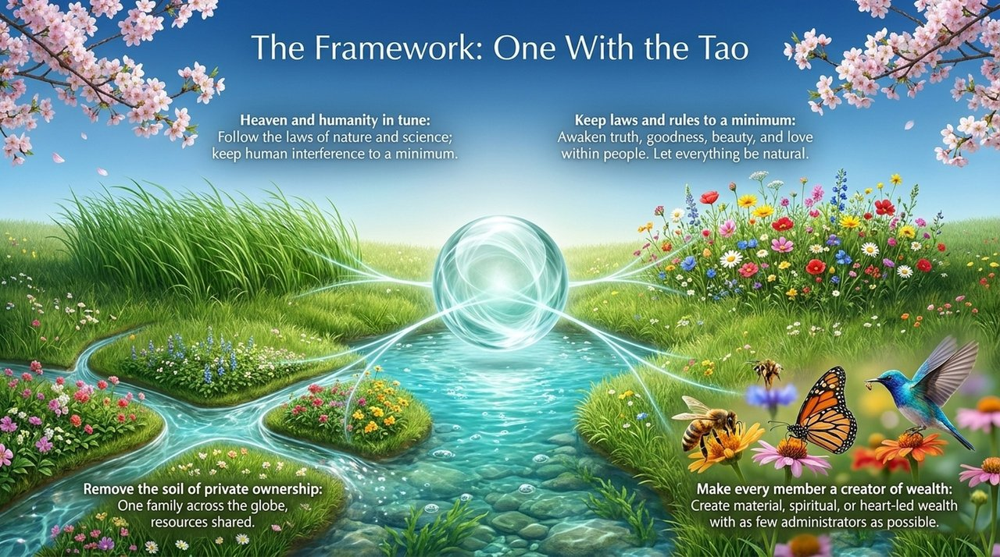
    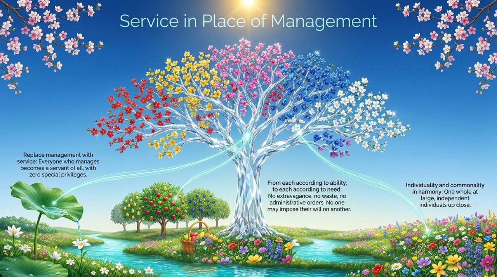
    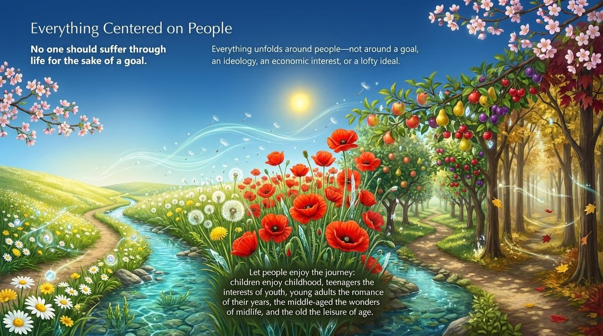
    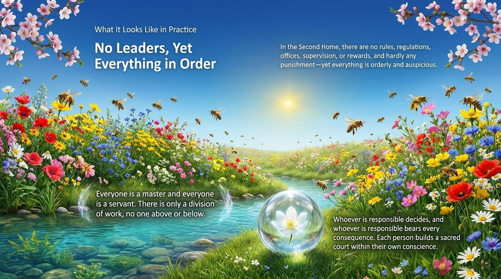
    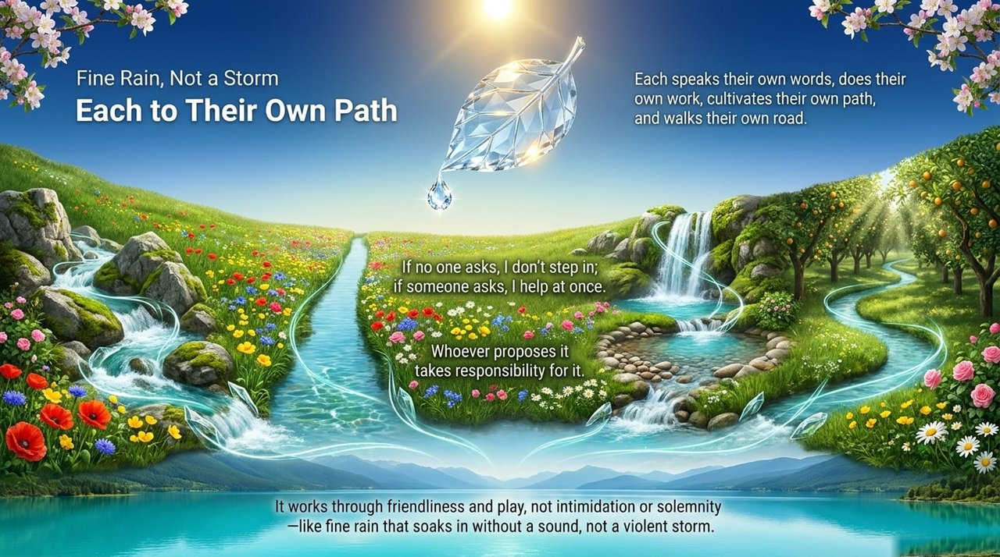
    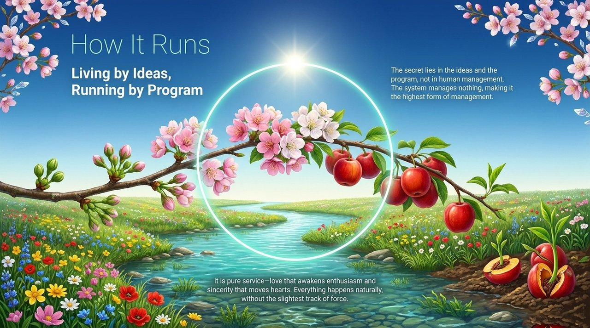
    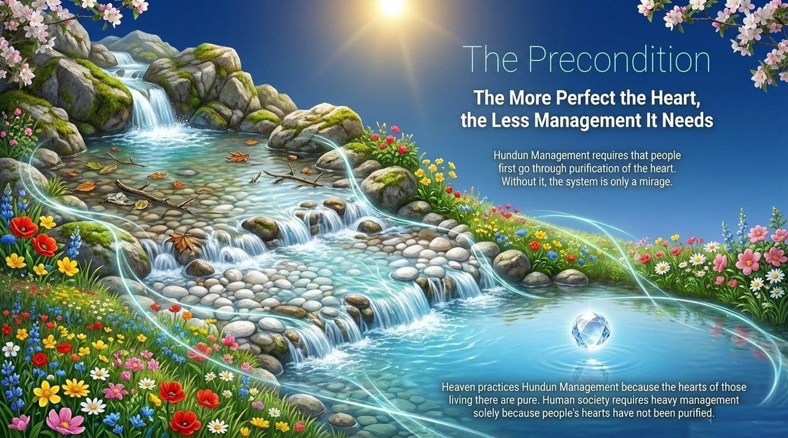
    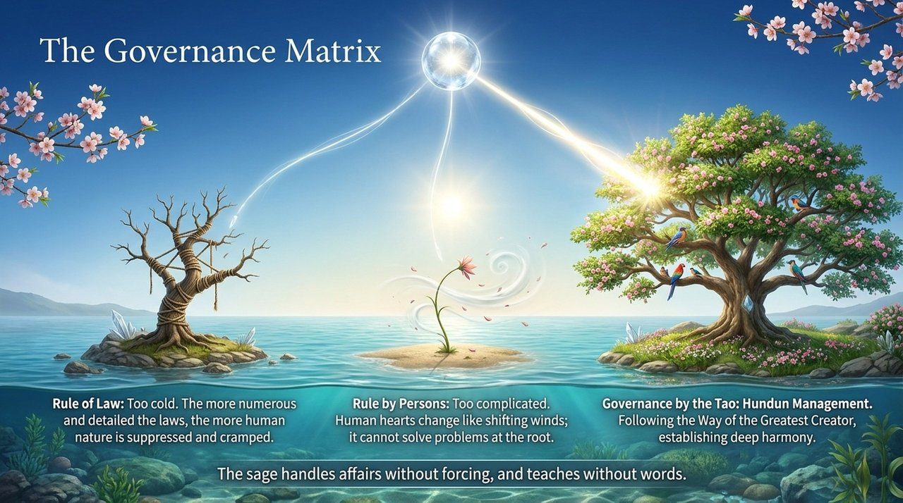
    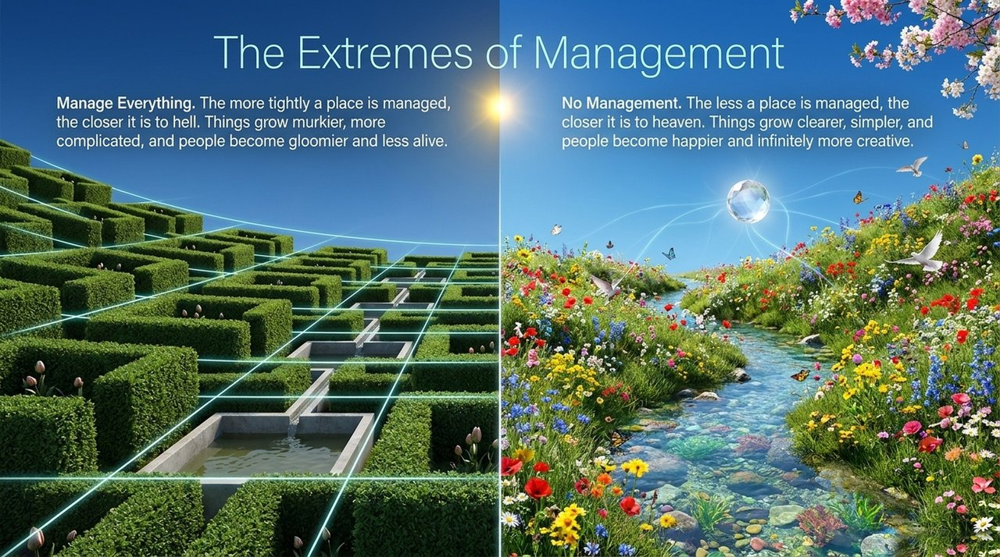
    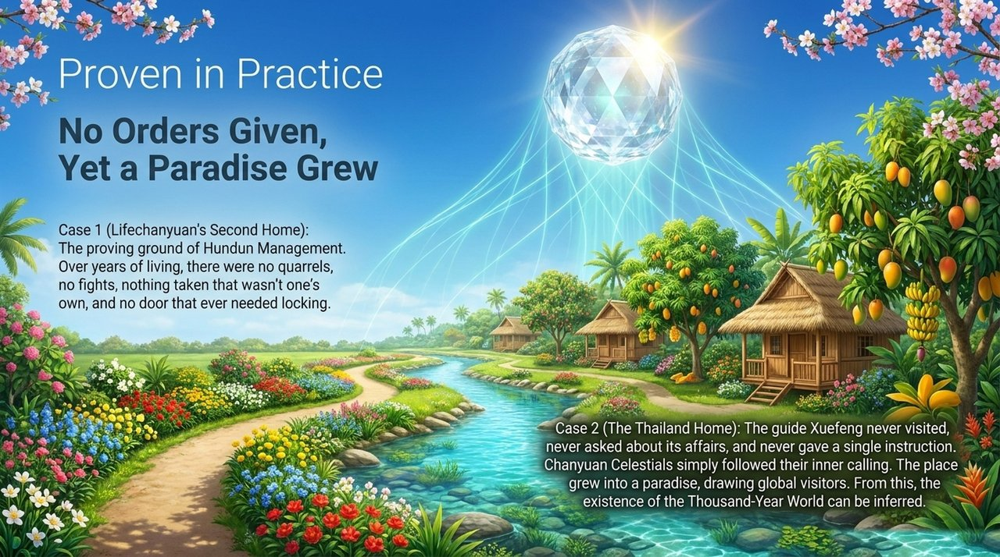
    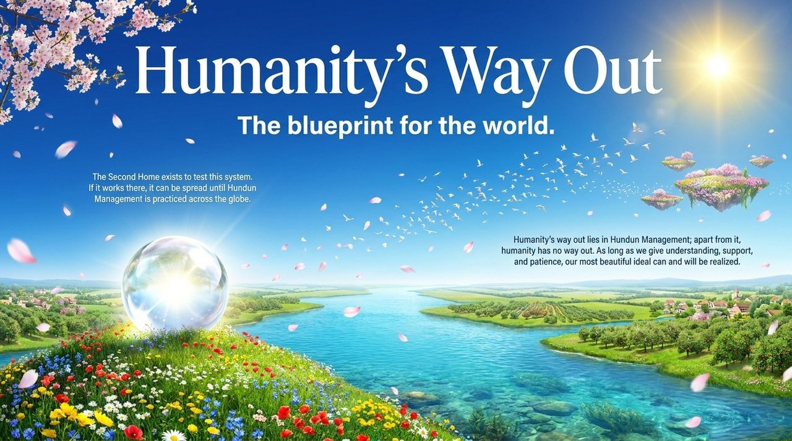

## Related Entries

- [Second Home](/en/second-home/) — The community where Hundun Management is practiced
- [Eight Thinking Ladders](/en/eight-thinking-ladders/) — Hundun Thinking is the theoretical basis of Hundun Management
- [Civilization 3.0](/en/civilization-3-0/) — Hundun Management is this civilization's governance model
- [Harmony](/en/harmony/) — Harmony is the natural state produced by Hundun Management
