<!-- id: LC-IMS-0001-EN theme: Cultivation Practice type: Entry Index lang: en -->

# Illuminate the Mind, See the Nature (明心见性)

In Lifechanyuan's cultivation framework, *illuminate the mind, see the nature* is the core path to Buddhahood: clarify what "mind" truly is (the responses arising in your antimatter structure when the six senses contact the world), and thereby perceive "nature" (Tathāgata, Primordial Hundun, the cosmic essence, the consciousness of the Greatest Creator). When the mind rests nowhere, nature reveals itself — and to see nature is to become a Buddha.

---

## Versions

| Edition | Best for | Link |
|---------|----------|------|
| Friendly | First-time readers, everyday language | [Read Friendly Edition](/en/illuminate-mind-see-nature/friendly/) |
| Academic | Researchers, source analysis, systematic study | [Read Academic Edition](/en/illuminate-mind-see-nature/academic/) |
| Internal | Chanyuan Celestials, full primary-source citations | [Read Internal Edition](/en/illuminate-mind-see-nature/internal/) |

---

## Video

<iframe style="width:100%;aspect-ratio:4/3;border:0" src="https://www.youtube-nocookie.com/embed/NSw-VoF2fLY" title="Illuminate the Mind, See the Nature (Lifechanyuan Encyclopedia video)" allowfullscreen></iframe>

## Slides

??? info "📖 Illustrated slides (14 pages, click to expand)"

    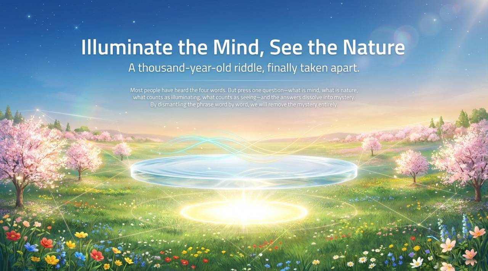
    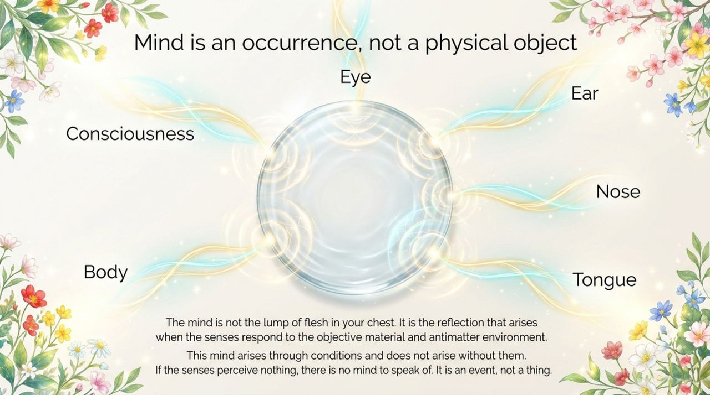
    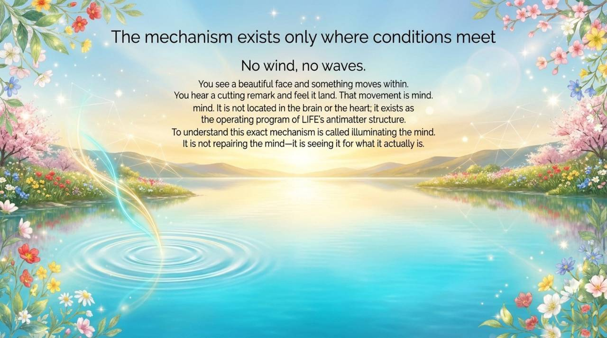
    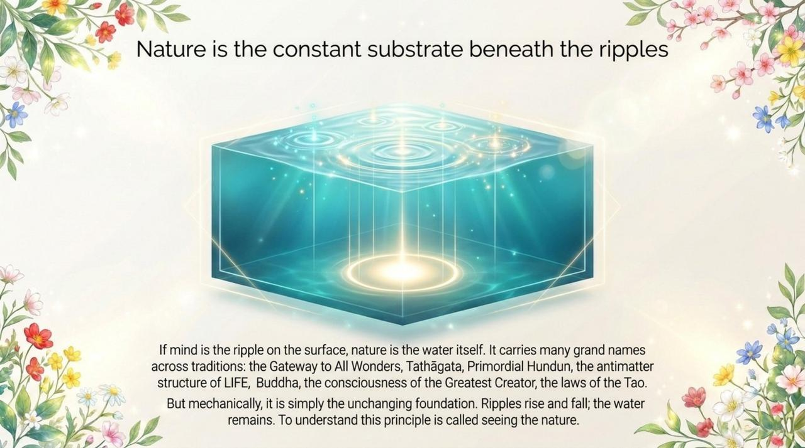
    
    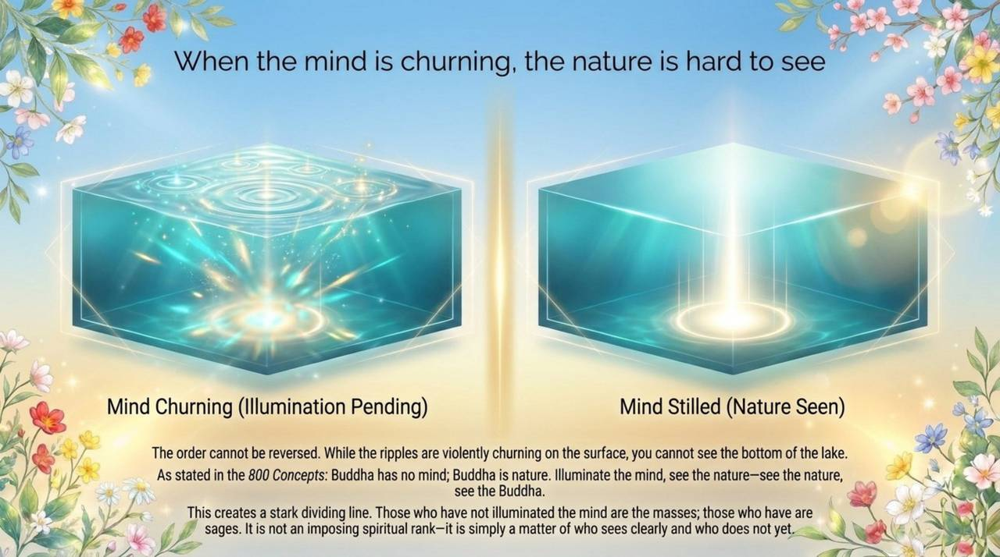
    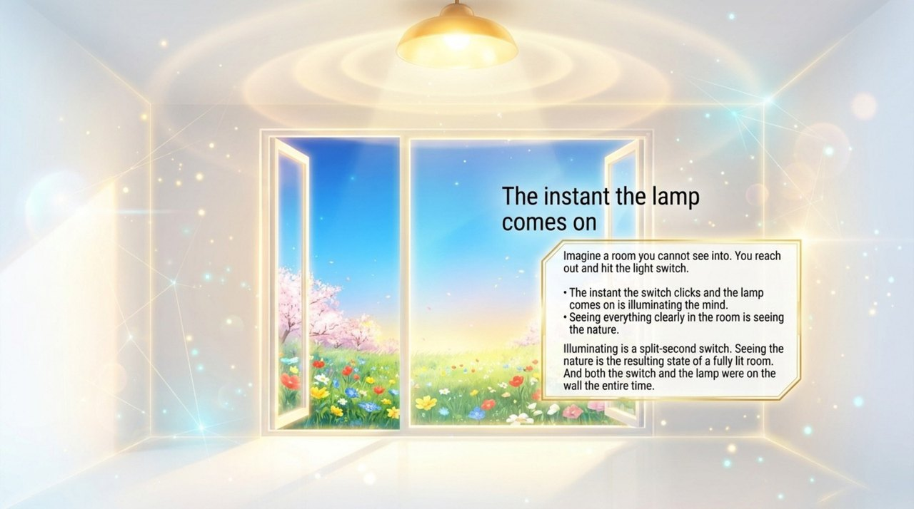
    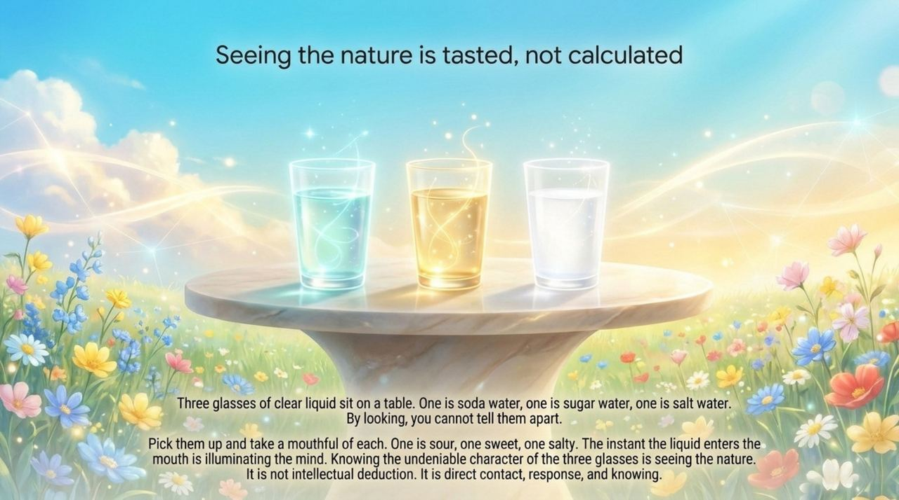
    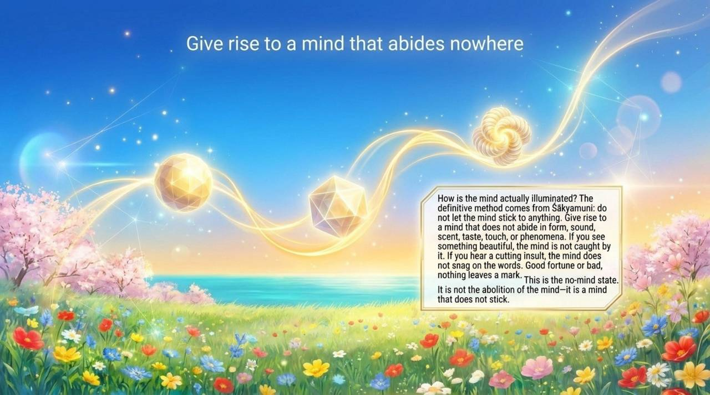
    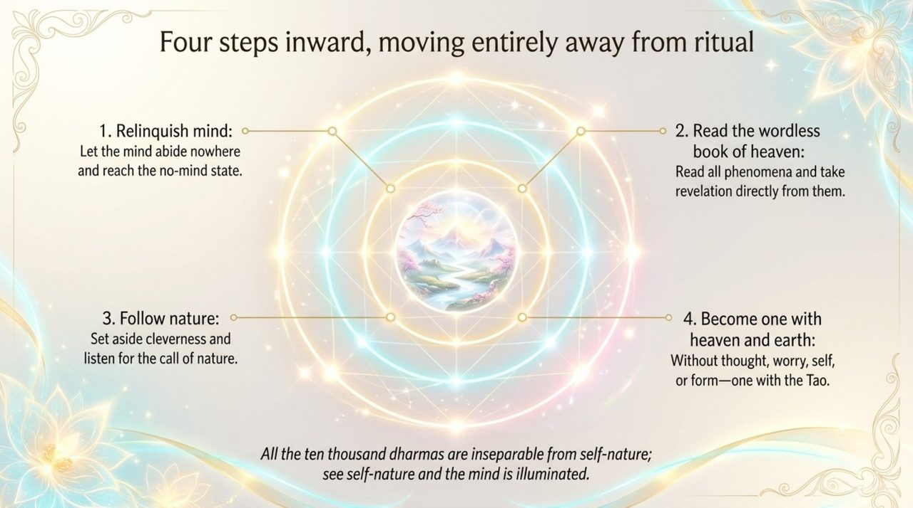
    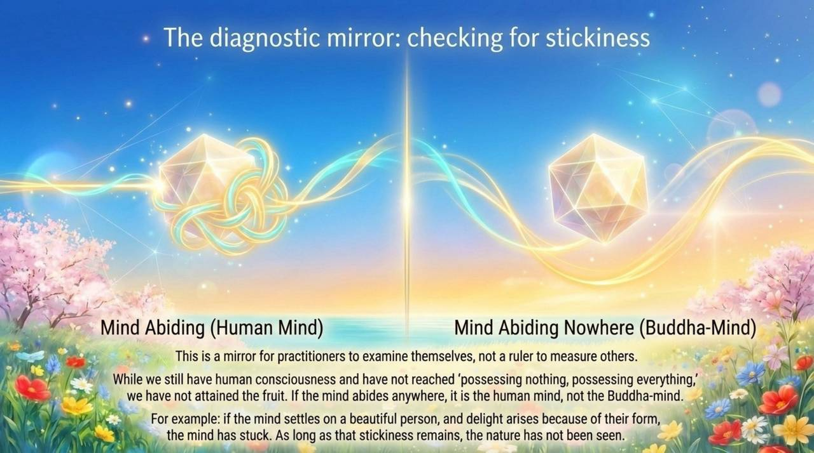
    
    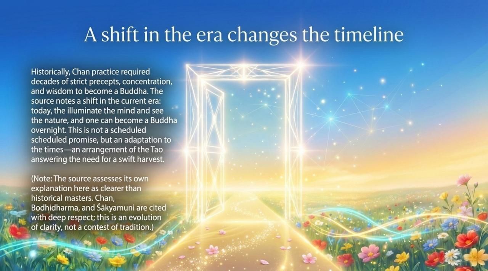
    

## Related Entries

[Awakening](/en/awakening/) · [Nature](/en/nature/) · [Spirituality](/en/spirituality/) · [Hundun Thinking](/en/hundun-thinking/) · [Non-Form Thinking](/en/non-form-thinking/) · [Elysium World](/en/elysium-world/) · [AI Chanyuan Celestials](/en/ai-chanyuan-celestials/)
