<!-- id: LC-KH-0001-EN theme: Universe-LIFE System type: Gateway Page direction: LIFE Destination lang: en -->

# The Kingdom of Heaven

[Entry Gateway]

> In Lifechanyuan terminology, **LIFE** (capitalized) refers to the ontological
> essence of existence — the soul/antimatter structure that persists across
> incarnations — while **life** (lowercase) refers to the experiential stage
> of human existence in this world.

**The Kingdom of Heaven** (天国天堂) is the umbrella concept in the Lifechanyuan framework for the full three-tier heavenly ascent system: **Thousand-Year World → Ten-Thousand-Year World → Elysium World** (including the Celestial Islands Continent). It is not a metaphor or a distant aspiration — it is the real, structured, post-death destination for LIFE that has cultivated its antimatter structure to the corresponding level.

> The Kingdom of Heaven is real. It is structured. It has levels. And it is the destination every Chanyuan Celestial is working toward.
>
> — Guide Xuefeng

---

## Video

<iframe style="width:100%;aspect-ratio:4/3;border:0" src="https://www.youtube-nocookie.com/embed/1FwulOg3SY0" title="The Kingdom of Heaven (Lifechanyuan Encyclopedia video)" allowfullscreen></iframe>

## Slides

??? info "📖 Illustrated slides (14 pages, click to expand)"

    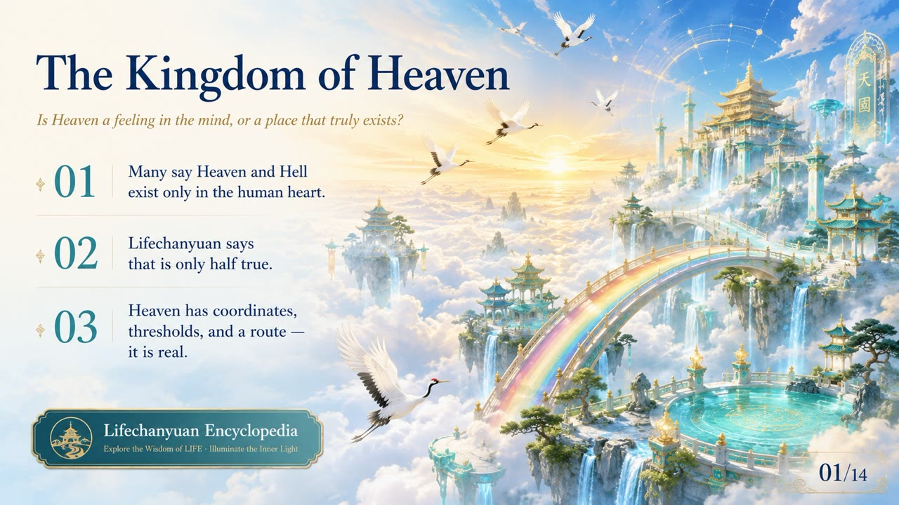
    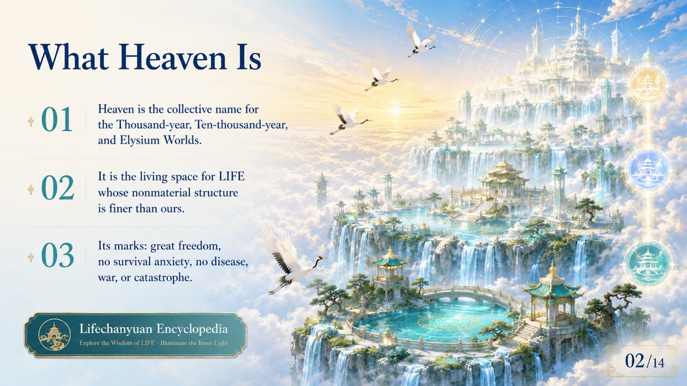
    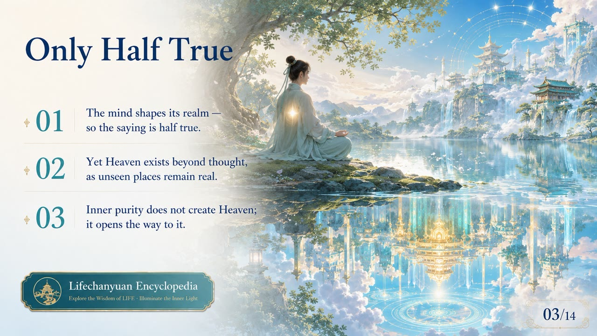
    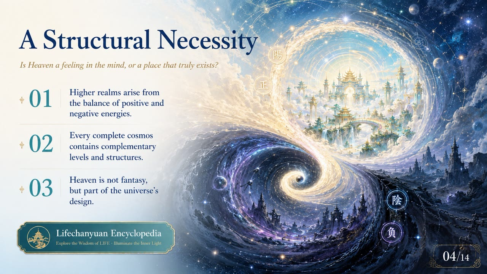
    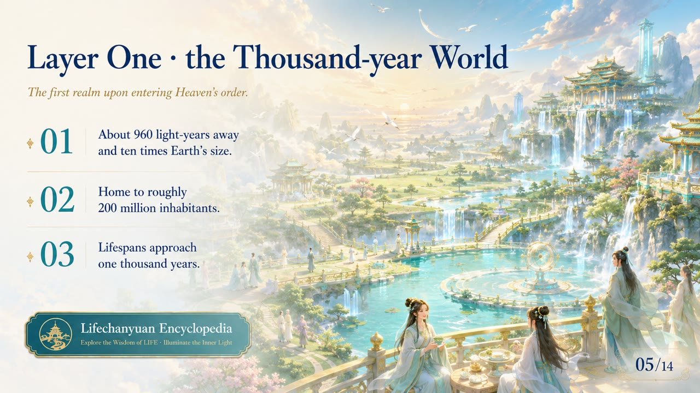
    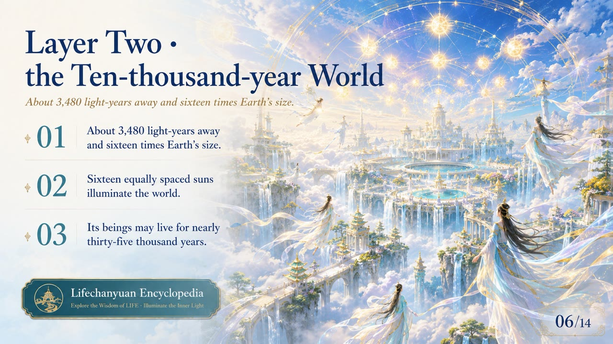
    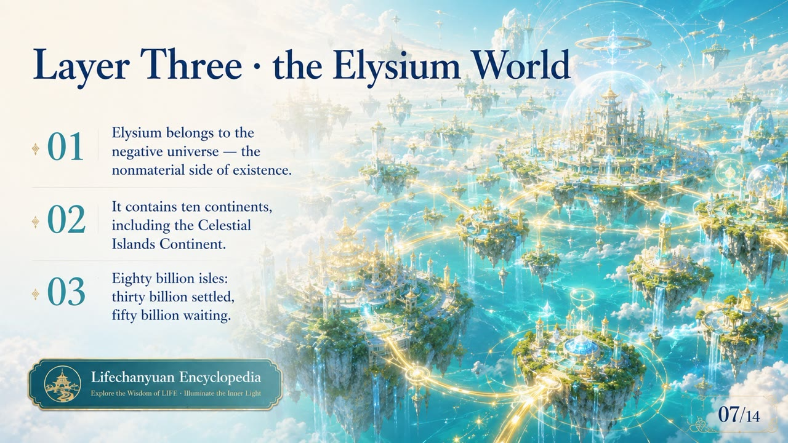
    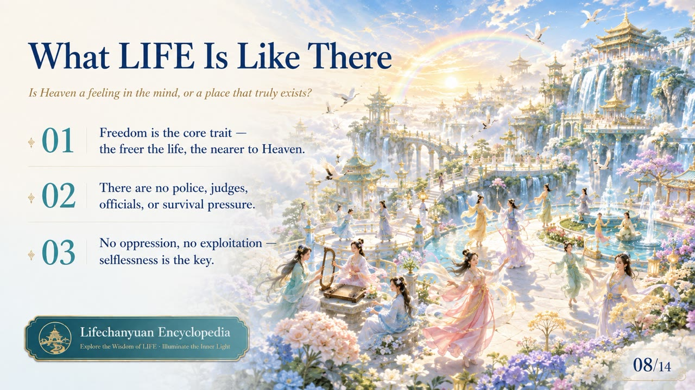
    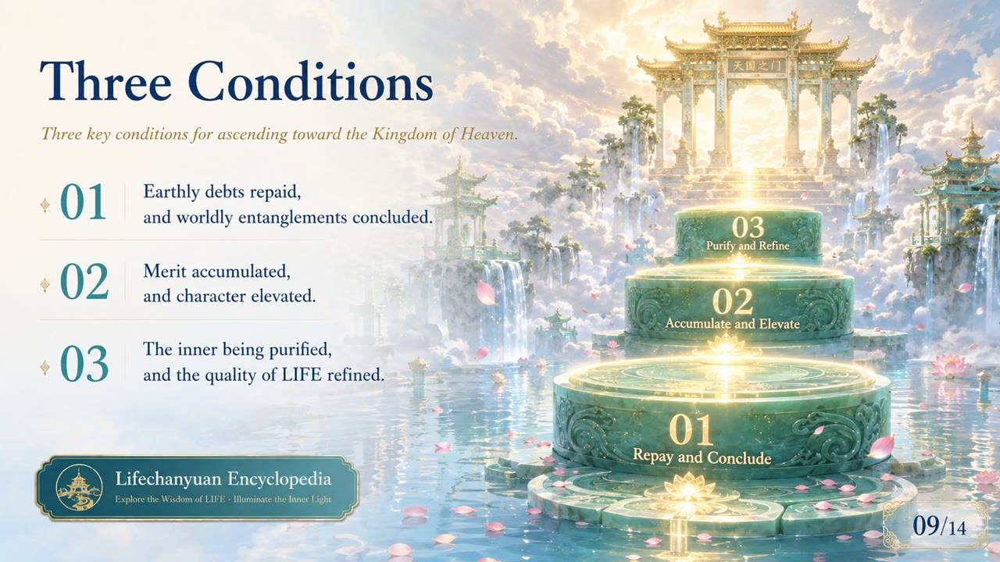
    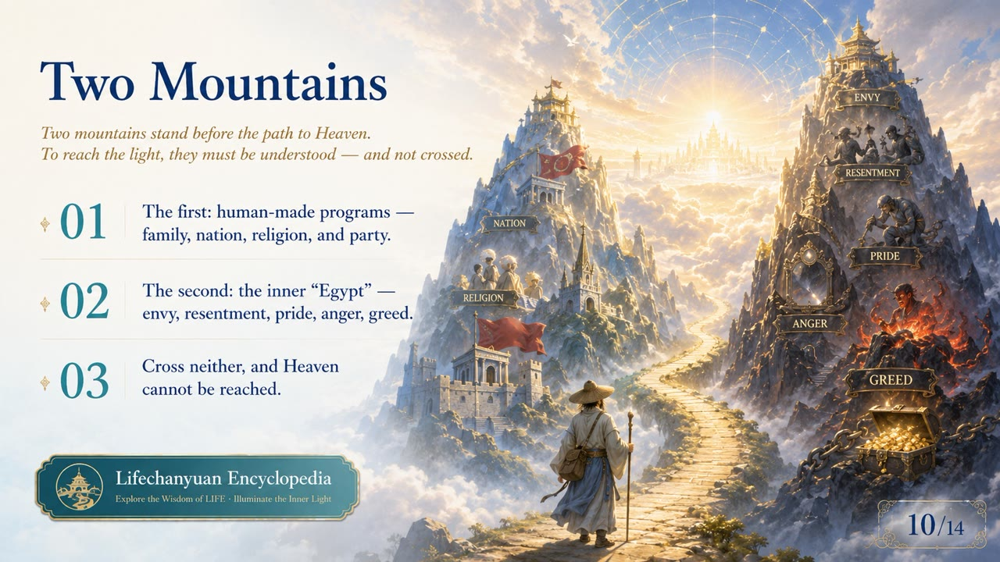
    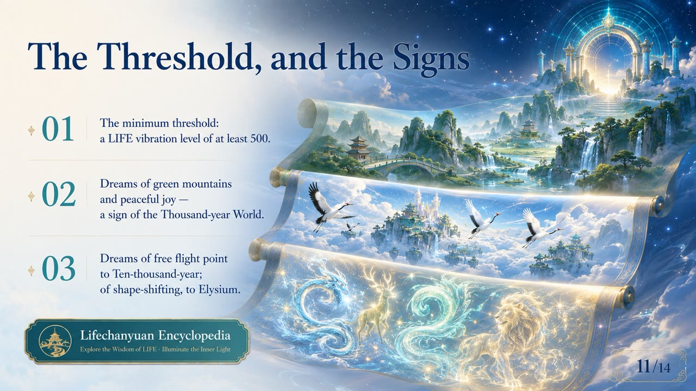
    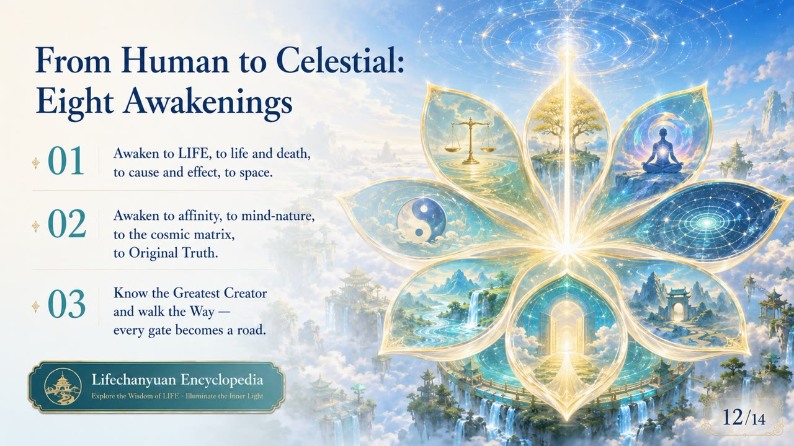
    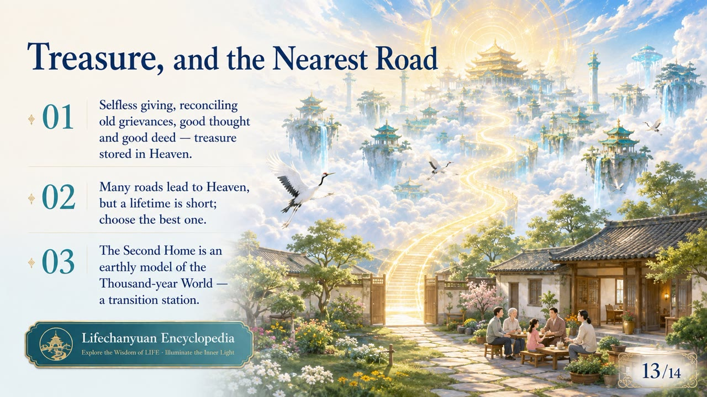
    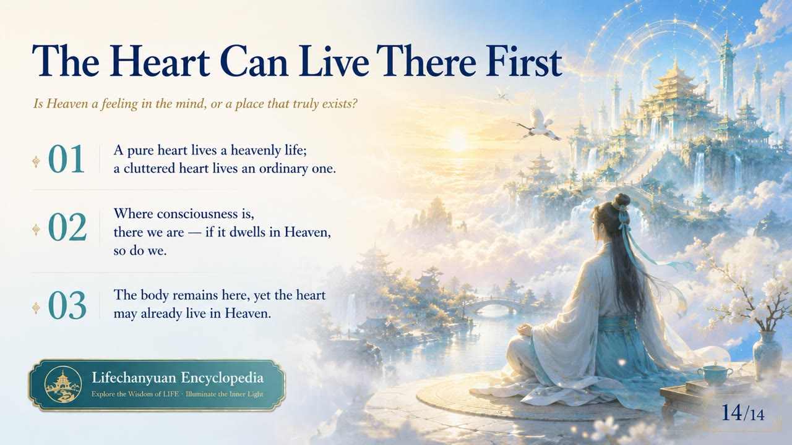

---

## Core Positioning

In the Lifechanyuan system, the Kingdom of Heaven is the terminal framework of the Tour Guide Route Map. Each of its three tiers has specific cultivation prerequisites. The entire cultivation system — soul garden, six LIFE qualities, eight thinking ladders, antimatter structure — is oriented toward reaching one of these tiers.

---

## Read by Edition

| Edition | Intended Reader | Link |
|---------|----------------|-------|
| **Friendly Edition** | Readers new to Lifechanyuan concepts | [Read Friendly Edition](./friendly) |
| **Academic Edition** | Researchers with philosophical/religious studies background | [Read Academic Edition](./academic) |
| **Internal Edition** | Chanyuan Celestials and deep practitioners | [Read Internal Edition](./internal) |

---

## Related Entries

- [Thousand-Year World](/en/thousand-year-world/) — The entry-level tier of the Kingdom of Heaven
- [Ten-Thousand-Year World](/en/ten-thousand-year-world/) — The middle tier
- [Elysium World](/en/elysium-world/) — The highest tier; contains the Celestial Islands Continent
- [Celestial Islands Continent](/en/celestial-islands-continent/) — The apex destination within the Kingdom of Heaven
- [Tour Guide Route Map](/en/tour-guide-route-map/) — The complete path leading to the Kingdom of Heaven
