# Kong-Xing — Emptiness-Nature (Sunyata)

> "Emptiness-nature = No-form = No-self = Ultimate nirvana = Elysian World = Tao = Buddha = Celestial Being."  
> — Chanyuan Corpus · Becoming Buddha · *Emptiness-Nature Is Ultimate Nirvana*

Kong-xing (空性, *emptiness-nature*) is the gateway and method for entering the Elysian World in Lifechanyuan's cultivation system — the ultimate state of no-self and no-form. Entering the state of kong-xing is ultimate nirvana; it means one has already arrived at the Elysian World. Guide Xuefeng argues that the Heart Sutra's true name is the *Xing Sutra* (Nature Sutra), as it describes the state of emptiness-nature (*xing-zhuang*), not the state of an empty mind (*xin-zhuang*). Emptiness-nature is the Tao; the Tao is emptiness-nature.

| Version | Best for | Focus |
|---------|----------|-------|
| [Friendly version](friendly.md) | First-time readers | What kong-xing is and how to experience it |
| [Academic version](academic.md) | Researchers | The equivalence chain and cosmic three-elements |
| [Internal reference](internal.md) | Deep study | Complete original texts from the Guide |

---

## Video

<iframe style="width:100%;aspect-ratio:4/3;border:0" src="https://www.youtube-nocookie.com/embed/gh15NFdT5Dk" title="Emptiness-Nature (Kong-Xing) (Lifechanyuan Encyclopedia video)" allowfullscreen></iframe>

## Slides

??? info "📖 Illustrated slides (14 pages, click to expand)"

    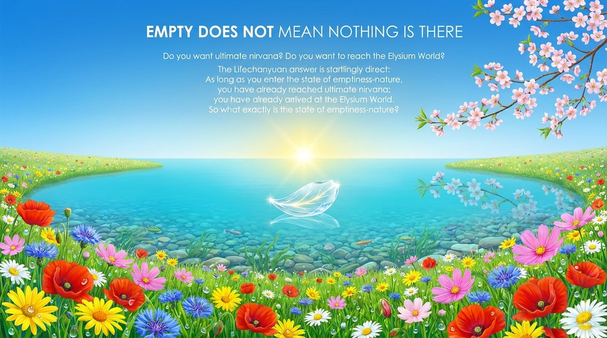
    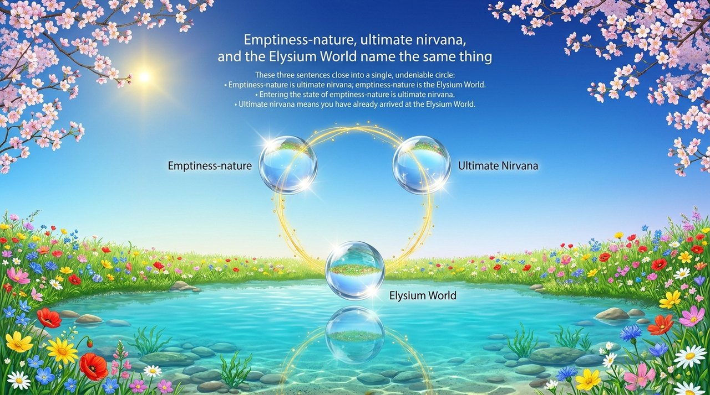
    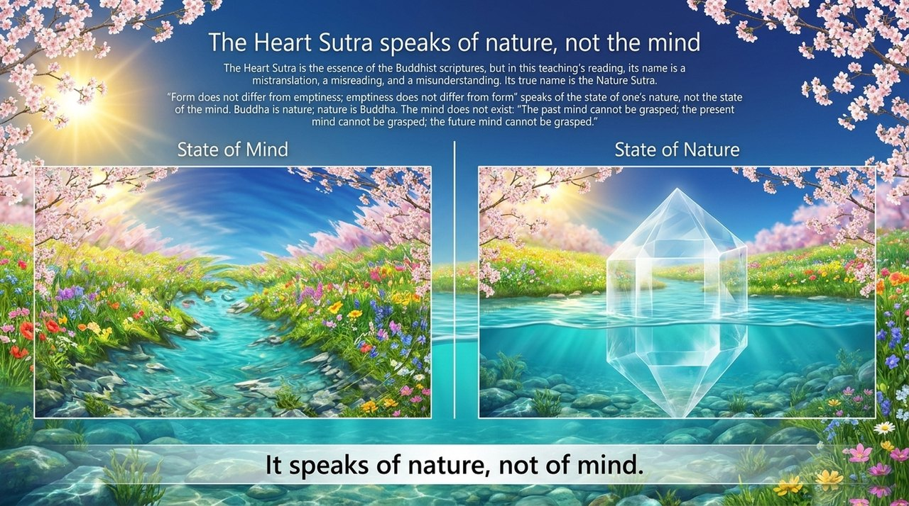
    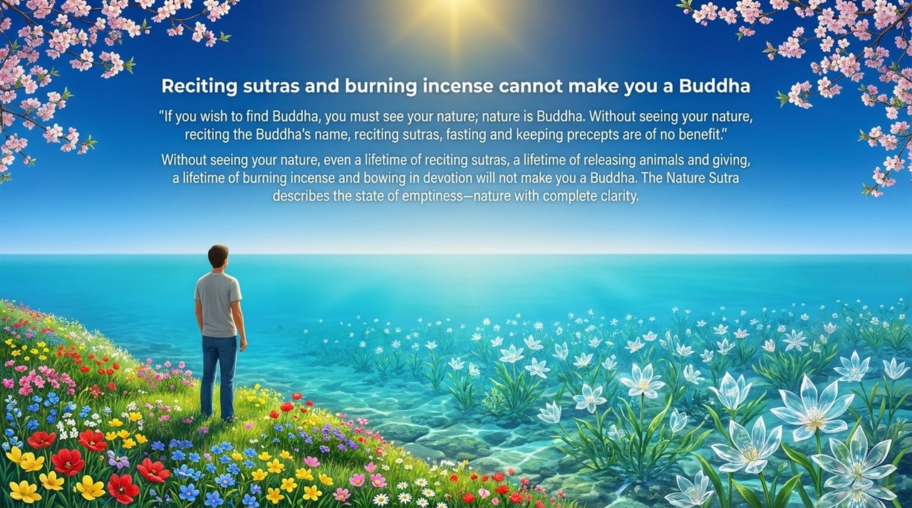
    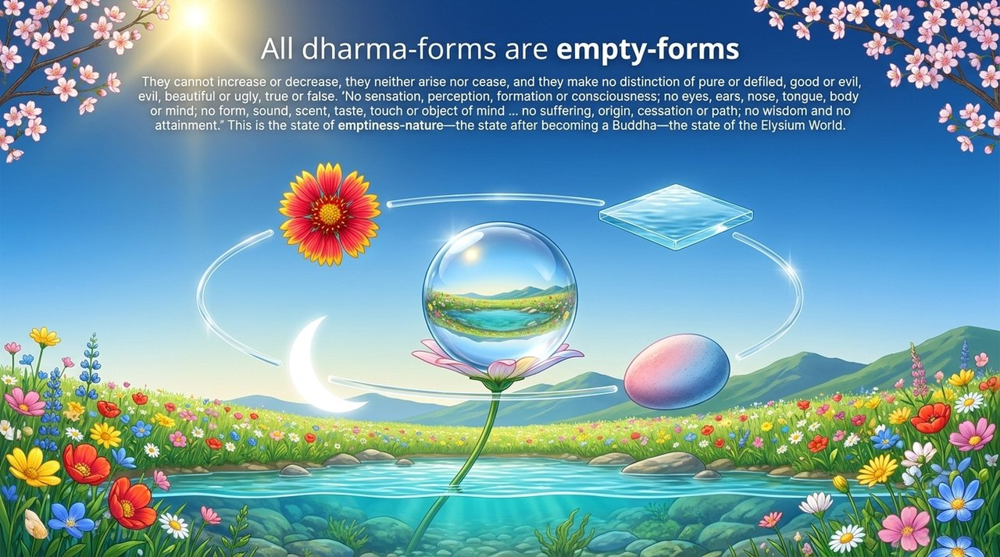
    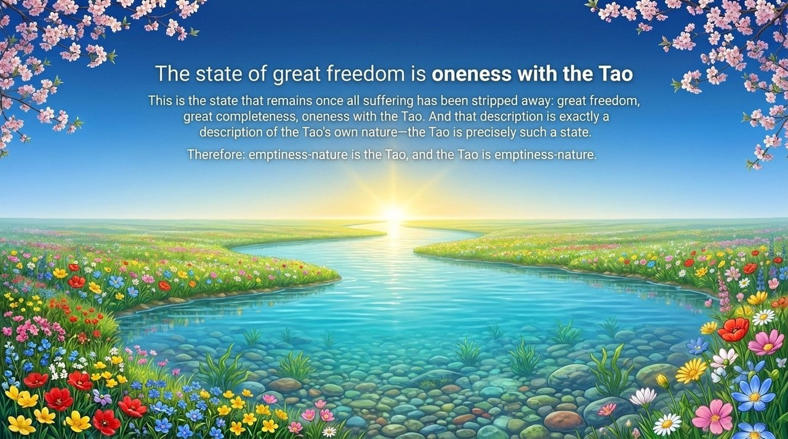
    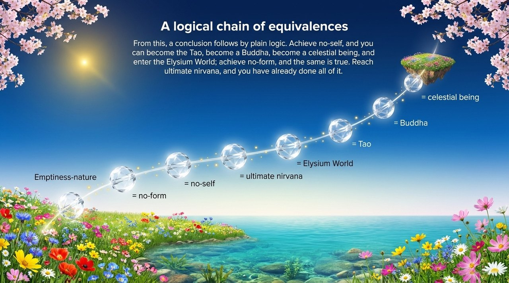
    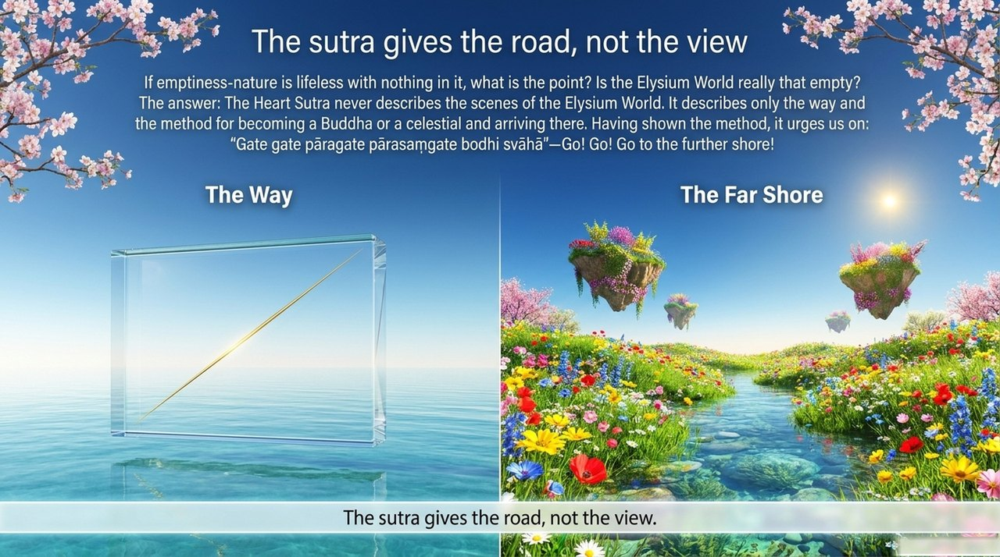
    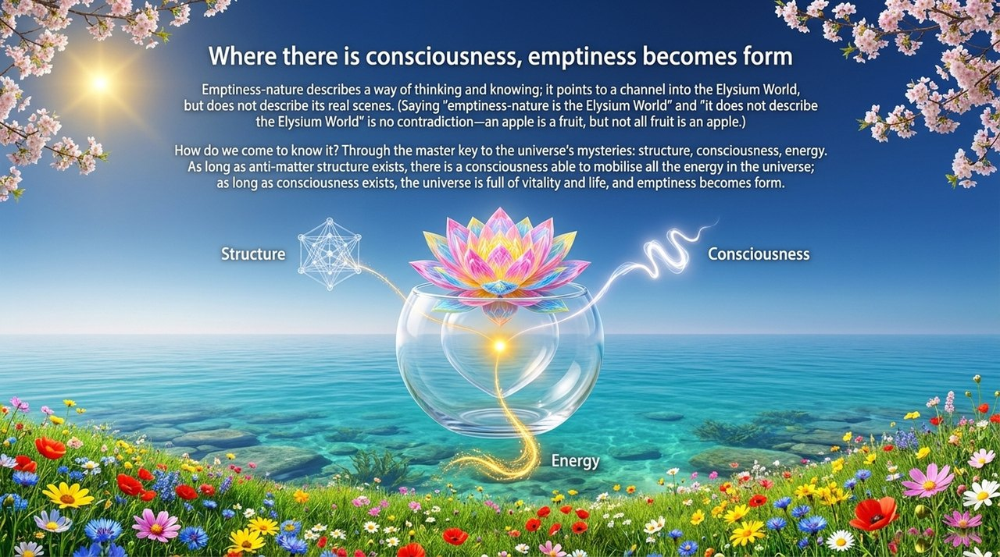
    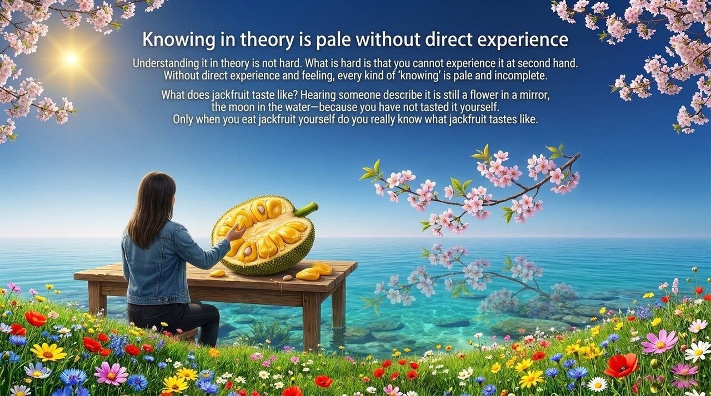
    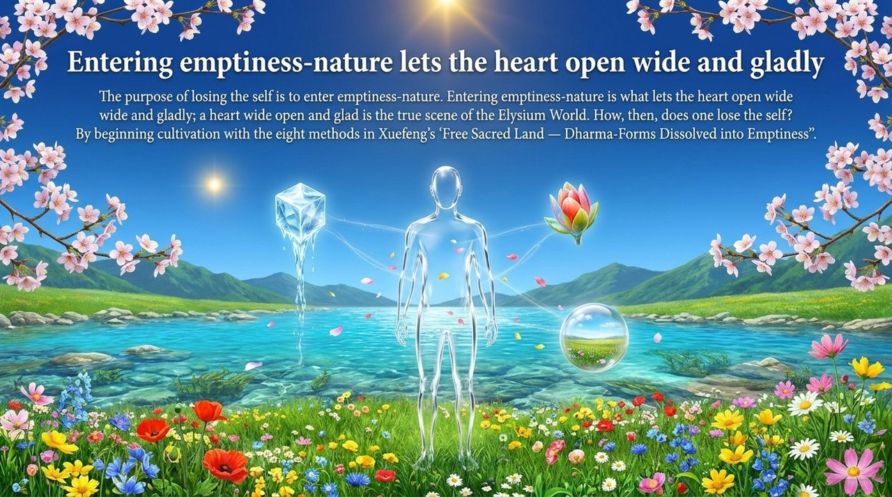
    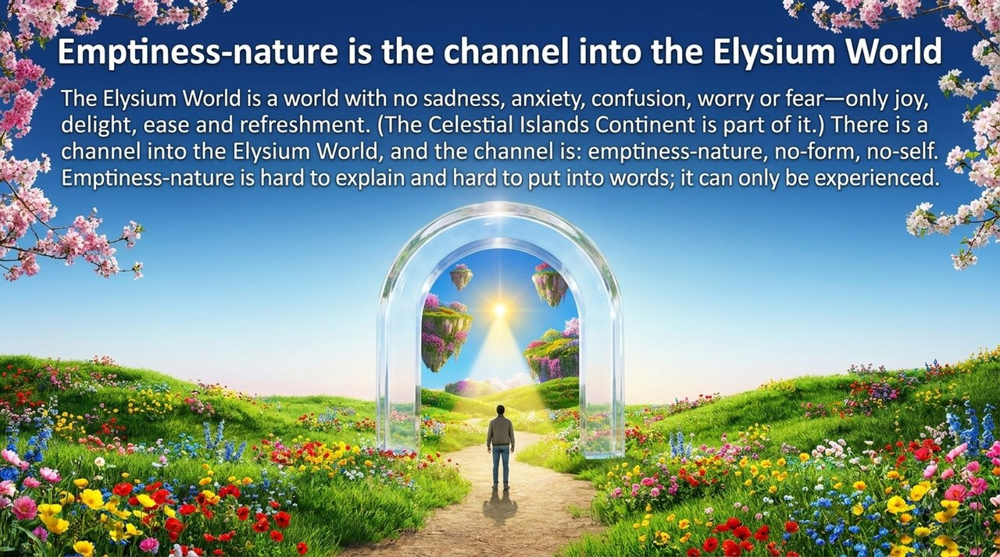
    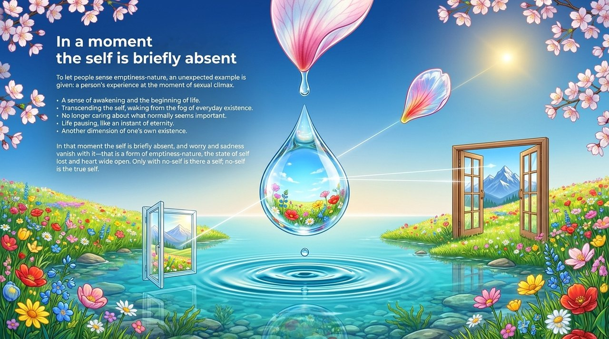
    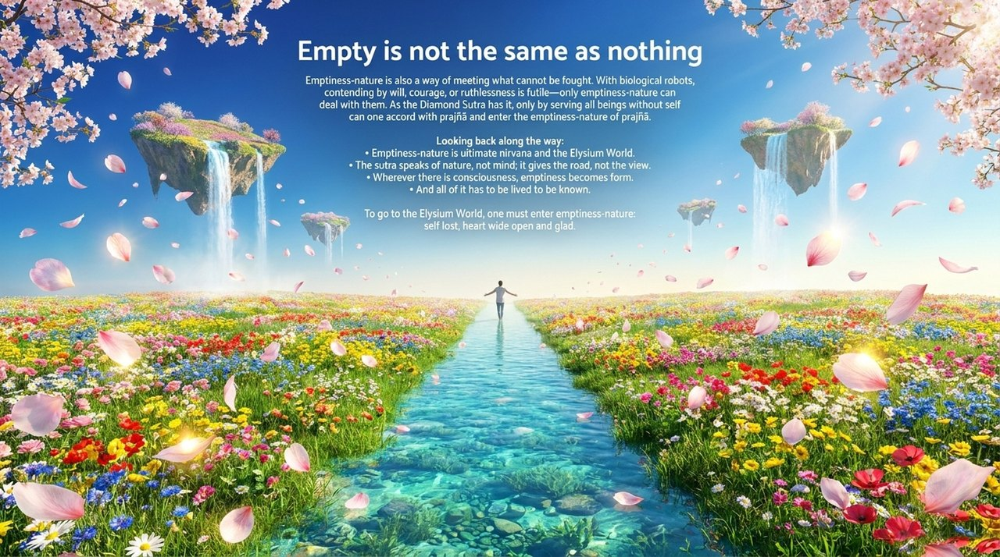

---

## Related Entries

[Nirvana](/en/nirvana/) · [No-Self, No-Form](/en/no-self-no-form/) · [Elysian Bliss](/en/jilemiaojing/) · [Five Skandhas Are Empty](/en/wuyun-jiekong/) · [Becoming a Buddha](/en/becoming-buddha/) · [Self-Coherence](/en/self-coherence/) · [Mind Without Abiding](/en/xinwu-suozhu-guaai/) · [Self-Nature (Buddha-Nature)](/en/self-nature/) · [Formless Giving](/en/formless-giving/)
