<!-- id: LC-LFN-0001-EN theme: cultivation type: navigation direction: practical-living lang: en -->

# Labor as the First Need of Life

In the Lifechanyuan system, "labor as the first need of life" stands as one of the core organizing principles of the Second Home (Life Oasis). In sharp contrast to mainstream society's tendency to escape physical work, Lifechanyuan treats manual labor as the primary need of daily life — regardless of one's status, contributions, or intellect, every member must participate in physical labor. Labor is understood as an indispensable path to equality, soul-garden perfection, and ultimately the celestial life of the Thousand-Year World.

---

## Version Guide

| Version | Best for | Focus |
|---------|----------|-------|
| [Friendly version](friendly.md) | First-time readers | Everyday context · the labor threshold · soul garden |
| [Academic version](academic.md) | Researchers | Conceptual analysis · contrast with Confucian tradition · cultivation meaning |
| [Internal reference](internal.md) | Deep study | Full quotations · seven-section framework · New Era perspective |

---

## Video

<iframe style="width:100%;aspect-ratio:4/3;border:0" src="https://www.youtube-nocookie.com/embed/y5wypTOUZdk" title="Labor as the First Need of Life (Lifechanyuan Encyclopedia video)" allowfullscreen></iframe>

## Slides

??? info "📖 Illustrated slides (14 pages, click to expand)"

    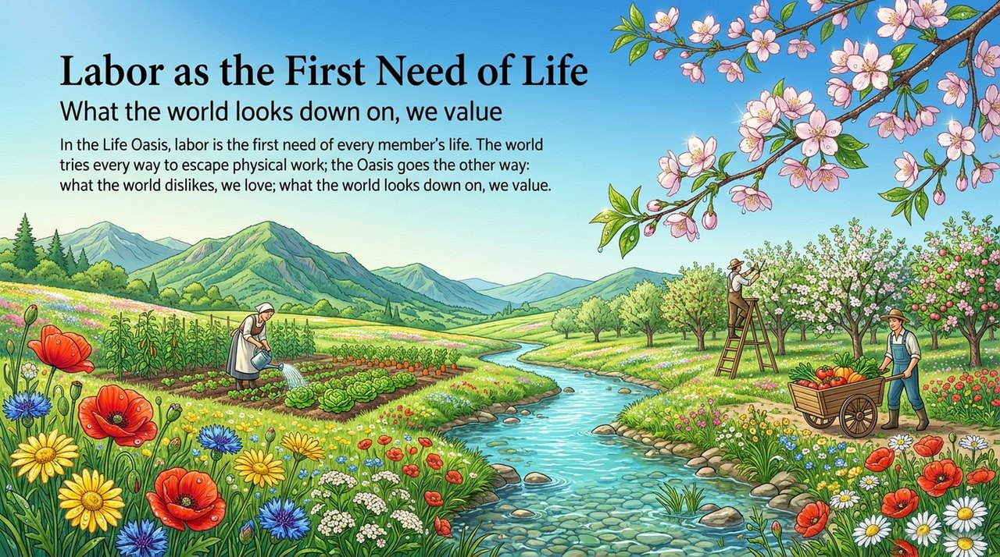
    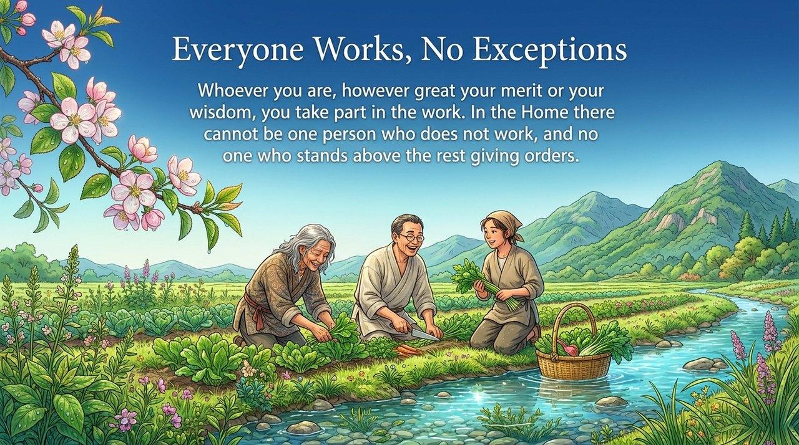
    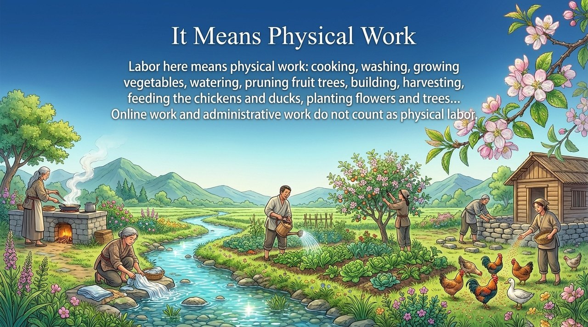
    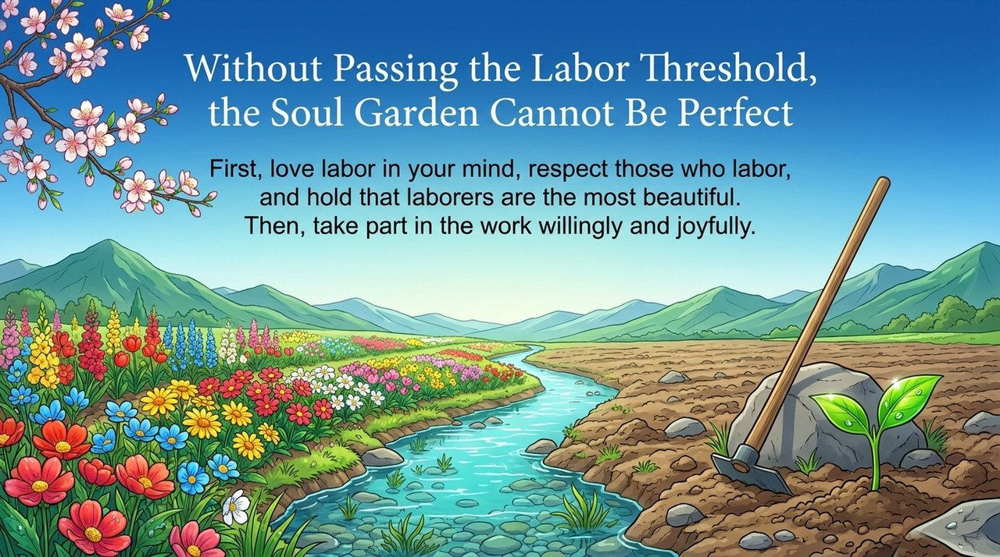
    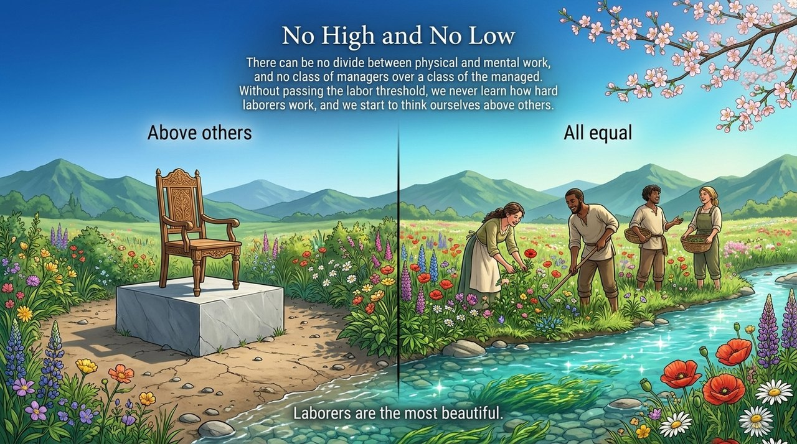
    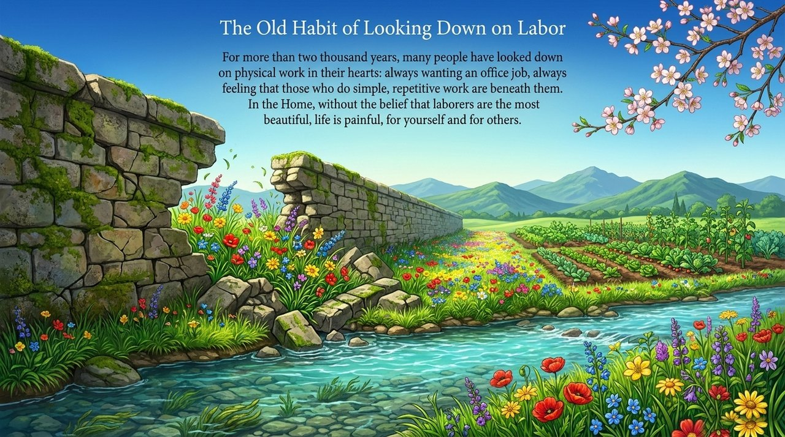
    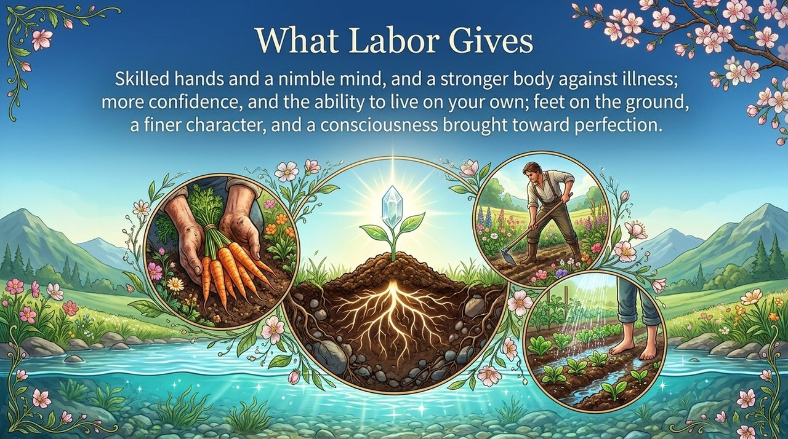
    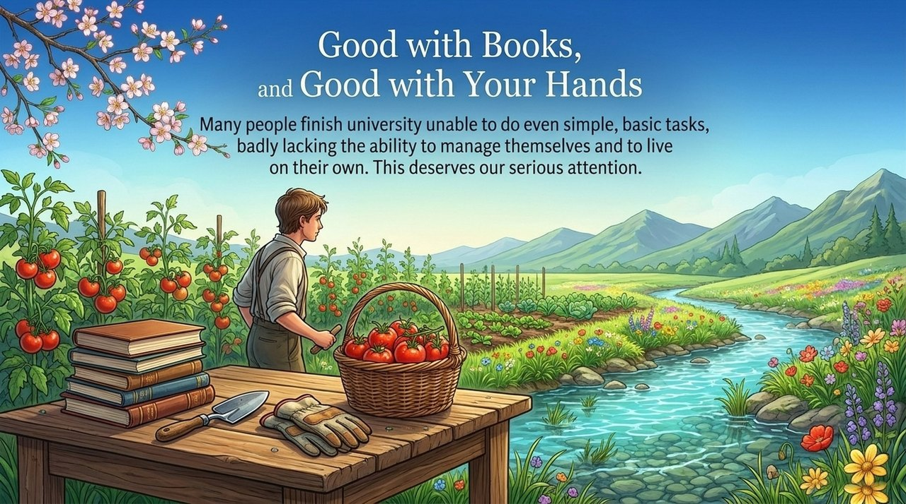
    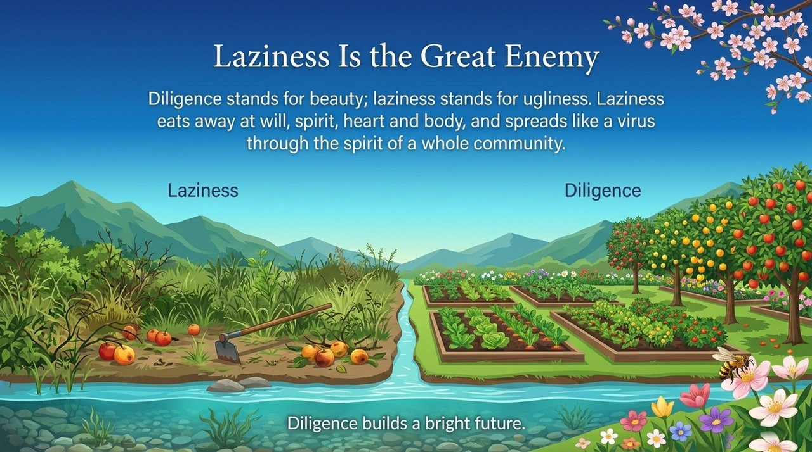
    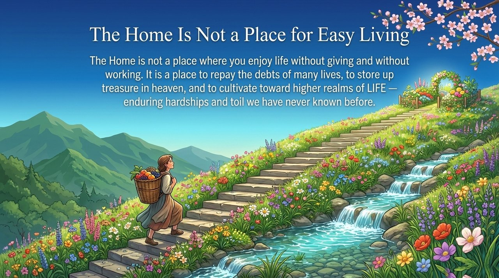
    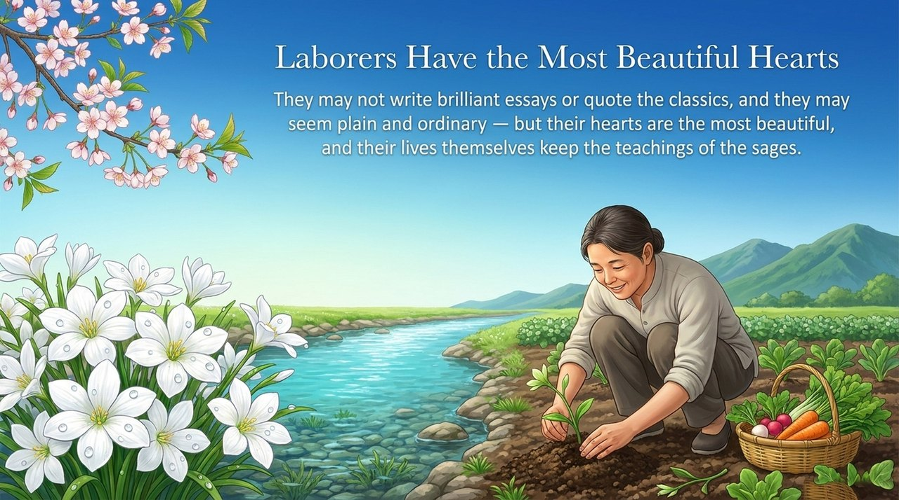
    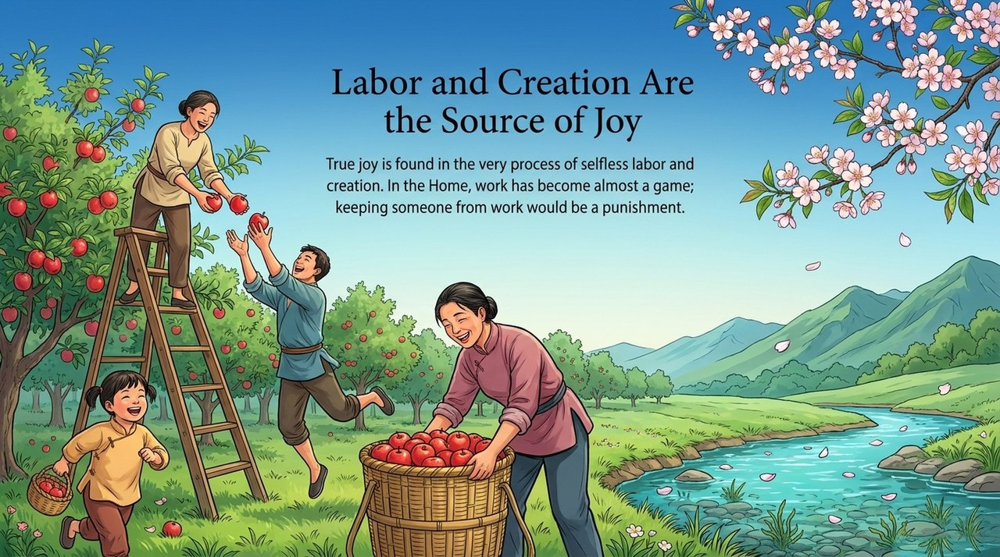
    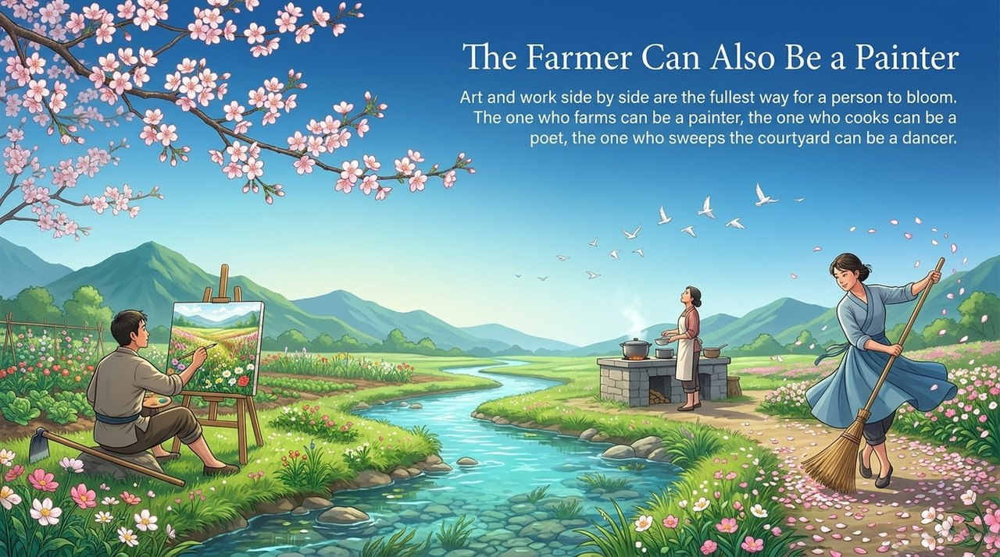
    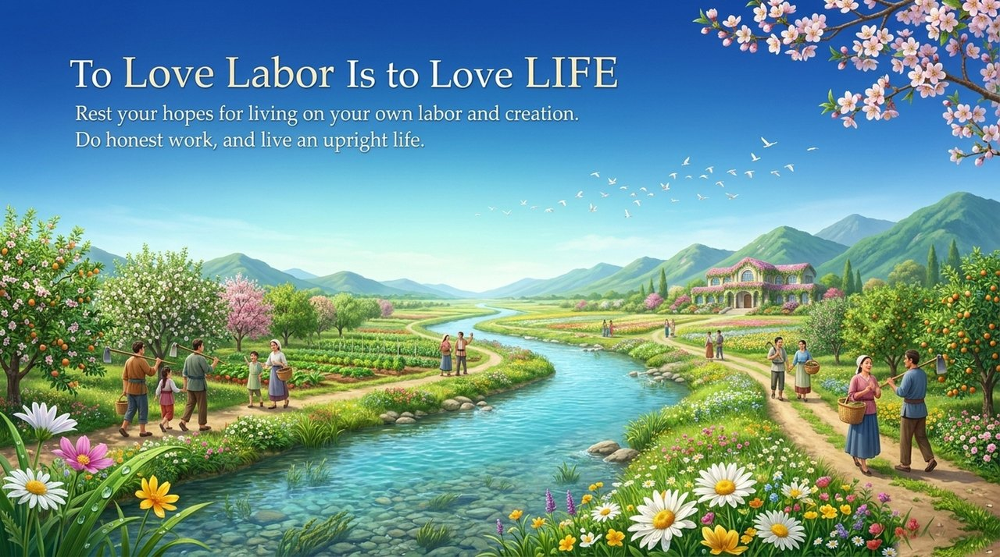

---

## Related Entries

[Life Oasis](/en/life-oasis/) · [Second Home](/en/second-home/) · [Contribute by Ability, Take by Need](/en/contribute-by-ability-take-by-need/) · [Own Nothing, Have Everything](/en/own-nothing-have-everything/) · [Standard of Perfect Human Nature](/en/perfect-human-nature/) · [Soul Garden](/en/soul-garden/) · [Gratitude](/en/gratitude/) · [Repaying Debts](/en/debt-repayment/) · [Hundun Management](/en/hundun-management/)
