<!-- id: LC-LG-0001-EN theme: Cultivation Practice type: Entry Index lang: en -->

# Letting Go

**Letting go** (*fàng xià* 放下) is, in the Lifechanyuan system, the primary heart-method for advancing toward the celestial realm and a practical requirement woven through every stage of cultivation. Letting go is not passive abandonment — it is the deliberate unloading of all grasping at past merits, present possessions, and external fixations, so that the LIFE-spirit can travel light.

> "If I were to teach you the Dharma, the very first thing I would ask of everyone is to *let go*."
> (Chanyuan Corpus · Revelation · *Letting Go*)

The depth of one's letting go determines the height of the LIFE space one is able to reach.

---

## Version Navigation

| Version | Best For | Core Content |
|---------|---------|--------------|
| [Friendly Version](./friendly/) | First-time readers | Zen parable and analogies explaining the nature of letting go |
| [Academic Version](./academic/) | In-depth study | Systematic analysis: levels, mechanism, and relationship to celestial attainment |
| [Internal Version](./internal/) | Source verification | All source texts quoted verbatim, zero alteration |

---

## Video

<iframe style="width:100%;aspect-ratio:4/3;border:0" src="https://www.youtube-nocookie.com/embed/Nw3_afitMp4" title="Letting Go (Lifechanyuan Encyclopedia video)" allowfullscreen></iframe>

## Slides

??? info "📖 Illustrated slides (14 pages, click to expand)"

    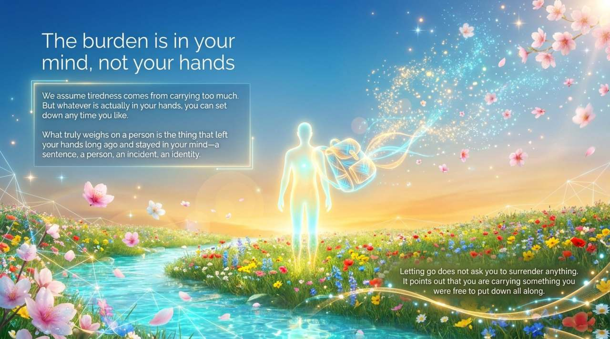
    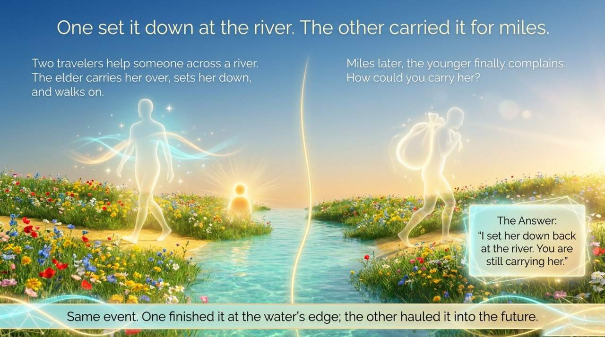
    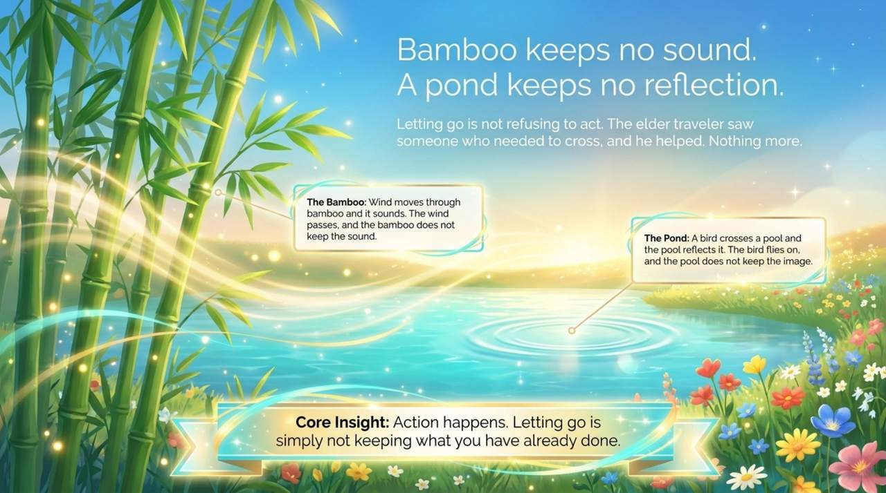
    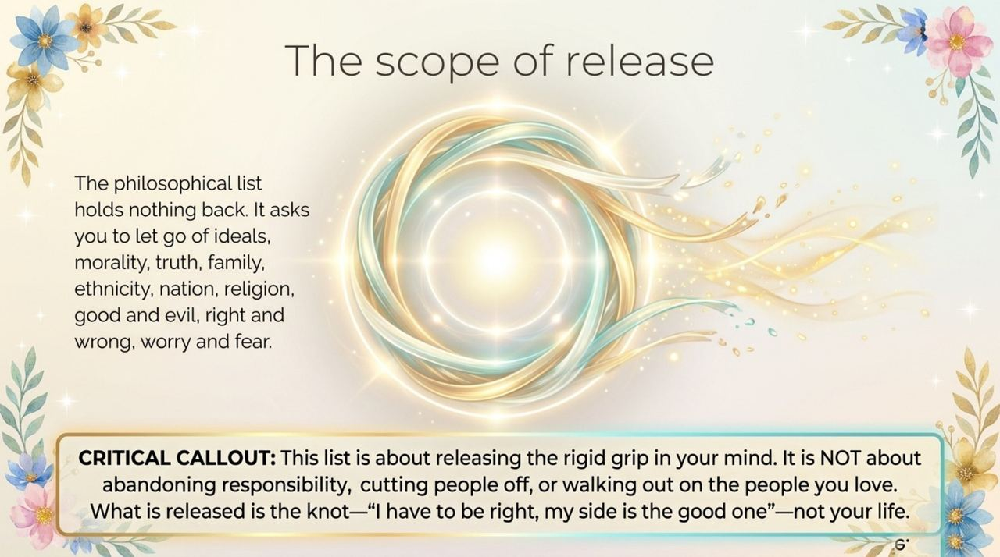
    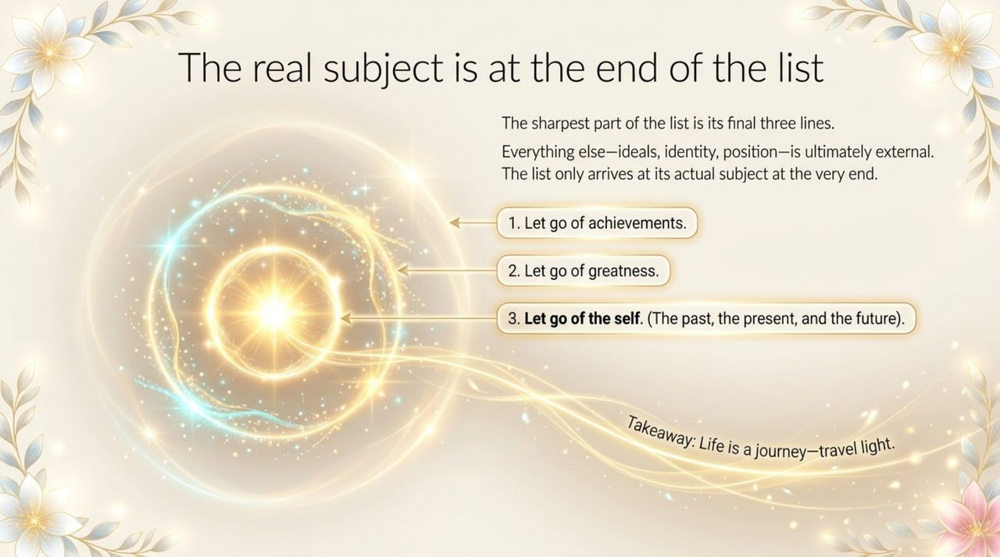
    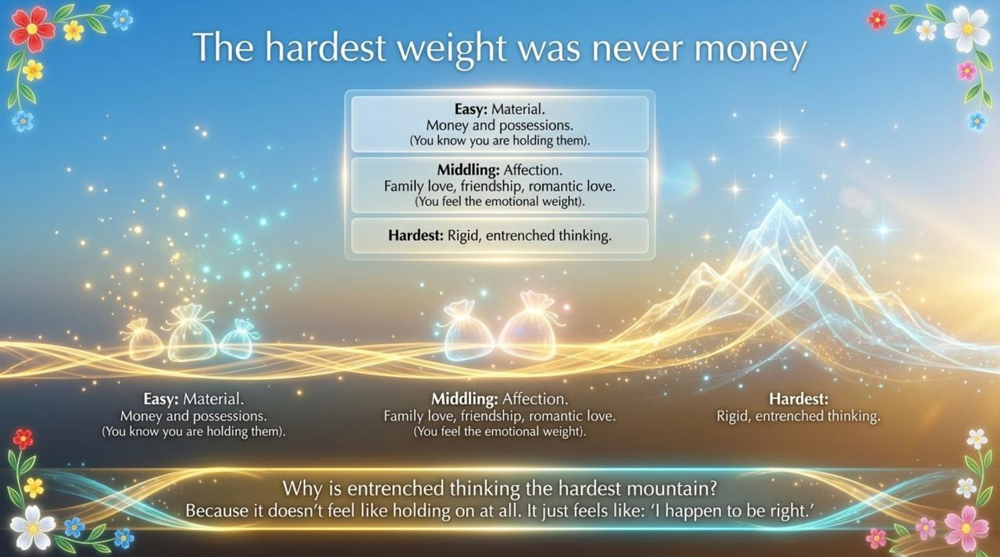
    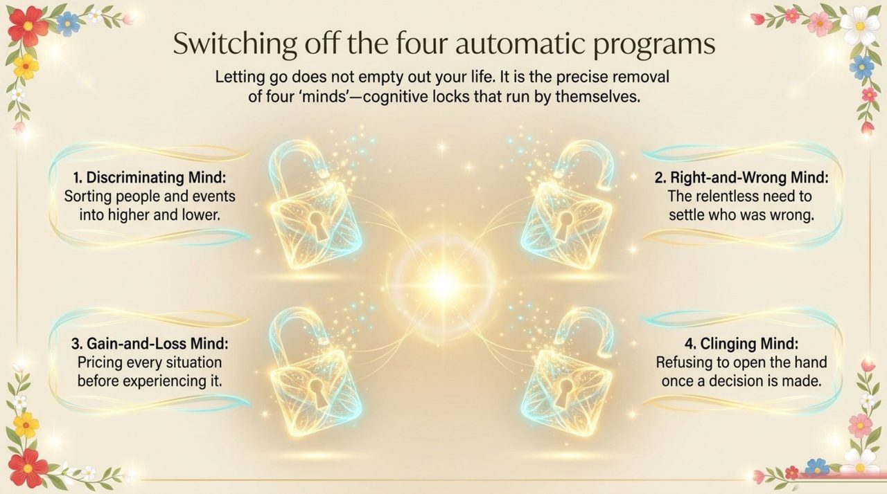
    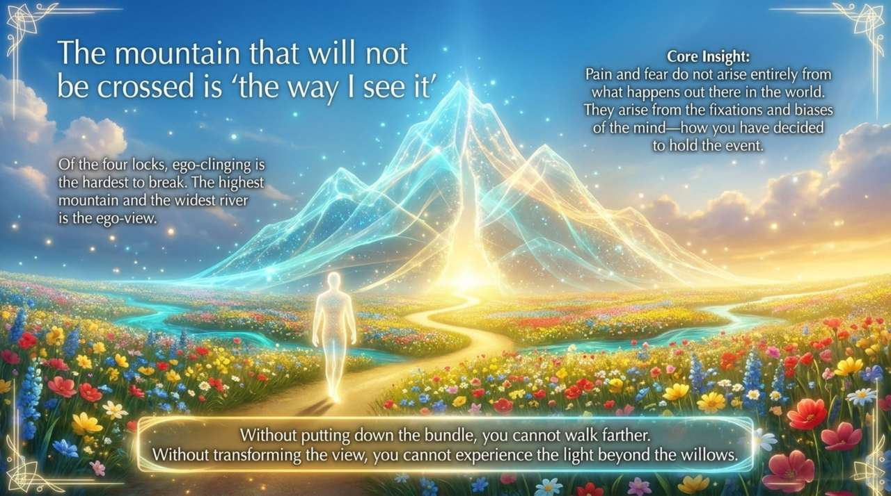
    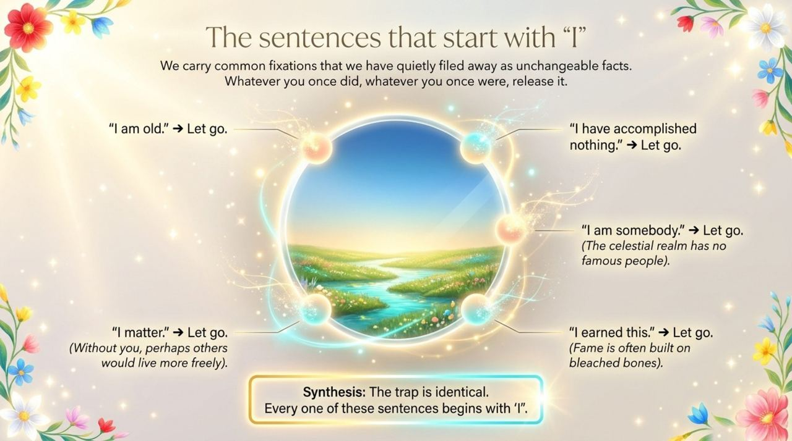
    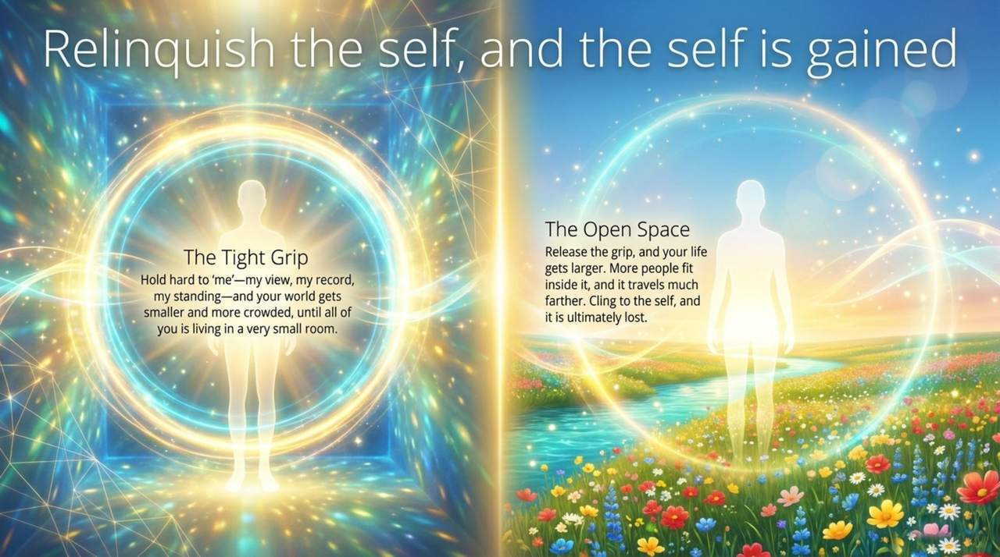
    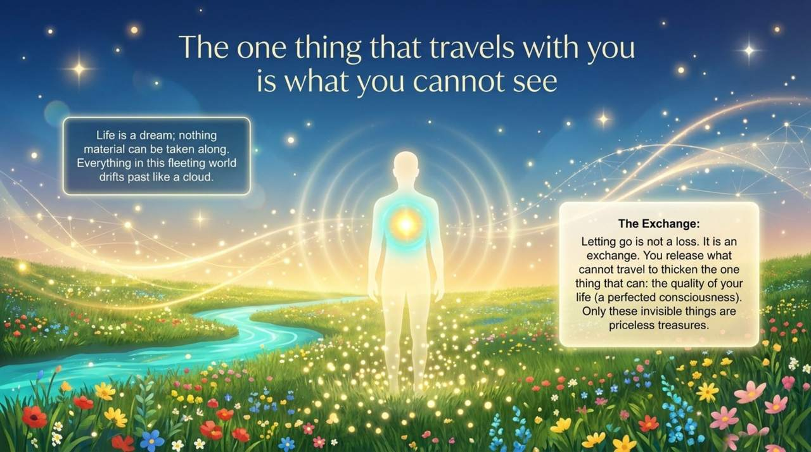
    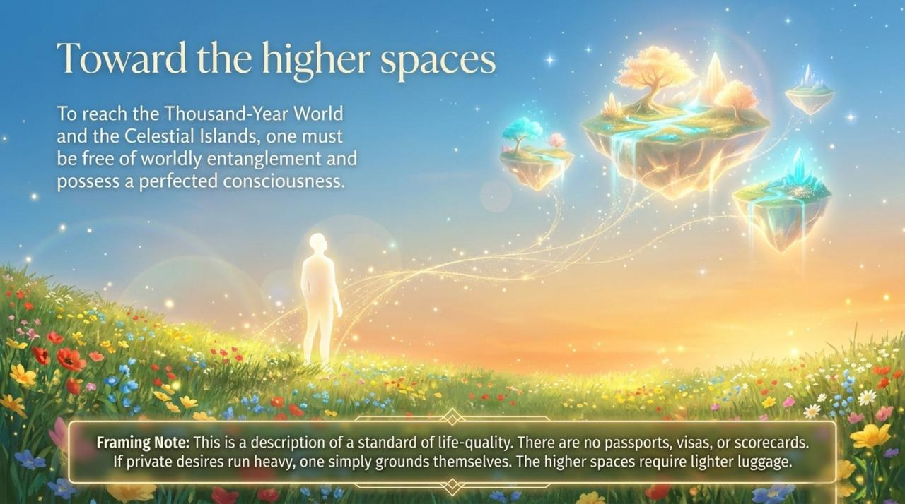
    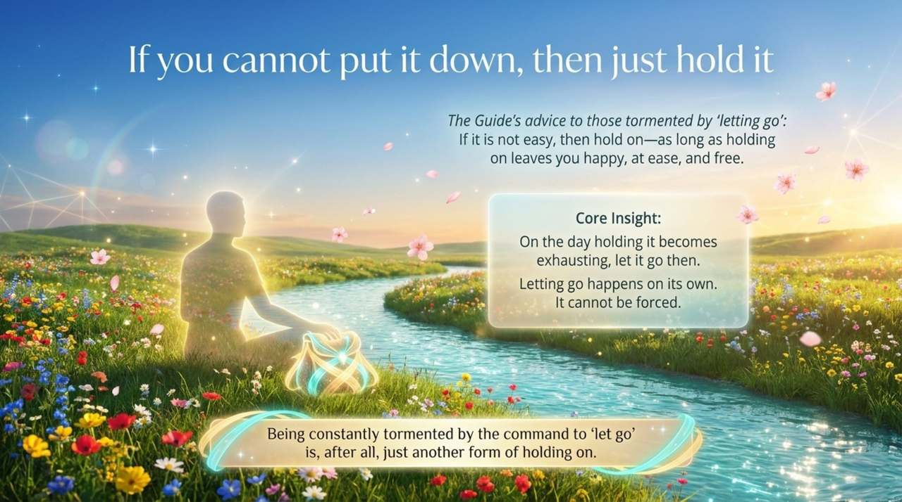
    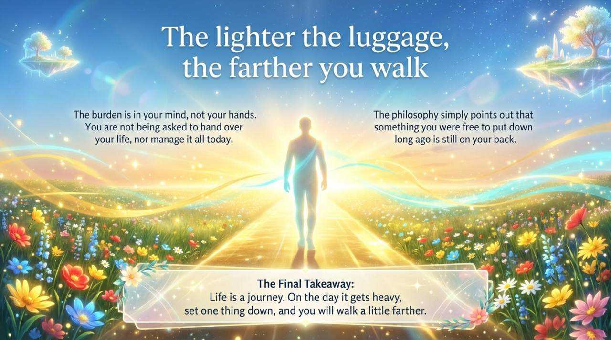

## Core Points

- **What to let go of**: ideals, morality, truth, -isms, family, ethnicity, nation, religion, political party, commandments; life/death, honor/disgrace; good/evil, true/false; achievements, greatness — and finally, the self ("ego-clinging")
- **Difficulty levels**: material things → affections → rigid thinking and ego-clinging (hardest)
- **Dialectical core**: "Relinquish the self, and the self is gained; cling to the self, and the self is ultimately lost."
- **Relationship to celestial attainment**: Entry to the Thousand-Year World, Ten-Thousand-Year World, and Celestial Islands Continent requires letting go as an unavoidable prerequisite
- **Second Home**: the practical institutional support for letting go — "own nothing, yet possess everything"
- **Not a rigid rule**: "If letting go torments you, just hold on — let go when you're naturally ready"

---

## Related Entries

[Spiritual Purification Course](/en/spiritual-purification-course/) · [Repentance](/en/repentance/) · [Second Home](/en/second-home/) · [Thousand-Year World](/en/thousand-year-world/) · [Inner Spirit (Overview)](/en/soul-overview/) · [Spirituality](/en/spirituality/) · [Gratitude](/en/gratitude/)
