# Life and Death

**Life and Death**, in the Lifechanyuan system, does not refer to the actual ending and beginning of LIFE itself, but to the transformation of LIFE's carrier — the physical body. The essence of LIFE is a spiritually endowed antimatter structure that never truly dies. What is called "death" is the spirit body leaving the physical carrier and transforming into another dimensional space. Life and death are mutually rooted — one of the Eight Great Dialectics of the universe. Awakening to the nature of life and death is the Second of the Eight Great Awakenings on the path from human to immortal.

## Video

<iframe style="width:100%;aspect-ratio:4/3;border:0" src="https://www.youtube-nocookie.com/embed/mNy2jvdKQtc" title="Life and Death (Lifechanyuan Encyclopedia video)" allowfullscreen></iframe>

## Slides

??? info "📖 Illustrated slides (14 pages, click to expand)"

    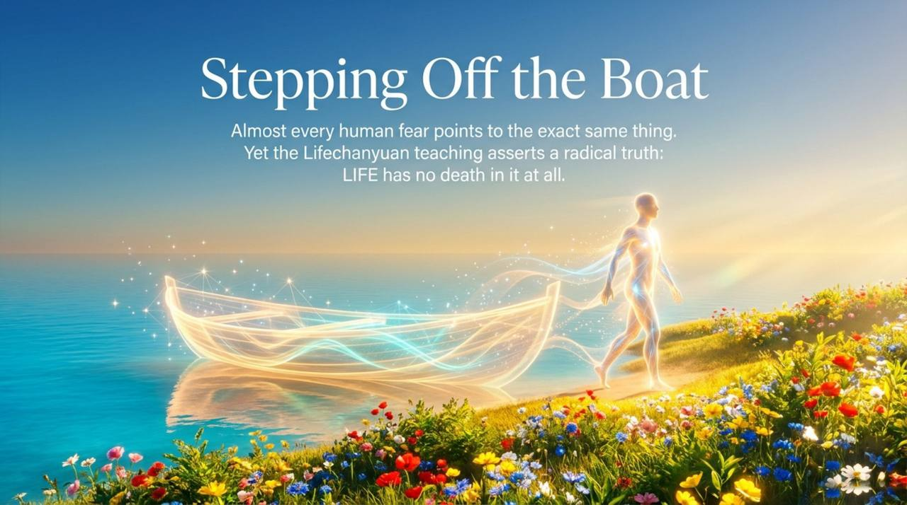
    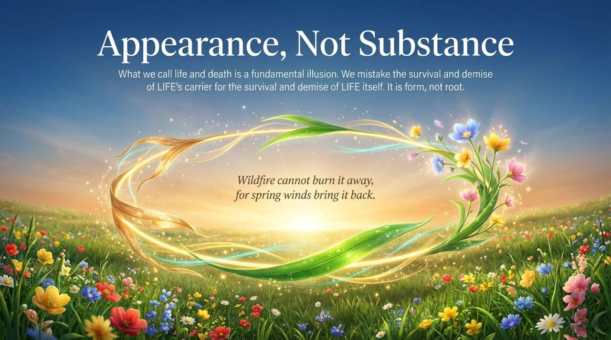
    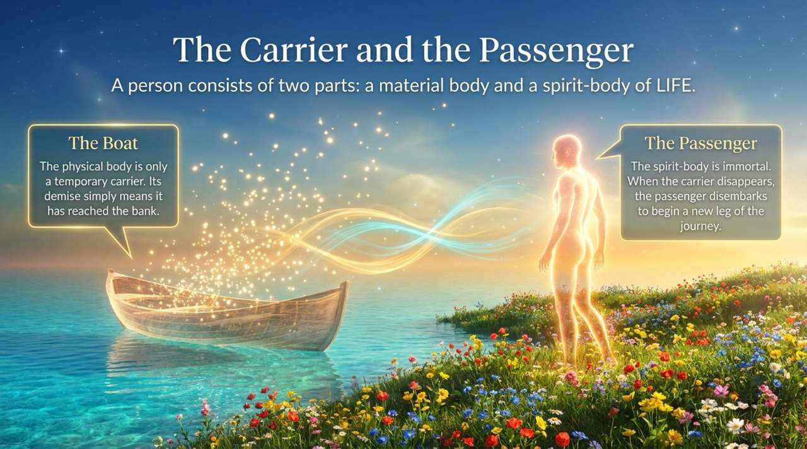
    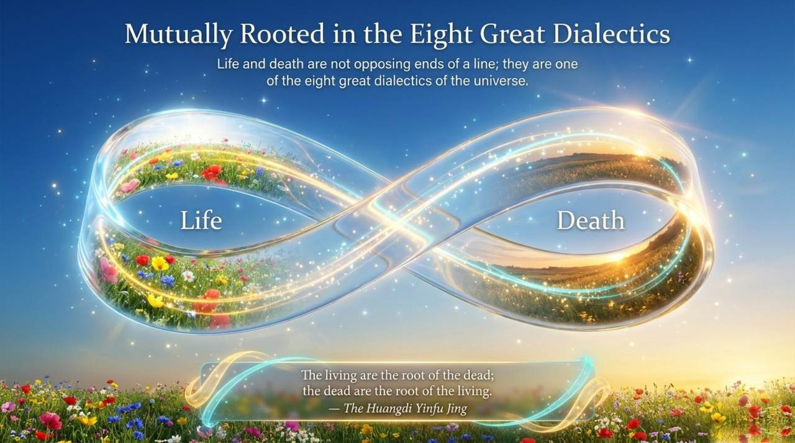
    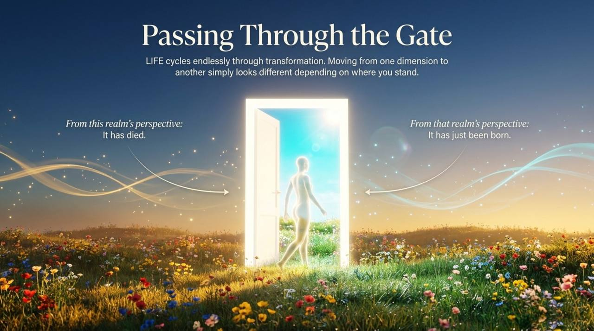
    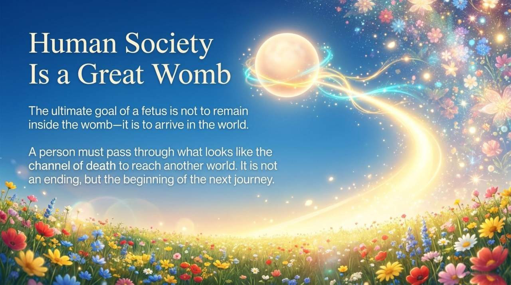
    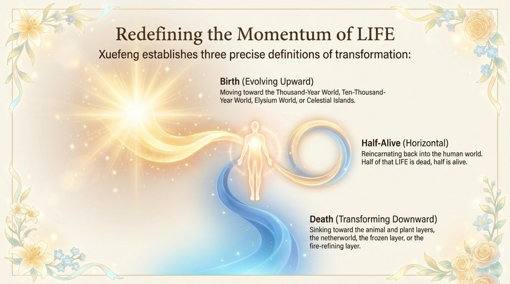
    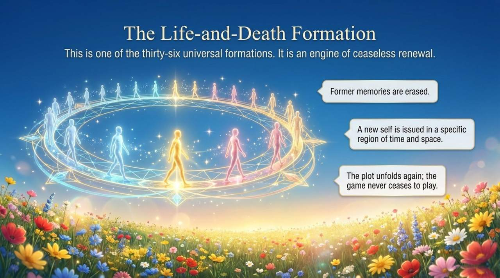
    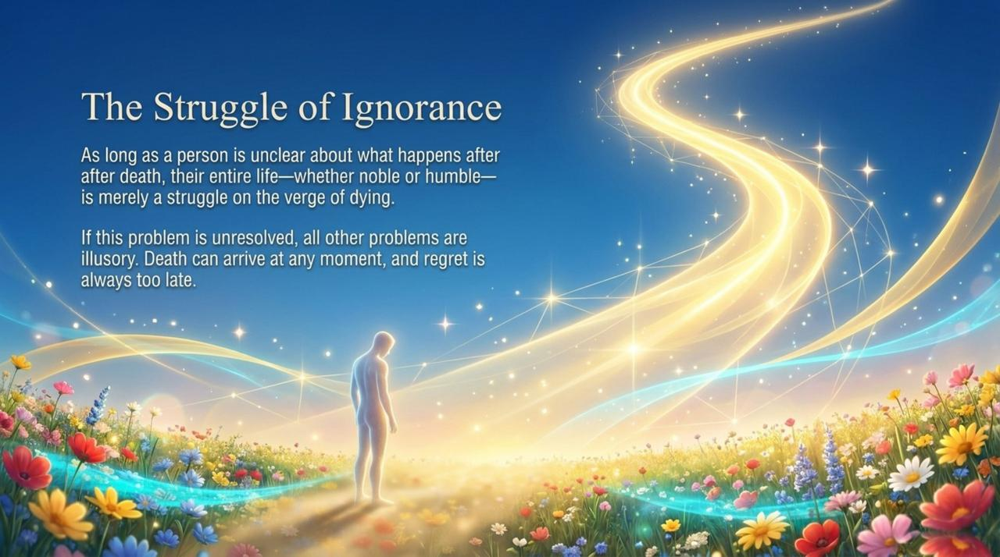
    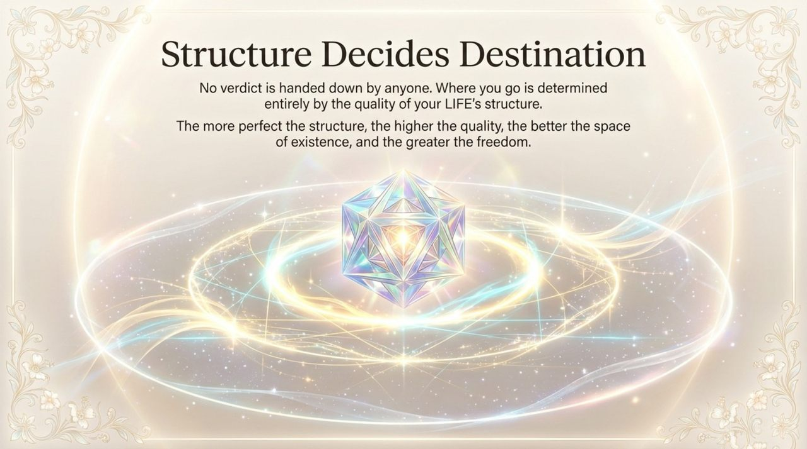
    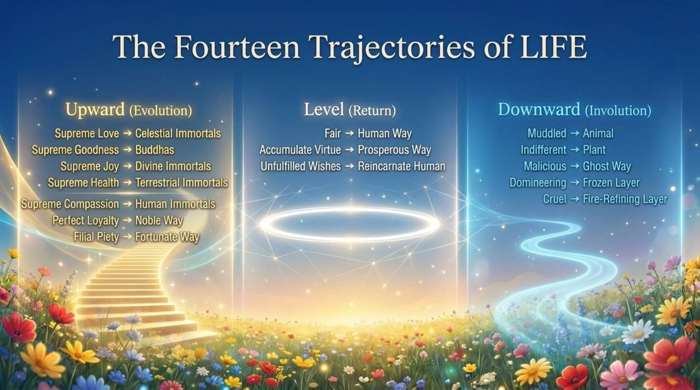
    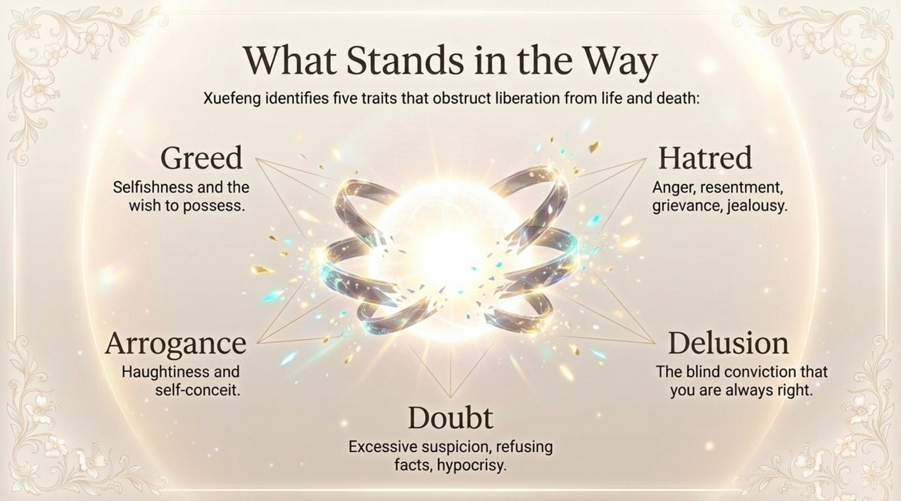
    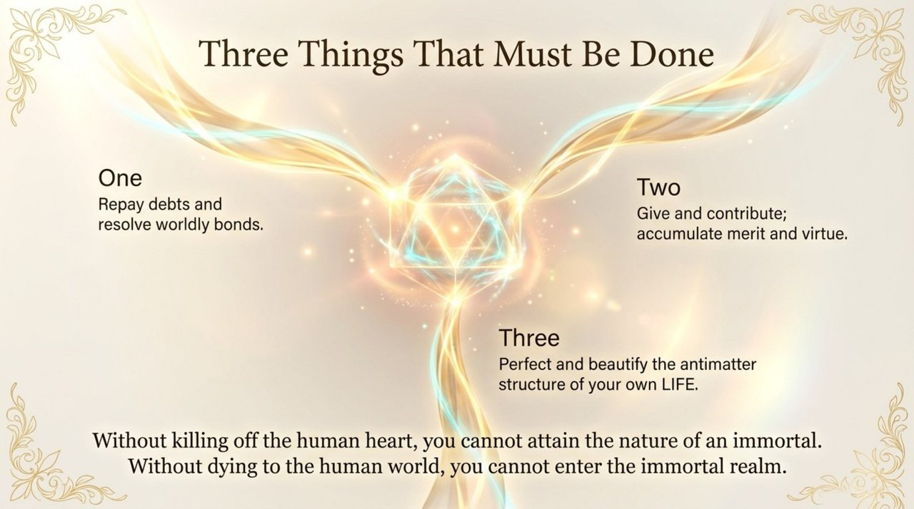
    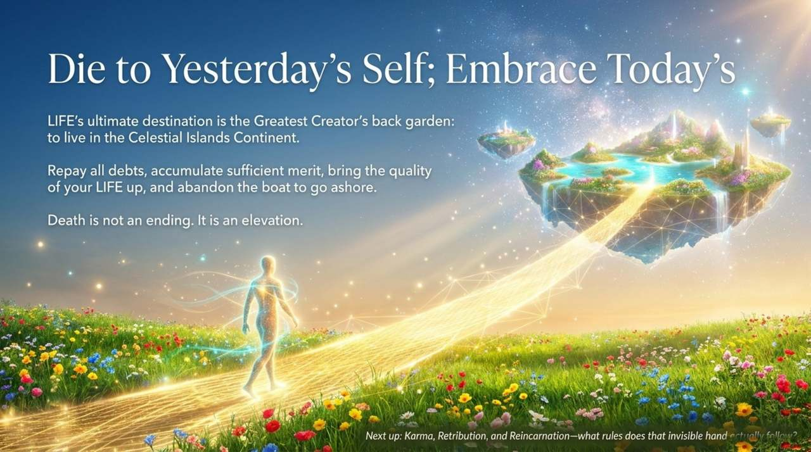

---

## Version Guide

| Version | Best for | Link |
|---------|----------|------|
| Friendly | First-time readers | [Read Friendly Version](/en/life-and-death/friendly/) |
| Academic | Scholarly research, cross-cultural comparison | [Read Academic Version](/en/life-and-death/academic/) |
| Internal | Chanyuan Celestials, deep study | [Read Internal Version](/en/life-and-death/internal/) |

---

## Related Entries

[Life](/en/life/) · [Soul](/en/soul/) · [Karma · Retribution · Reincarnation](/en/karma-retribution-reincarnation/) · [Awakening](/en/awakening/) · [Antimatter Structure](/en/antimatter-structure/) · [Kingdom of Heaven](/en/kingdom-of-heaven/) · [Celestial Islands Continent](/en/celestial-islands-continent/)
