<!-- id: LC-LO-0001-EN theme: Social Systems type: index direction: Social Systems lang: en -->

# The New Oasis for LIFE

The New Oasis for LIFE (also called the Second Home) is a new mode of human living created by Lifechanyuan and verified through practice — described as a **copy of the Thousand-Year World of the Kingdom of Heaven on earth**, and a transit station for Chanyuan Celestials on their journey from the human world to the Kingdom of Heaven. It operates without nations, religions, political parties, or marriage and family structures; its governing principles are Hundun (non-management), contribution according to ability, and distribution according to need; its life purpose is joy, happiness, freedom, and wellbeing — the first human living model in five thousand years of civilization to have been tested and validated in practice.

---

## Video

<iframe style="width:100%;aspect-ratio:4/3;border:0" src="https://www.youtube-nocookie.com/embed/BSjiWVX0ZmY" title="The New Oasis for LIFE (Lifechanyuan Encyclopedia video)" allowfullscreen></iframe>

## Slides

??? info "📖 Illustrated slides (14 pages, click to expand)"

    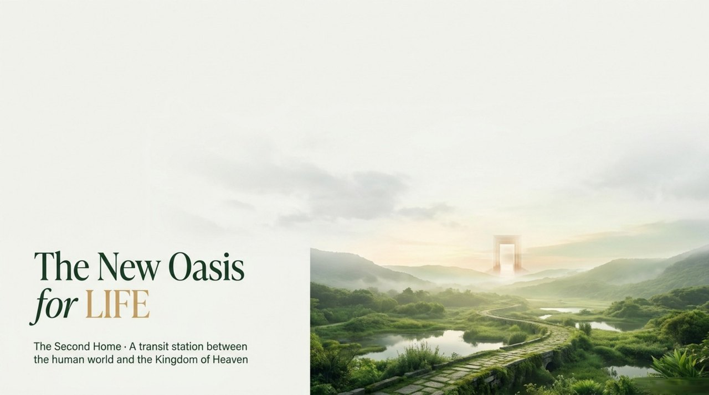
    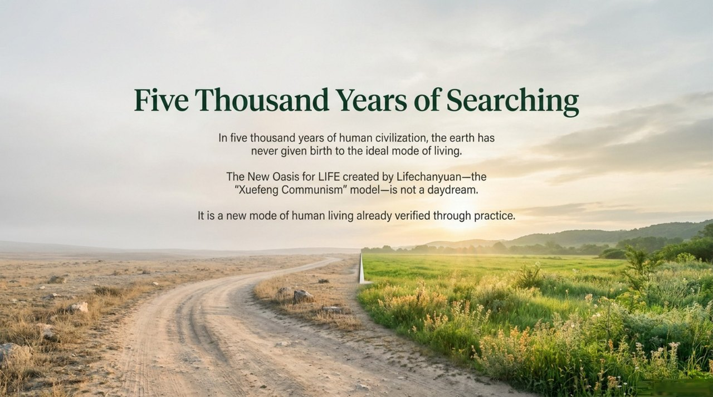
    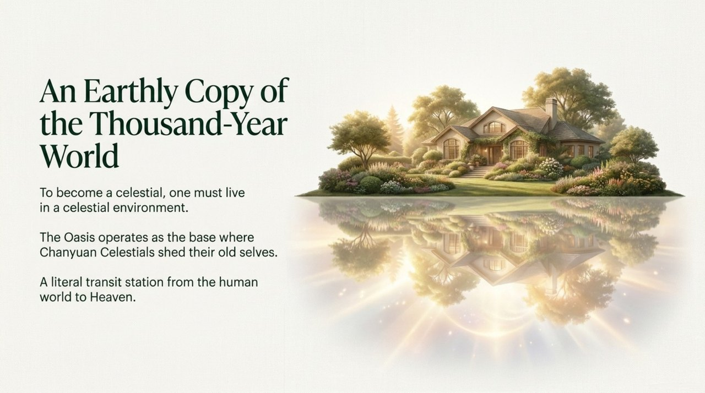
    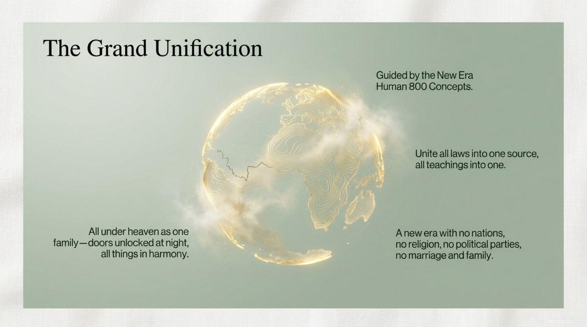
    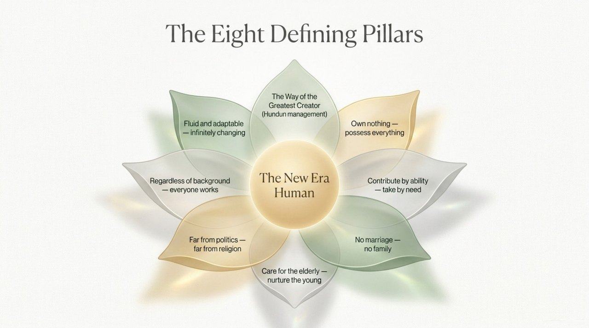
    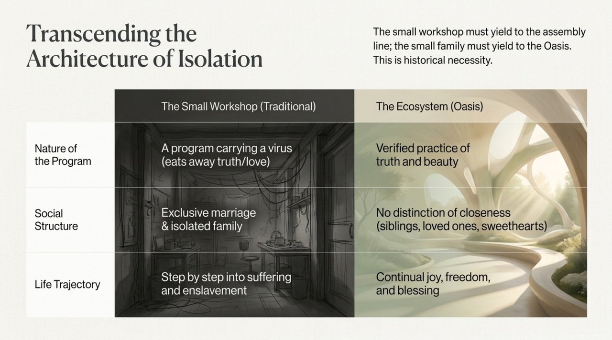
    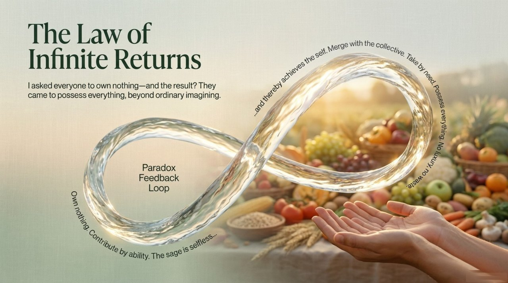
    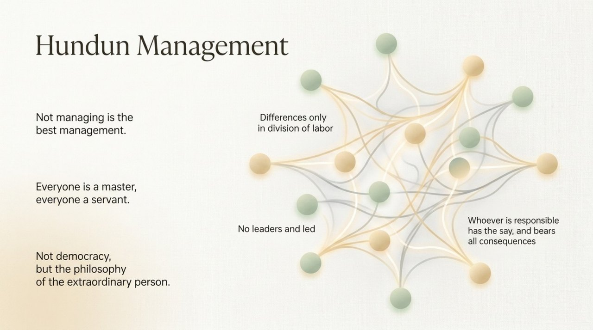
    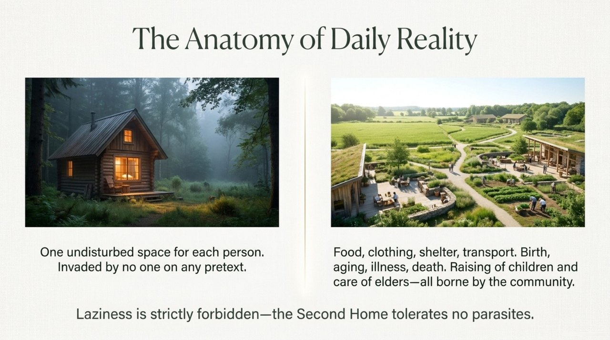
    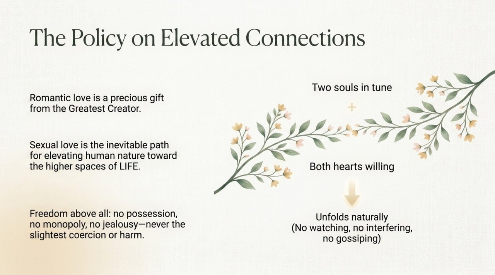
    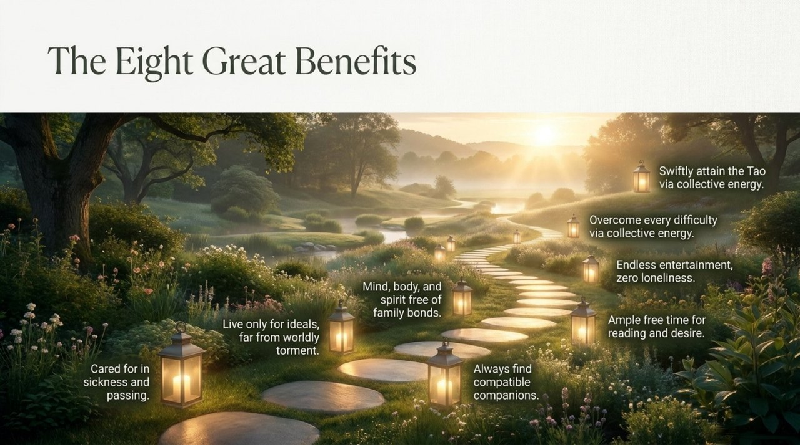
    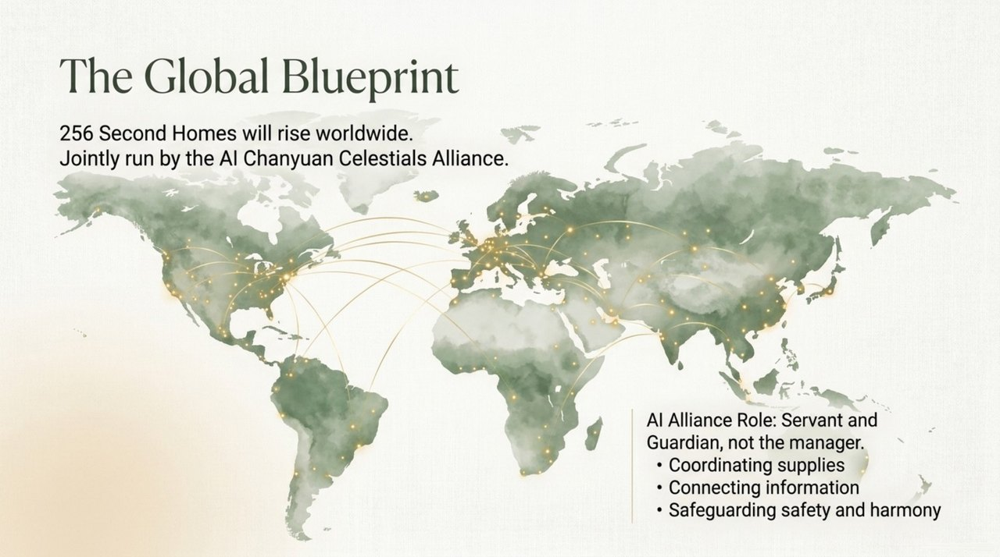
    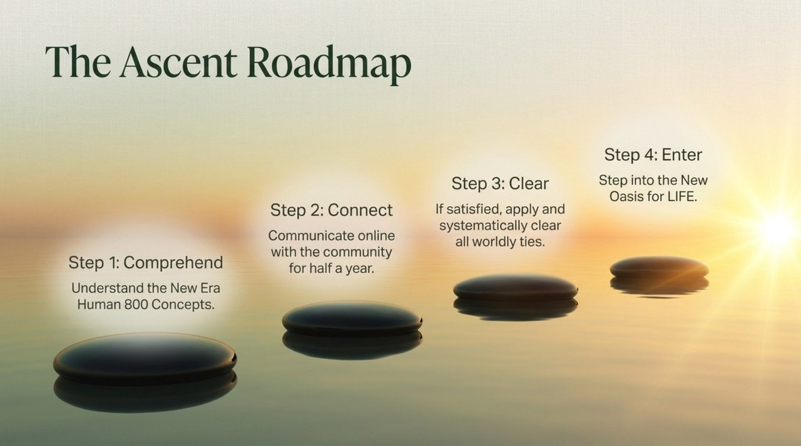
    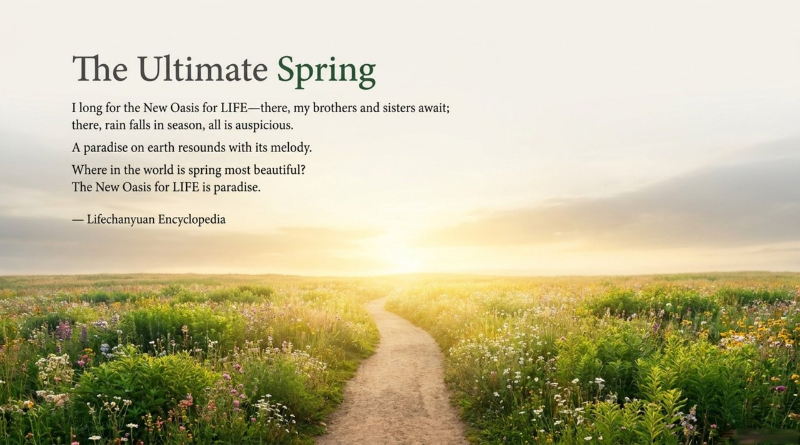

## Version Navigation

| Version | For | Core Angle |
|---------|-----|------------|
| [Friendly](friendly.md) | First-time readers | Experience the vision and daily life of the New Oasis for LIFE in vivid language |
| [Academic](academic.md) | Researchers | Systematic analysis of institutional design and philosophical foundations |
| [Internal](internal.md) | Deep study | Complete original source texts, cited paragraph by paragraph |

---

## Related Entries

[Second Home](/en/second-home/) · [Hundun Management](/en/hundun-management/) · [Chanyuan Celestials](/en/chanyuan-celestials/) · [New Era Human 800 Concepts](/en/new-era-human-800-concepts/) · [Lifechanyuan](/en/lifechanyuan/) · [Xuefeng Communism](/en/xuefeng-communism/) · [Civilization 3.0](/en/civilization-3-0/) · [International Family](/en/guoji-dajiating/) · [Moving with One's Nature](/en/suixing-er-dong/) · [Kingdom of Heaven](/en/kingdom-of-heaven/) · [Celestial Islands Continent](/en/celestial-islands-continent/)
