<!-- id: LC-LR-0001-EN theme: Universe and Space-Time type: Entry Index lang: en -->

# Reincarnation of LIFE

The **Reincarnation of LIFE** rests on one foundational truth: LIFE does not die — only its form of expression dies. The essential nature of LIFE is a spiritually-charged antimatter structure that cannot be destroyed; it can only transform from one form into another, entering from one space into another. As energy is indestructible, so LIFE is ceaseless. The total number of LIFE-forms within the cosmic system is a constant — neither increasing nor decreasing — just as the total volume of water on Earth never changes, only cycling through cloud, rain, ocean, and ice. LIFE cycles through ten specific spaces: the Elysium World, Ten-Thousand-Year World, Thousand-Year World, the human world, the domestic animal realm, the animal realm, the plant realm, the underworld, the frozen layer, and the fire-refining layer. Which space a LIFE enters after death is determined entirely by the state of consciousness at the moment of death — for consciousness determines the antimatter structure, and the antimatter structure determines the LIFE form. No sudden change of mind at the last moment can substitute for a lifetime of accumulated consciousness. The reincarnation overview: those of supreme love ascend to Celestial Immortal; those of supreme goodness ascend to Buddha; the confused fall to the animal realm; the cruel descend to the fire-refining layer. Humans can reincarnate as animals — supported by four logical laws: the law of cosmic debt, the law of consciousness, the law of LIFE balance, and the principle that the human world is a transfer station. Descending is easy; ascending is hard. Opening the spiritual sense, transforming consciousness, clearing karmic debt, and perfecting human nature are the fundamental paths to escaping lower-realm reincarnation.

## Video

<iframe style="width:100%;aspect-ratio:4/3;border:0" src="https://www.youtube-nocookie.com/embed/UuozlOOoTD4" title="Reincarnation of LIFE (Lifechanyuan Encyclopedia video)" allowfullscreen></iframe>

## Slides

??? info "📖 Illustrated slides (14 pages, click to expand)"

    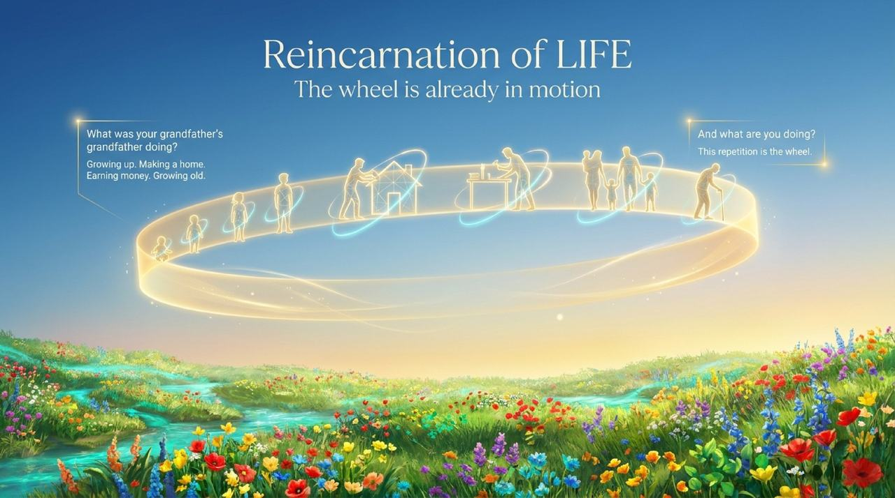
    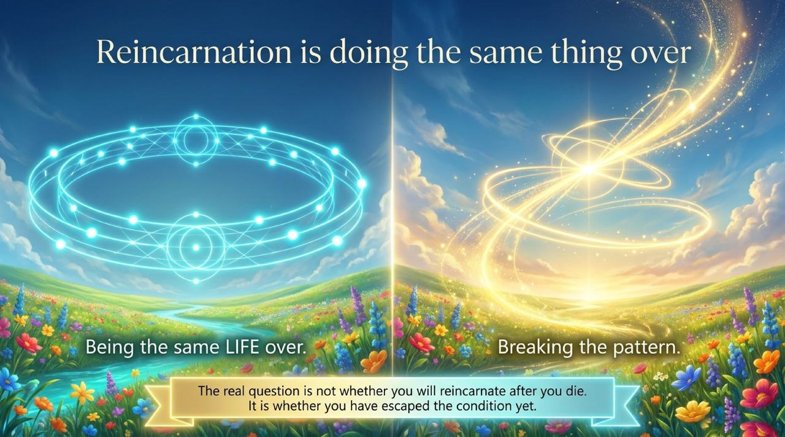
    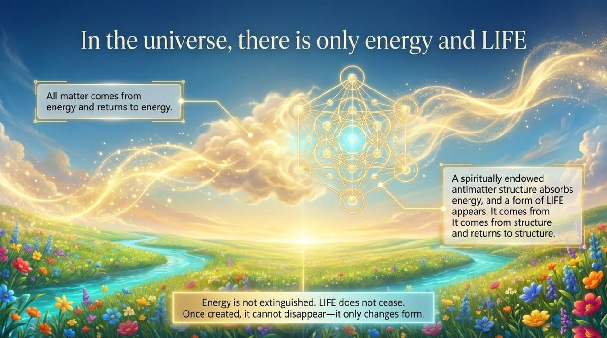
    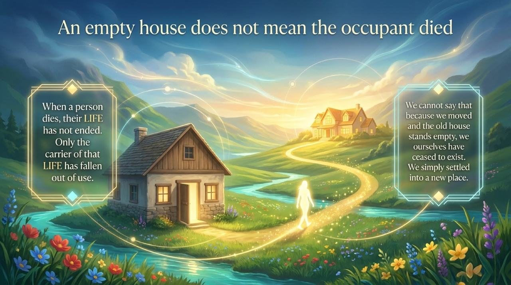
    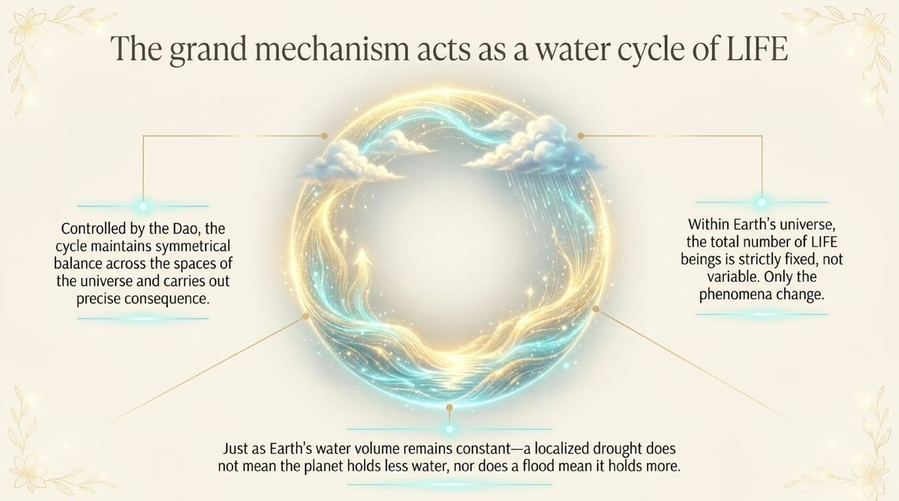
    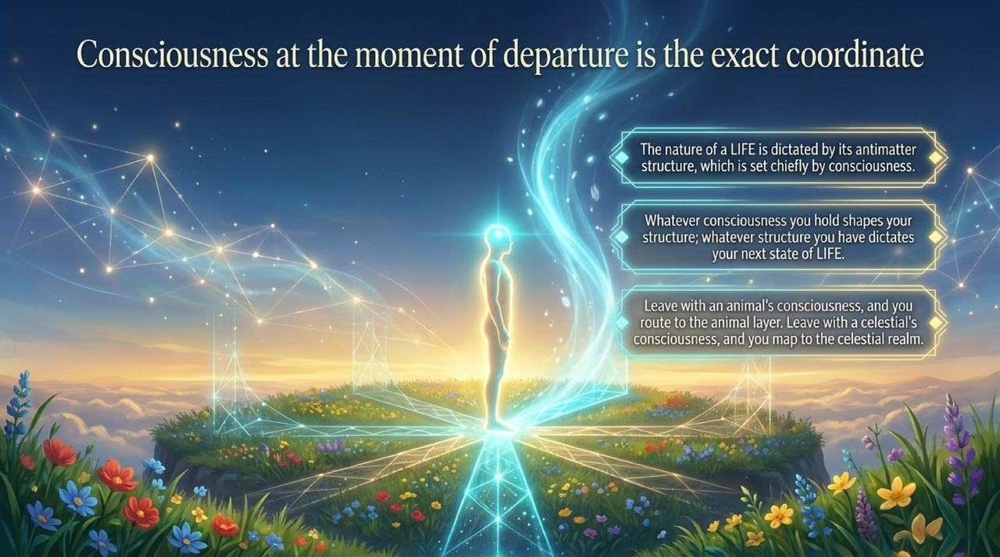
    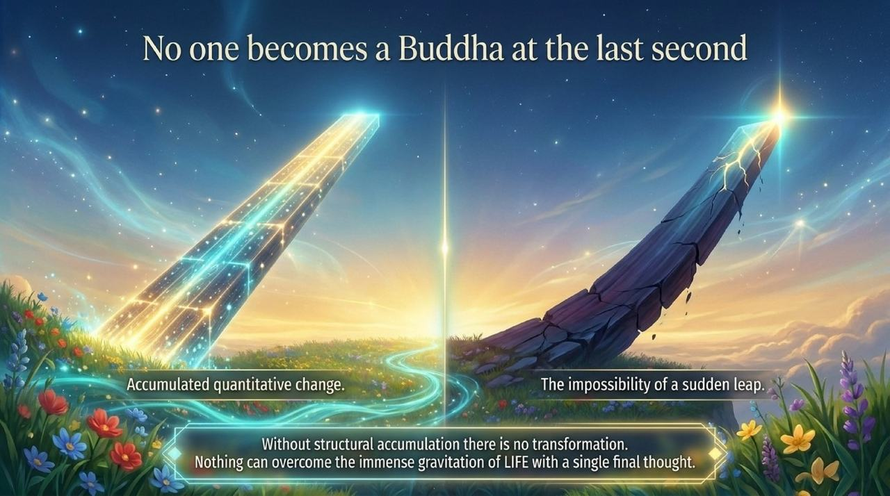
    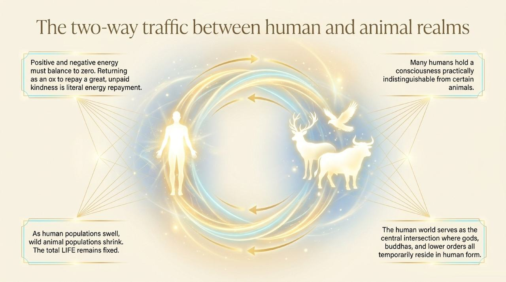
    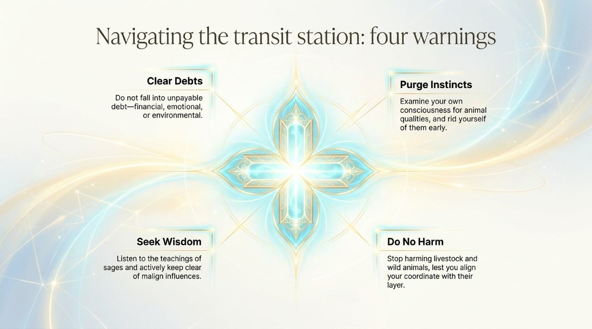
    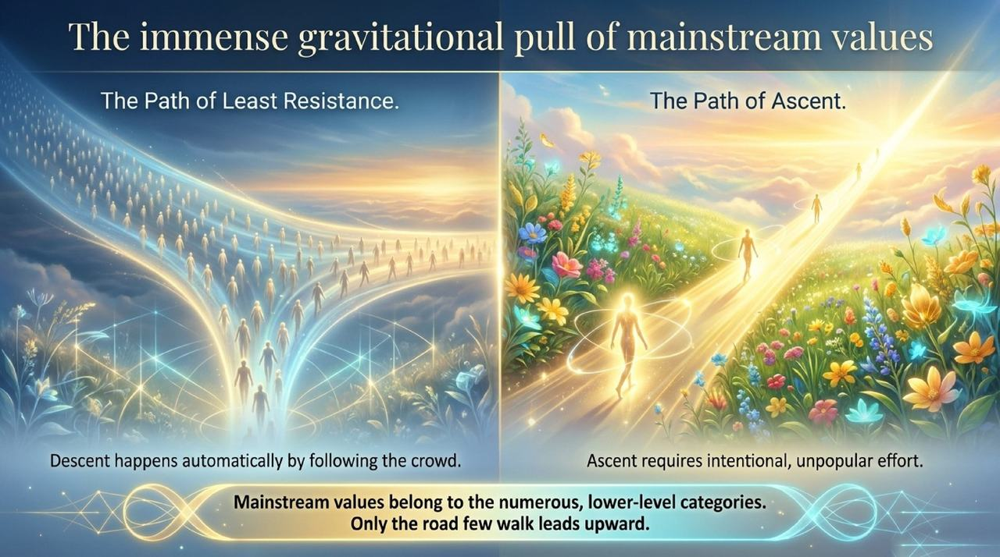
    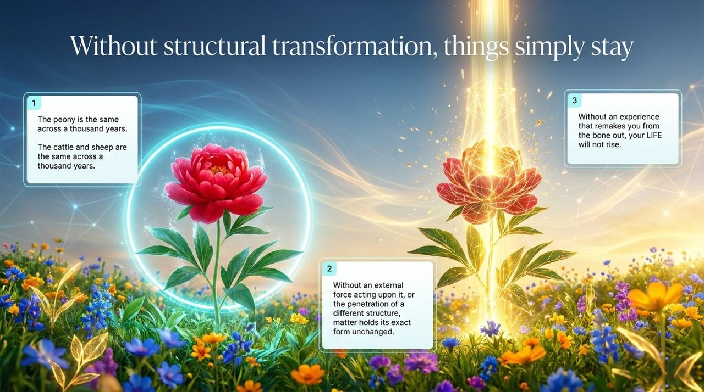
    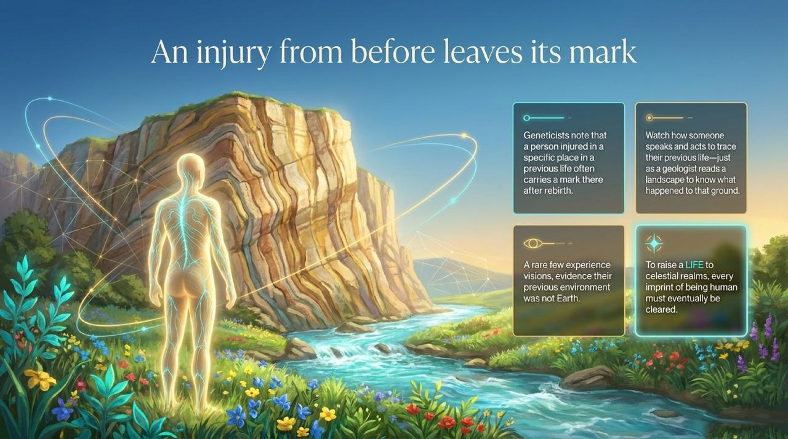
    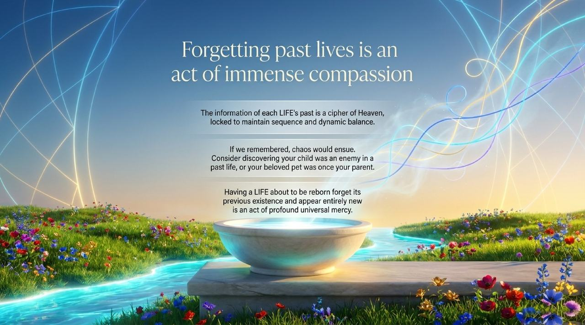
    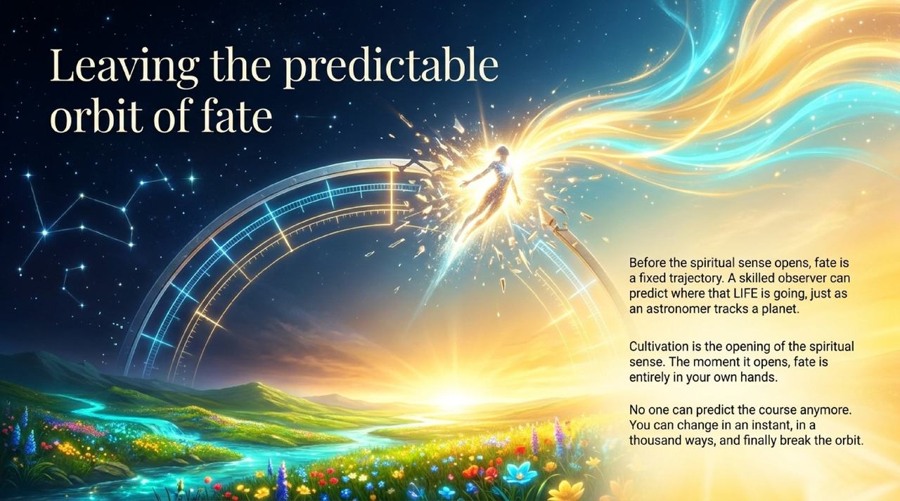

---

| Edition | Best for | Link |
|---------|----------|------|
| Friendly | First-time readers, everyday language | [Read Friendly Edition](/en/life-reincarnation/friendly/) |
| Academic | Researchers, source analysis, systematic study | [Read Academic Edition](/en/life-reincarnation/academic/) |
| Internal | Chanyuan Celestials, full primary-source citations | [Read Internal Edition](/en/life-reincarnation/internal/) |

---

**Related Entries**

[Karma, Retribution & Reincarnation](/en/karma-retribution-reincarnation/) · [Life and Death](/en/life-and-death/) · [LIFE](/en/life/) · [Mysteries of LIFE](/en/life-mysteries/) · [Antimatter Structure](/en/antimatter-structure/) · [Higher LIFE Spaces](/en/high-life-spaces/) · [Thousand-Year World](/en/thousand-year-world/) · [Life Trajectory](/en/life-trajectory/) · [Spirituality](/en/spirituality/) · [Awakening](/en/awakening/)
