# Lifechanyuan's View on Money

**Lifechanyuan's view on money** is a comprehensive framework developed by Guide Xuefeng that redefines wealth, currency, and prosperity from the perspective of LIFE elevation. Its core claim is that currency is merely a temporary exchange symbol — not genuine wealth. True wealth must be understood in a three-tiered hierarchy: spiritual wealth first, mental wealth second, and material wealth last. Within the Lifechanyuan community, a programmatic design eliminates currency circulation entirely, freeing members from the corrupting influence of financial entanglements.

> "Lifechanyuan's view on money is: progressively do away with currency. Resident Chanyuan Celestials do not handle currency… When there is no financial interest binding people together, getting along becomes simple, relaxed, and easy — extraordinarily harmonious and pleasant."
>
> — Xuefeng Corpus · Chanyuan Chapter · *Lifechanyuan's View on Money*

| Version | Best for | Focus |
|---------|----------|-------|
| [Friendly version](friendly.md) | First-time readers | Everyday analogies showing why money can be an obstacle |
| [Academic version](academic.md) | Researchers | Theoretical framework, comparisons, and internal logic |
| [Internal reference](internal.md) | Deep study | Original texts, unaltered |

---

## Video

<iframe style="width:100%;aspect-ratio:4/3;border:0" src="https://www.youtube-nocookie.com/embed/dWPWhWEvsL4" title="Lifechanyuan's View on Money (Lifechanyuan Encyclopedia video)" allowfullscreen></iframe>

## Slides

??? info "📖 Illustrated slides (14 pages, click to expand)"

    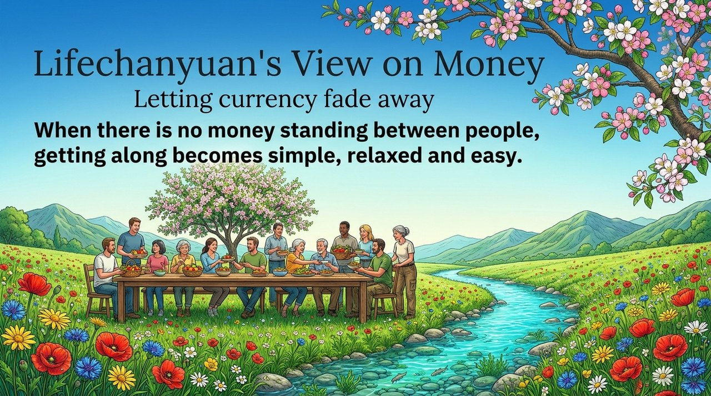
    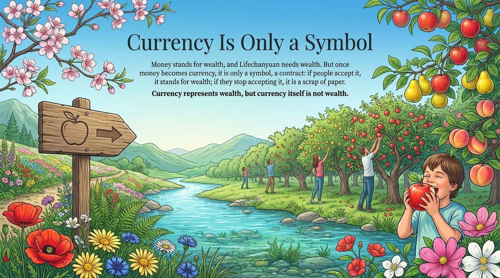
    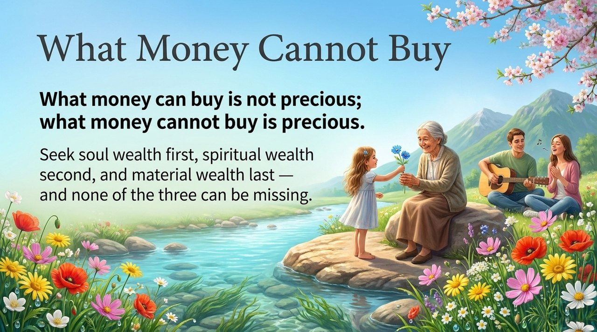
    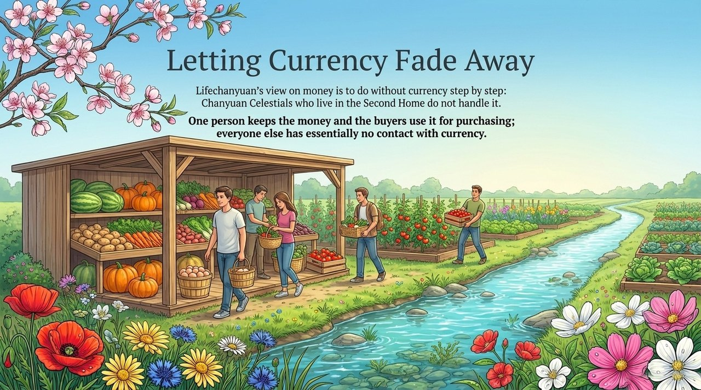
    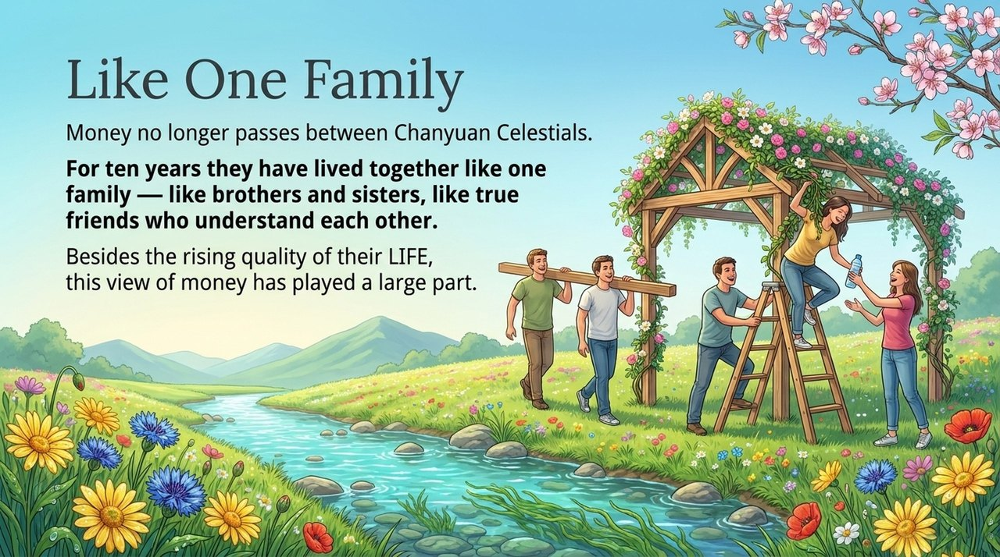
    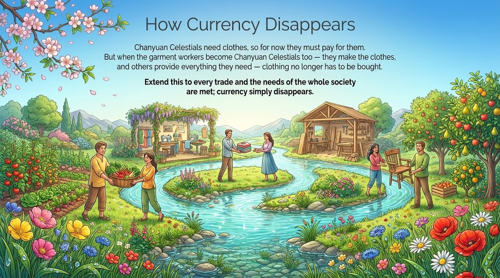
    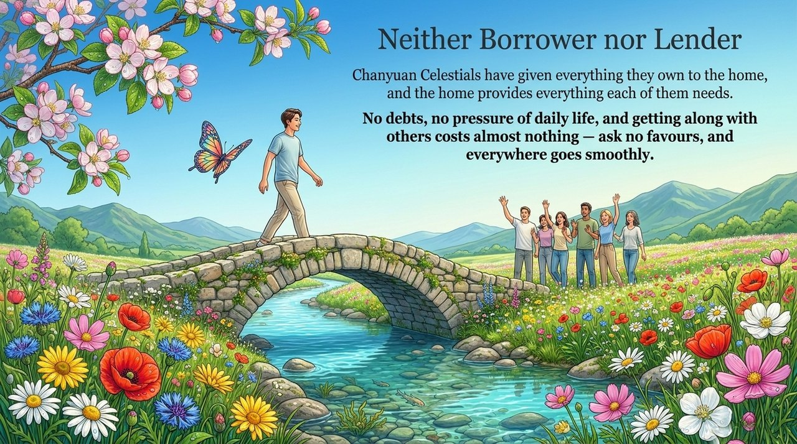
    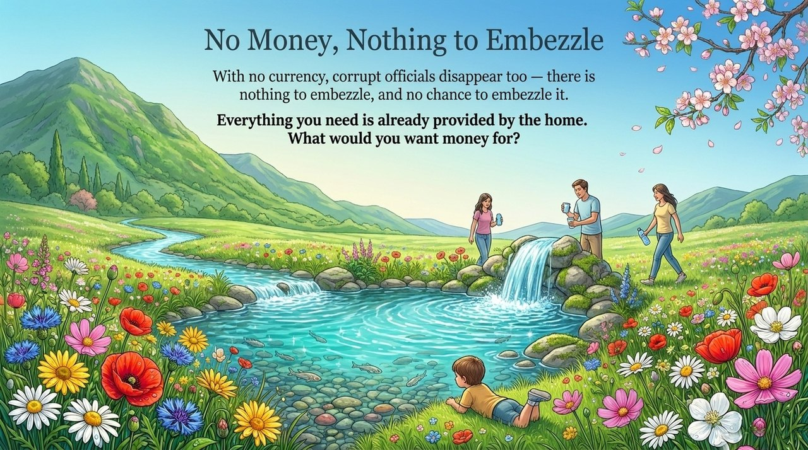
    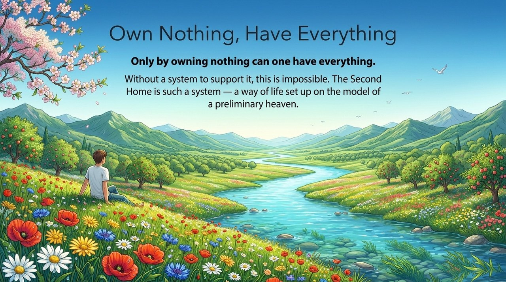
    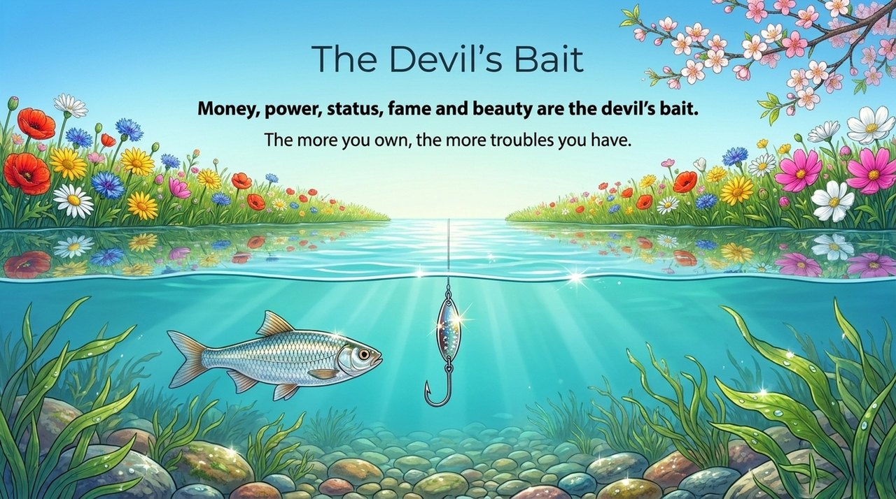
    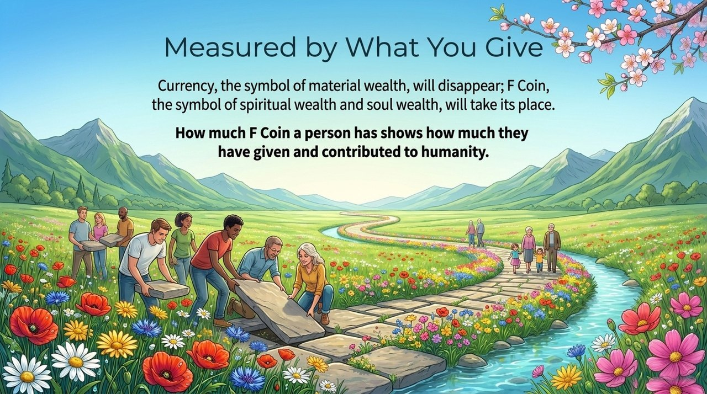
    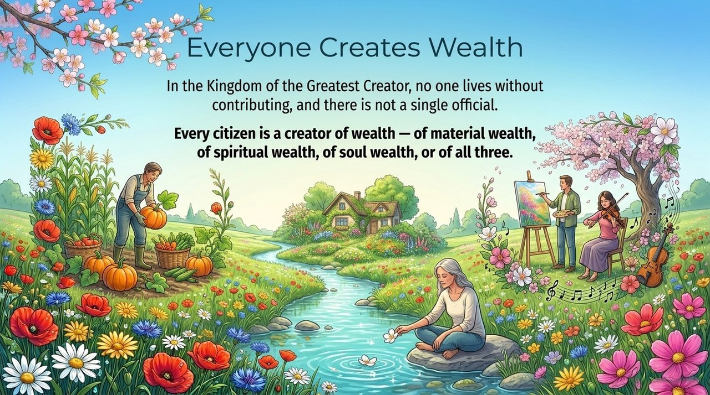
    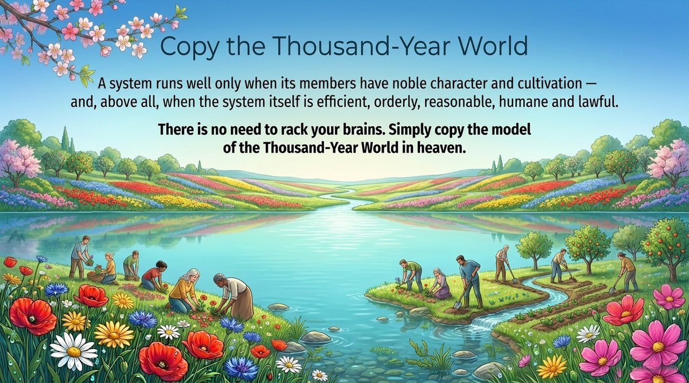
    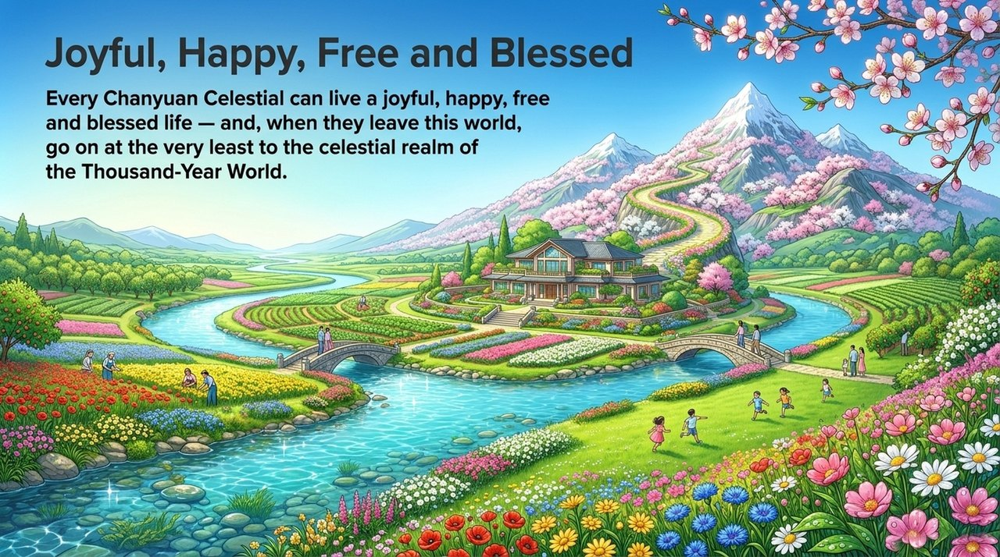

---

## Related Entries

[F-Coin](/en/f-coin/) · [Heavenly Treasures](/en/heavenly-treasures/) · [Hundun Economy](/en/hundun-economy/) · [The Greatest Creator Is the Primary Productive Force](/en/greatest-creator-first-productive-force/) · [Three Forms of Wealth](/en/three-forms-of-wealth/) · [Second Home](/en/second-home/) · [Xuefeng-Style Communism](/en/xuefeng-communism/) · [New Oasis for LIFE](/en/life-oasis/)
