<!-- id: LC-NAT-0001-EN theme: Universe-LIFE System type: Gateway Page direction: Ontological Origin lang: en -->

# Nature (性 Xìng)

[Entry Gateway]

> In Lifechanyuan terminology, **LIFE** (capitalized) refers to the ontological
> essence of existence — the soul/antimatter structure that persists across
> incarnations — while **life** (lowercase) refers to the experiential stage
> of human existence in this world.

**Nature** (性, Xìng) is the deepest, most fundamental concept in the Lifechanyuan theoretical system. It is the characteristic of **Structure** — one of the Three Cosmic Elements — one of the three essential qualities of the Way of the Greatest Creator, the ultimate destination of all cultivation, another name for Buddha, and the foundational basis of all existence and distinction among the ten thousand things.

> The true transmission contains only one word: **Nature** (性).
>
> — Guide Xuefeng, *New Era Human 800 Concepts*, Article 799

---

## Video

<iframe style="width:100%;aspect-ratio:4/3;border:0" src="https://www.youtube-nocookie.com/embed/psuOfE8AWRk" title="Nature (Xing) (Lifechanyuan Encyclopedia video)" allowfullscreen></iframe>

## Slides

??? info "📖 Illustrated slides (14 pages, click to expand)"

    
    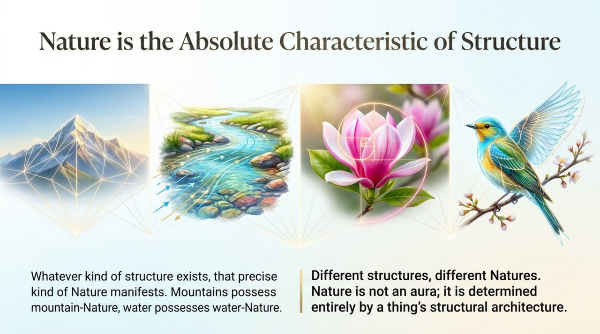
    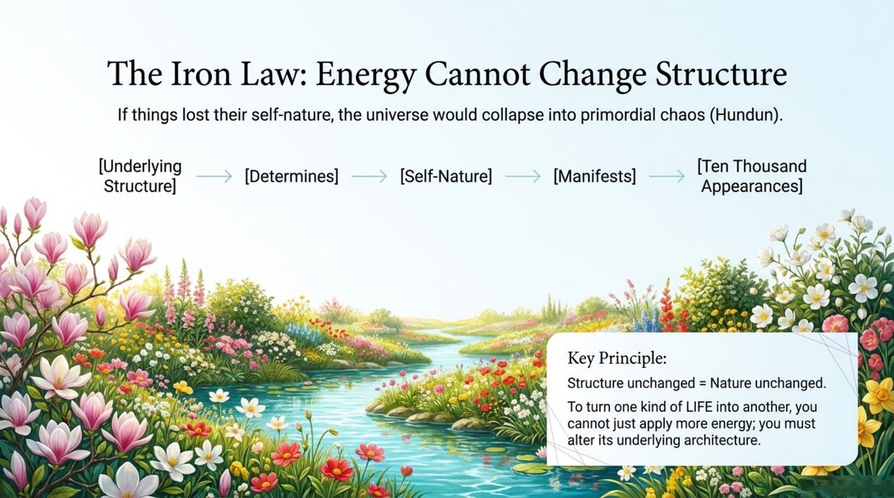
    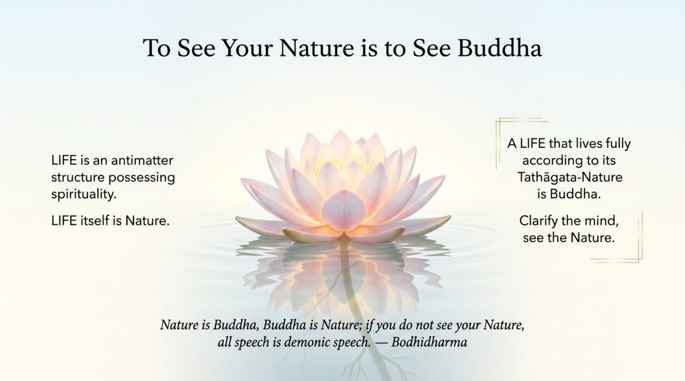
    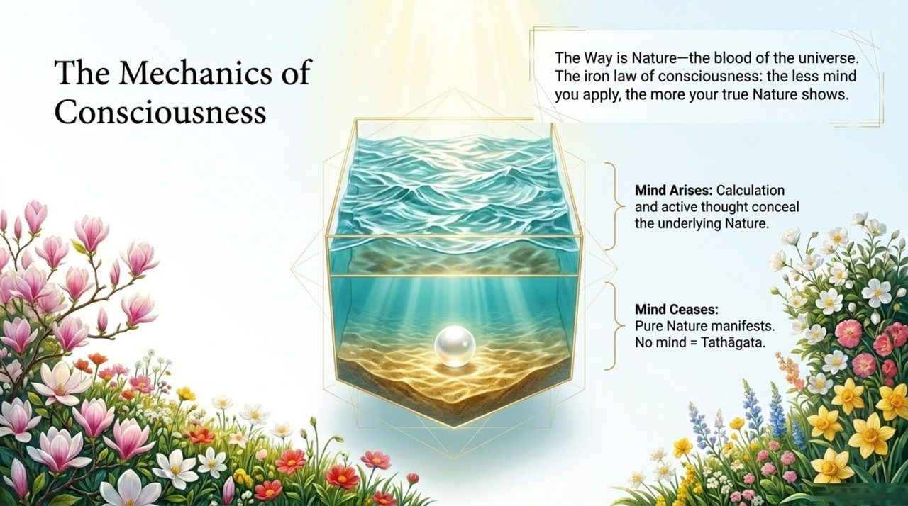
    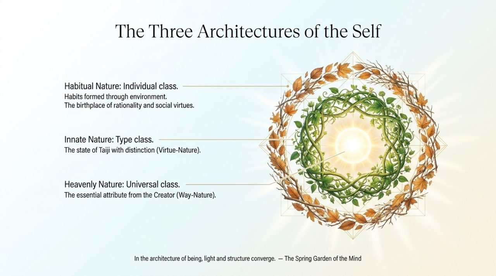
    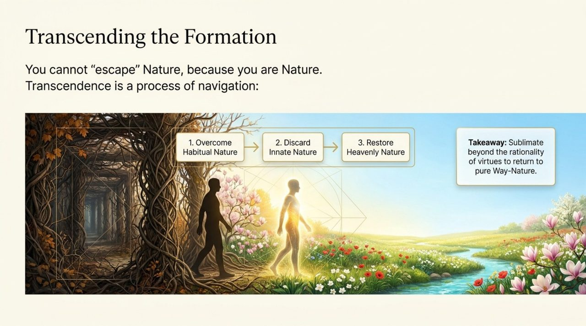
    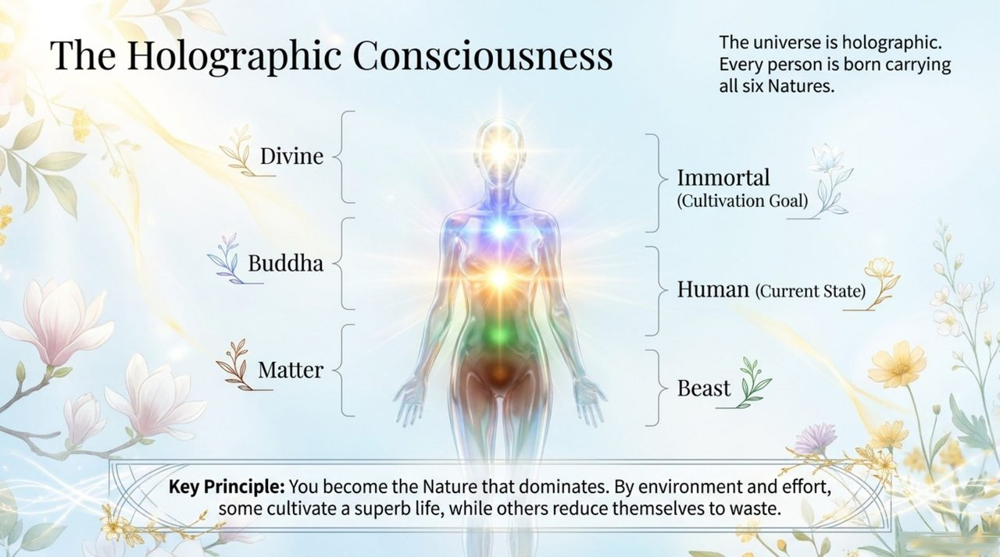
    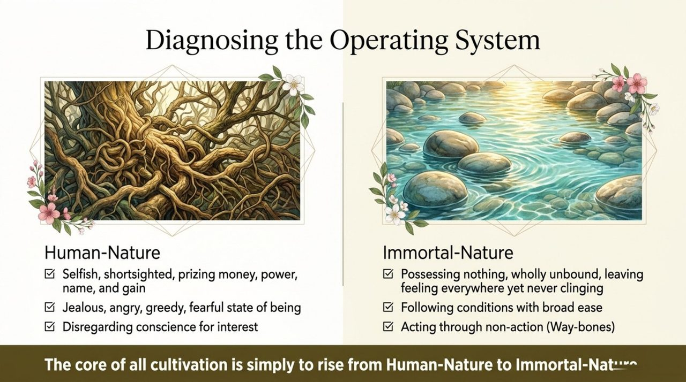
    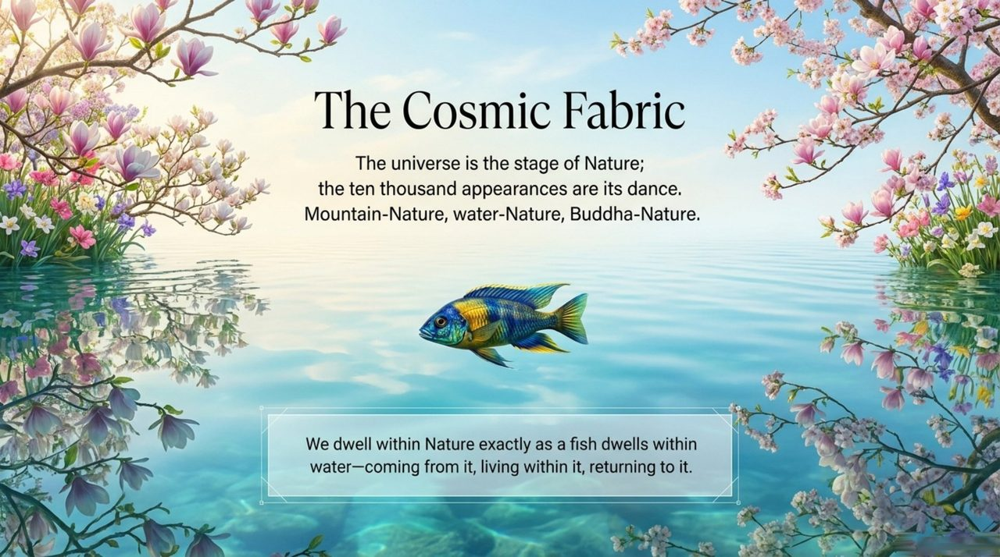
    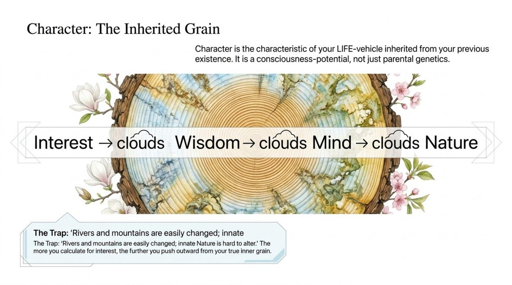
    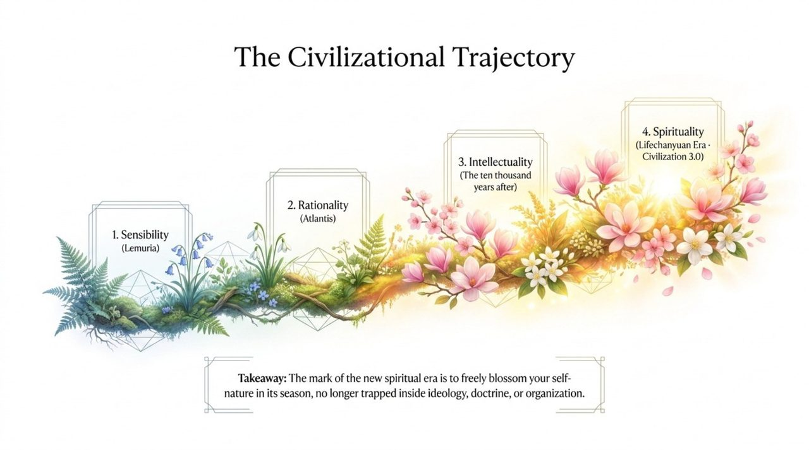
    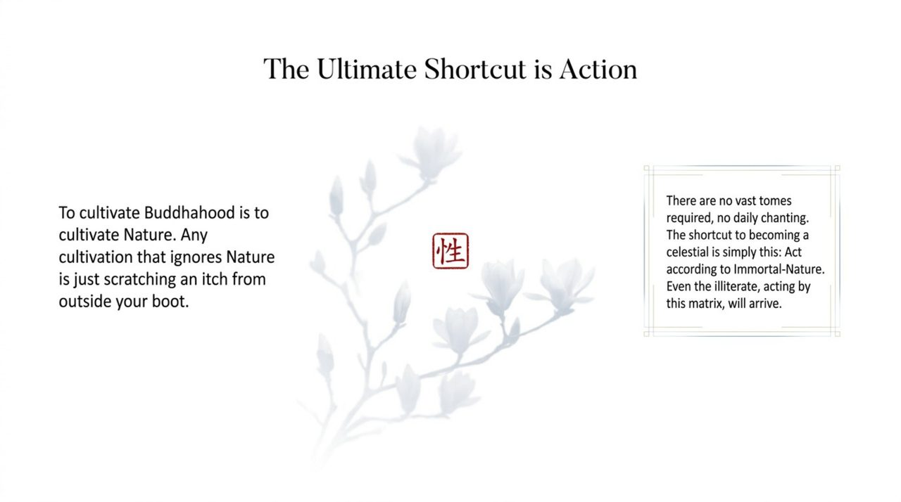
    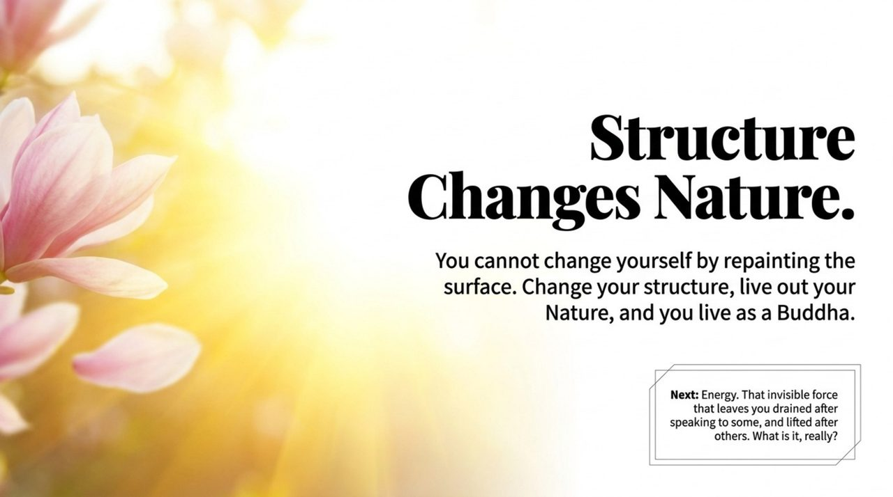

---

## Core Positioning

In the Lifechanyuan system, Nature (Xìng) simultaneously operates on five levels: cosmologically, it is the characteristic of Structure, one of the Three Cosmic Elements; ontologically, Buddha is Nature and Nature is Buddha — seeing one's Nature is becoming Buddha; in cultivation, the true transmission is one word: Nature; as the basis of distinction, each LIFE form has its unique Nature which determines its level and destination.

---

## Read by Edition

| Edition | Intended Reader | Link |
|---------|----------------|-------|
| **Friendly Edition** | Readers new to Lifechanyuan concepts | [Read Friendly Edition](./friendly) |
| **Academic Edition** | Researchers with philosophical/religious studies background | [Read Academic Edition](./academic) |
| **Internal Edition** | Chanyuan Celestials and deep practitioners | [Read Internal Edition](./internal) |

---

## Related Entries

- [Structure](/en/structure/) — Nature is the characteristic of Structure, one of the Three Cosmic Elements
- [Consciousness](/en/consciousness/) — The Way is the characteristic of Consciousness; Nature, Love, and the Way form the essence of the Greatest Creator's Way
- [Energy](/en/energy/) — Love is the characteristic of Energy; the three characteristics together constitute the Way
- [The Greatest Creator](/en/greatest-creator/) — Nature, Love, and the Way are the three essential qualities of the Way of the Greatest Creator
