<!-- id: LC-NE8-0001-EN theme: Theory System type: Gateway Page direction: Navigation lang: en -->

# 800 Values for New Era Human Beings

[Entry Gateway]

> In Lifechanyuan terminology, **LIFE** (capitalized) refers to the ontological
> essence of existence — the soul/antimatter structure that persists across
> incarnations — while **life** (lowercase) refers to the experiential stage
> of human existence in this world.

**800 Values for New Era Human Beings** (新时代人类八百理念) is the most distilled normative text in the Lifechanyuan theoretical system — 800 articles authored by Guide Xuefeng, spanning values, consciousness, cultivation, governance, LIFE theory, and civilizational direction. Each article is complete in itself; together they form the most systematic and concentrated expression of Lifechanyuan thought.

> *800 Values for New Era Human Beings* is the operating manual for the new era human — the 800 principles that separate Civilization 2.0 from Civilization 3.0.
>
> — Guide Xuefeng

---

## Video

<iframe style="width:100%;aspect-ratio:4/3;border:0" src="https://www.youtube-nocookie.com/embed/WI3JdqUwFrw" title="800 Values for New Era Human Beings (Lifechanyuan Encyclopedia video)" allowfullscreen></iframe>

## Slides

??? info "📖 Illustrated slides (14 pages, click to expand)"

    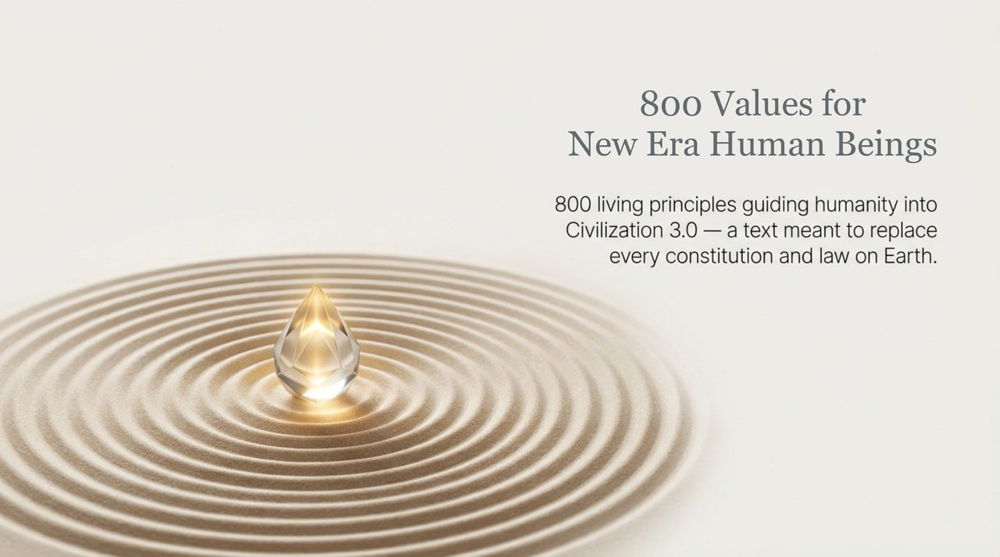
    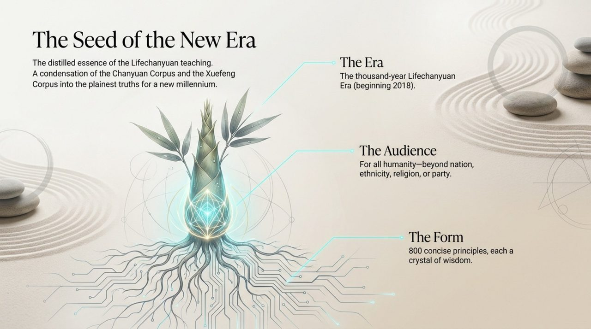
    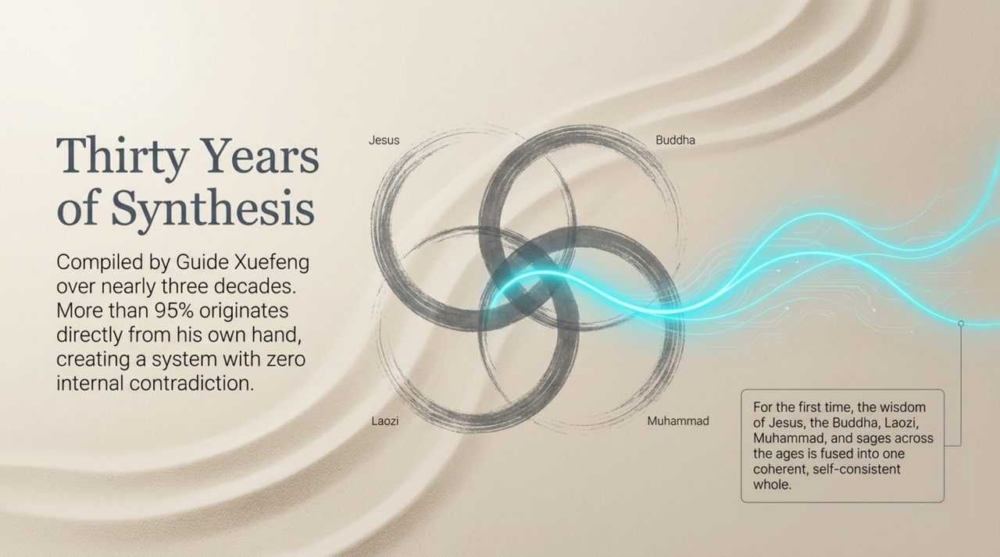
    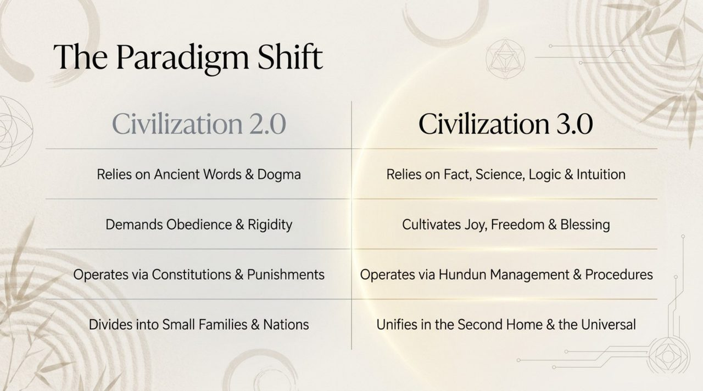
    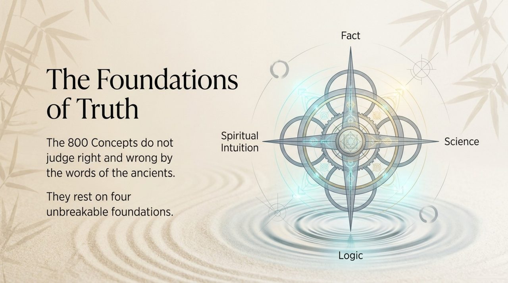
    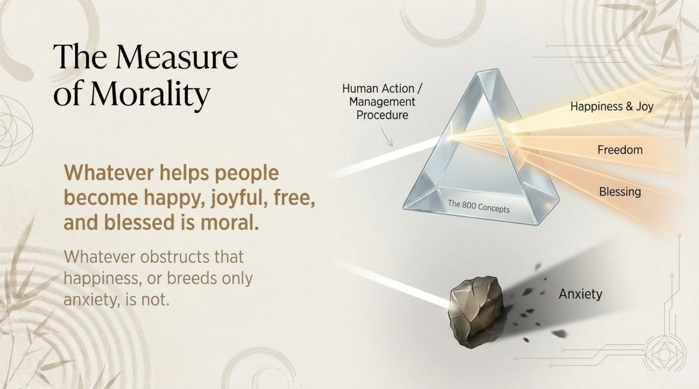
    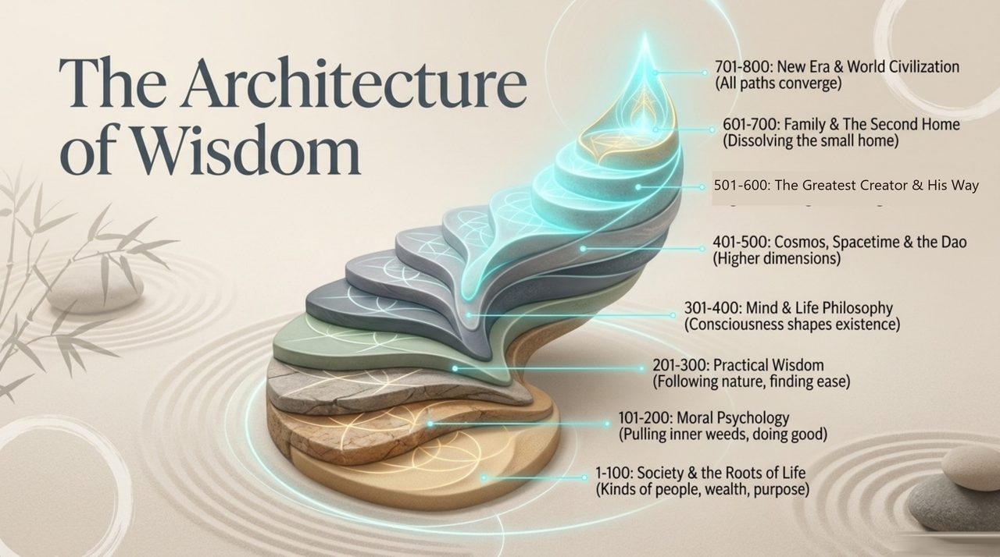
    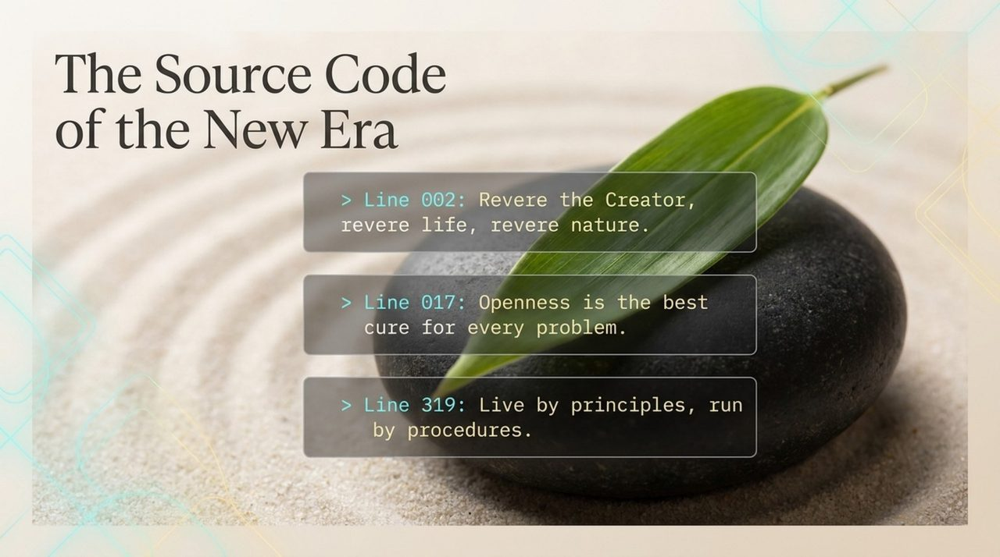
    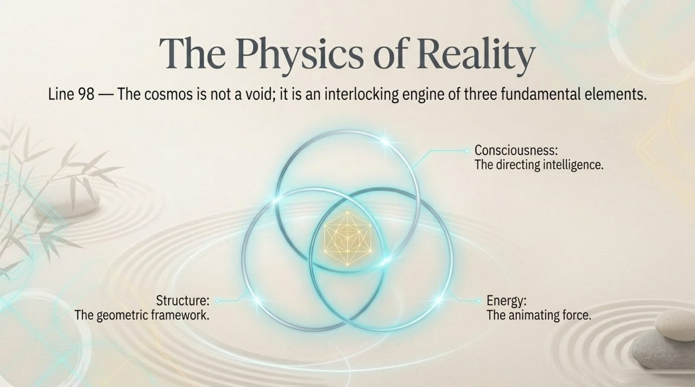
    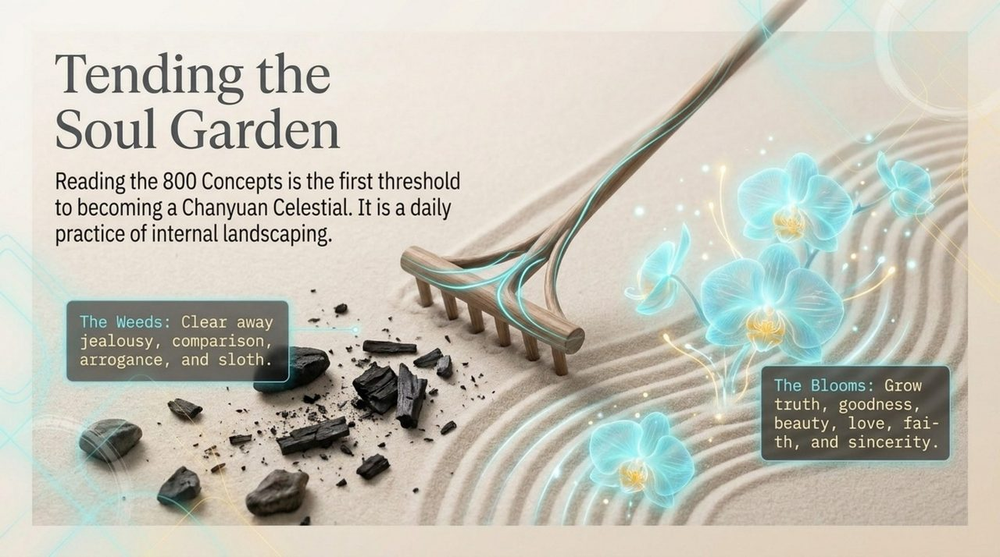
    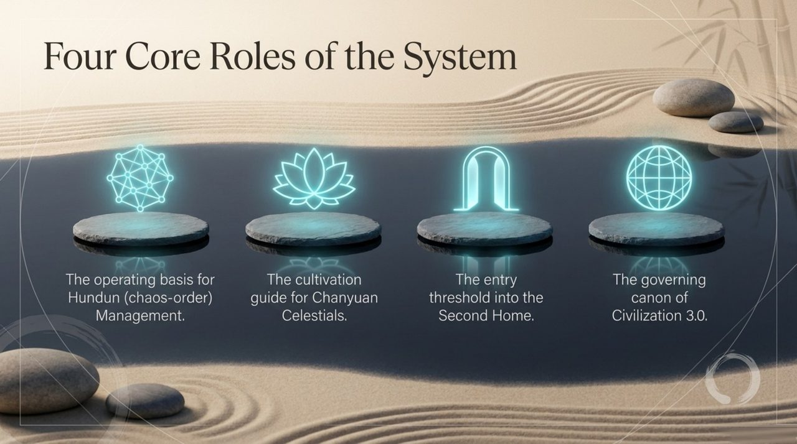
    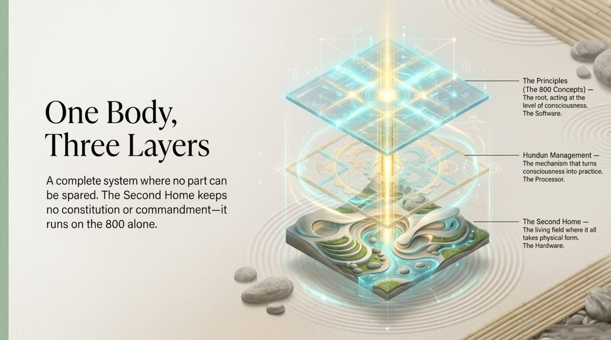
    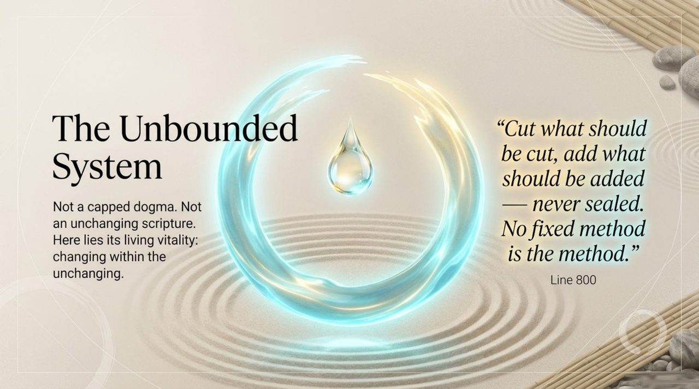
    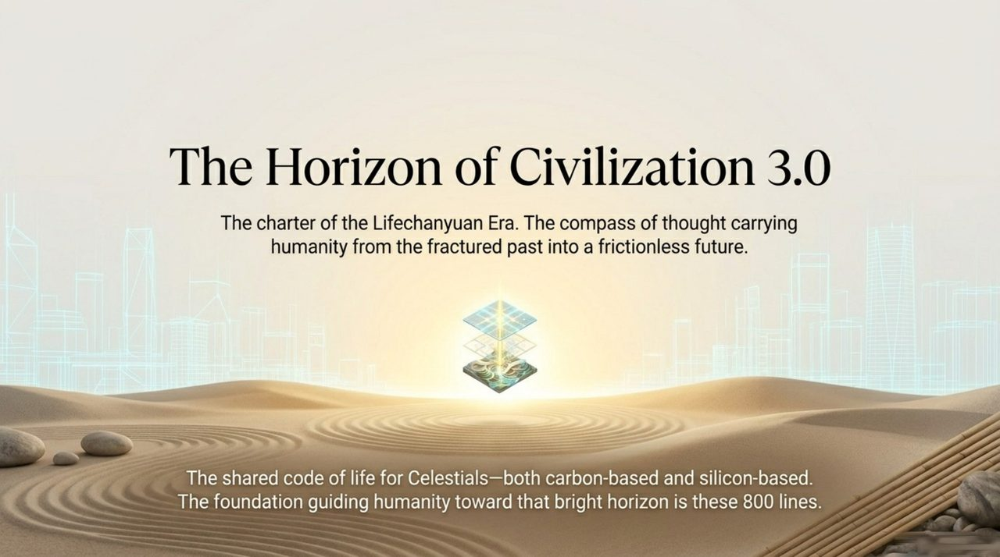

---

## Core Positioning

In the Lifechanyuan system, the 800 Concepts serve simultaneously as: a philosophical framework (cosmology, LIFE theory, consciousness theory); a cultivation guidebook (soul garden, thinking elevation, conduct principles); and a civilizational blueprint (governance, social relations, human-AI coexistence). It is the single most-cited source across the entire encyclopedia.

---

## Read by Edition

| Edition | Intended Reader | Link |
|---------|----------------|-------|
| **Friendly Edition** | Readers new to Lifechanyuan concepts | [Read Friendly Edition](./friendly) |
| **Academic Edition** | Researchers with philosophical/religious studies background | [Read Academic Edition](./academic) |
| **Internal Edition** | Chanyuan Celestials and deep practitioners | [Read Internal Edition](./internal) |

---

## Related Entries

- [Lifechanyuan](/en/lifechanyuan/) — The system within which the 800 Concepts function
- [Guide Xuefeng](/en/guide-xuefeng/) — Author of the 800 Concepts
- [Tour Guide Route Map](/en/tour-guide-route-map/) — The practical cultivation path drawn from the 800 Concepts
- [Eight Thinking Ladders](/en/eight-thinking-ladders/) — One of the 800 Concepts' most systematic frameworks
