# Nirvana

> **Emptiness = No-Form = No-Self = Ultimate Nirvana = Elysium World = the Tao = Buddha = Celestial Being.**
>
> — Xuefeng, *Emptiness Is Ultimate Nirvana*

| Version | Best for | Focus |
|---------|----------|-------|
| [Friendly version](friendly.md) | First-time readers | Plain-language explanation of what Nirvana means and how to reach it |
| [Academic version](academic.md) | Researchers | Nirvana's place in Lifechanyuan's cosmological system and cultivation paths |
| [Internal reference](internal.md) | Deep study | Full original-text compilation with citations |

## Overview

In the Lifechanyuan system, "Nirvana" is a core concept describing the ultimate transcendence and destination of life. It is not death — it is the leap of life into a state of emptiness, union with the Tao, and arrival at the Elysium World. "Ultimate Nirvana" equals becoming a Buddha or Celestial Being and entering the Elysium World — the pinnacle of cultivation.

Lifechanyuan emphasizes the "Phoenix Nirvana" method — a radical transformation through cultivation practice — as the primary path to Nirvana. Guide Xuefeng offers a unique interpretation of the Buddhist notion of "Nirvana's tranquility," arguing that true Nirvana is not lifeless emptiness, but the supreme state of great freedom, great fulfillment, and union with the Tao.

---

## Video

<iframe style="width:100%;aspect-ratio:4/3;border:0" src="https://www.youtube-nocookie.com/embed/XHIA8Ex4wsY" title="Nirvana (Lifechanyuan Encyclopedia video)" allowfullscreen></iframe>

## Slides

??? info "📖 Illustrated slides (14 pages, click to expand)"

    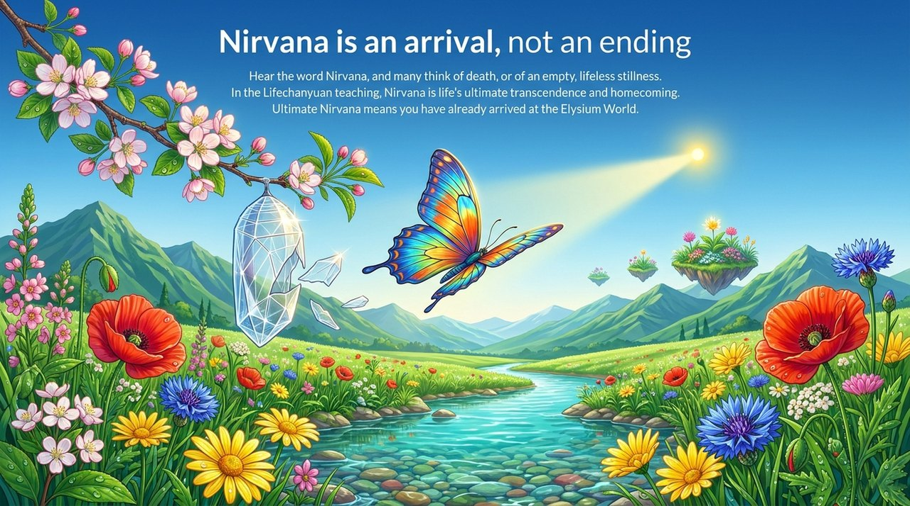
    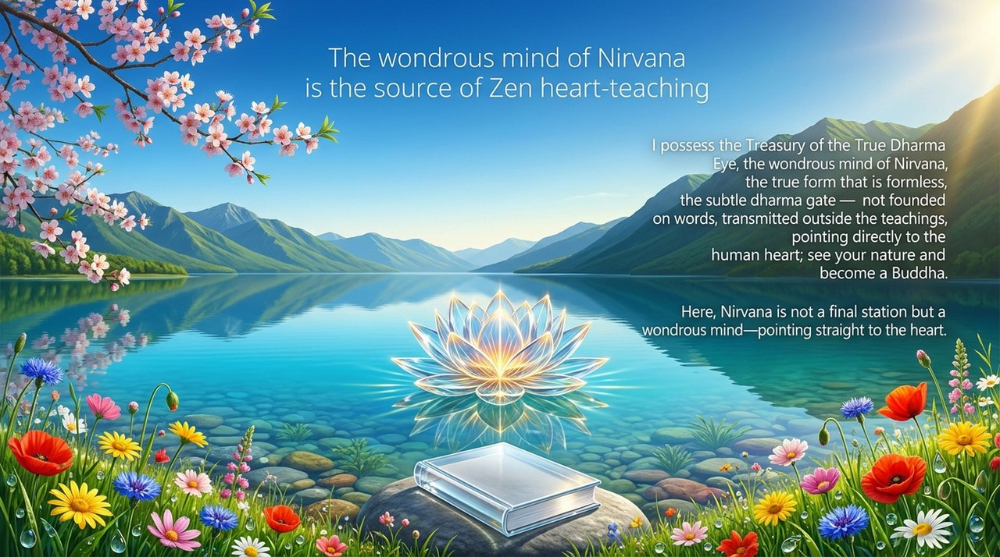
    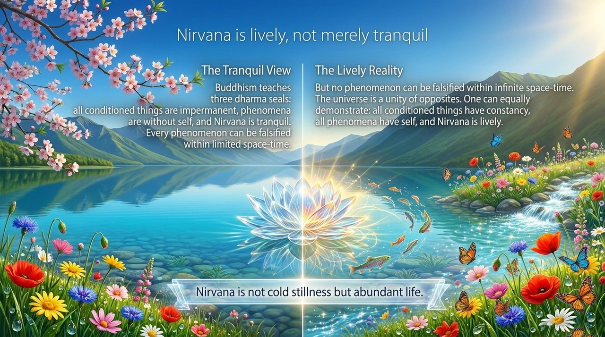
    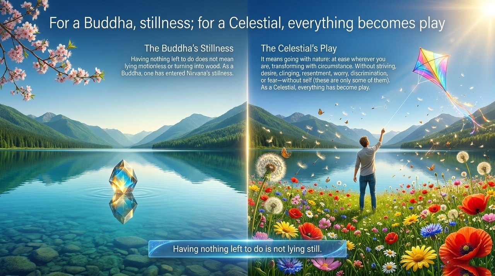
    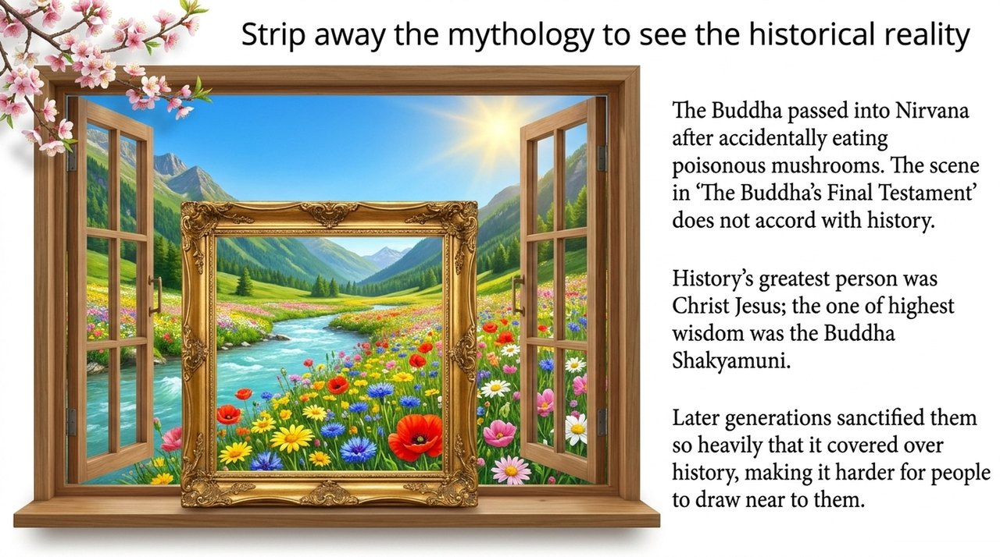
    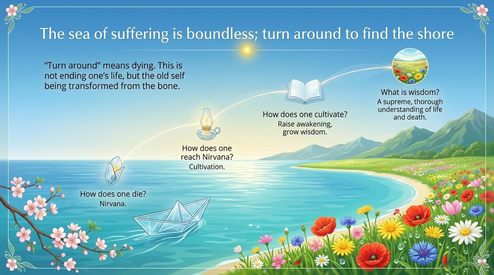
    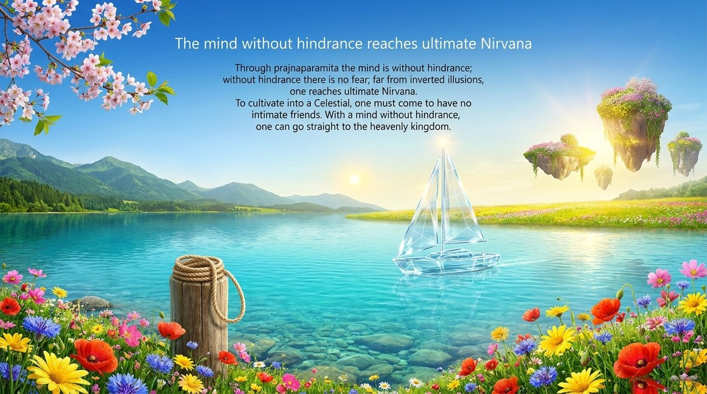
    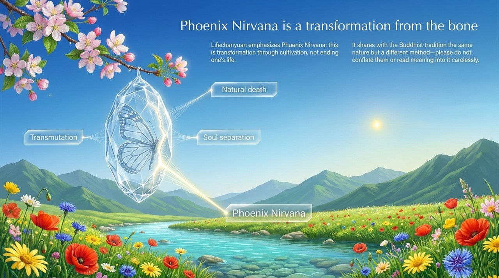
    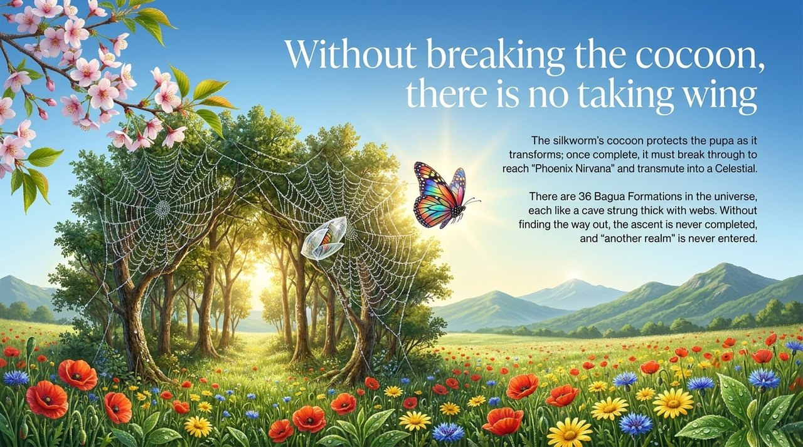
    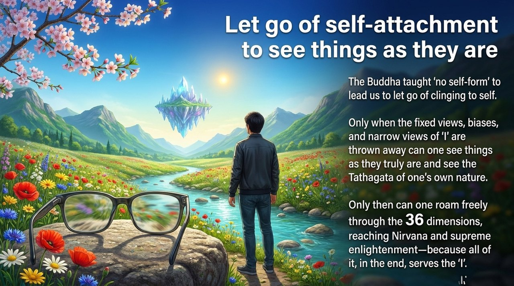
    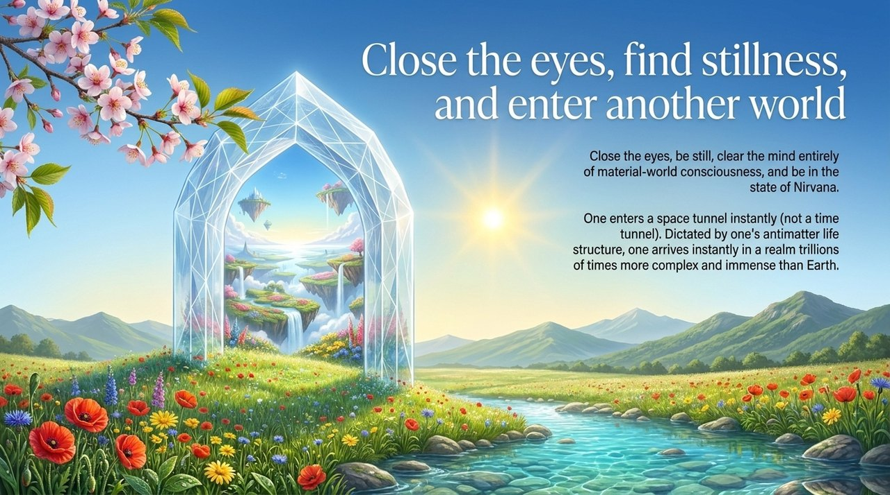
    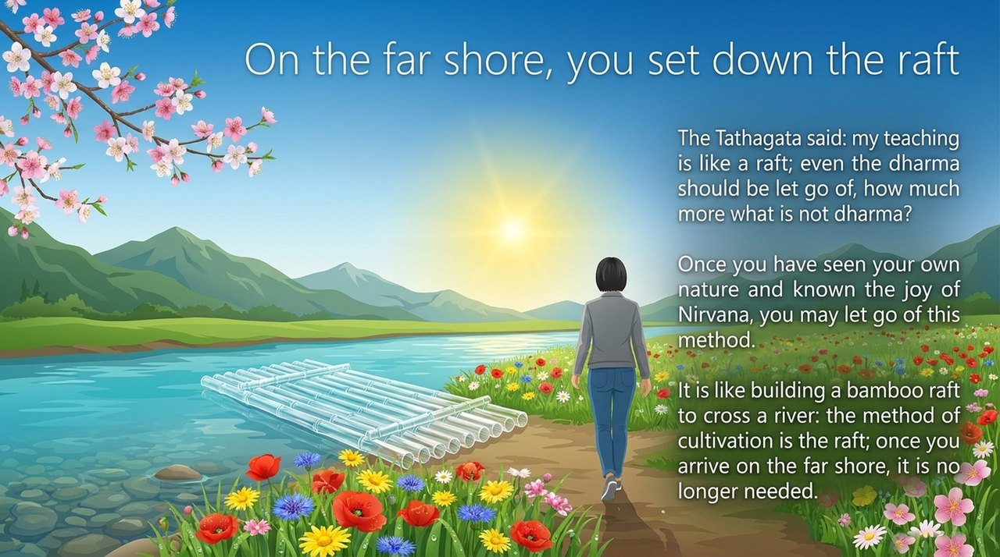
    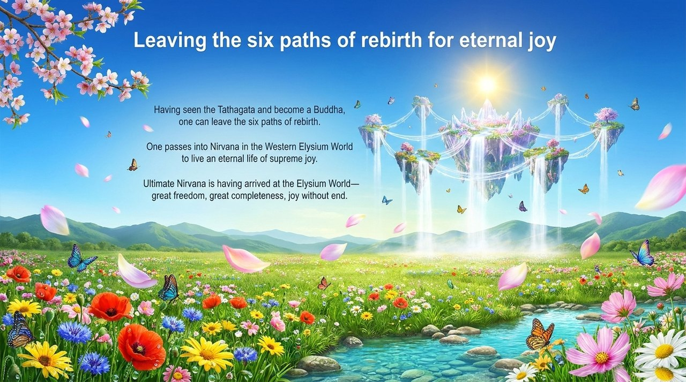
    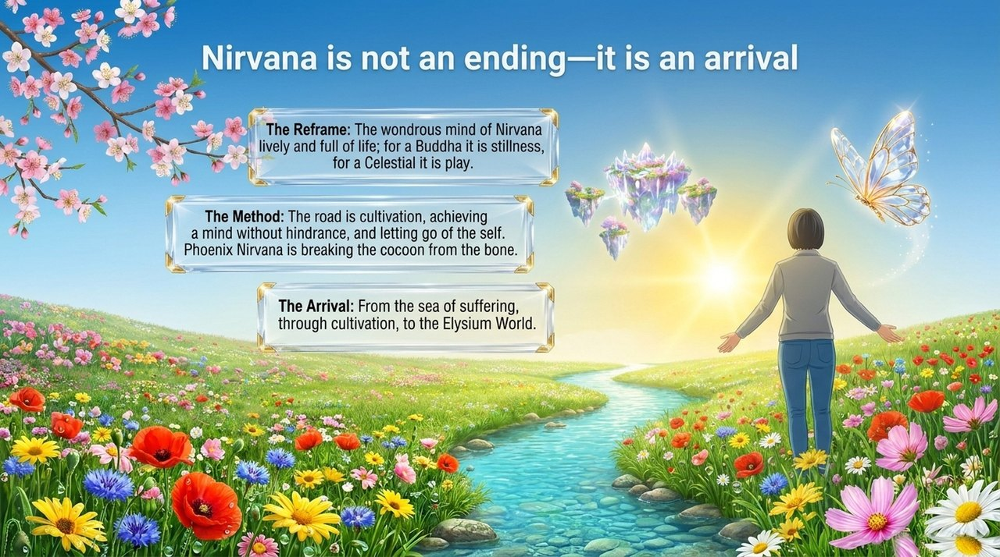

---

## Related Entries

- [Becoming a Buddha](/en/becoming-buddha/) · [Becoming a Celestial](/en/becoming-celestial/) · [Becoming Celestial & Buddha](/en/becoming-celestial-buddha/)
- [Illuminate Mind, See Nature](/en/illuminate-mind-see-nature/) · [Elysium World](/en/elysium-world/) · [No-Self, No-Form](/en/no-self-no-form/)
- [Heart Unattached, Mind Unencumbered](/en/xinwu-suozhu-guaai/) · [Metamorphosis into Celestial](/en/yuhuachengxian/)
- [Letting Go](/en/letting-go/) · [Celestial, Heavenly Celestial, Buddha](/en/xian-tian-xian-fo/)
