# Past Life, Present Life, and Future Life

**Past life, present life, and future life** is a foundational concept in Lifechanyuan's spiritual cosmology, describing the three continuous segments of a LIFE's journey through time. One's thoughts, intentions, and actions in a past life compose the "fate-formation" (命阵) that governs the present life's circumstances; the efforts and inner state of the present life, in turn, inscribe the future life's script. These three segments are woven together through the Dao's cosmic programming and the law of cause and effect.

> "Only those who clearly understand their own past and can see their own future are truly living with clarity — they alone can turn tragedy into joy, and step from the realm of necessity into the realm of freedom."
>
> — 800 Values for New Era Humanity, Value 45

## Video

<iframe style="width:100%;aspect-ratio:4/3;border:0" src="https://www.youtube-nocookie.com/embed/sxCTC5ex0rE" title="Past Life, Present Life, and Future Life (Lifechanyuan Encyclopedia video)" allowfullscreen></iframe>

## Slides

??? info "📖 Illustrated slides (12 pages, click to expand)"

    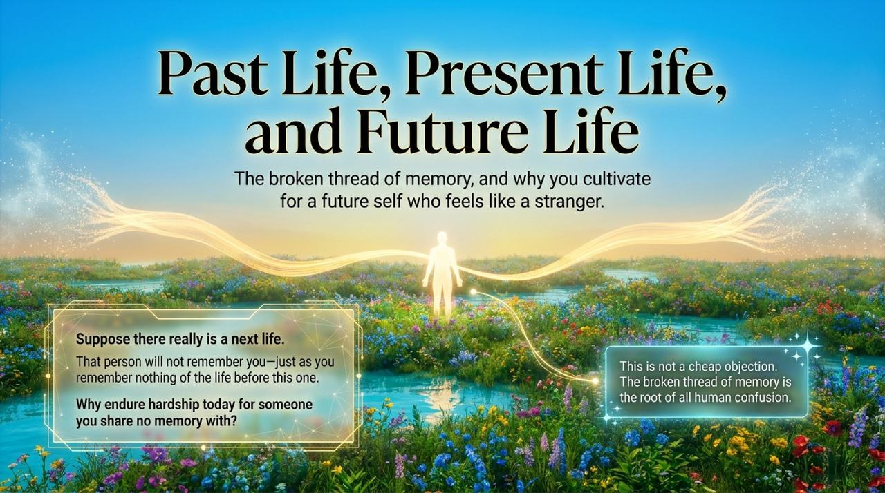
    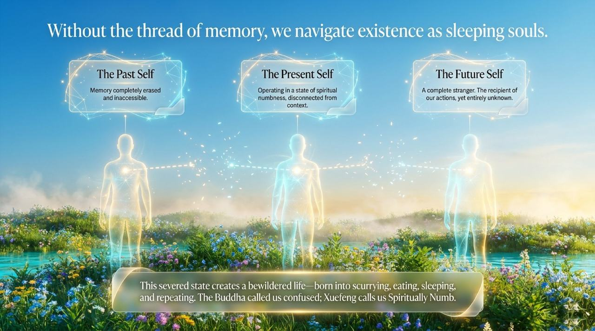
    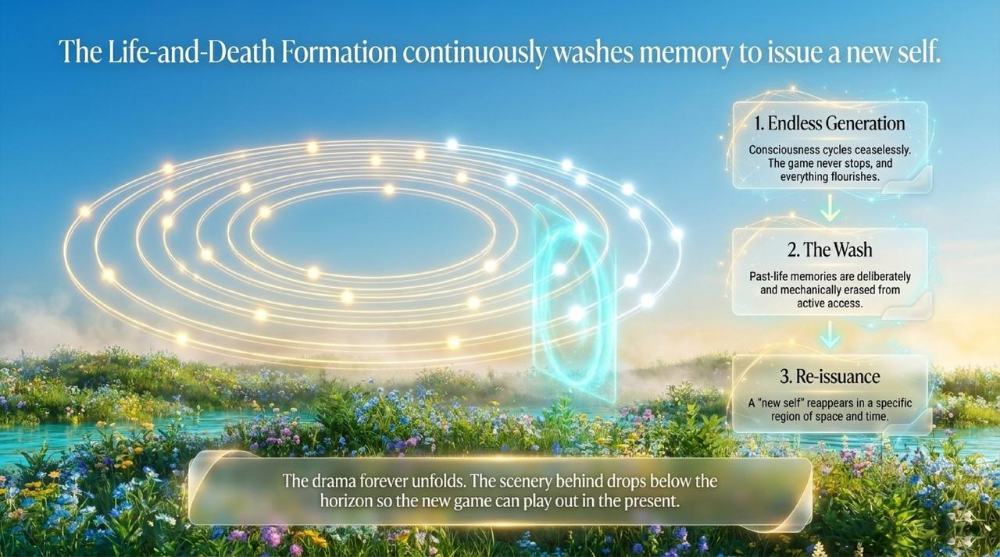
    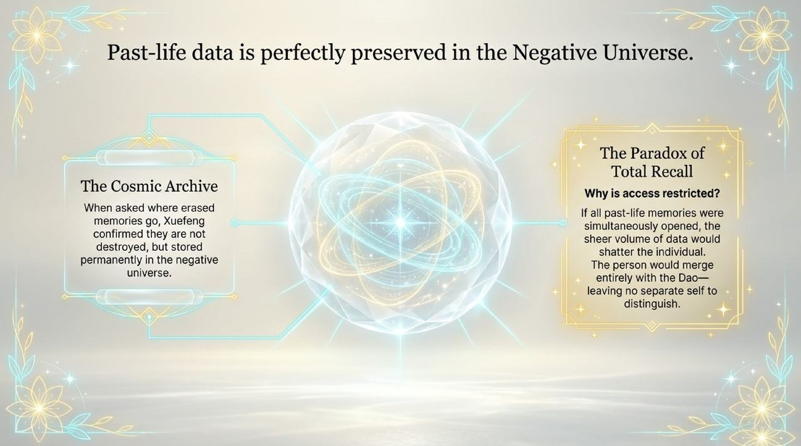
    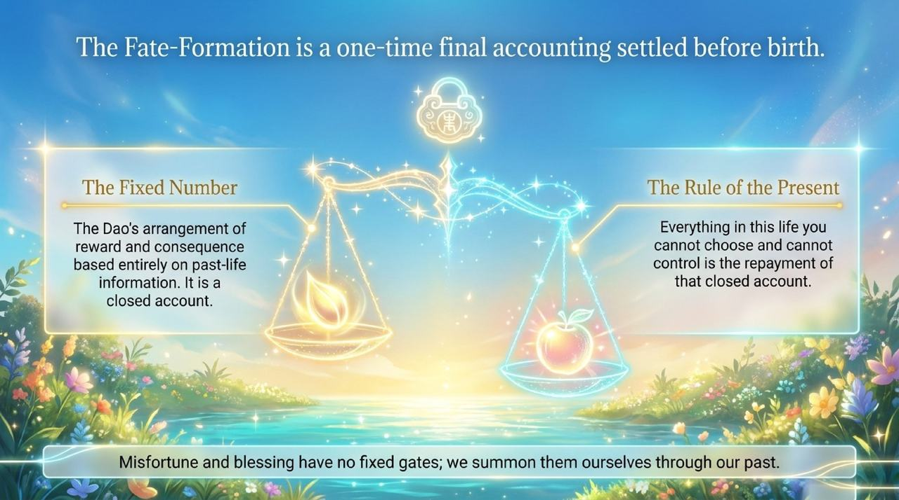
    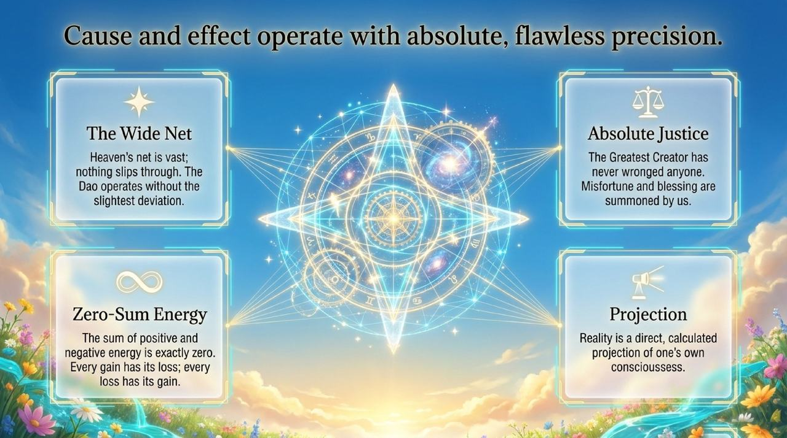
    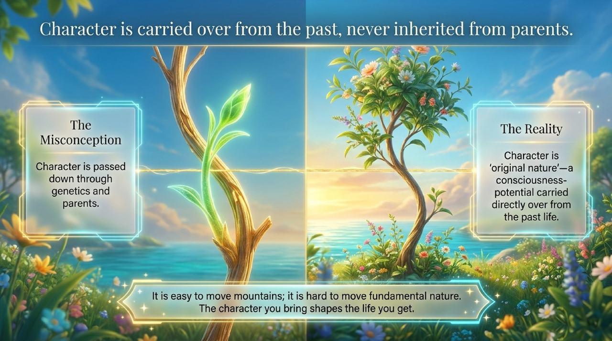
    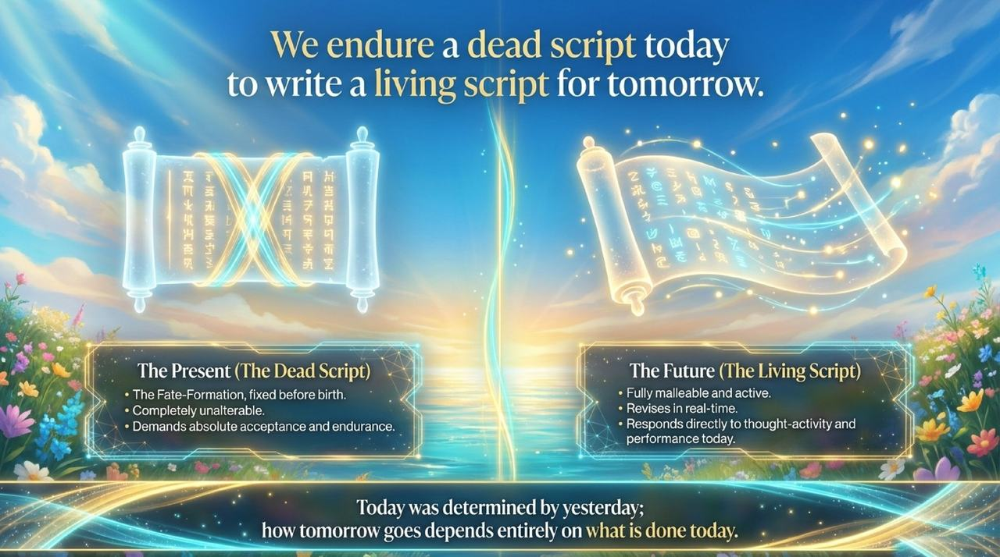
    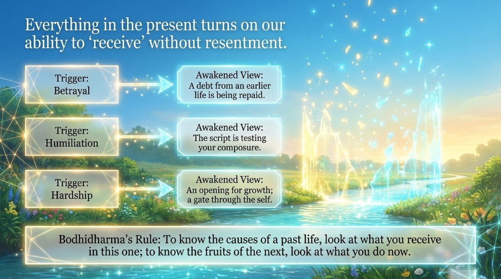
    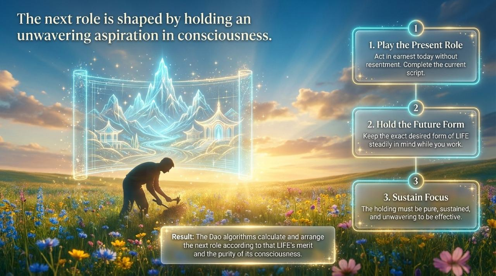
    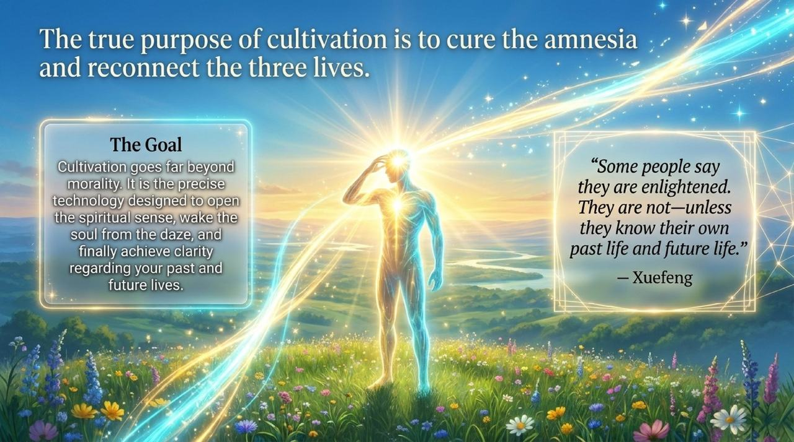
    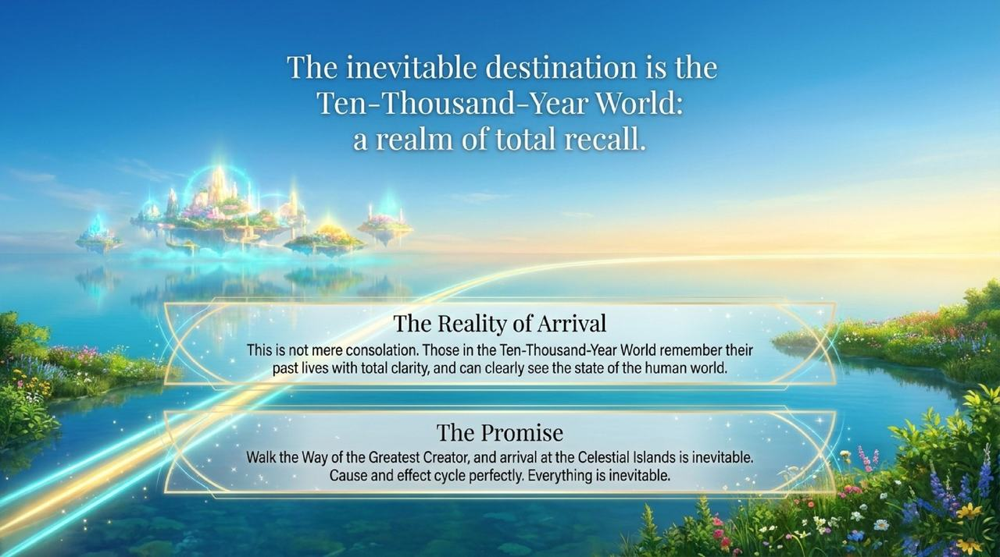

| Version | Best for | Focus |
|---------|----------|-------|
| [Friendly version](friendly.md) | First-time readers | Life analogies that illuminate the three-life journey |
| [Academic version](academic.md) | Researchers | Systematic analysis of mechanism, memory storage, and cultivation significance |
| [Internal reference](internal.md) | Deep study | Original source texts, unaltered |

## Related Entries

[Karma · Retribution · Reincarnation](/en/karma-retribution-reincarnation/) · [Reincarnation of LIFE](/en/life-reincarnation/) · [The Life Script](/en/cosmic-script/) · [Reincarnation and Abortion](/en/reincarnation-and-abortion/) · [The Law of Indestructibility of LIFE](/en/law-of-life-indestructibility/) · [Awakening](/en/awakening/) · [Spiritual Awareness](/en/spiritual-awareness/) · [Becoming Celestial and Buddha](/en/becoming-celestial-and-buddha/)
