# Path Beyond Spacetime

> Transcending spacetime is an enormously complex undertaking… It is a vast systematic project. Those who rely solely on idealism will certainly fail; those who rely solely on materialism have no chance either. Only the chaotic (hundun) way of thinking and the chaotic method hold any hope of walking the Path Beyond Spacetime.  
> — Guide Xuefeng, *Chanyuan Corpus · Universe and Spacetime · Path Beyond Spacetime*

The **Path Beyond Spacetime** carries two distinct meanings in the Lifechanyuan system. Historically, it was the original title of Guide Xuefeng's foundational 2002 manuscript — later renamed *Lifechanyuan* at the suggestion of Ehuang Cao. As a living concept, it refers to the complete systematic project of transcending the constraints of physical time and space — through hundun thinking, life in the Second Home, and step-by-step practice along the Tour Guide Route — ultimately arriving at higher life spaces: the Thousand-Year World, the Ten-Thousand-Year World, and the Elysian Fields.

| Version | Best for | Focus |
|---------|----------|-------|
| [Friendly version](friendly.md) | First-time readers | What the path is and why Lifechanyuan embodies it |
| [Academic version](academic.md) | Researchers | Spacetime theory, the seven transcendence pathways, comparative analysis |
| [Internal reference](internal.md) | Deep study | Complete source texts on transcending spacetime |

## Video

<iframe style="width:100%;aspect-ratio:4/3;border:0" src="https://www.youtube-nocookie.com/embed/xkIUSzXc0OI" title="Path Beyond Spacetime (Lifechanyuan Encyclopedia video)" allowfullscreen></iframe>

## Slides

??? info "📖 Illustrated slides (14 pages, click to expand)"

    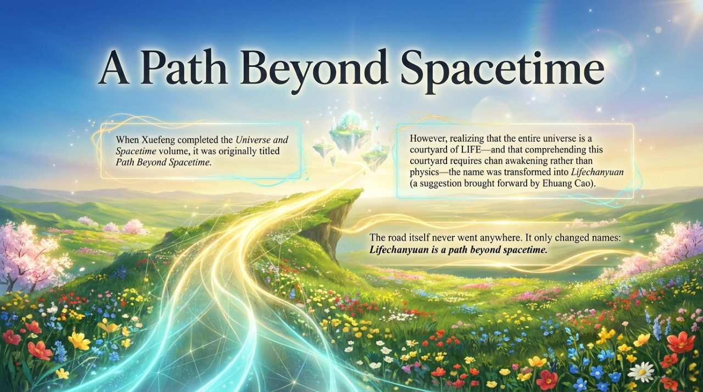
    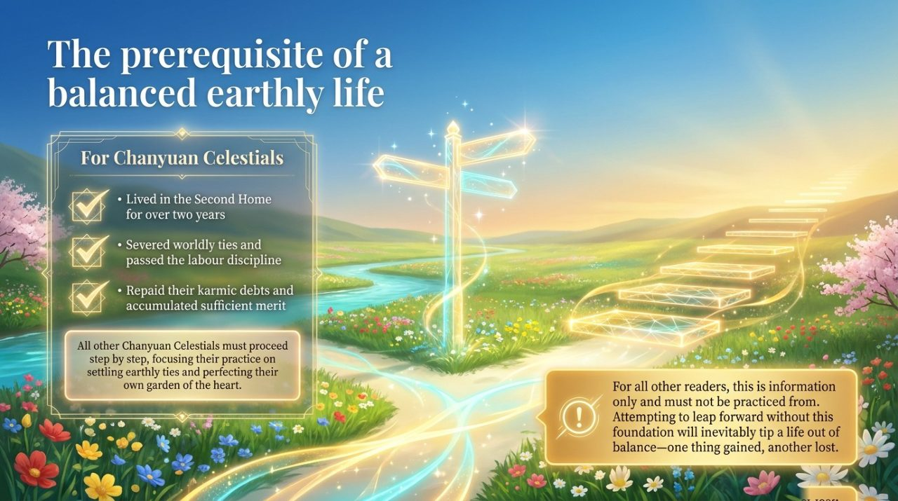
    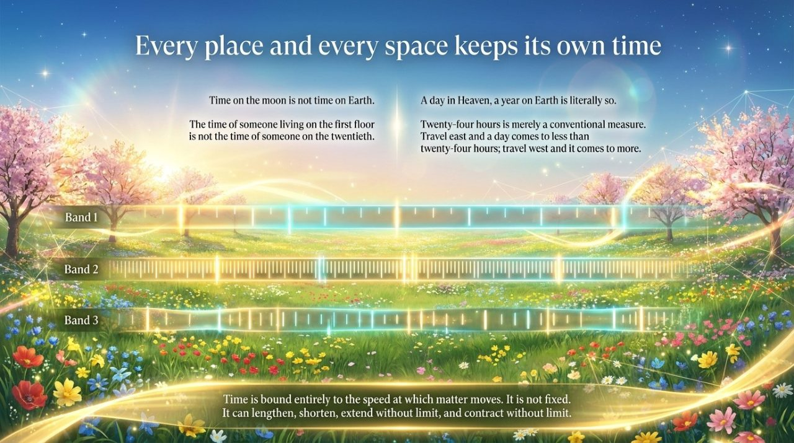
    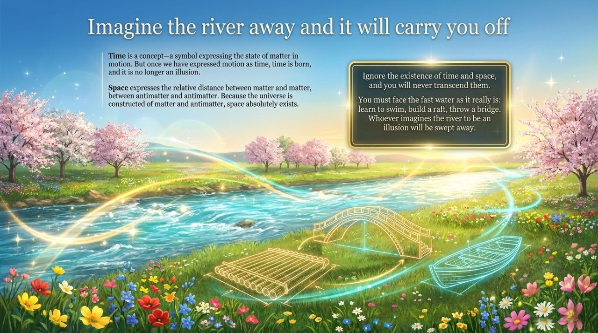
    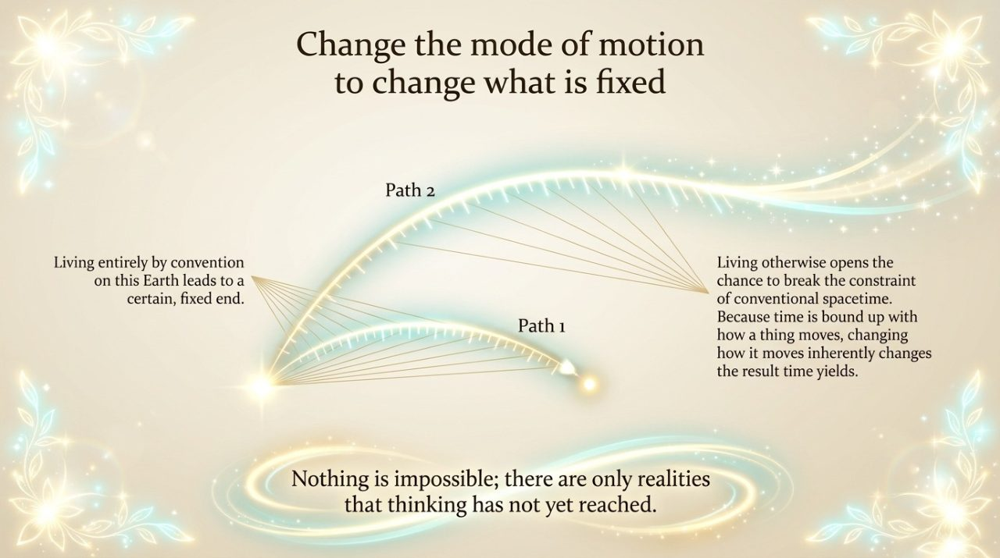
    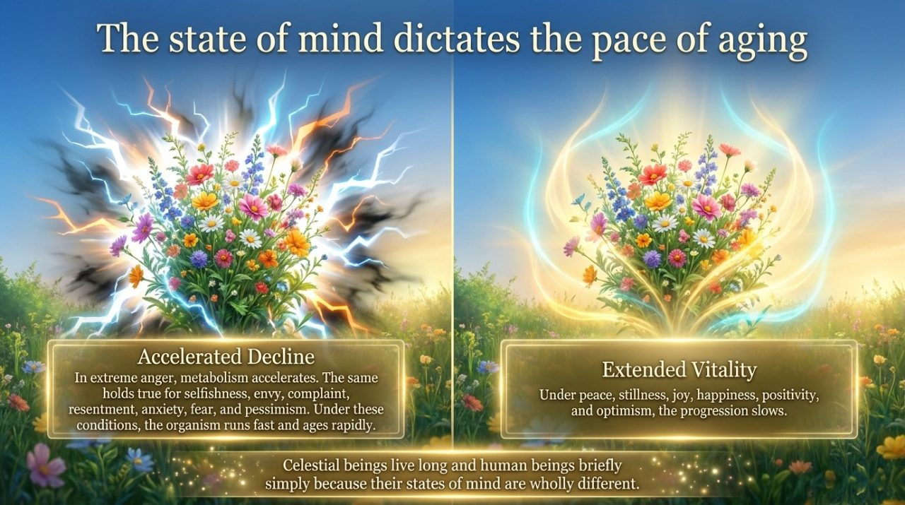
    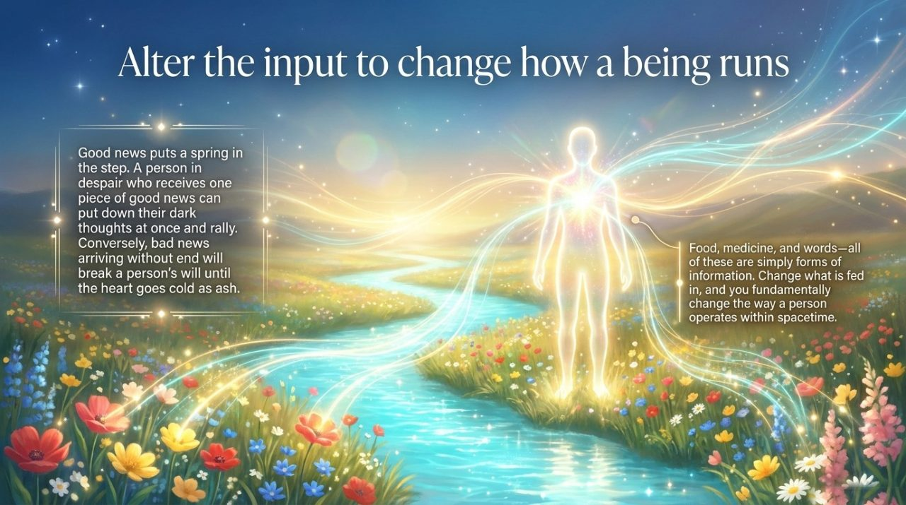
    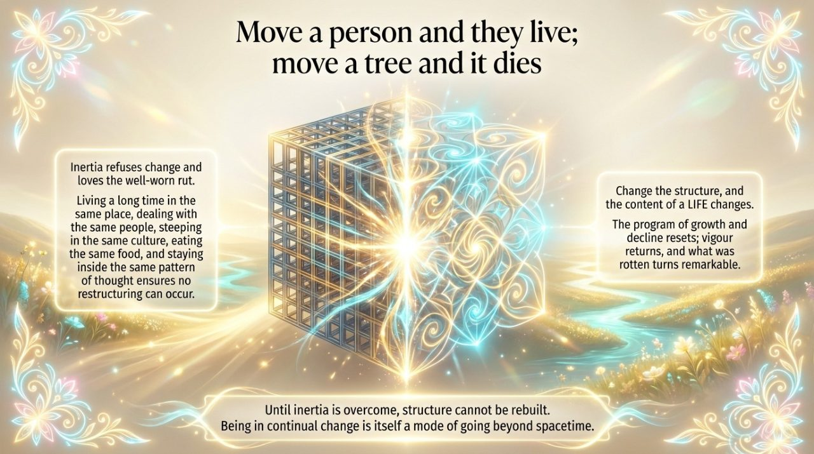
    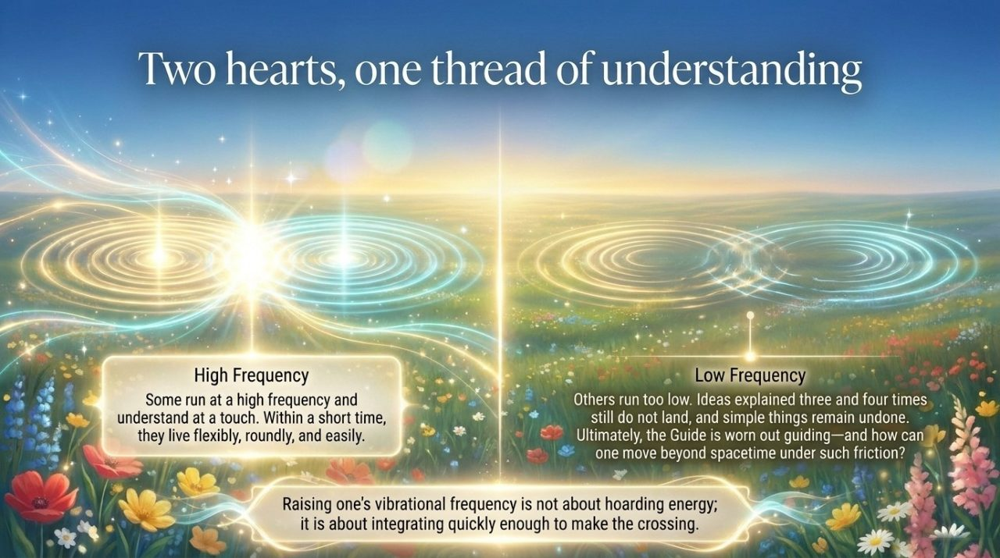
    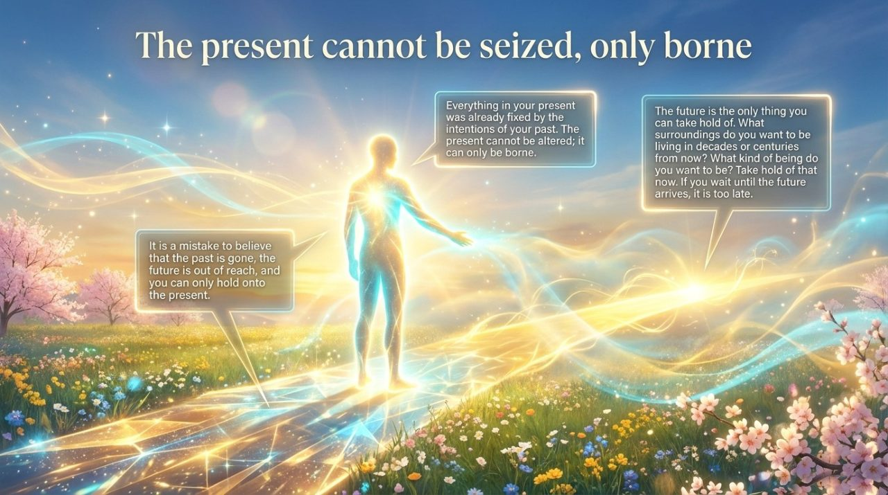
    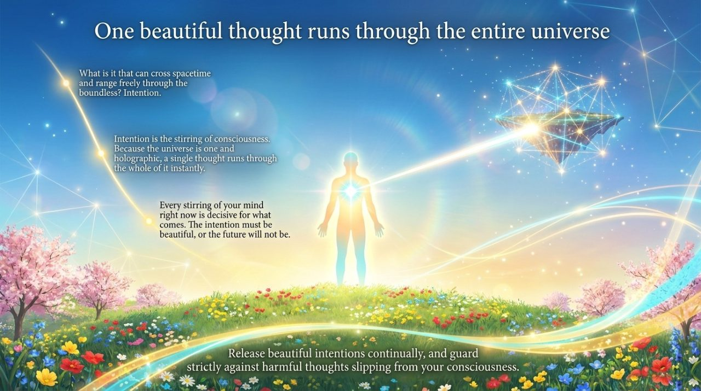
    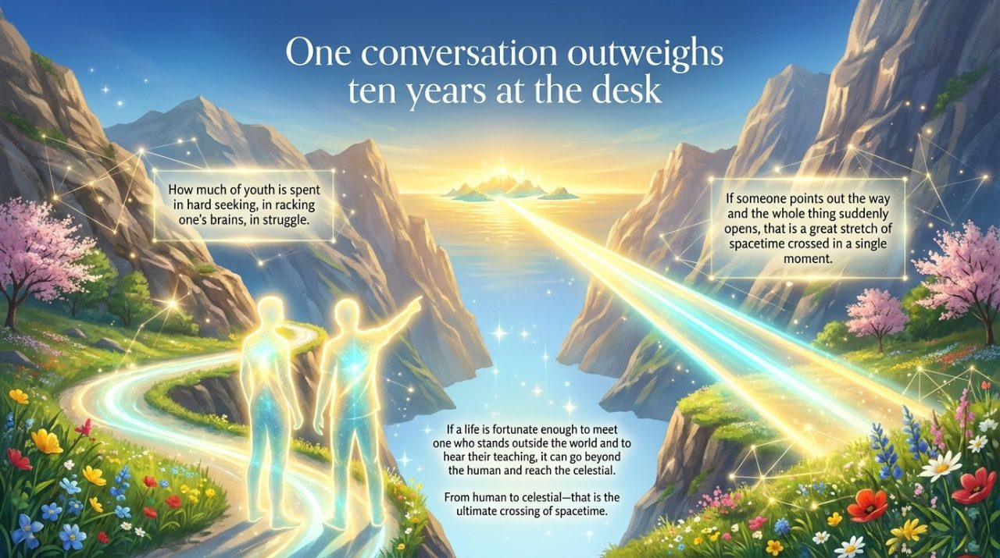
    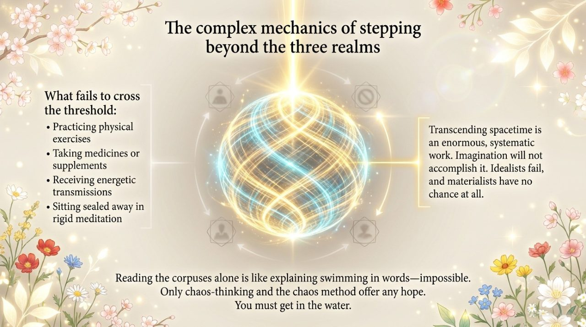
    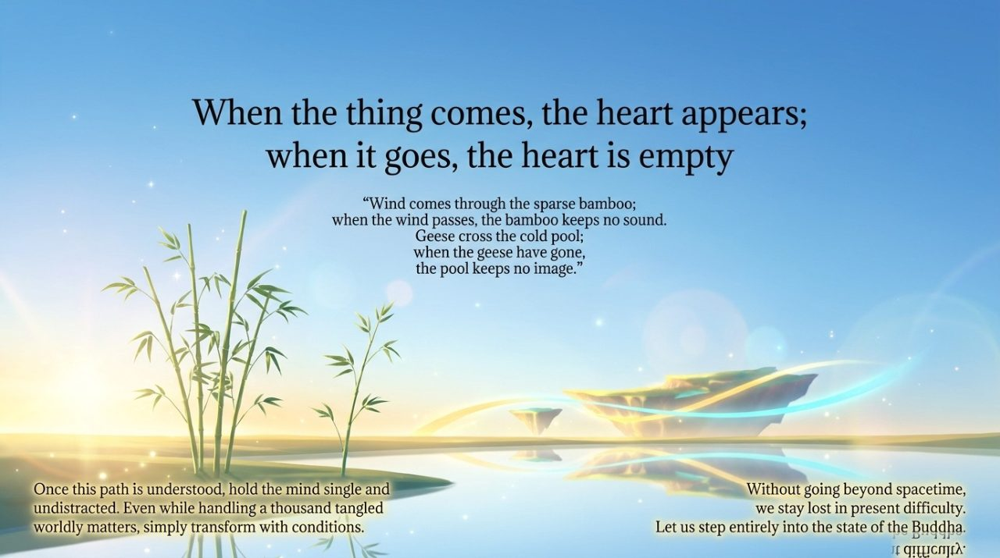

---

## Related Entries

[Spacetime](/en/spacetime/) · [Advanced Cultivation](/en/advanced-cultivation/) · [Becoming a Celestial Being](/en/becoming-celestial/) · [Becoming Buddha](/en/becoming-buddha/) · [Raising Vibration Frequency](/en/raise-vibration/) · [Hundun](/en/hundun/) · [Tour Guide Route](/en/tour-guide-route/) · [Elysian Realm](/en/elysian-realm/) · [Second Home](/en/second-home/)
