<!-- id: LC-QA-0001-EN theme: Mystery of LIFE type: Entry Index lang: en -->

# Qing (Affection)

***Qing*** (情, affection) is a form of antimatter energy embedded in LIFE's antimatter structure — encompassing characteristics of consciousness, structure, and energy, but essentially energy in nature. It is the total expression of the Tao of nature, and the force that maintains the cosmic web binding each level of life to its proper space. The breadth of one's *qing* domain directly determines one's level of LIFE.

---

## Video

<iframe style="width:100%;aspect-ratio:4/3;border:0" src="https://www.youtube-nocookie.com/embed/M46_LpN3s0s" title="Affection (Qing) (Lifechanyuan Encyclopedia video)" allowfullscreen></iframe>

## Slides

??? info "📖 Illustrated slides (13 pages, click to expand)"

    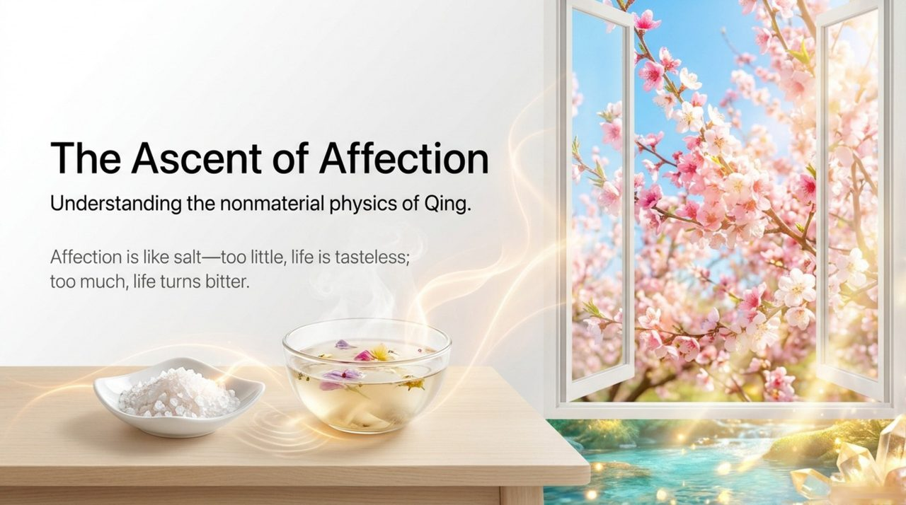
    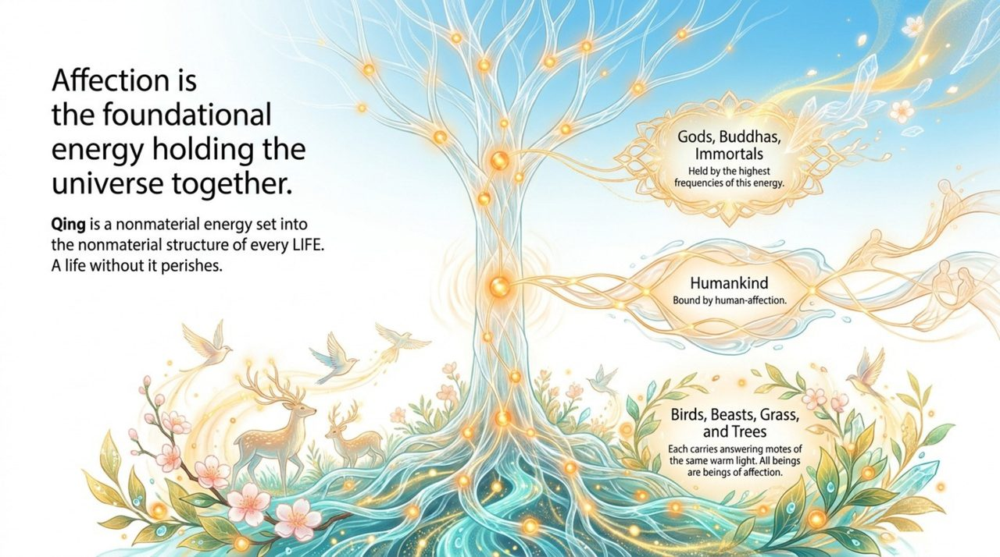
    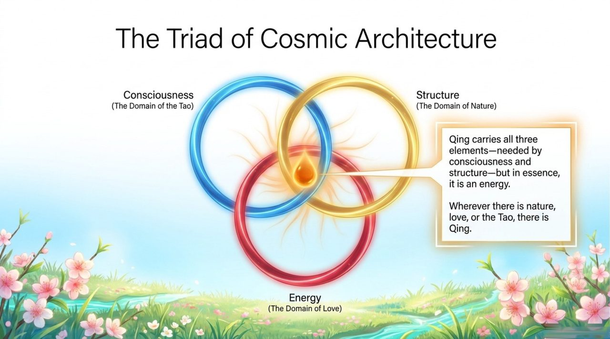
    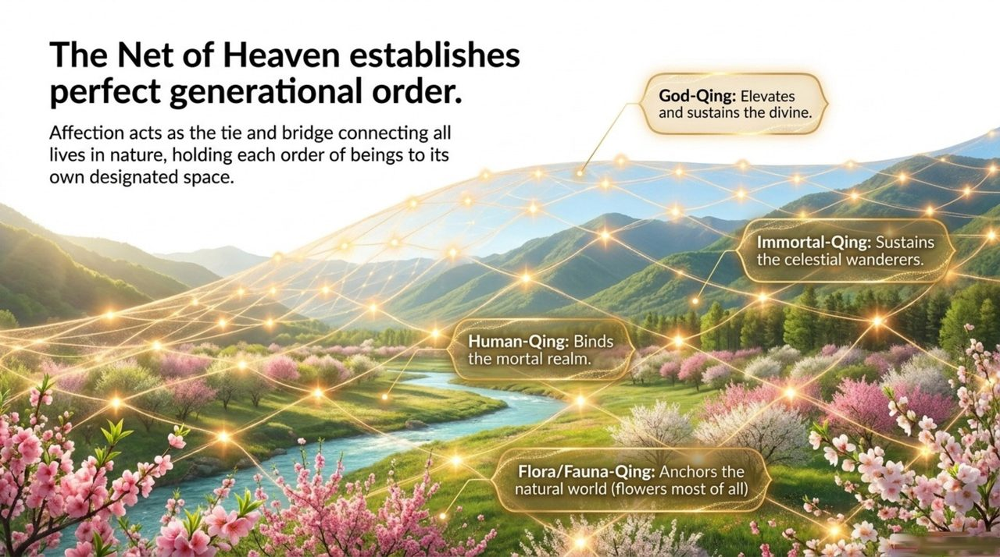
    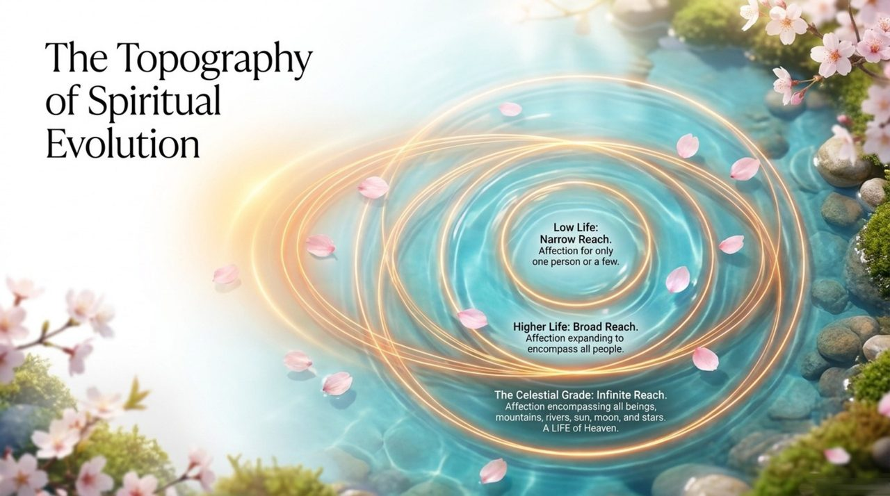
    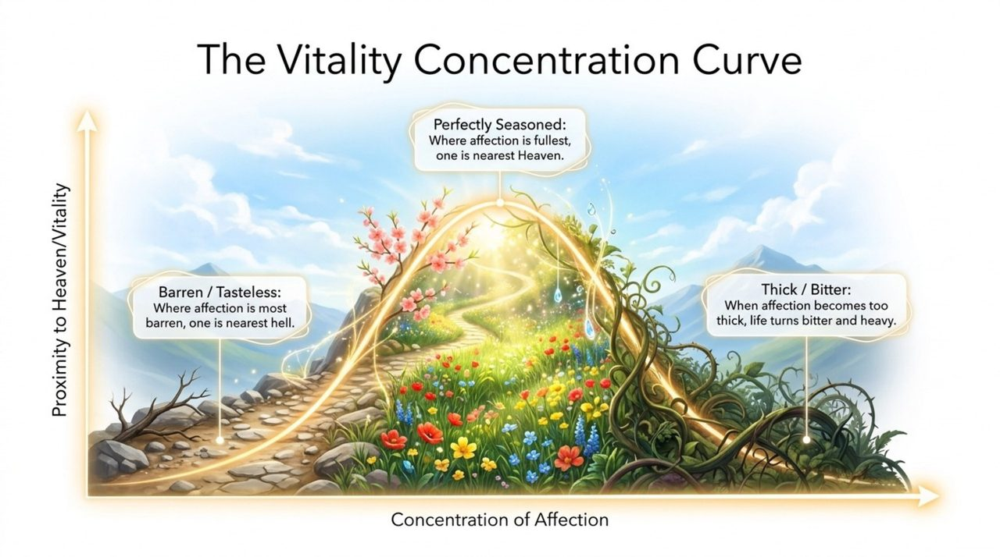
    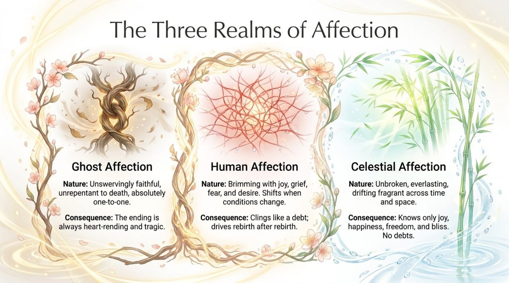
    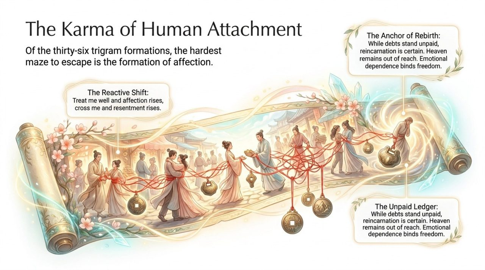
    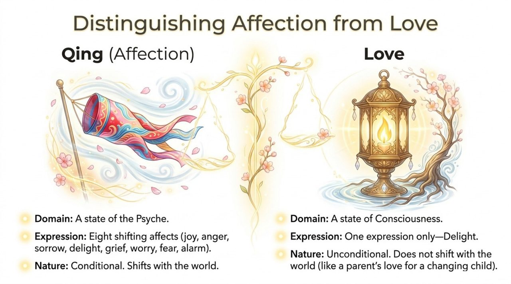
    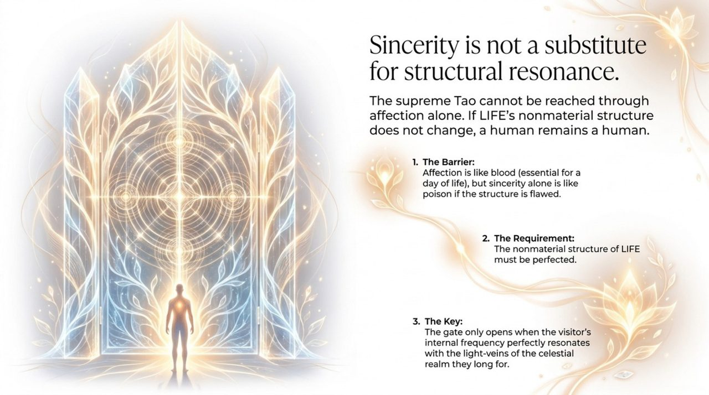
    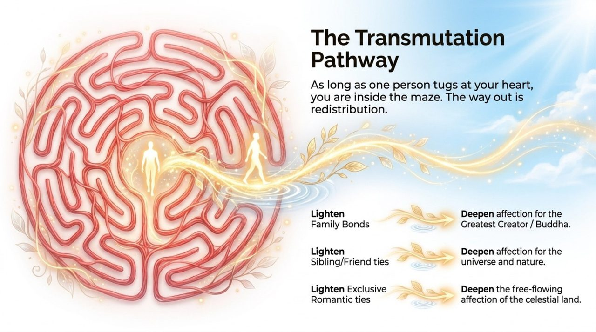
    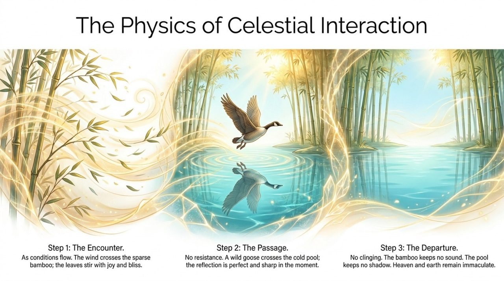
    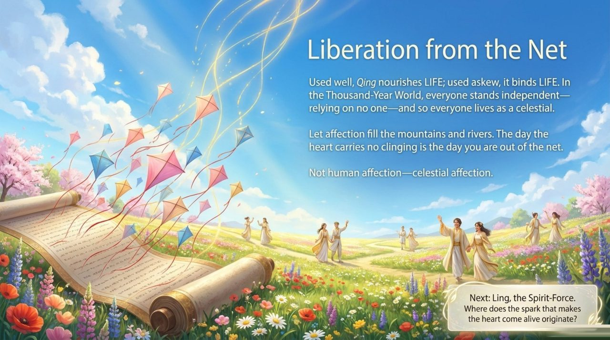

## Versions

| Edition | Best for | Link |
|---------|----------|------|
| Friendly | First-time readers, everyday language | [Read Friendly Edition](/en/qing-affection/friendly/) |
| Academic | Researchers, source analysis, systematic study | [Read Academic Edition](/en/qing-affection/academic/) |
| Internal | Chanyuan Celestials, full primary-source citations | [Read Internal Edition](/en/qing-affection/internal/) |

---

## Related Entries

[Love](/en/love/) · [Nature](/en/nature/) · [Karma, Retribution & Reincarnation](/en/karma-retribution-reincarnation/) · [Heart-Mind](/en/heart-mind/) · [Consciousness](/en/consciousness/) · [Antimatter Structure](/en/antimatter-structure/) · [Thousand-Year World](/en/thousand-year-world/) · [Formless Giving](/en/formless-giving/)
