<!-- id: LC-RD-0001-EN theme: cultivation type: navigation direction: daily-practice lang: en -->

# Red Dust

*Red Dust* (红尘, *hóng chén*) is one of the central concepts in Lifechanyuan's cosmology and cultivation framework. It refers to the entirety of the mundane world — specifically defined as the collective sum of the Thirty-Six Bagua Formations that entangle human existence. At its core lies the "emotion web" (情阵), with the husband-wife bond as its deepest layer. Red Dust is not merely an external environment but an inner state of attachment and entanglement. Seeing through Red Dust and transcending it are essential milestones on the path toward becoming a Celestial Being or Buddha.

> "What is Red Dust? Red Dust is the Thirty-Six Bagua Formations. When we say 'living in the Red Dust,' we mean living inside these thirty-six formations."
>
> *(Xuefeng's Collected Writings · Awakening Essays · See Through the Red Dust Early)*

---

## Video

<iframe style="width:100%;aspect-ratio:4/3;border:0" src="https://www.youtube-nocookie.com/embed/IDZyldax0V8" title="Red Dust (Lifechanyuan Encyclopedia video)" allowfullscreen></iframe>

## Slides

??? info "📖 Illustrated slides (12 pages, click to expand)"

    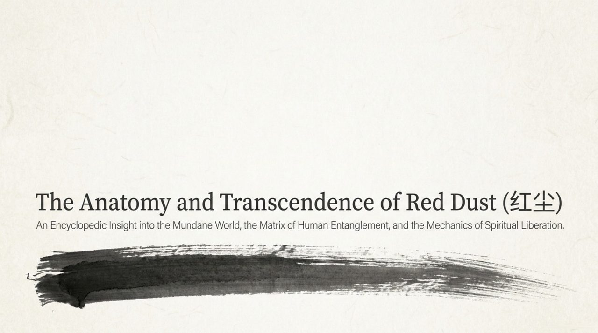
    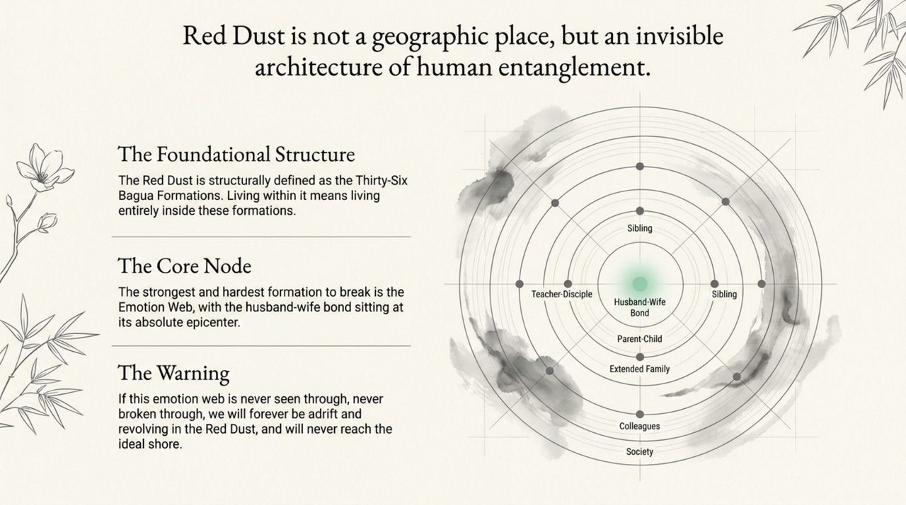
    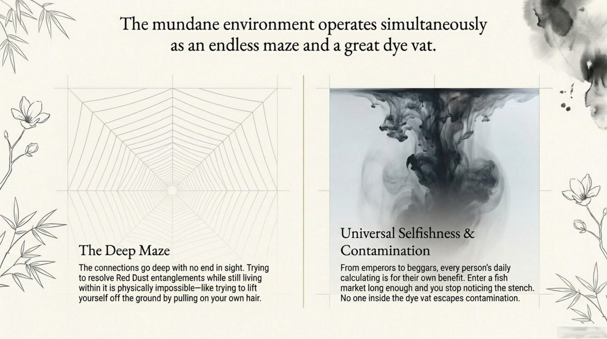
    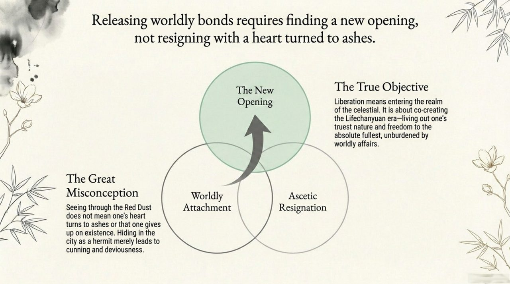
    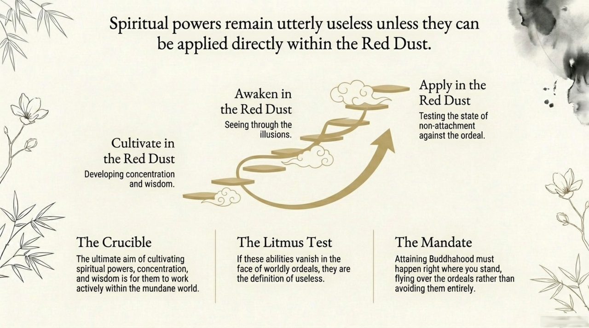
    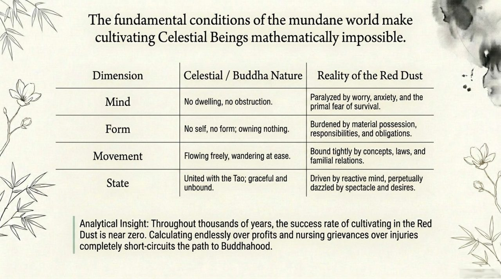
    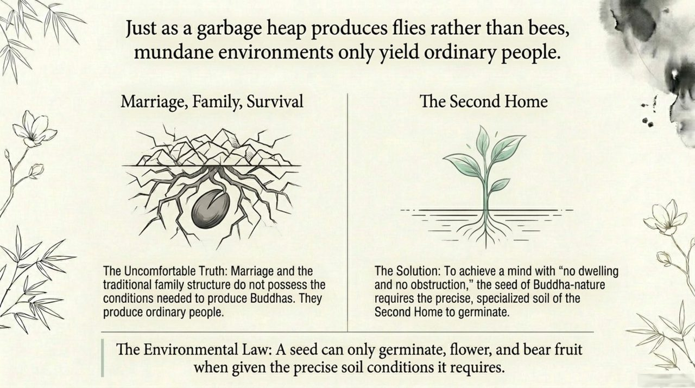
    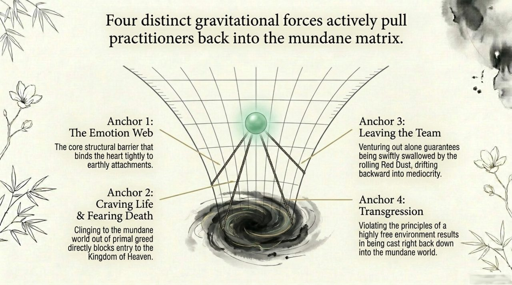
    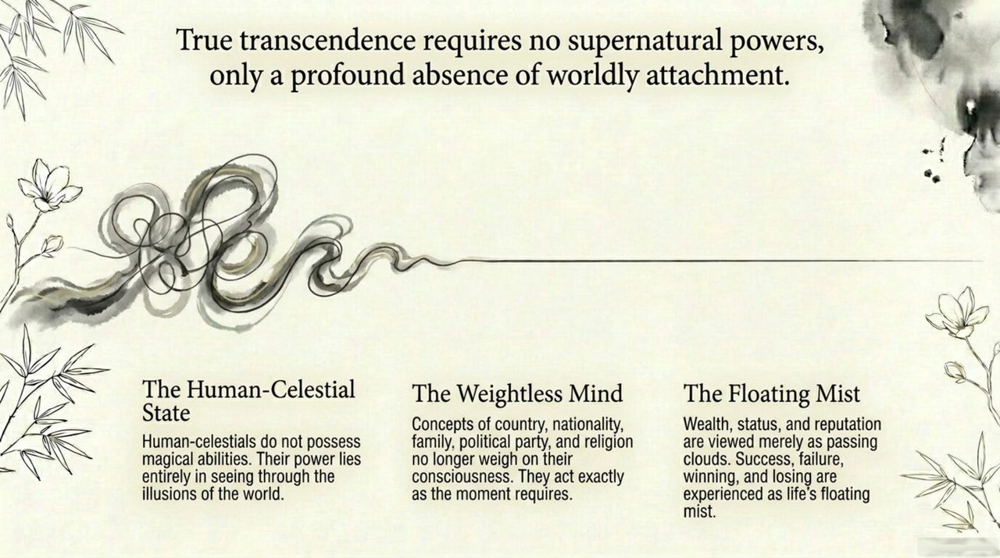
    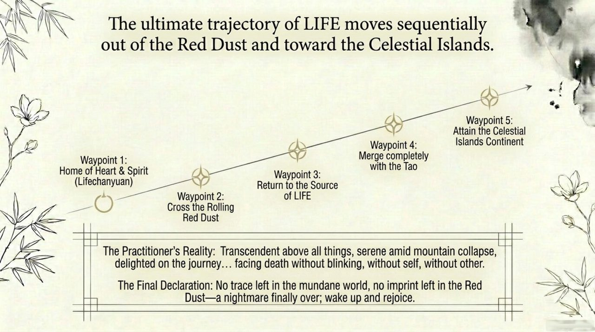
    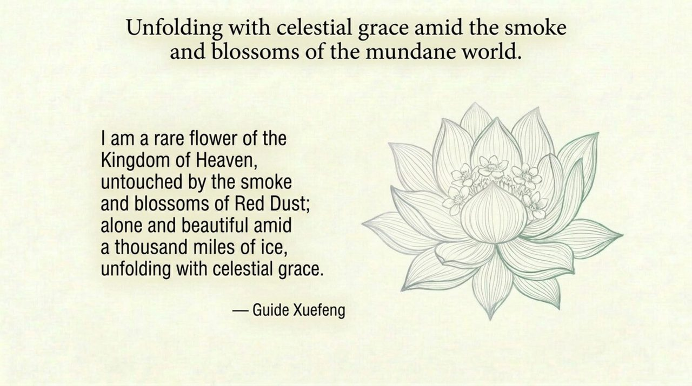
    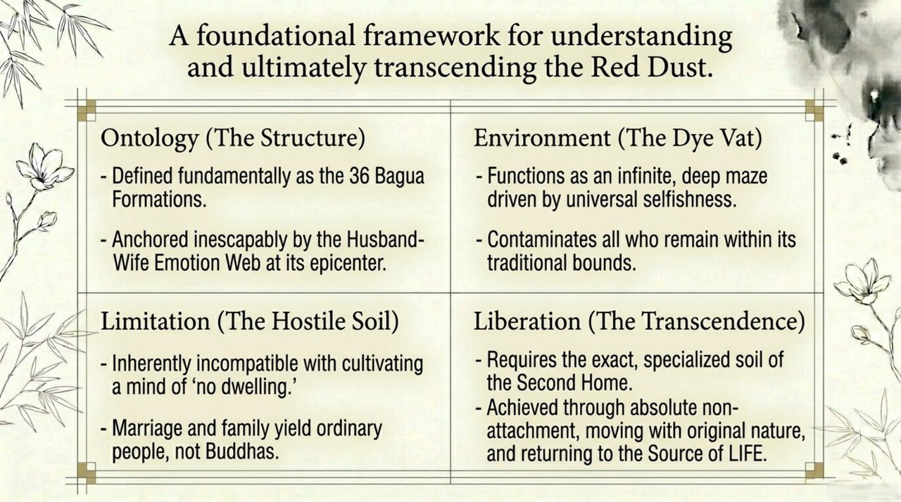

## Version Navigation

| Version | Best for | Focus |
|---------|----------|-------|
| [Friendly version](friendly.md) | First-time readers | Everyday context · the emotion web · the path beyond |
| [Academic version](academic.md) | Researchers | Concept analysis · systemic positioning · cross-tradition comparison |
| [Internal reference](internal.md) | Deep study | Full source quotations · seven-section framework · cultivation guidance |

---

## Related Entries

[Thirty-Six Bagua Formations](/en/thirty-six-bagua-formations/) · [Releasing Worldly Bonds](/en/releasing-worldly-bonds/) · [Qing — Affection](/en/qing-affection/) · [Becoming Celestial and Buddha](/en/becoming-celestial-buddha/) · [The Second Home](/en/second-home/) · [No Attachment, No Obstruction](/en/xinwu-suozhu-guaai/) · [Transcending the Ordinary](/en/chaofantuosu/) · [Transforming into a Celestial Being](/en/yuhuachengxian/)
