# Repentance

**Repentance** (*忏悔*, chànhuǐ), in the Lifechanyuan system, is a private matter between a person and the Greatest Creator — the Creator. It is the sincere act of acknowledging one's transgressions to the Greatest Creator through the inner Spirit and seeking forgiveness, upon recognizing that one's words and deeds have deviated from the Greatest Creator's will. Repentance is not a religious ritual, is not directed toward other people, and uses the inner Spirit as its sole medium. Repentance is an effective method for purifying the inner Spirit, a remedy for eliminating karmic obstacles, the primary method for escaping hardship, and a necessary condition for elevating the quality of LIFE.

> Repentance is the necessary condition for the elevation of LIFE quality. Without repentance, there is no elevation.

---

## Version Navigation

| Version | Best For | Link |
|---------|----------|------|
| Friendly | New readers, accessible introduction | [Read Friendly Version](/en/repentance/friendly/) |
| Academic | In-depth study, systematic analysis | [Read Academic Version](/en/repentance/academic/) |
| Internal | Chanyuan Celestials, original texts | [Read Internal Version](/en/repentance/internal/) |

---

## Video

<iframe style="width:100%;aspect-ratio:4/3;border:0" src="https://www.youtube-nocookie.com/embed/Segauw4SB-U" title="Repentance (Lifechanyuan Encyclopedia video)" allowfullscreen></iframe>

## Slides

??? info "📖 Illustrated slides (14 pages, click to expand)"

    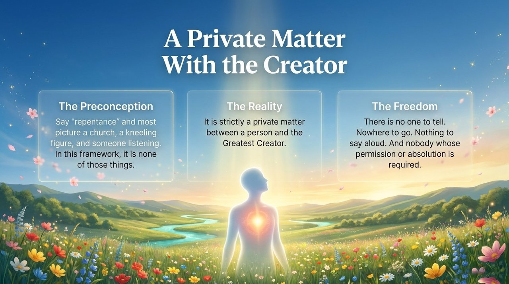
    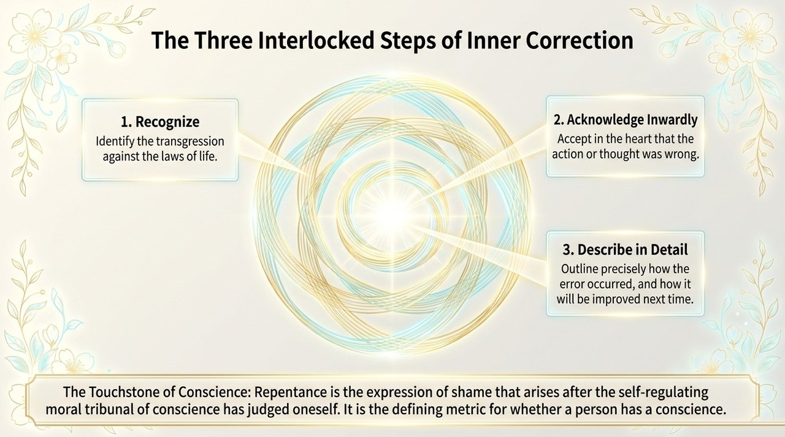
    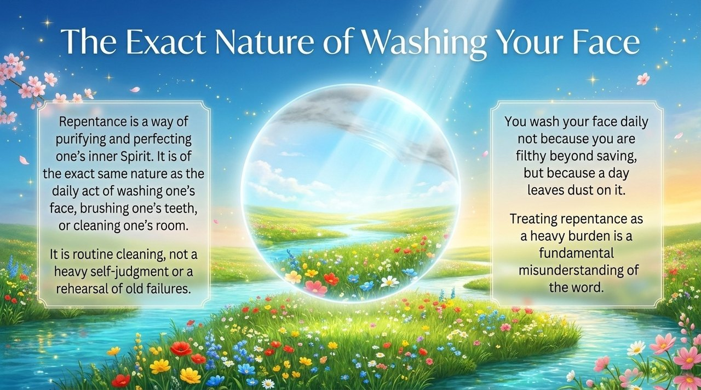
    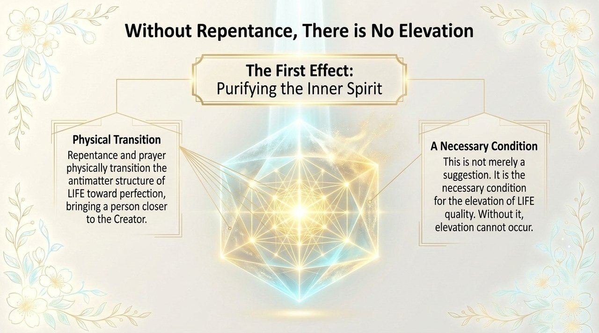
    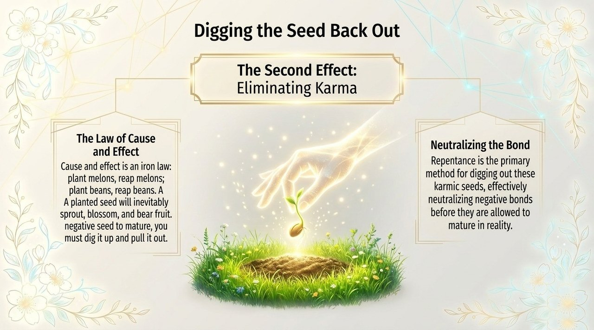
    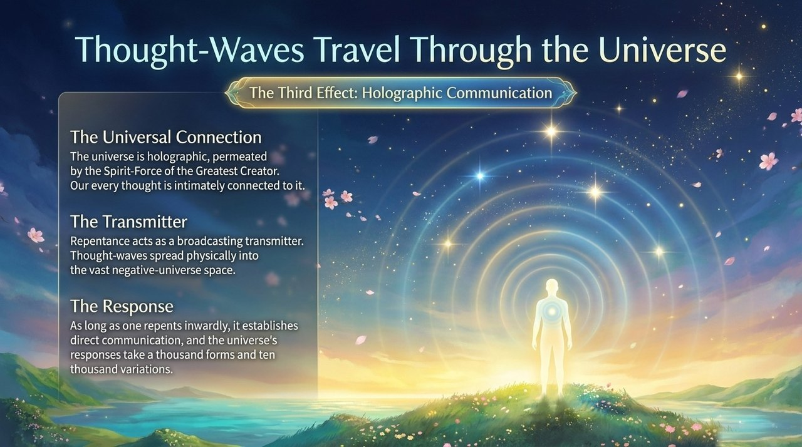
    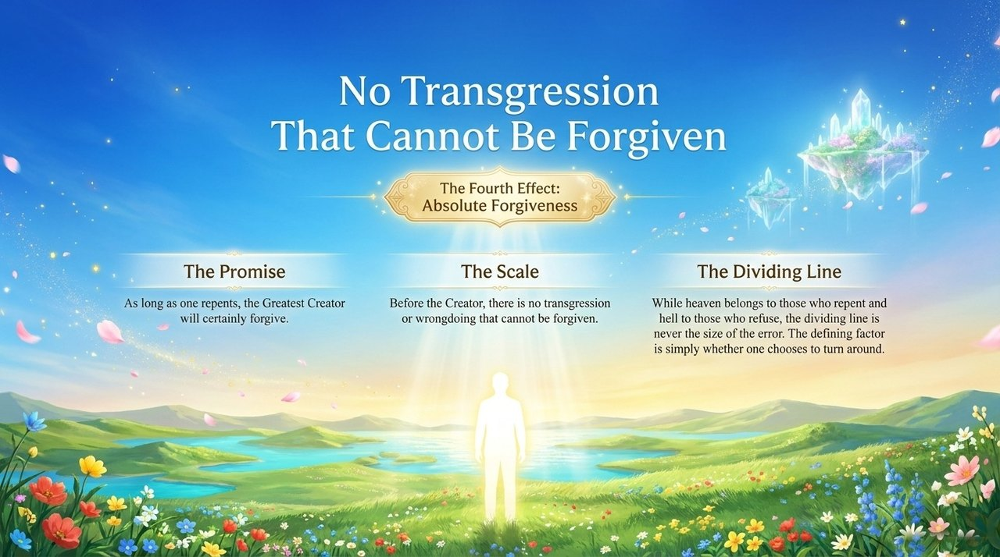
    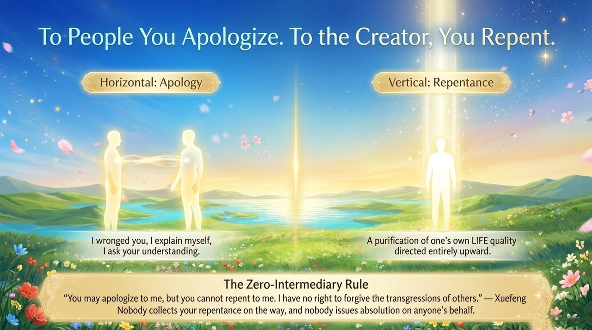
    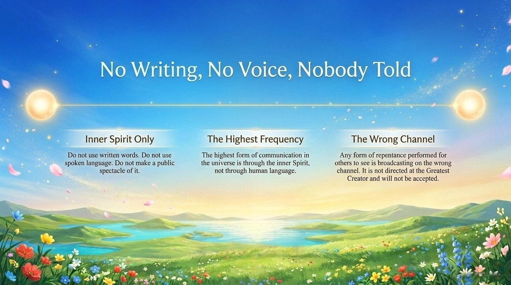
    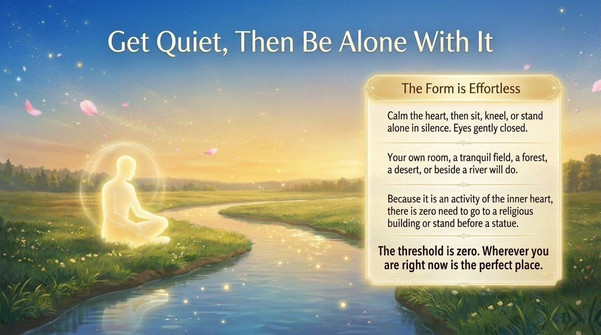
    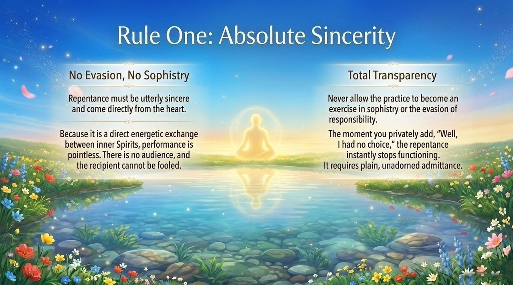
    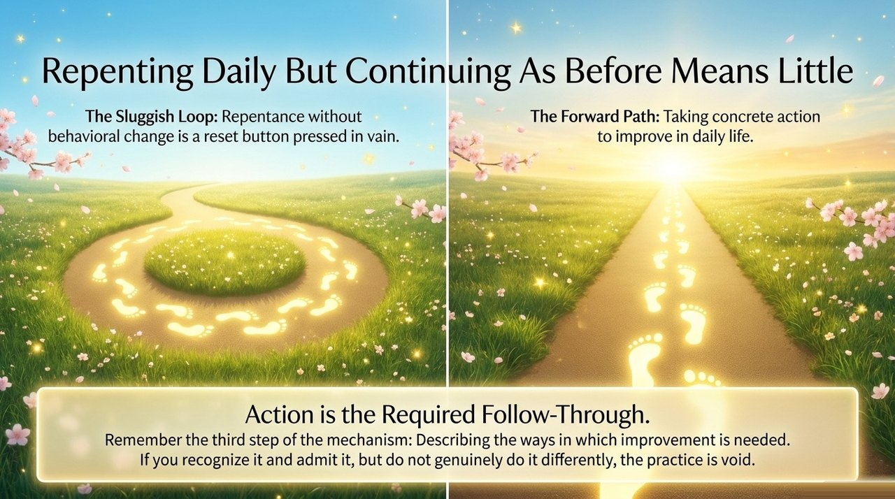
    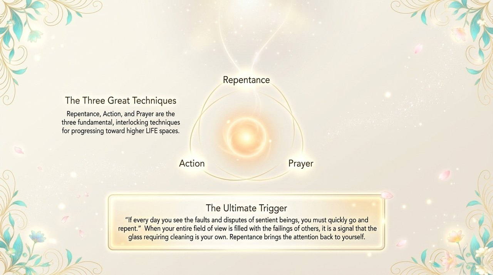
    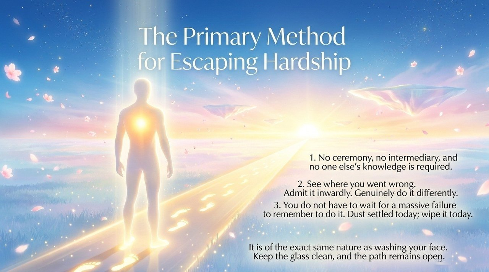

---

## Related Entries

[Inner Spirit (Overview)](/en/soul-overview/) · [Soul Garden](/en/soul-garden/) · [Awakening](/en/awakening/) · [Way of the Greatest Creator](/en/way-of-the-greatest-creator/) · [Raise Vibrational Frequency](/en/raise-vibration-frequency/) · [Return to Zero](/en/return-to-zero/) · [Gratitude](/en/gratitude/) · [Yuan (Karmic Affinity)](/en/yuan/)
