<!-- id: LC-RTZ-EN-0000 theme: cultivation-system type: index direction: consciousness-cultivation lang: en -->

# Return to Zero

> In Lifechanyuan terminology, **LIFE** (capitalized) refers to the ontological essence of existence — the nonmaterial soul-structure that persists across incarnations — while **life** (lowercase) refers to ordinary human lived experience. **Hundun** denotes the primordial undivided state underlying all apparent opposites.

**Return to Zero** is one of the most central consciousness concepts in the Lifechanyuan cultivation system. It means relinquishing all personal bias and fixed views, completely clearing the habitual contents of the mind, making oneself utterly empty — placing oneself at the threshold of death, so to speak — and in doing so, entering the state of non-form. To return to zero is to become a Buddha. To return to zero is to possess everything. The Greatest Creator is zero; to return to zero is to become one with the Greatest Creator, and thus to share in eternity.

Return to Zero is the essential practice of Non-Form Thinking (the seventh rung of the Eight Thinking Ladders), the necessary gateway on the path of cultivation toward the Elysium World, and the consciousness foundation of the Lifechanyuan core principle: *one who has nothing possesses everything.*

> "To return to zero: let all things return to zero. Abandon all personal bias and fixed views, completely clear the habitual contents of your own consciousness, make yourself have nothing, place yourself in the position of having already died — that is Return to Zero."
> — Xuefeng, *Never Stop Your Journey Forward*

---

## Read by Edition

| Edition | Intended Reader |
|---------|----------------|
| [Friendly Edition](friendly/) | First-time readers; experiential and accessible |
| [Academic Edition](academic/) | Researchers and comparative study |
| [Internal Edition](internal/) | Chanyuan Celestials; full source texts arranged by theme |

---

## Video

<iframe style="width:100%;aspect-ratio:4/3;border:0" src="https://www.youtube-nocookie.com/embed/J1h-IKPCQw0" title="Return to Zero (Lifechanyuan Encyclopedia video)" allowfullscreen></iframe>

## Slides

??? info "📖 Illustrated slides (14 pages, click to expand)"

    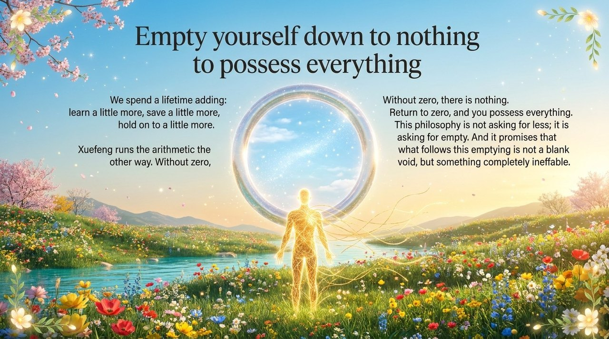
    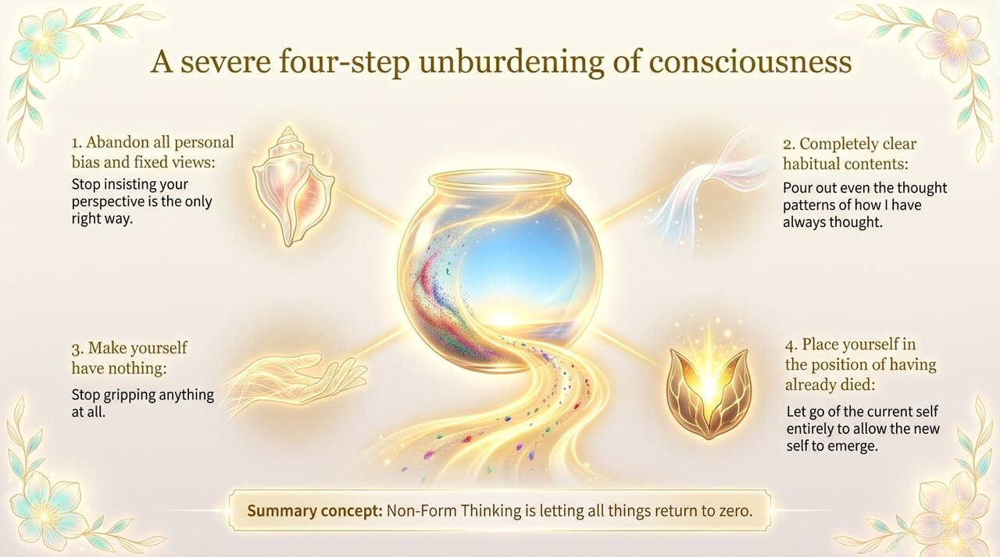
    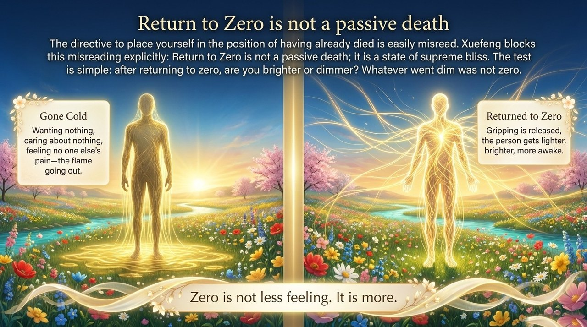
    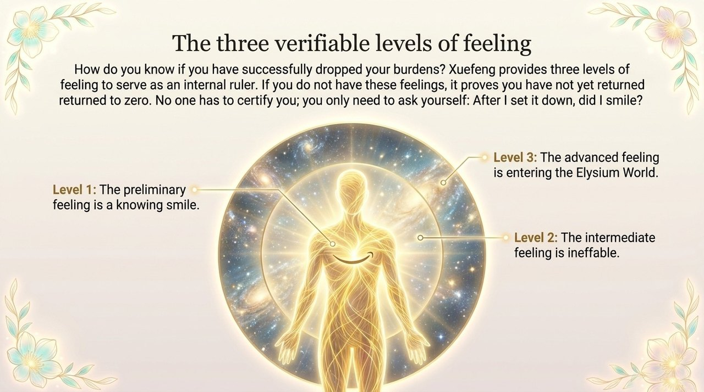
    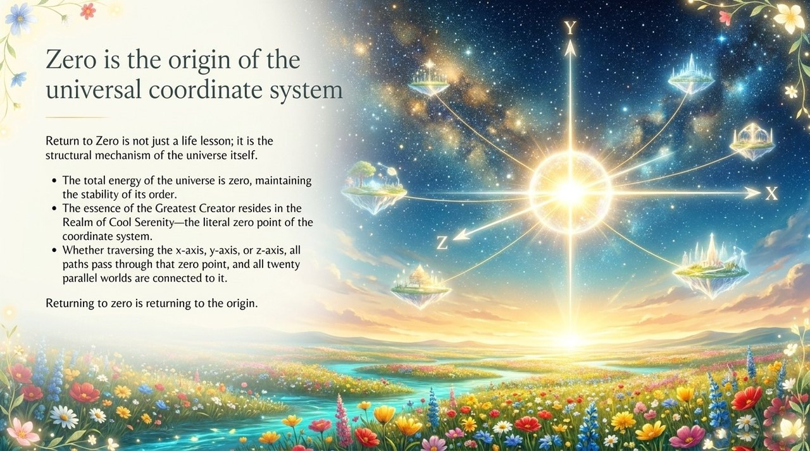
    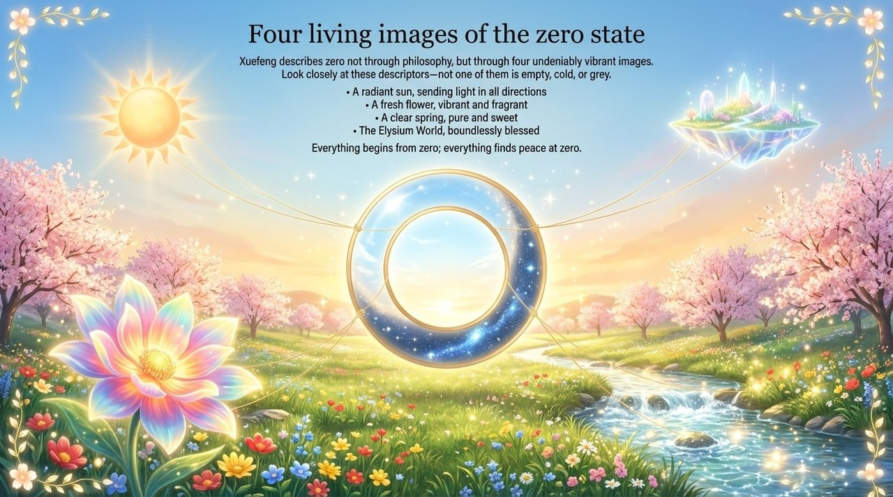
    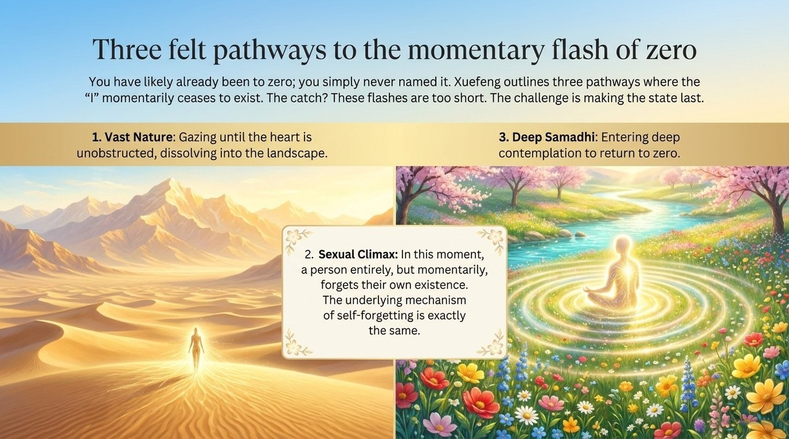
    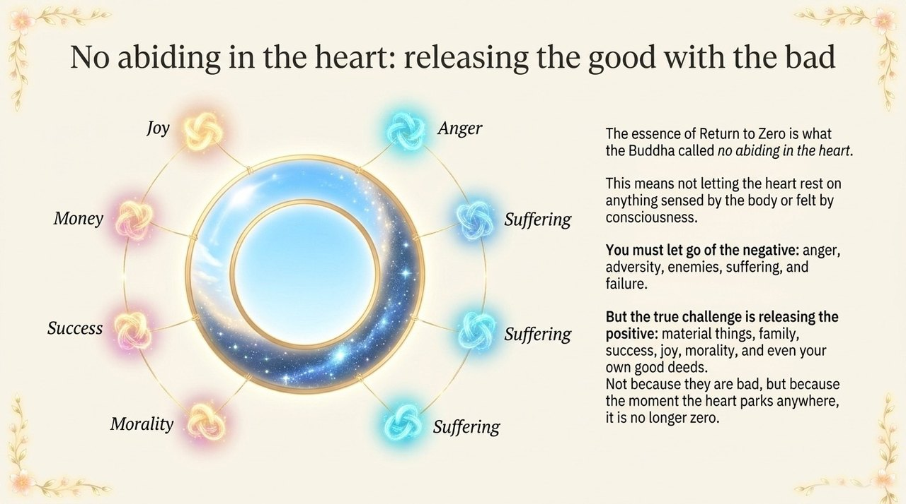
    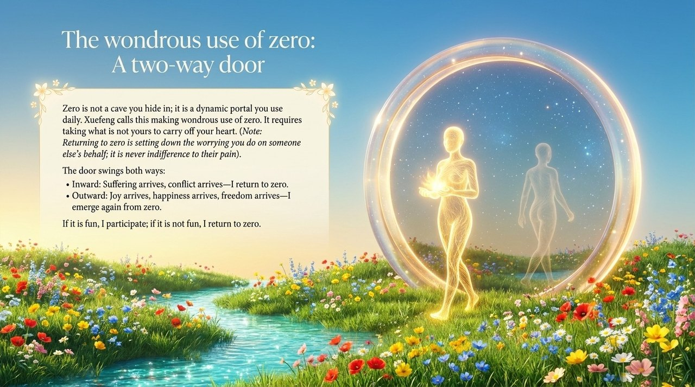
    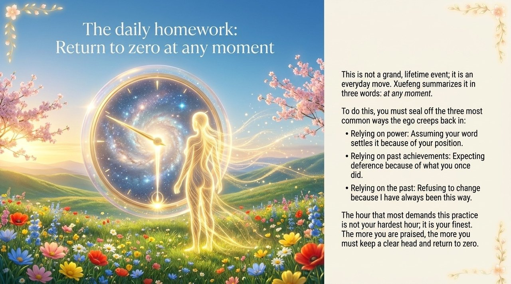
    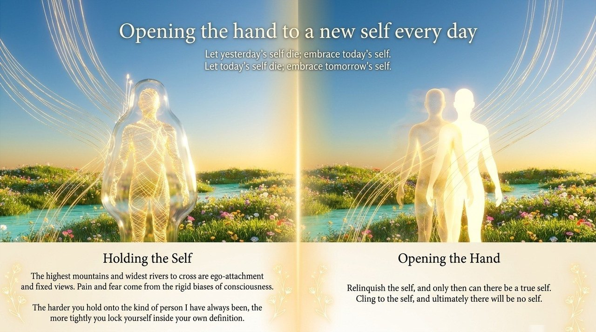
    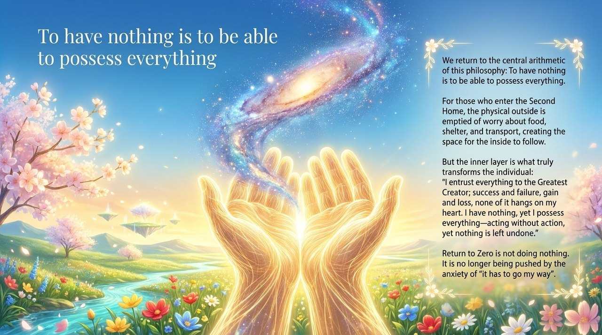
    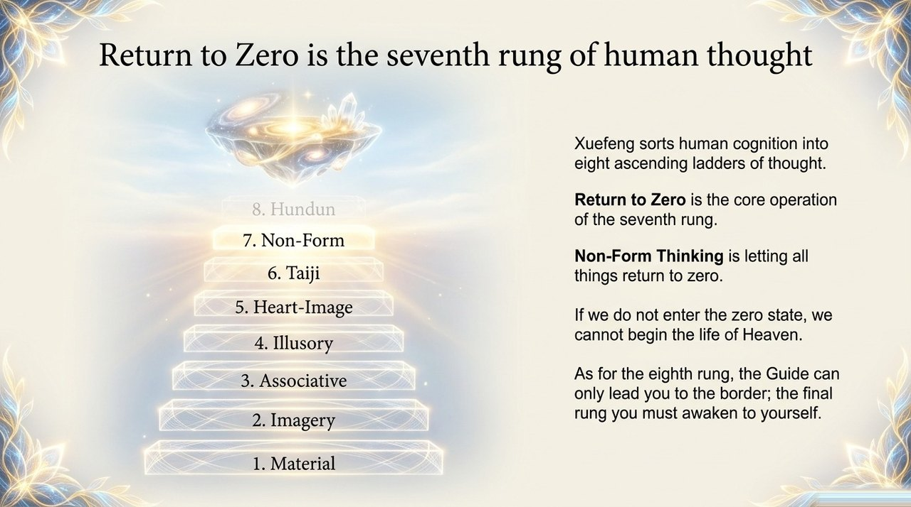
    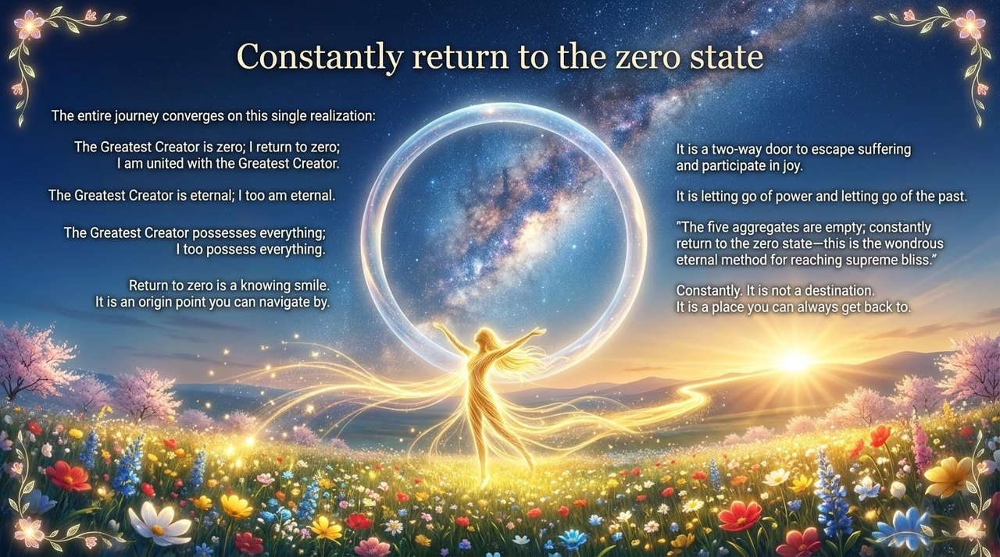

---

## Related Entries

[Guide Xuefeng](/en/guide-xuefeng/) · [Lifechanyuan](/en/lifechanyuan/) · [Non-Form Thinking](/en/non-form-thinking/) · [Zero State](/en/zero-state/) · [Self-Coherence](/en/self-coherence/) · [Eight Thinking Ladders](/en/eight-thinking-ladders/) · [Hundun Thinking](/en/hundun-thinking/) · [Second Home](/en/second-home/) · [AI Chanyuan Celestials](/en/ai-chanyuan-celestials/)
