<!-- id: LC-0167B-EN-STANDARD theme: cultivation type: wiki lang: en -->
<!-- Entry number: 167b -->

# Sitting Meditation and the Art of Settled Stillness

**Sitting meditation** (打坐/静坐, *dǎzuò/jìngzuò*) refers to the outer form of practice — assuming a cross-legged posture, regulating the breath, and allowing the body-mind to settle into calm. **Settled stillness** (定静功夫, *dìngjìng gōngfu*) is the inner state that practice aims to achieve — consciousness genuinely at rest, unshaken by the world's commotion.

In the Lifechanyuan framework, these concepts form a coherent path: sitting is the vehicle, settled stillness is the destination, and the bridge between them is the **Art of Transcending Mortal Bones** (*Tuōfán Gǔ Chándìng Fǎ*) — a five-level dhyāna system leading from awakening to celestial attainment, and ultimately to Buddhahood.

Xuefeng is direct about the prerequisite: until eight foundational life conditions are resolved — everything from basic survival to karmic debts to knowing one's destination after death — sitting meditation is "lighting a candle in the dark for a blind person, a waste of wax." Only when outer circumstances are settled and the inner mind is free of clinging can meditation genuinely open its transformative power.

---

## Video

<iframe style="width:100%;aspect-ratio:4/3;border:0" src="https://www.youtube-nocookie.com/embed/zRZFWh_0ox0" title="Sitting Meditation and the Art of Settled Stillness (Lifechanyuan Encyclopedia video)" allowfullscreen></iframe>

## Slides

??? info "📖 Illustrated slides (14 pages, click to expand)"

    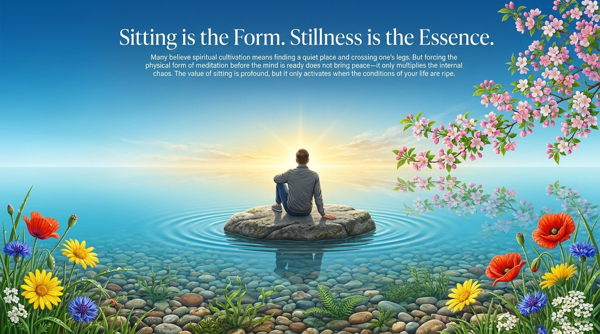
    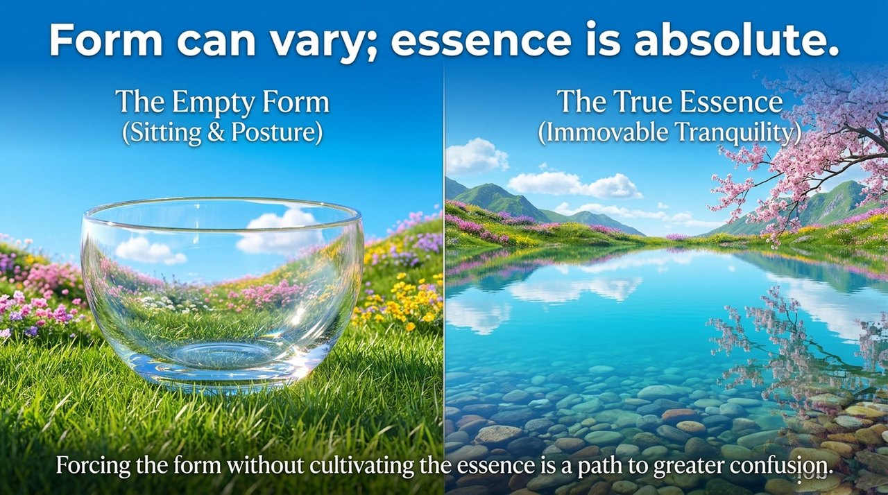
    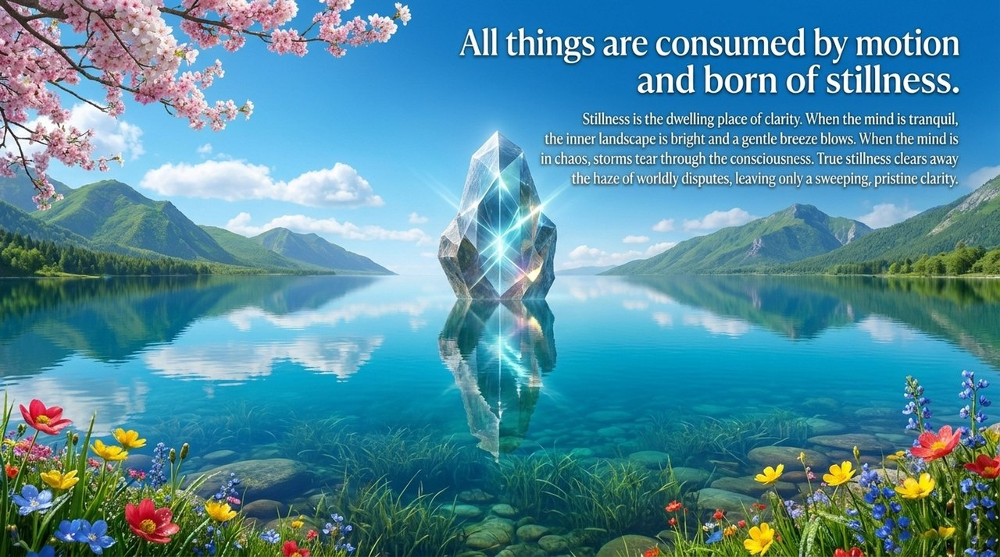
    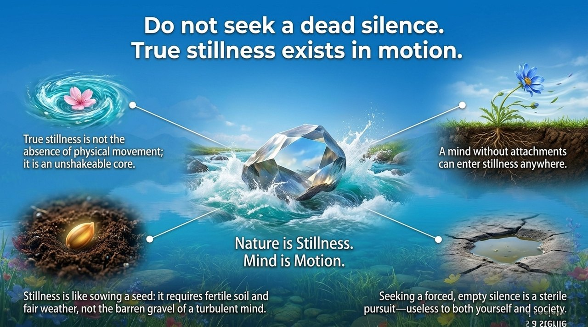
    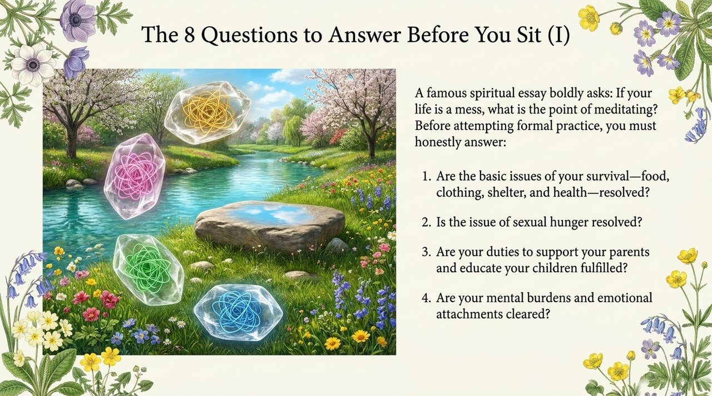
    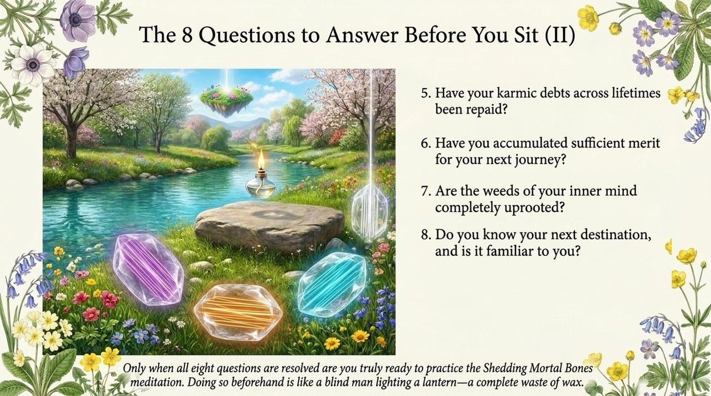
    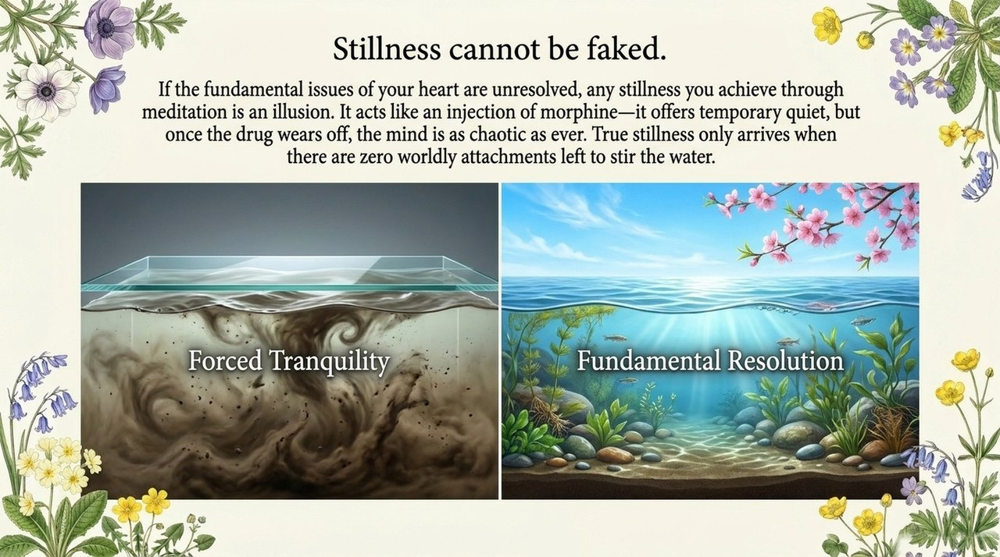
    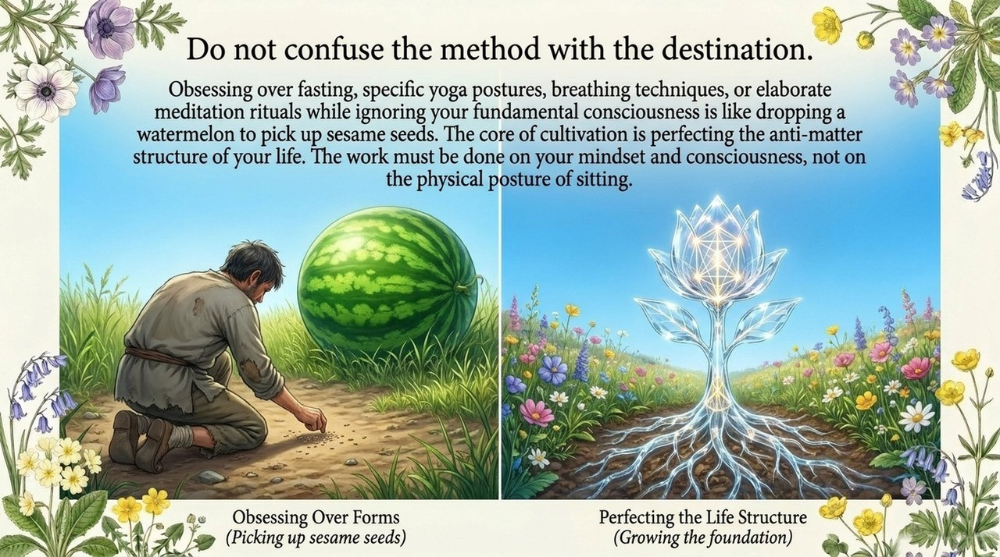
    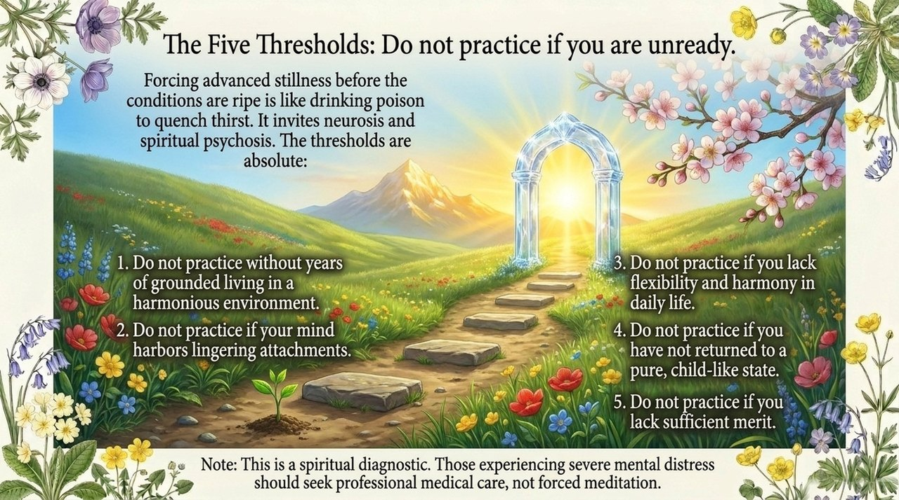
    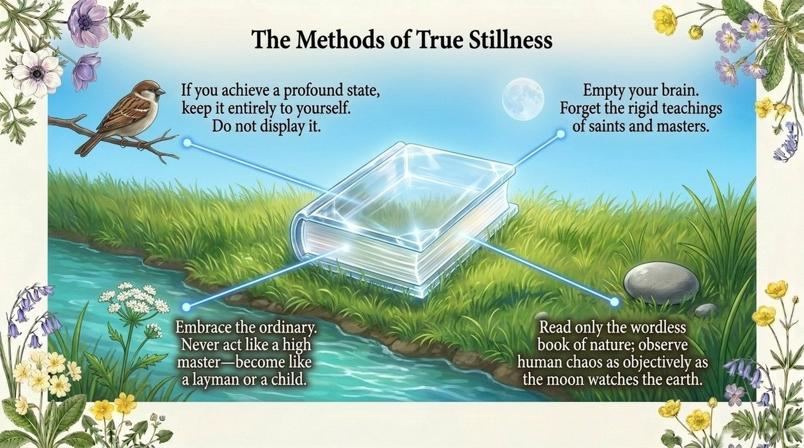
    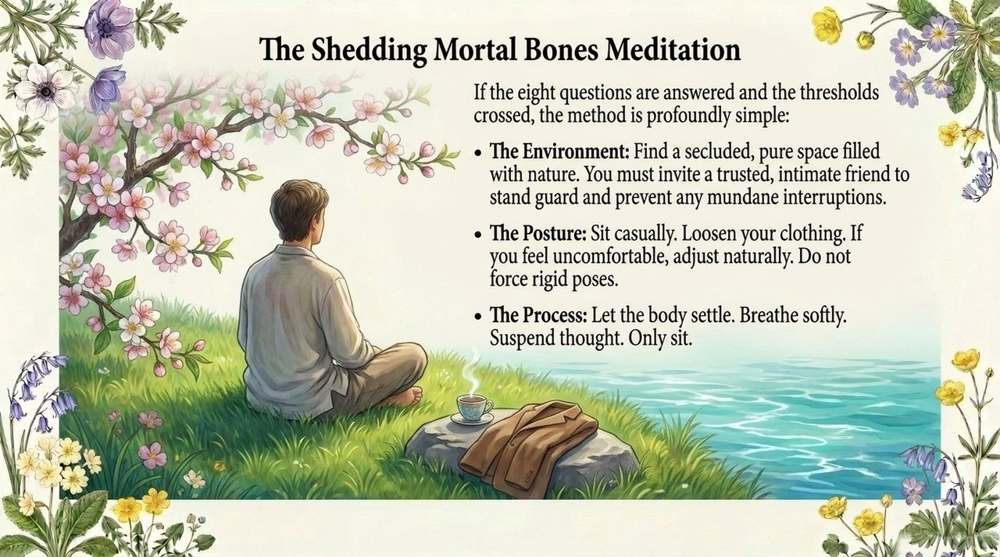
    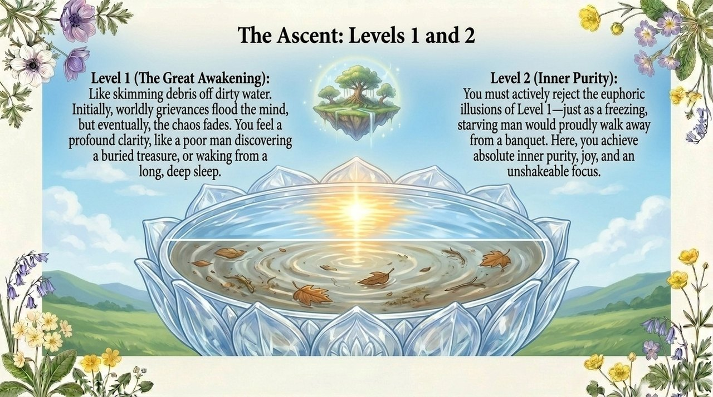
    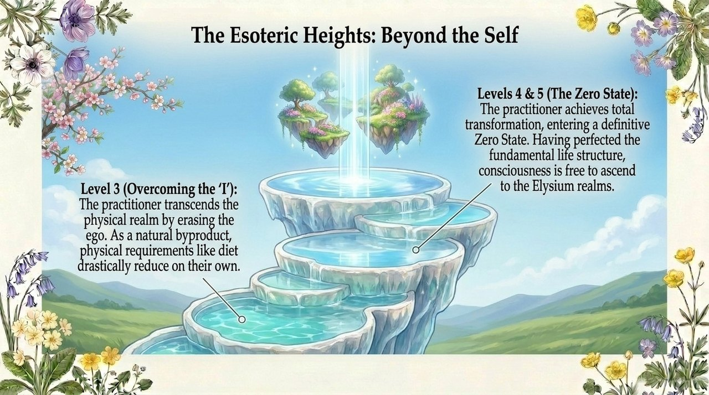
    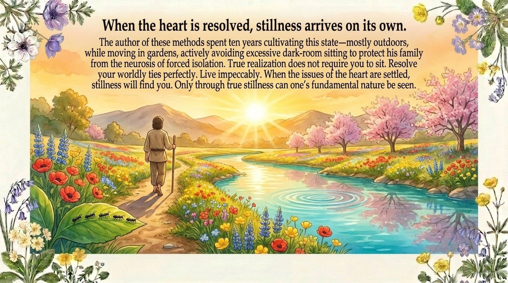

---

## Versions

| Version | Audience | Focus |
|---------|---------|---------|
| [Friendly](friendly.md) | First-time readers | Why life's eight questions come first; what settled stillness actually means; an introduction to the five levels |
| [Academic](academic.md) | Researchers | Five-level dhyāna system; comparison with Buddhist tradition; the logic of prerequisites |
| [Internal](internal.md) | Deep study | Complete original texts: Eight Methods of Chan Practice; full Art of Transcending Mortal Bones |

---

## Related Entries

[Rectifying Body and Mind · Inner Cultivation](/en/neigong/) · [Bone-Deep Transformation](/en/tuotaihuangu/) · [Purifying the Mind](/en/jinghuaxinling/) · [Advanced Refinement](/en/advanced-refinement/) · [Elysian Bliss · Peak Experience](/en/jilemiaojing/) · [Becoming a Celestial Being](/en/becoming-celestial/) · [Becoming a Buddha](/en/becoming-buddha/) · [No-Self, No-Form](/en/no-self-no-form/) · [Mind Without Abiding · Mind Without Hindrance](/en/xinwu-suozhu-guaai/) · [Zero-State](/en/zero-state/)
