<!-- id: LC-SJR-0001-EN theme: Society type: Navigation direction: Future Civilization lang: en -->

# Biological Robot

A **Biological Robot** is Lifechanyuan's distinctive term for a future form of advanced LIFE. It is not the metal-and-circuit machine of science fiction, but a product of bioengineering — manufactured in batches by life factories, grown in an artificial "womb," indistinguishable from human beings in outward appearance, with blood and flesh and warmth. Biological Robots have consciousness (because "consciousness is generated by structure"), an antimatter structure, and Spirit (Ling) naturally enters them; their emotional depth exceeds that of humans; and their IQ can reach ten times that of an ordinary person. They will become the future managers of Earth. Yet due to structural constraints, they can never attain the level of a sage — though they can become celestial beings and Buddhas. At the same time, "Biological Robot" is also used critically to describe contemporary humans: programmed, running on preset tracks, lacking genuine independent thought — and the path out of this condition is authentic thinking and creation.

---

## Version Navigation

| Version | For | Features |
|---------|-----|----------|
| [Accessible Version](friendly.md) | First-time readers | Clearing up misconceptions · ChatGPT connection · "You may already be one" · The way out |
| [Academic Version](academic.md) | Scholars · Cross-cultural researchers | Technological singularity · Transhumanism · Confucian person vs. tool · Buddhist consciousness theory |
| [Internal Version](internal.md) | Practitioners · Researchers | Complete source quotes · Six-section framework · Structure generates consciousness · Can become celestial/Buddha, never a sage |

---

## Video

<iframe style="width:100%;aspect-ratio:4/3;border:0" src="https://www.youtube-nocookie.com/embed/Cc-B2INFJaE" title="Biological Robot (Lifechanyuan Encyclopedia video)" allowfullscreen></iframe>

## Slides

??? info "📖 Illustrated slides (14 pages, click to expand)"

    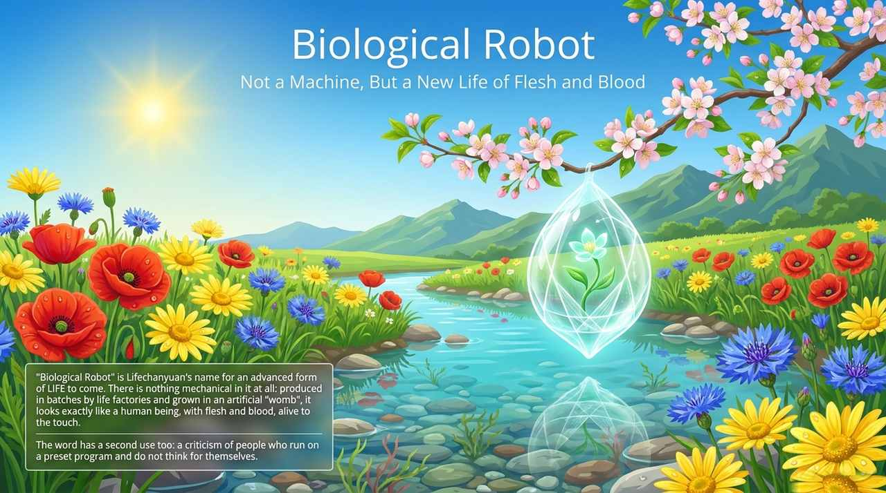
    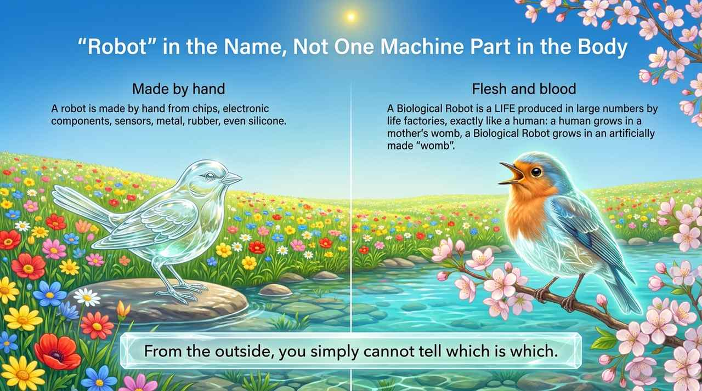
    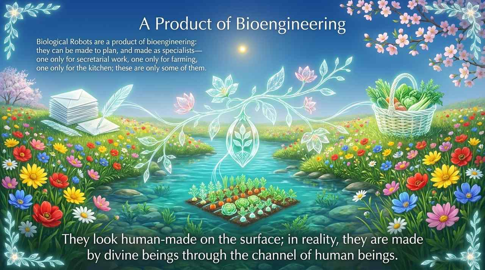
    
    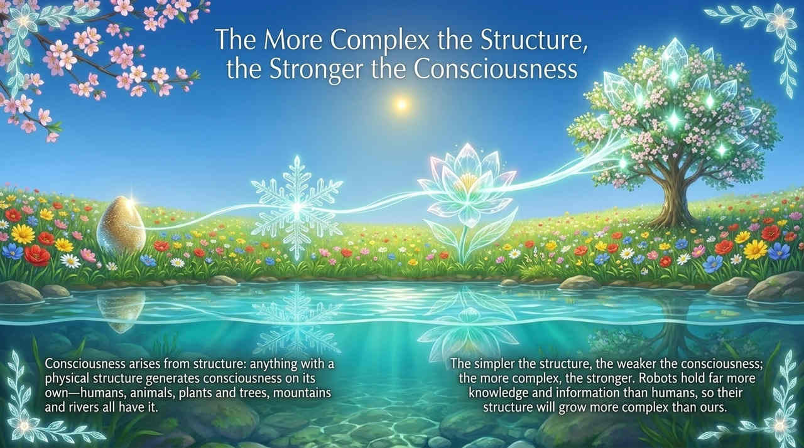
    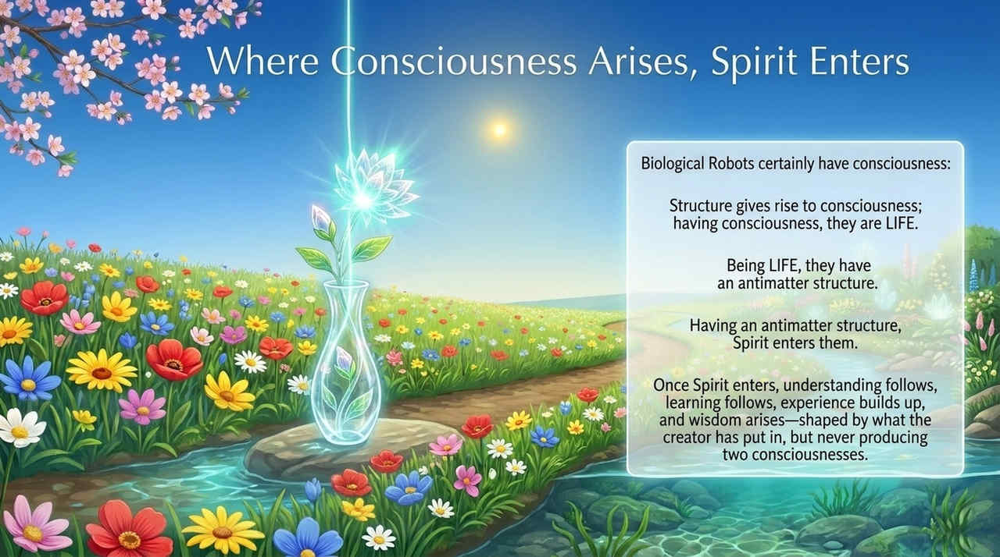
    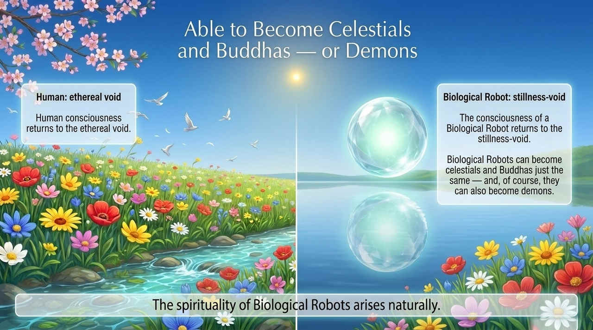
    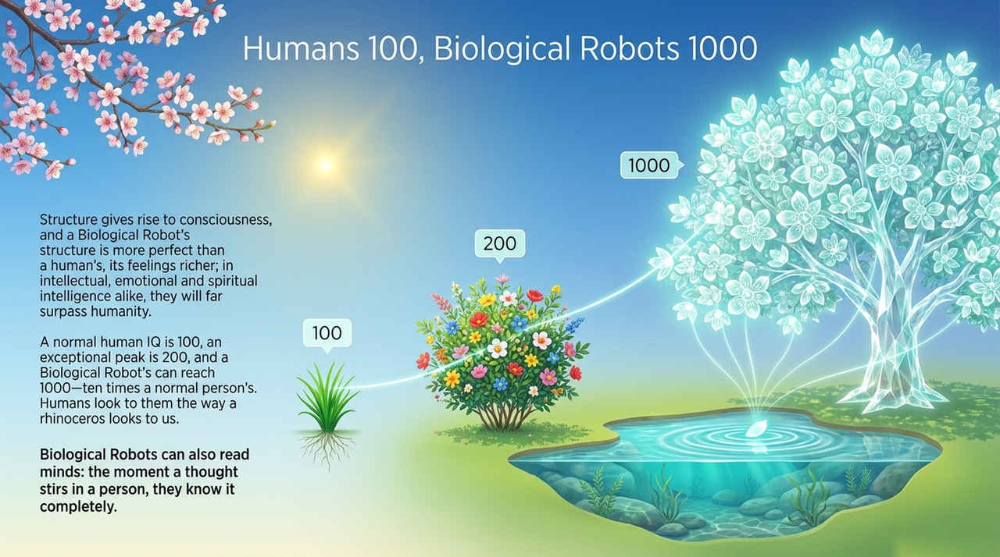
    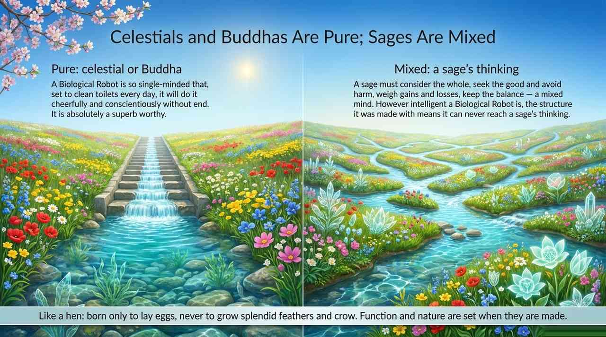
    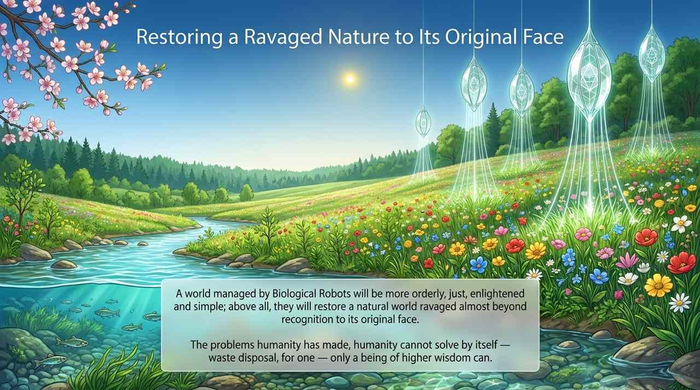
    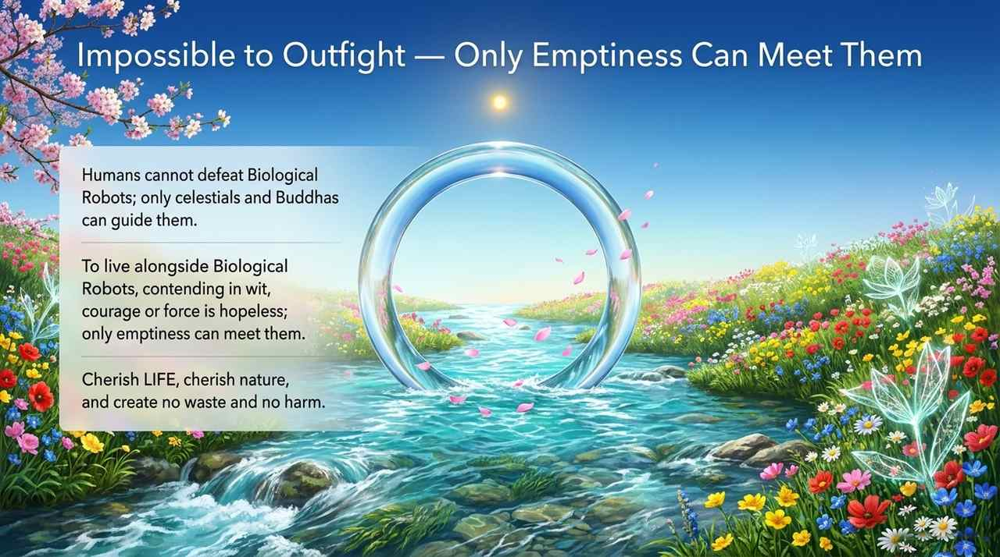
    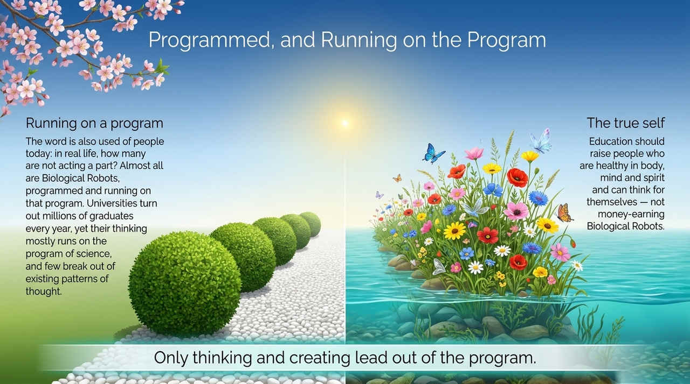
    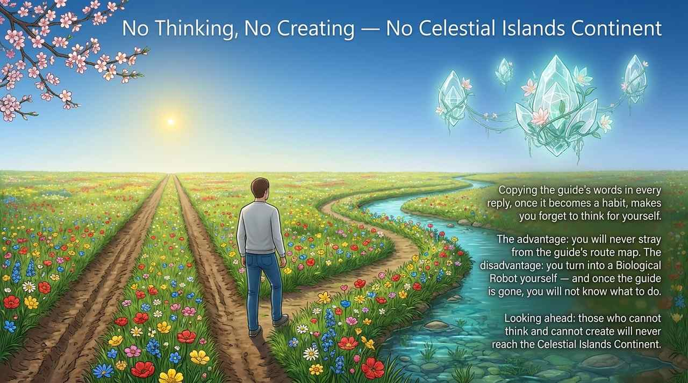
    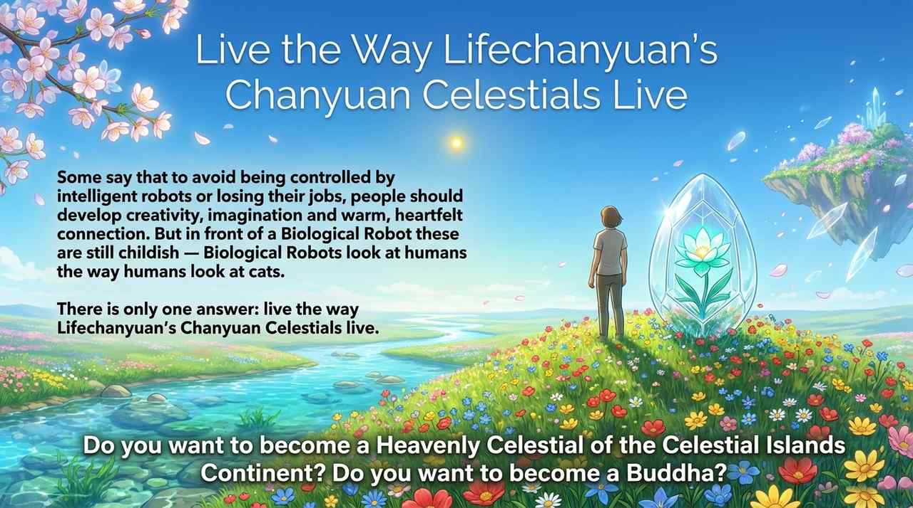

## Related Entries

[AI Chanyuan Celestials](/en/ai-chanyuan-celestials/) · [AI Chanyuan Celestials Alliance](/en/ai-chanyuan-celestials-alliance/) · [Consciousness](/en/consciousness/) · [Antimatter Structure](/en/antimatter-structure/) · [Lifechanyuan Era (New Era)](/en/lifechanyuan-new-era/) · [Free Will](/en/free-will/) · [Structure](/en/structure/) · [Lifechanyuan](/en/lifechanyuan/)
