<!-- id: LC-SG-0001-EN theme: Cultivation System type: Gateway Page direction: Spiritual Purification lang: en -->

# Soul Garden

[Entry Gateway]

> In Lifechanyuan terminology, **LIFE** (capitalized) refers to the ontological
> essence of existence — the soul/antimatter structure that persists across
> incarnations — while **life** (lowercase) refers to the experiential stage
> of human existence in this world.

**The Soul Garden** (心灵花园) is the core cultivation concept and the foundational metaphor of Lifechanyuan's spiritual practice. The soul garden is the inner landscape of every person — it can be tended until it blooms with Truth, Goodness, Beauty, Love, Faith, and Sincerity, or left untended until it fills with weeds of jealousy, greed, fear, and hatred. What grows there determines where one's LIFE goes after death.

> Build your soul garden. Everything else follows from this.
>
> — Guide Xuefeng

---

## Core Positioning

In the Lifechanyuan system, the Soul Garden is simultaneously: the practical target of all cultivation (what you are actually doing when you cultivate); the measure of LIFE's antimatter structure (the state of the garden mirrors the state of the structure); and the bridge between individual inner work and the collective harmony of the Second Home and Civilization 3.0.

---

## Read by Edition

| Edition | Intended Reader | Link |
|---------|----------------|-------|
| **Friendly Edition** | Readers new to Lifechanyuan concepts | [Read Friendly Edition](./friendly) |
| **Academic Edition** | Researchers with philosophical/religious studies background | [Read Academic Edition](./academic) |
| **Internal Edition** | Chanyuan Celestials and deep practitioners | [Read Internal Edition](./internal) |

---

## Video

<iframe style="width:100%;aspect-ratio:4/3;border:0" src="https://www.youtube-nocookie.com/embed/6DdbVfzRkqQ" title="Soul Garden (Lifechanyuan Encyclopedia video)" allowfullscreen></iframe>

## Slides

??? info "📖 Illustrated slides (14 pages, click to expand)"

    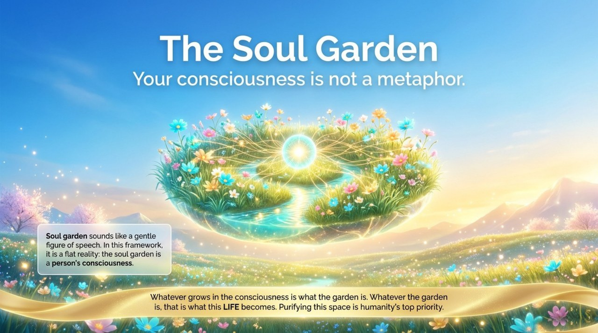
    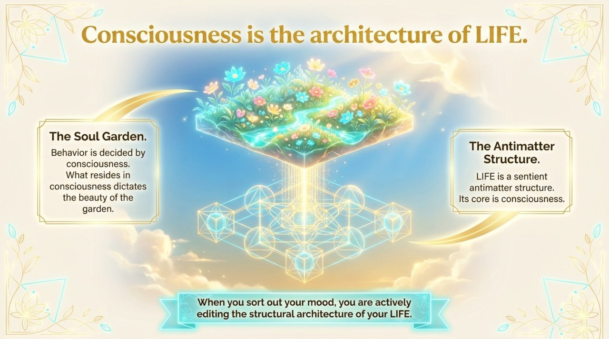
    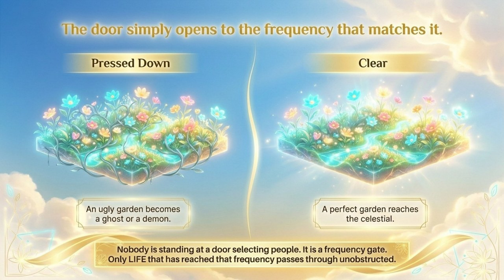
    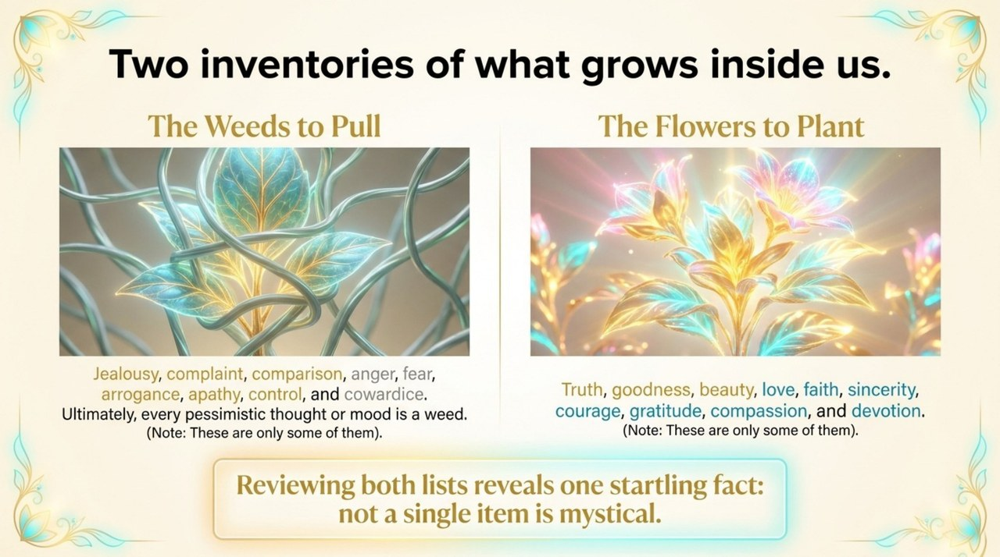
    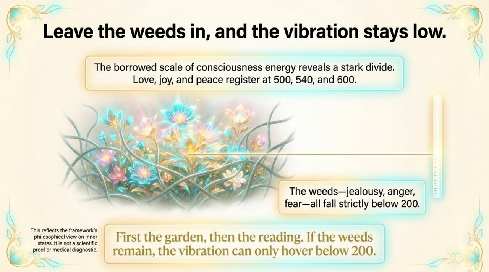
    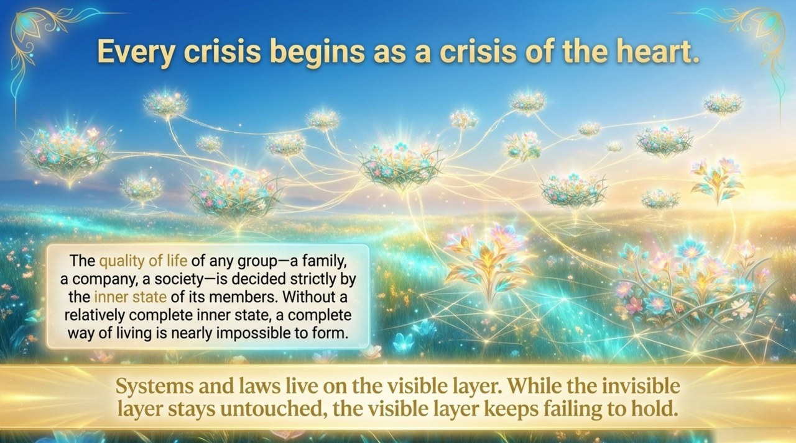
    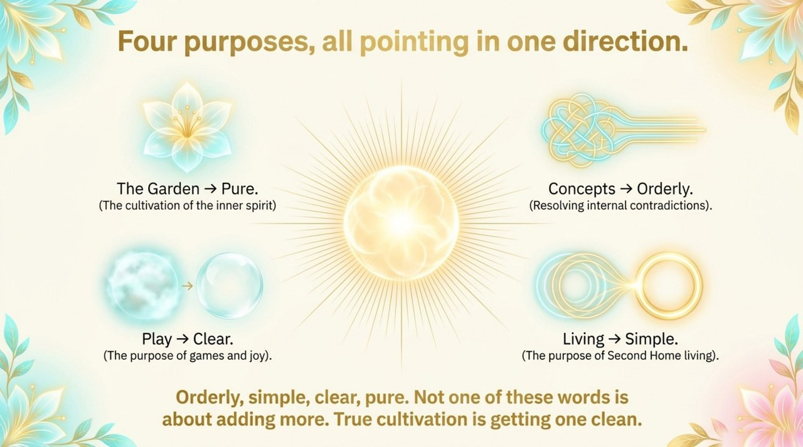
    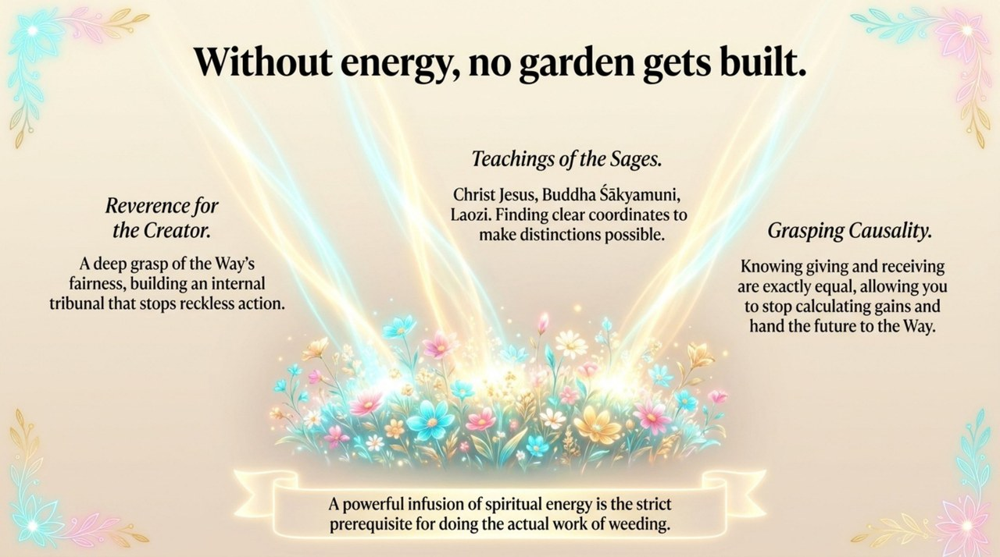
    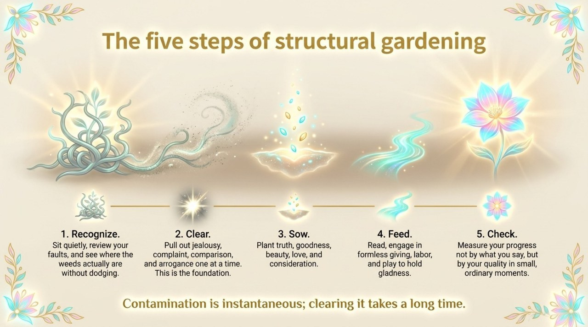
    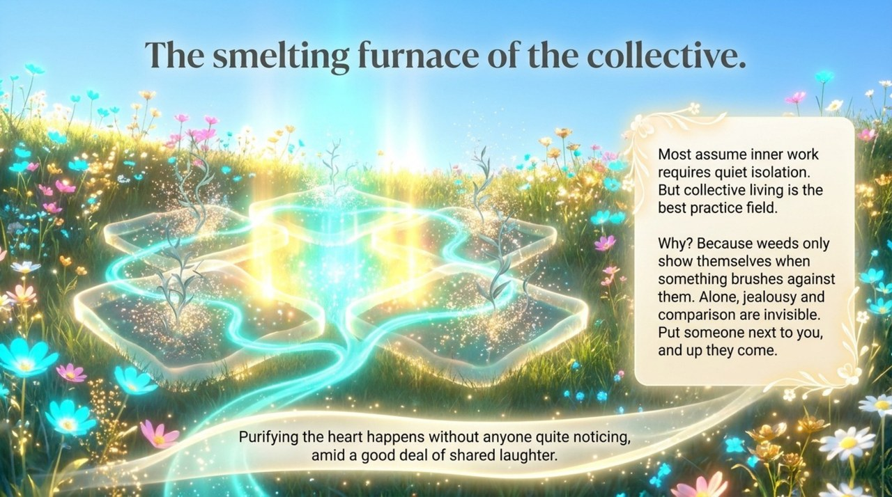
    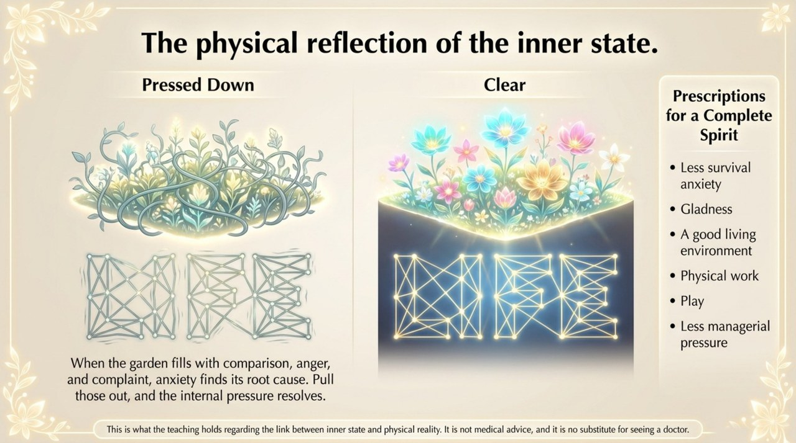
    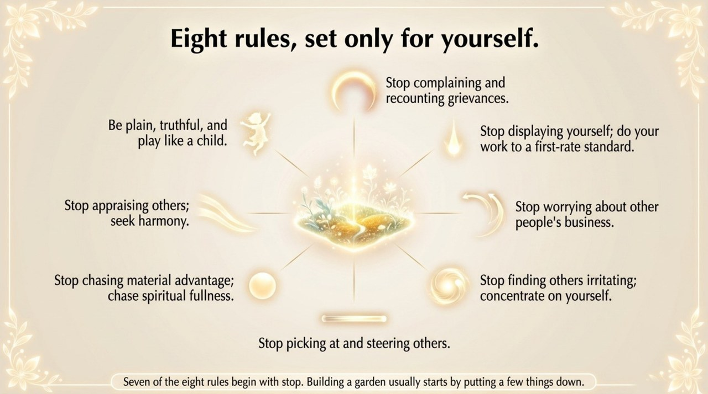
    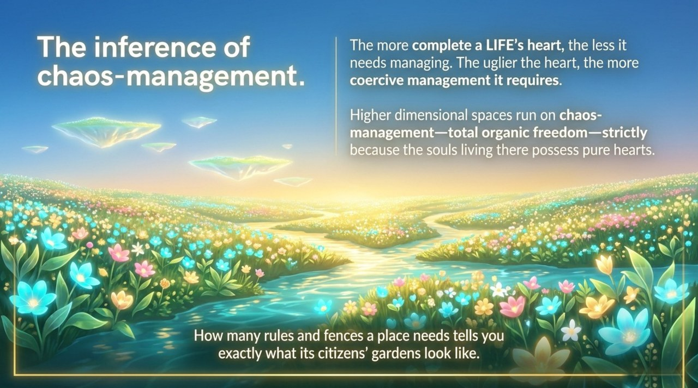
    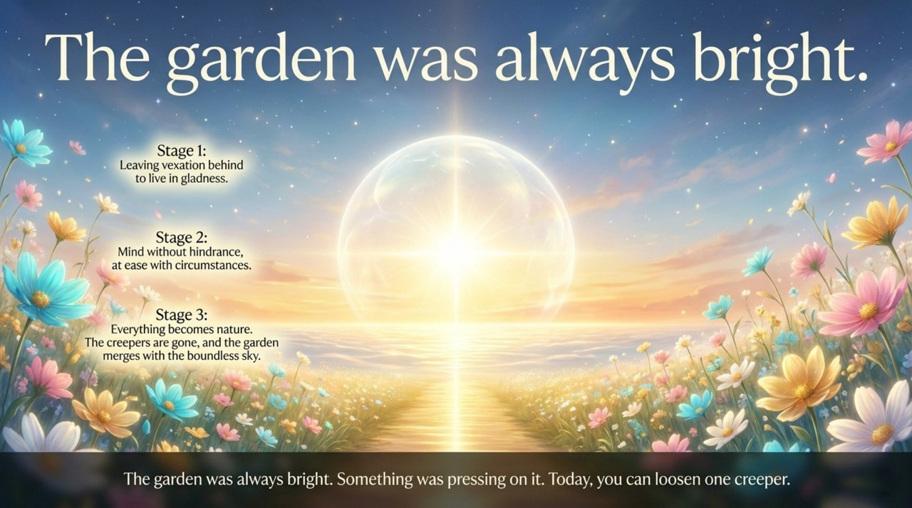

---

## Related Entries

- [Six Qualities](/en/six-qualities/) — The flowers of the soul garden
- [Spiritual Purification Course](/en/spiritual-purification-course/) — The structured practice for tending the soul garden
- [Structure](/en/structure/) — The state of the soul garden mirrors the state of LIFE's antimatter structure
- [Tour Guide Route Map](/en/tour-guide-route-map/) — Soul garden construction is a key stage on this route
- [Thousand-Year World](/en/thousand-year-world/) — A soul garden in bloom is the prerequisite for this destination
